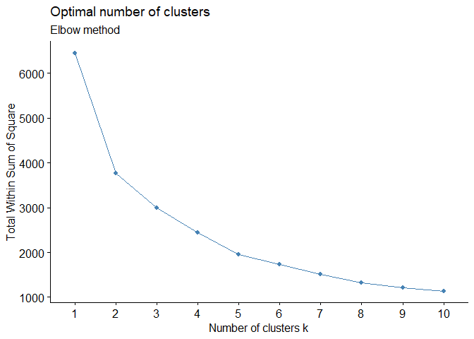
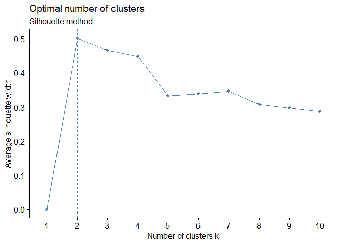
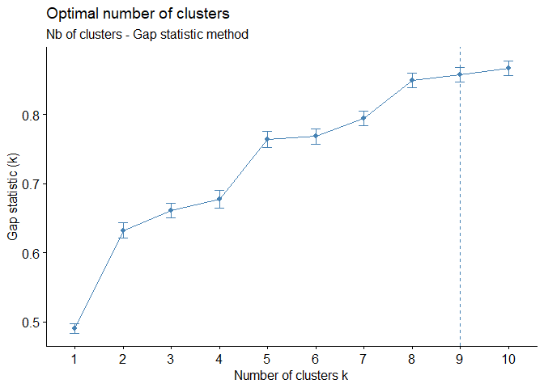
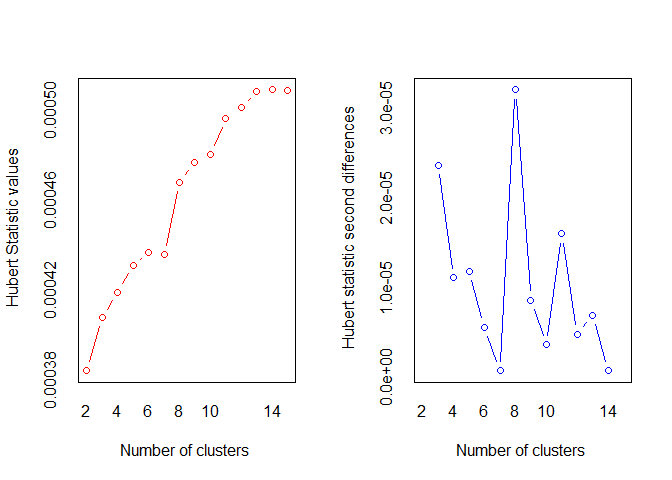
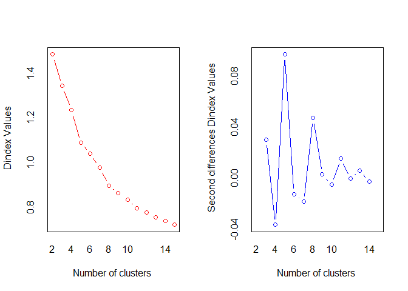
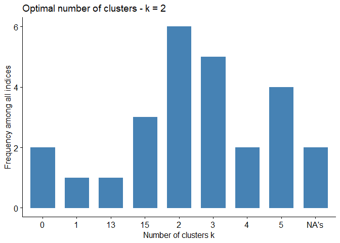

Determining the Optimal Number of Clusters
================
Virginia\_Ahedo
7/10/2020

### Set working paths

``` r
setwd("D:/OneDrive - Universidad de Burgos/Goonies/CULM/GitHub_repository/Lets-go-Fishing")
dataPath <- "D:/OneDrive - Universidad de Burgos/Goonies/CULM/GitHub_repository/Lets-go-Fishing"
```

### Load required libraries

``` r
require(factoextra)
```

    ## Loading required package: factoextra

    ## Loading required package: ggplot2

    ## Welcome! Want to learn more? See two factoextra-related books at https://goo.gl/ve3WBa

``` r
require(clustertend)
```

    ## Loading required package: clustertend

``` r
require(NbClust)
```

    ## Loading required package: NbClust

### Load “Final\_Clustering\_db.Rda”: Clustering database without “society\_name” & “society\_id”

``` r
load("Final_Clustering_db.Rda")
```

#### Check structure of “Final\_Clustering\_db.Rda”

``` r
str(final_clust_db)
```

    ## 'data.frame':    1290 obs. of  6 variables:
    ##  $ Gathering            : num  74.2 37.3 10 38.8 28.1 ...
    ##  $ Hunting              : num  18.9 55.8 29.2 29.2 65 ...
    ##  $ Fishing              : num  2.3 2.3 10 10 2.3 ...
    ##  $ Husbandry            : num  2.3 2.3 48.3 19.6 2.3 ...
    ##  $ Agriculture          : num  2.3 2.3 2.39 2.39 2.3 ...
    ##  $ Agriculture_intensity: Factor w/ 6 levels "Casual","Extensive/shifting",..: 6 6 6 NA 6 2 6 6 6 6 ...

#### Clustering analysis will be conducted on variables EA001 to EA005, thus, we drop column 6: Agriculture intensity.

#### Standardize the subsistence dataset.

``` r
final_clust_db_scaled = scale(final_clust_db[,-6])
```

#### Check structure of final\_clust\_db\_scaled

``` r
str(final_clust_db_scaled)
```

    ##  num [1:1290, 1:5] 4.4609 1.8554 -0.0725 1.9564 1.2041 ...
    ##  - attr(*, "dimnames")=List of 2
    ##   ..$ : NULL
    ##   ..$ : chr [1:5] "Gathering" "Hunting" "Fishing" "Husbandry" ...
    ##  - attr(*, "scaled:center")= Named num [1:5] 11.1 14.6 15.7 15.8 42.9
    ##   ..- attr(*, "names")= chr [1:5] "Gathering" "Hunting" "Fishing" "Husbandry" ...
    ##  - attr(*, "scaled:scale")= Named num [1:5] 14.1 14.1 15.5 16.2 25.1
    ##   ..- attr(*, "names")= chr [1:5] "Gathering" "Hunting" "Fishing" "Husbandry" ...

### Determining the Optimal Number of Clusters

#### Direct methods

##### 1\. Elbow method

``` r
# Elbow method: minimizes the total intra-cluster variation -within-cluster sum of square (WSS)-. WSS measures the compactness of the clustering and we want it to be as small as possible.
# One should choose a number of clusters so that adding another cluster doesn't improve much better the total WSS.

# Function Parameters:
# - x: the standardized data.
# - FUNcluster: hcut: hierarchical clustering
# - method: "wss" (total within sum of squares)

fviz_nbclust(final_clust_db_scaled, hcut, method = "wss") + labs(subtitle = "Elbow method")
```

<!-- -->

``` r
# The location of the bend (knee) in the plot is generally considered as an indicator of the appropriate number of clusters --> K = 2 
```

#### 2\. Average silhouette method

``` r
# Average silhouette method
# It measures the quality of a clustering, i.e., determines how well each object lies within its cluster. A high average silhouette width indicates a good clustering. The optimal number of clusters k is the one that maximizes the average silhouette over a range of possible values of k

# Function parameters: 
# FUNcluster = hcut (hierarchical clustering)

fviz_nbclust(final_clust_db_scaled, hcut, method = "silhouette") + labs(subtitle = "Silhouette method")
```

<!-- -->

``` r
#The location of the maximum is considered as the appropriate number of clusters
```

#### 3\. Gap statistic

``` r
# Gap statistic (Hastie & Tibshirani)
# The gap statistic compares the total within intra-cluster variation for different values of k with their expected values under null reference distribution of the data.
# The estimate of the optimal nb of clusters will be the value that maximizes the gap statistic, which means that the cluster structure is far away from the random uniform distribution.

# Note that, using B = 500 gives quite precise results, so that the gap plot is basically unchanged after another run -> nboot = 500 is the recommended value for analysis.

# Function parameters:
# - FUNcluster = hcut (hierarchical clustering)
# - nboot = 500 -> number of Montecarlo bootstrap samples. Used only for determining the number of clusters using gap.

set.seed(123)
fviz_nbclust(final_clust_db_scaled, FUNcluster = hcut, nstart = 2, method = "gap_stat", nboot = 500) + labs(subtitle = "Nb of clusters - Gap statistic method")
```

<!-- -->

``` r
# The disadvantage of elbow and average silhouette methods is that, they measure a global clustering characteristic only. A more sophisticated method is to use the gap statistic which provides a statistical procedure to formalize the elbow/silhouette heuristic in order to estimate the optimal number of clusters.
```

#### Nb\_clust: 30 indices for choosing the best number of clusters

``` r
#Function NbClust
# -distance: the distance measure to be used to compute the dissimilarity matrix --> "euclidean"
# -min.nc: minimum number of clusters: 2
# -max.nc: maximum number of clusters: 15
# -method: "ward.D2"
# Two different algorithms are found in the literature for Ward clustering. The one used by option "ward.D" (equivalent to the only Ward option "ward" in R versions <= 3.0.3) does not implement Ward's (1963) clustering criterion, whereas option "ward.D2" implements that criterion (Murtagh and Legendre 2014). With the latter, the dissimilarities are squared before cluster updating. Note that agnes(, method="ward") corresponds to hclust(, "ward.D2").

# nb <- NbClust(final_clust_db_scaled, distance = "euclidean", min.nc = 2, max.nc = 15, method = "ward.D2")
# fviz_nbclust(nb)
```

``` r
# NbClust returns the following error:
# Error in NbClust(final_clust_db_scaled, distance = "euclidean", min.nc = 2, : The TSS matrix is indefinite. There must be too many missing values. The index cannot be calculated.
```

##### Check how many rows are in fact different

``` r
dim(unique(final_clust_db_scaled))
```

    ## [1] 278   5

``` r
# The high number of identical rows is probably the reason why our matrix is indefinite. 
# To make up for this problem we are going to add some random noise to all entries in the original matrix
```

##### First we are going to create the final\_subsistence\_db by dropping col 6 (EA028)

``` r
final_subsistence_db = final_clust_db[,-6]
```

##### Add random noise to final\_subsistence\_db

``` r
rand_noise_matrix = matrix(runif(1290*5)/100000,ncol = 5)
noised_subsistence_db = final_subsistence_db + rand_noise_matrix
```

##### Standardize the noised\_subsistence\_db

``` r
noised_subsistence_db_scaled = scale(noised_subsistence_db)
```

##### Call NbClust

``` r
nb <- NbClust(noised_subsistence_db_scaled, distance = "euclidean", min.nc = 2, max.nc = 15, method = "ward.D2")
```

<!-- -->

    ## *** : The Hubert index is a graphical method of determining the number of clusters.
    ##                 In the plot of Hubert index, we seek a significant knee that corresponds to a 
    ##                 significant increase of the value of the measure i.e the significant peak in Hubert
    ##                 index second differences plot. 
    ## 

<!-- -->

    ## *** : The D index is a graphical method of determining the number of clusters. 
    ##                 In the plot of D index, we seek a significant knee (the significant peak in Dindex
    ##                 second differences plot) that corresponds to a significant increase of the value of
    ##                 the measure. 
    ##  
    ## ******************************************************************* 
    ## * Among all indices:                                                
    ## * 6 proposed 2 as the best number of clusters 
    ## * 5 proposed 3 as the best number of clusters 
    ## * 2 proposed 4 as the best number of clusters 
    ## * 4 proposed 5 as the best number of clusters 
    ## * 1 proposed 13 as the best number of clusters 
    ## * 3 proposed 15 as the best number of clusters 
    ## 
    ##                    ***** Conclusion *****                            
    ##  
    ## * According to the majority rule, the best number of clusters is  2 
    ##  
    ##  
    ## *******************************************************************

``` r
fviz_nbclust(nb)
```

    ## Among all indices: 
    ## ===================
    ## * 2 proposed  0 as the best number of clusters
    ## * 1 proposed  1 as the best number of clusters
    ## * 6 proposed  2 as the best number of clusters
    ## * 5 proposed  3 as the best number of clusters
    ## * 2 proposed  4 as the best number of clusters
    ## * 4 proposed  5 as the best number of clusters
    ## * 1 proposed  13 as the best number of clusters
    ## * 3 proposed  15 as the best number of clusters
    ## * 2 proposed  NA's as the best number of clusters
    ## 
    ## Conclusion
    ## =========================
    ## * According to the majority rule, the best number of clusters is  2 .

<!-- -->

#### Save the final\_subsistence\_db: without col 6 (EA028 - Agriculture Intensity) and with no “society\_name” or “society\_id” so that it has no impact on the clustering process

``` r
save(final_subsistence_db, file = "final_subsistence_db.Rda")
```
