Explore ConsensusClusterPlus results
================
Virginia\_Ahedo
9/10/2020

### Setup

### Clean workspace

### Set working paths

``` r
setwd("D:/OneDrive - Universidad de Burgos/Goonies/CULM/GitHub_repository/Lets-go-Fishing")
dataPath <- "D:/OneDrive - Universidad de Burgos/Goonies/CULM/GitHub_repository/Lets-go-Fishing"
```

### Load required libraries

``` r
require(ConsensusClusterPlus)
```

    ## Loading required package: ConsensusClusterPlus

### Load previous results from ConsensusClusterPlus

``` r
# Functions parametrization:

# title = "HC Euclidean Consensus Clustering"
 
# rcc_Euclidean = ConsensusClusterPlus(d = t_final_clust_matrix_norm, maxK = 20, reps = 1000,
#                                      pItem = 0.8, pFeature = 1, clusterAlg = 'hc',
#                                      innerLinkage = "ward.D2", finalLinkage = "ward.D2",
#                                      title = title, distance = 'euclidean', seed = 1, 
#                                      plot = 'png', writeTable = T, verbose = T)

# icl = calcICL(rcc_Euclidean, title = title, plot = "png", writeTable = T)

load("rcc_Euclidean_FINAL.Rda")
load("cluster_item_consensus.Rda")
load("consensusMean.Rda")
```

### Histograms from consensus matrices

#### Extract consensus matrices from rcc\_Euclidean

##### Select the upper triangle

``` r
Kmin = 2
Kmax = 20

for (i in Kmin:Kmax){
  assign(paste("consensusMatrix_", i, sep = ""), rcc_Euclidean[[i]]$consensusMatrix)
  diag_indexes = upper.tri(rcc_Euclidean[[i]]$consensusMatrix, diag = F)
  assign(paste("upperTri_", i, sep = ""), rcc_Euclidean[[i]]$consensusMatrix[diag_indexes])
}
```

##### Histogram obtention

``` r
for (j in Kmin:Kmax){
  assign(paste("histogram_", j, sep =""), hist(get(paste0("upperTri_",j)),
                                               main = paste("K = ", j, sep = ""),
                                               xlab = "consensus indexes",
                                               col = "darkmagenta"))
}
```

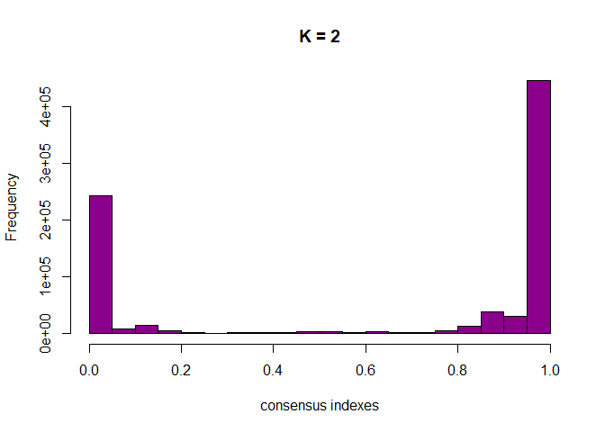<!-- -->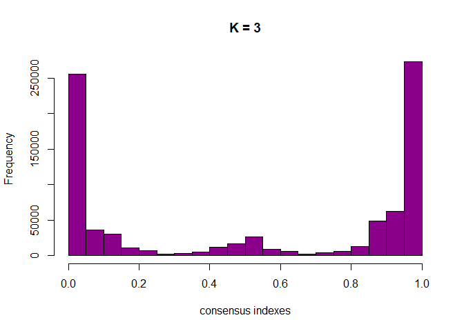<!-- -->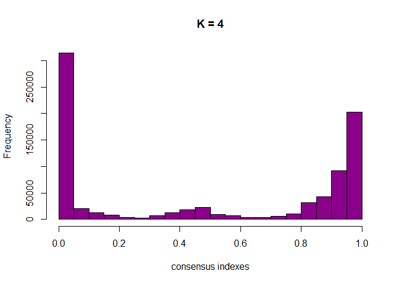<!-- -->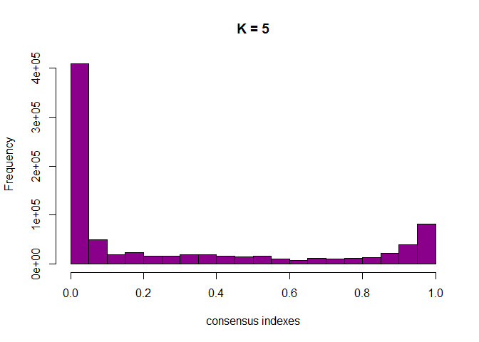<!-- -->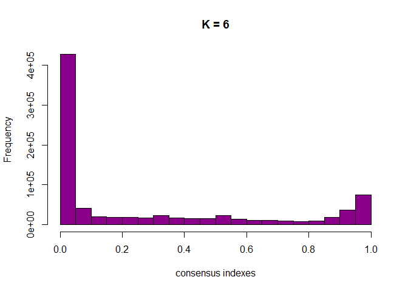<!-- -->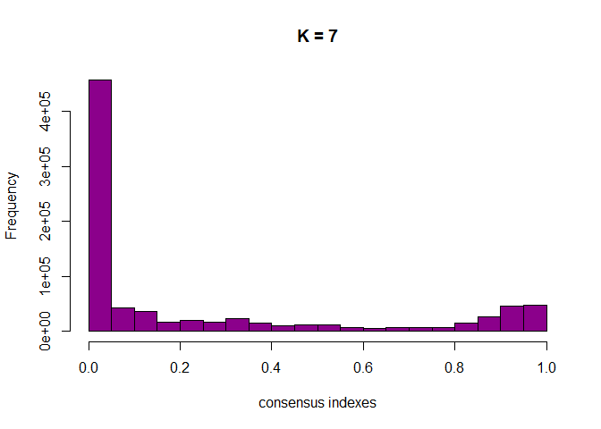<!-- -->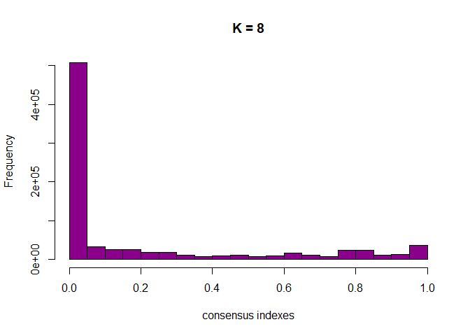<!-- --><!-- -->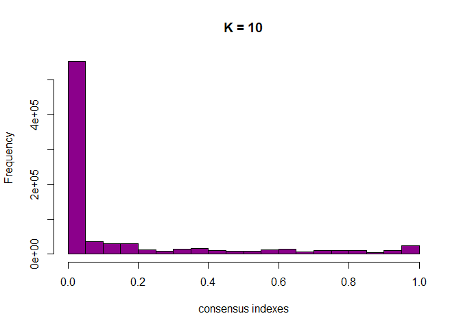<!-- -->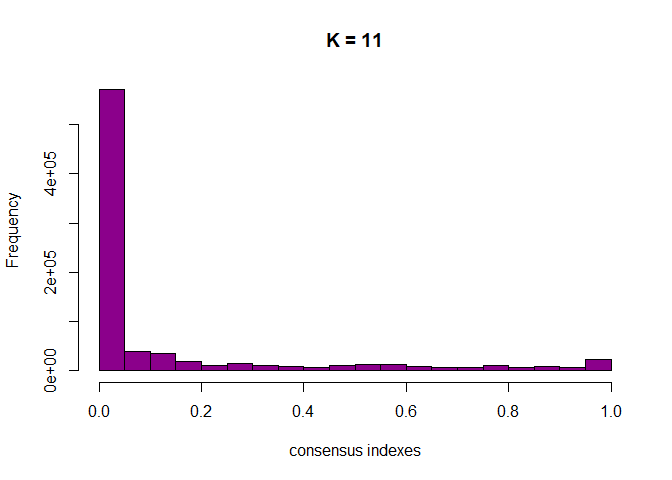<!-- --><!-- -->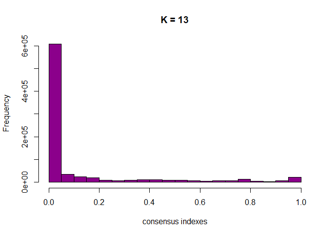<!-- -->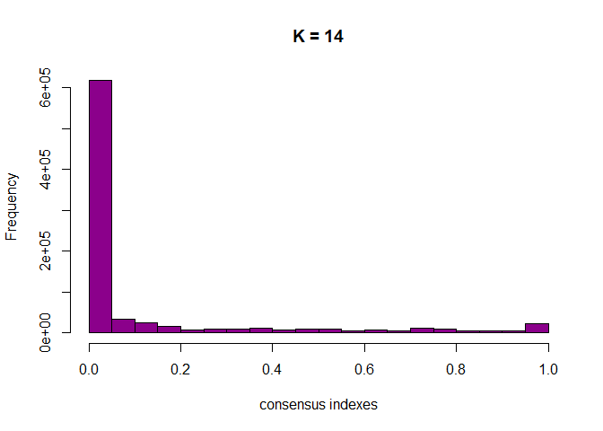<!-- -->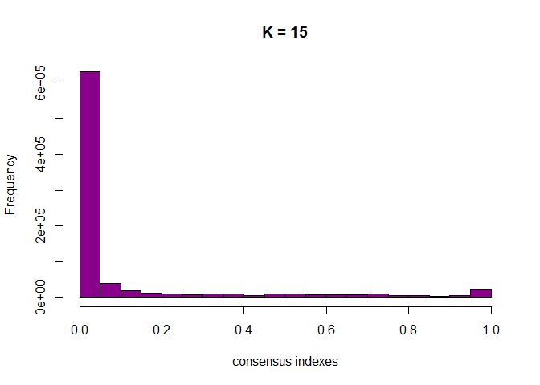<!-- -->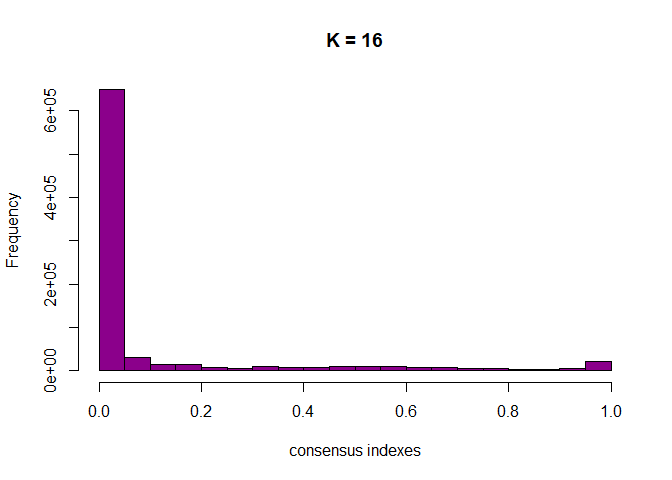<!-- --><!-- --><!-- -->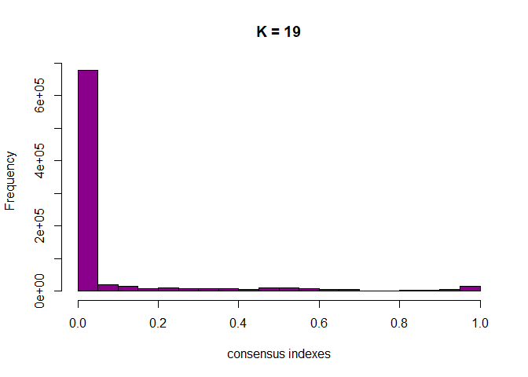<!-- -->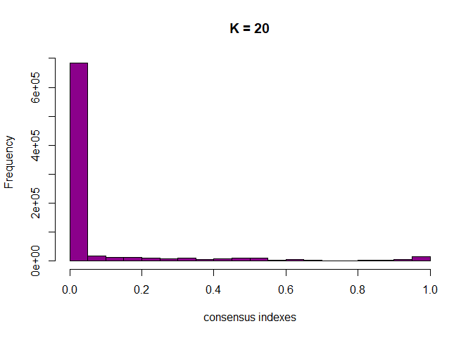<!-- -->

``` r
# Histogram counts
intermediate_counts = vector()
for (k in Kmin:Kmax){
  assign(paste("freq_table_", k, sep = ""), cbind(get(paste0("histogram_", k))$breaks[-1],
                                                  get(paste0("histogram_", k))$counts))
  sum = 0
  for(l in 2:(dim(get(paste0("freq_table_", k)))[1]-1)){
    sum <- sum +  get(paste0("freq_table_", k))[l,2]
    }
  intermediate_counts[k-1] <- sum
}
```

##### Create table k and sum of intermediate values

``` r
intermediate_vals = data.frame(cbind(seq(from = 2, to = Kmax), intermediate_counts))
names(intermediate_vals) <- c("K", "sum intermed counts")
intermediate_vals[order(intermediate_vals$`sum intermed counts`),]
```

    ##     K sum intermed counts
    ## 19 20              132475
    ## 18 19              138407
    ## 1   2              142797
    ## 17 18              145441
    ## 16 17              152510
    ## 15 16              162074
    ## 14 15              179046
    ## 13 14              191386
    ## 12 13              201781
    ## 11 12              219081
    ## 10 11              237601
    ## 9  10              254219
    ## 8   9              265286
    ## 7   8              288963
    ## 2   3              303174
    ## 3   4              315000
    ## 6   7              326922
    ## 5   6              329836
    ## 4   5              341027
