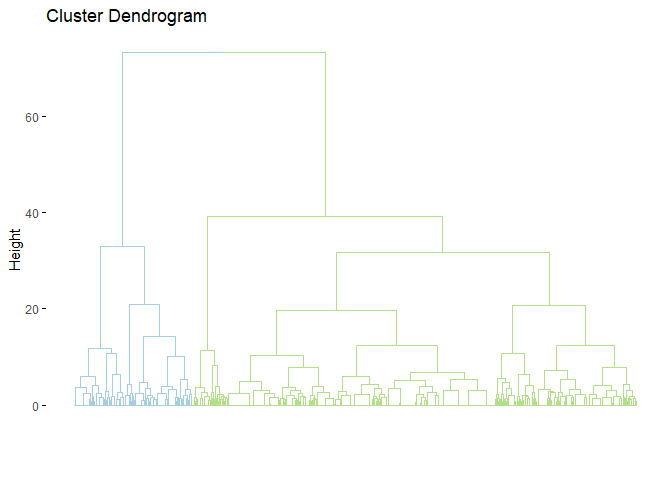
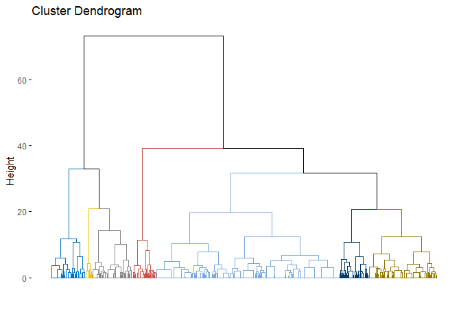
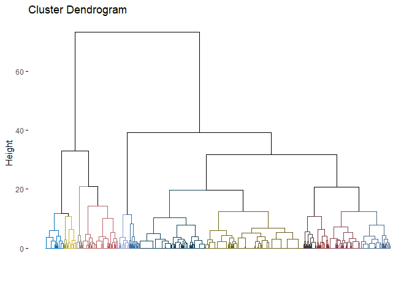

Hierarchical clustering different cuts
================
Virginia\_Ahedo
10/10/2020

### Setup

### Clean workspace

### Set working paths

``` r
setwd("D:/OneDrive - Universidad de Burgos/Goonies/CULM/GitHub_repository/Lets-go-Fishing")
dataPath <- "D:/OneDrive - Universidad de Burgos/Goonies/CULM/GitHub_repository/Lets-go-Fishing"
```

### Load required libraries

``` r
require(factoextra)
```

    ## Loading required package: factoextra

    ## Loading required package: ggplot2

    ## Welcome! Want to learn more? See two factoextra-related books at https://goo.gl/ve3WBa

``` r
require(dplyr)
```

    ## Loading required package: dplyr

    ## 
    ## Attaching package: 'dplyr'

    ## The following objects are masked from 'package:stats':
    ## 
    ##     filter, lag

    ## The following objects are masked from 'package:base':
    ## 
    ##     intersect, setdiff, setequal, union

``` r
require(xlsx)
```

    ## Loading required package: xlsx

#### We are going to work with “Named\_Clustering\_db.Rda” (1290 societies), which includes “society\_id”, “society\_name”, variables from EA001 to EA005 and EA028.

#### Load “Named\_Clustering\_db.Rda”: named\_clust\_db

``` r
load("Named_Clustering_db.Rda")
```

#### Check structure of “Named\_Clustering\_db.Rda”

``` r
str(named_clust_db)
```

    ## 'data.frame':    1290 obs. of  8 variables:
    ##  $ society_id           : chr  "Aa1" "Aa2" "Aa3" "Aa4" ...
    ##  $ society_name         : chr  "!Kung" "Dorobo" "Nama" "Bergdama" ...
    ##  $ Gathering            : num  74.2 37.3 10 38.8 28.1 ...
    ##  $ Hunting              : num  18.9 55.8 29.2 29.2 65 ...
    ##  $ Fishing              : num  2.3 2.3 10 10 2.3 ...
    ##  $ Husbandry            : num  2.3 2.3 48.3 19.6 2.3 ...
    ##  $ Agriculture          : num  2.3 2.3 2.39 2.39 2.3 ...
    ##  $ Agriculture_intensity: Factor w/ 6 levels "Casual","Extensive/shifting",..: 6 6 6 NA 6 2 6 6 6 6 ...

### Create the hc\_db\_final, which is the database on which we will conduct clustering analysis (vars EA001 to EA005 for 1290 societies). To do so, we will preprocess the named\_clust\_db:

#### Save “society\_id” in a variable.

#### Drop: “society\_id”, “society\_name” and “Agriculture\_intensity”

``` r
society_ids = named_clust_db$society_id
hc_db_final = select(named_clust_db, -c("society_id", "society_name", "Agriculture_intensity"))
str(hc_db_final)
```

    ## 'data.frame':    1290 obs. of  5 variables:
    ##  $ Gathering  : num  74.2 37.3 10 38.8 28.1 ...
    ##  $ Hunting    : num  18.9 55.8 29.2 29.2 65 ...
    ##  $ Fishing    : num  2.3 2.3 10 10 2.3 ...
    ##  $ Husbandry  : num  2.3 2.3 48.3 19.6 2.3 ...
    ##  $ Agriculture: num  2.3 2.3 2.39 2.39 2.3 ...

#### Prior to conducting hierarchical clustering we need to standardize by column the hc\_db\_final dataset

``` r
hc_db_final_scaled = scale(hc_db_final)
str(hc_db_final_scaled)
```

    ##  num [1:1290, 1:5] 4.4609 1.8554 -0.0725 1.9564 1.2041 ...
    ##  - attr(*, "dimnames")=List of 2
    ##   ..$ : NULL
    ##   ..$ : chr [1:5] "Gathering" "Hunting" "Fishing" "Husbandry" ...
    ##  - attr(*, "scaled:center")= Named num [1:5] 11.1 14.6 15.7 15.8 42.9
    ##   ..- attr(*, "names")= chr [1:5] "Gathering" "Hunting" "Fishing" "Husbandry" ...
    ##  - attr(*, "scaled:scale")= Named num [1:5] 14.1 14.1 15.5 16.2 25.1
    ##   ..- attr(*, "names")= chr [1:5] "Gathering" "Hunting" "Fishing" "Husbandry" ...

## HIERACHICAL CLUSTERING

### Nb clusters = 2: Hunter-gatherers vs agriculturalists

``` r
# Function eclust arguments:
# - FUNcluster = "hclust"
# - k = 2
# - k.max = the maximum number of clusters to consider (not given)
# - graph = TRUE --> Cluster plot is displayed --> NOT WORKING
# - hc_metric = "euclidean"
# - hc_method: the agglomerative method to be used by hclust: "ward.D2"
# - seed = 1 --> integer used for seeding the random number generator.

# With regard to hc_method: Two different algorithms are found in the literature for Ward clustering. The one used by option "ward.D" (equivalent to the only Ward option "ward" in R versions <= 3.0.3) does not implement Ward's (1963) clustering criterion, whereas option "ward.D2" implements that criterion (Murtagh and Legendre 2014). With the latter, the dissimilarities are squared before cluster updating. Note that agnes(, method="ward") corresponds to hclust(, "ward.D2").

hc2.res <- eclust(hc_db_final_scaled, "hclust", k = 2, hc_metric = "euclidean", 
                  hc_method = "ward.D2", seed = 1)
```

#### Visualize dendrogram coloured for k = 2

``` r
fviz_dend(hc2.res, show_labels = F, palette = "Paired", as.ggplot = T)
```

<!-- -->

### Nb clusters = 7

``` r
hc7.res <- eclust(hc_db_final_scaled, "hclust", k = 7, hc_metric = "euclidean", 
                  hc_method = "ward.D2", seed = 1)
```

#### Visualize dendrogram coloured for k = 7

``` r
fviz_dend(hc7.res, show_labels = F, palette = "jco", as.ggplot = T)
```

<!-- -->
\#\#\# Nb clusters = 15

``` r
hc15.res <- eclust(hc_db_final_scaled, "hclust", k = 15, hc_metric = "euclidean", 
                  hc_method = "ward.D2", seed = 1)
```

#### Visualize dendrogram coloured for k = 15

``` r
fviz_dend(hc15.res, show_labels = F, palette = "jco", as.ggplot = T)
```

<!-- -->

### Create interpretation dataset with extra variables which have not been used in the clustering analysis but that will serve as interpretation aids.

#### Extra variables to include in the interpretation dataset:

##### 1\. EA029: Major crop type.

##### 2\. EA030: Settlement patterns.

##### 3\. EA031: Mean size of local communities.

##### 4\. EA039: Domestic animals - Plow cultivation.

##### 5\. EA040: Domestic animals - Type.

##### 6\. EA041: Domestic animals - Milking.

##### 7\. EA202: Population size.

``` r
#EA029: Major crop type
EA029 = read.csv("EA029.csv", header = T, sep = ",", fileEncoding = "UTF-8")

#EA030: Settlement patterns
EA030 = read.csv("EA030.csv", header = T, sep = ",", fileEncoding = "UTF-8")

#EA031: Mean size of local communities
EA031 = read.csv("EA031.csv", header = T, sep = ",", fileEncoding = "UTF-8")

#EA039: Domestic animals - Plow cultivation
EA039 = read.csv("EA039.csv", header = T, sep = ",", fileEncoding = "UTF-8")

#EA040: Domestic animals - Type
EA040 = read.csv("EA040.csv", header = T, sep = ",", fileEncoding = "UTF-8")

#EA041: Domestic animals - Milking
EA041 = read.csv("EA041.csv", header = T, sep = ",", fileEncoding = "UTF-8")

#EA202: Population size
EA202 = read.csv("EA202.csv", header = T, sep = ",", fileEncoding = "UTF-8")
```

##### Drop unnecessary columns before building the interpretation\_db

##### The interpretation\_db will be joined with named\_clust\_db by “society\_id”

##### Rename code\_label column

``` r
cols2drop = c("society_name", "society_xd_id", "language_glottocode", "language_name",
              "language_family","variable_id", "code", "focal_year", "sub_case", "comment")

EA029_s <- select(EA029, -all_of(cols2drop))
names(EA029_s)[names(EA029_s) == "code_label"] <- "major_crop_type"

EA030_s <- select(EA030, -all_of(cols2drop))
names(EA030_s)[names(EA030_s) == "code_label"] <- "settlement_patterns"

EA031_s <- select(EA031, -all_of(cols2drop))
names(EA031_s)[names(EA031_s) == "code_label"] <- "mean_size_communities"

EA039_s <- select(EA039, -all_of(cols2drop))
names(EA039_s)[names(EA039_s) == "code_label"] <- "plow"

EA040_s <- select(EA040, -all_of(cols2drop))
names(EA040_s)[names(EA040_s) == "code_label"] <- "domestic_animals"

EA041_s <- select(EA041, -all_of(cols2drop))
names(EA041_s)[names(EA041_s) == "code_label"] <- "milking"

EA202_s <- select(EA202, -all_of(cols2drop))
names(EA202_s)[names(EA202_s) == "code_label"] <- "population_size"
```

##### Check dimensions

``` r
cat("\nDimensions of dataset EA029_s: ", dim(EA029_s))
```

    ## 
    ## Dimensions of dataset EA029_s:  1179 2

``` r
cat("\nDimensions of dataset EA030_s: ", dim(EA030_s))
```

    ## 
    ## Dimensions of dataset EA030_s:  1187 2

``` r
cat("\nDimensions of dataset EA031_s: ", dim(EA031_s))
```

    ## 
    ## Dimensions of dataset EA031_s:  611 2

``` r
cat("\nDimensions of dataset EA039_S: ", dim(EA039_s))
```

    ## 
    ## Dimensions of dataset EA039_S:  1182 2

``` r
cat("\nDimensions of dataset EA040_s: ", dim(EA040_s))
```

    ## 
    ## Dimensions of dataset EA040_s:  1182 2

``` r
cat("\nDimensions of dataset EA041_s: ", dim(EA041_s))
```

    ## 
    ## Dimensions of dataset EA041_s:  1182 2

``` r
cat("\nDimensions of dataset EA202_s: ", dim(EA202_s))
```

    ## 
    ## Dimensions of dataset EA202_s:  953 2

#### Build interpretation database

##### Left join of named\_clust\_db and all interpretation variables.

##### Include attribute all = T, so that it does not drop registers with NAs

``` r
interpretation_01 = merge(named_clust_db, EA029_s, by.x="society_id", all = T)
interpretation_02 = merge(interpretation_01, EA030_s, by.x="society_id", all = T)
interpretation_03 = merge(interpretation_02, EA031_s, by.x="society_id", all = T)
interpretation_04 = merge(interpretation_03, EA039_s, by.x="society_id", all = T)
interpretation_05 = merge(interpretation_04, EA040_s, by.x="society_id", all = T)
interpretation_06 = merge(interpretation_05, EA041_s, by.x="society_id", all = T)
interpretation_07 = merge(interpretation_06, EA202_s, by.x="society_id", all = T)

str(interpretation_07)
```

    ## 'data.frame':    1291 obs. of  15 variables:
    ##  $ society_id           : chr  "Aa1" "Aa2" "Aa3" "Aa4" ...
    ##  $ society_name         : chr  "!Kung" "Dorobo" "Nama" "Bergdama" ...
    ##  $ Gathering            : num  74.2 37.3 10 38.8 28.1 ...
    ##  $ Hunting              : num  18.9 55.8 29.2 29.2 65 ...
    ##  $ Fishing              : num  2.3 2.3 10 10 2.3 ...
    ##  $ Husbandry            : num  2.3 2.3 48.3 19.6 2.3 ...
    ##  $ Agriculture          : num  2.3 2.3 2.39 2.39 2.3 ...
    ##  $ Agriculture_intensity: Factor w/ 6 levels "Casual","Extensive/shifting",..: 6 6 6 NA 6 2 6 6 6 6 ...
    ##  $ major_crop_type      : Factor w/ 6 levels "Cereals","No agriculture",..: 2 2 2 NA 2 1 2 2 2 2 ...
    ##  $ settlement_patterns  : Factor w/ 8 levels "Complex permanent",..: 5 5 5 NA 5 2 5 5 5 5 ...
    ##  $ mean_size_communities: Factor w/ 8 levels "<50","100-199",..: 1 1 2 NA 2 NA 1 1 1 NA ...
    ##  $ plow                 : Factor w/ 3 levels "Absent","Not aboriginal but present",..: 1 1 1 NA 1 1 1 1 1 1 ...
    ##  $ domestic_animals     : Factor w/ 7 levels "Absence or near absence",..: 1 1 2 NA 1 2 1 1 1 2 ...
    ##  $ milking              : Factor w/ 2 levels "Absence or near absence",..: 1 1 2 NA 1 2 1 1 1 2 ...
    ##  $ population_size      : logi  NA NA NA NA NA NA ...

``` r
dim(interpretation_06)
```

    ## [1] 1290   14

``` r
dim(interpretation_07)
```

    ## [1] 1291   15

##### Check why from interpretation\_06 to interpretation\_07 we have an extra society

``` r
which(interpretation_07$society_id %in% interpretation_06$society_id == FALSE)
```

    ## [1] 1125

##### Which society is it?

``` r
interpretation_07[1125,]
```

    ##      society_id society_name Gathering Hunting Fishing Husbandry Agriculture
    ## 1125        Ng2         <NA>        NA      NA      NA        NA          NA
    ##      Agriculture_intensity major_crop_type settlement_patterns
    ## 1125                  <NA>            <NA>                <NA>
    ##      mean_size_communities plow domestic_animals milking population_size
    ## 1125                  <NA> <NA>             <NA>    <NA>              NA

##### Create interpretation\_final by dropping row 1125

``` r
interpretation_final = interpretation_07[-1125,]
str(interpretation_final)
```

    ## 'data.frame':    1290 obs. of  15 variables:
    ##  $ society_id           : chr  "Aa1" "Aa2" "Aa3" "Aa4" ...
    ##  $ society_name         : chr  "!Kung" "Dorobo" "Nama" "Bergdama" ...
    ##  $ Gathering            : num  74.2 37.3 10 38.8 28.1 ...
    ##  $ Hunting              : num  18.9 55.8 29.2 29.2 65 ...
    ##  $ Fishing              : num  2.3 2.3 10 10 2.3 ...
    ##  $ Husbandry            : num  2.3 2.3 48.3 19.6 2.3 ...
    ##  $ Agriculture          : num  2.3 2.3 2.39 2.39 2.3 ...
    ##  $ Agriculture_intensity: Factor w/ 6 levels "Casual","Extensive/shifting",..: 6 6 6 NA 6 2 6 6 6 6 ...
    ##  $ major_crop_type      : Factor w/ 6 levels "Cereals","No agriculture",..: 2 2 2 NA 2 1 2 2 2 2 ...
    ##  $ settlement_patterns  : Factor w/ 8 levels "Complex permanent",..: 5 5 5 NA 5 2 5 5 5 5 ...
    ##  $ mean_size_communities: Factor w/ 8 levels "<50","100-199",..: 1 1 2 NA 2 NA 1 1 1 NA ...
    ##  $ plow                 : Factor w/ 3 levels "Absent","Not aboriginal but present",..: 1 1 1 NA 1 1 1 1 1 1 ...
    ##  $ domestic_animals     : Factor w/ 7 levels "Absence or near absence",..: 1 1 2 NA 1 2 1 1 1 2 ...
    ##  $ milking              : Factor w/ 2 levels "Absence or near absence",..: 1 1 2 NA 1 2 1 1 1 2 ...
    ##  $ population_size      : logi  NA NA NA NA NA NA ...

### CREATION OF THE INTERPRETATION FILES

#### Create dataframes with the “society\_id” and the cluster assignments of observations for the different cuts at k = 2, 7 and 15.

#### Nb clusters = 2 -\> hc\_2

``` r
hc_2 = data.frame(society_ids, hc2.res$cluster)
colnames(hc_2) = c("society_id", "hc2.cluster")
hc_2
```

    ##      society_id hc2.cluster
    ## 1           Aa1           1
    ## 2           Aa2           1
    ## 3           Aa3           2
    ## 4           Aa4           1
    ## 5           Aa5           1
    ## 6           Aa6           2
    ## 7           Aa7           1
    ## 8           Aa8           1
    ## 9           Aa9           1
    ## 10          Ab1           2
    ## 11         Ab10           2
    ## 12         Ab11           2
    ## 13         Ab12           2
    ## 14         Ab13           2
    ## 15         Ab14           2
    ## 16         Ab15           2
    ## 17         Ab16           2
    ## 18         Ab17           2
    ## 19         Ab18           2
    ## 20         Ab19           2
    ## 21          Ab2           2
    ## 22         Ab20           2
    ## 23        Ab21a           2
    ## 24        Ab21b           2
    ## 25         Ab22           2
    ## 26          Ab3           2
    ## 27          Ab4           2
    ## 28          Ab5           2
    ## 29          Ab6           2
    ## 30          Ab7           2
    ## 31          Ab8           2
    ## 32          Ab9           2
    ## 33          Ac1           2
    ## 34         Ac10           2
    ## 35         Ac11           2
    ## 36         Ac12           2
    ## 37         Ac13           2
    ## 38         Ac14           2
    ## 39         Ac15           2
    ## 40         Ac16           2
    ## 41         Ac17           2
    ## 42         Ac18           2
    ## 43         Ac19           2
    ## 44          Ac2           2
    ## 45         Ac20           2
    ## 46         Ac21           2
    ## 47         Ac22           2
    ## 48         Ac23           2
    ## 49         Ac24           2
    ## 50         Ac25           2
    ## 51         Ac26           2
    ## 52         Ac27           2
    ## 53         Ac28           2
    ## 54         Ac29           2
    ## 55          Ac3           2
    ## 56         Ac30           2
    ## 57         Ac31           2
    ## 58         Ac32           2
    ## 59         Ac33           2
    ## 60         Ac34           2
    ## 61         Ac35           2
    ## 62         Ac36           2
    ## 63         Ac37           2
    ## 64         Ac38           2
    ## 65         Ac39           2
    ## 66          Ac4           2
    ## 67         Ac40           2
    ## 68         Ac41           2
    ## 69         Ac42           2
    ## 70         Ac43           2
    ## 71          Ac5           2
    ## 72          Ac6           2
    ## 73          Ac7           2
    ## 74          Ac8           2
    ## 75          Ac9           2
    ## 76          Ad1           2
    ## 77         Ad10           2
    ## 78         Ad11           2
    ## 79         Ad12           2
    ## 80         Ad13           2
    ## 81         Ad14           2
    ## 82         Ad15           2
    ## 83         Ad16           2
    ## 84         Ad17           2
    ## 85         Ad18           2
    ## 86         Ad19           2
    ## 87          Ad2           2
    ## 88         Ad20           2
    ## 89         Ad21           2
    ## 90         Ad22           2
    ## 91         Ad23           2
    ## 92         Ad24           2
    ## 93         Ad25           2
    ## 94         Ad26           2
    ## 95         Ad27           2
    ## 96         Ad28           2
    ## 97         Ad29           2
    ## 98          Ad3           2
    ## 99         Ad30           2
    ## 100        Ad31           2
    ## 101        Ad32           2
    ## 102        Ad33           2
    ## 103        Ad34           2
    ## 104        Ad35           2
    ## 105        Ad36           2
    ## 106        Ad37           2
    ## 107        Ad38           2
    ## 108        Ad39           2
    ## 109         Ad4           2
    ## 110        Ad40           2
    ## 111        Ad41           2
    ## 112        Ad42           2
    ## 113        Ad43           2
    ## 114        Ad44           2
    ## 115        Ad45           2
    ## 116        Ad46           2
    ## 117        Ad47           2
    ## 118        Ad48           2
    ## 119        Ad49           2
    ## 120         Ad5           2
    ## 121        Ad50           2
    ## 122        Ad51           2
    ## 123         Ad6           2
    ## 124         Ad7           2
    ## 125         Ad8           2
    ## 126         Ad9           2
    ## 127         Ae1           2
    ## 128        Ae10           2
    ## 129        Ae11           2
    ## 130        Ae12           2
    ## 131        Ae13           2
    ## 132        Ae14           2
    ## 133        Ae15           2
    ## 134        Ae16           2
    ## 135        Ae17           2
    ## 136        Ae18           2
    ## 137        Ae19           2
    ## 138         Ae2           2
    ## 139        Ae20           2
    ## 140        Ae21           2
    ## 141        Ae22           2
    ## 142        Ae23           2
    ## 143        Ae24           2
    ## 144        Ae25           2
    ## 145        Ae26           2
    ## 146        Ae27           2
    ## 147        Ae28           2
    ## 148        Ae29           2
    ## 149         Ae3           2
    ## 150        Ae30           2
    ## 151        Ae31           2
    ## 152        Ae32           2
    ## 153        Ae33           2
    ## 154        Ae34           2
    ## 155        Ae35           2
    ## 156        Ae36           2
    ## 157        Ae37           2
    ## 158        Ae38           2
    ## 159        Ae39           2
    ## 160         Ae4           2
    ## 161        Ae40           2
    ## 162        Ae41           2
    ## 163        Ae42           2
    ## 164        Ae43           2
    ## 165        Ae44           2
    ## 166        Ae45           2
    ## 167        Ae46           2
    ## 168        Ae47           2
    ## 169        Ae48           2
    ## 170        Ae49           2
    ## 171         Ae5           2
    ## 172        Ae50           2
    ## 173        Ae51           2
    ## 174        Ae52           2
    ## 175        Ae53           2
    ## 176        Ae54           2
    ## 177        Ae55           2
    ## 178        Ae56           2
    ## 179        Ae57           2
    ## 180        Ae58           2
    ## 181        Ae59           2
    ## 182         Ae6           2
    ## 183         Ae7           2
    ## 184         Ae8           2
    ## 185         Ae9           2
    ## 186         Af1           2
    ## 187        Af10           2
    ## 188        Af11           2
    ## 189        Af12           2
    ## 190        Af13           2
    ## 191        Af14           2
    ## 192        Af15           2
    ## 193        Af16           2
    ## 194        Af17           2
    ## 195        Af18           2
    ## 196        Af19           2
    ## 197         Af2           2
    ## 198        Af20           2
    ## 199        Af21           2
    ## 200        Af22           2
    ## 201        Af23           2
    ## 202        Af24           2
    ## 203        Af25           2
    ## 204        Af26           2
    ## 205        Af27           2
    ## 206        Af28           2
    ## 207        Af29           2
    ## 208         Af3           2
    ## 209        Af30           2
    ## 210        Af31           2
    ## 211        Af32           2
    ## 212        Af33           2
    ## 213        Af34           2
    ## 214        Af35           2
    ## 215        Af36           2
    ## 216        Af37           2
    ## 217        Af38           2
    ## 218        Af39           2
    ## 219         Af4           2
    ## 220        Af40           2
    ## 221        Af41           2
    ## 222        Af42           2
    ## 223        Af43           2
    ## 224        Af44           1
    ## 225        Af45           2
    ## 226        Af46           2
    ## 227        Af47           2
    ## 228        Af48           2
    ## 229        Af49           2
    ## 230         Af5           2
    ## 231        Af50           2
    ## 232        Af51           2
    ## 233        Af52           2
    ## 234        Af53           2
    ## 235        Af54           2
    ## 236        Af55           2
    ## 237        Af56           2
    ## 238        Af57           2
    ## 239        Af58           2
    ## 240         Af6           2
    ## 241         Af7           2
    ## 242         Af8           2
    ## 243         Af9           2
    ## 244         Ag1           2
    ## 245        Ag10           2
    ## 246        Ag11           2
    ## 247        Ag12           2
    ## 248        Ag13           2
    ## 249        Ag14           2
    ## 250        Ag15           2
    ## 251        Ag16           2
    ## 252        Ag17           2
    ## 253        Ag18           2
    ## 254        Ag19           2
    ## 255         Ag2           2
    ## 256        Ag20           2
    ## 257        Ag21           2
    ## 258        Ag22           2
    ## 259        Ag23           2
    ## 260        Ag24           2
    ## 261        Ag25           2
    ## 262        Ag26           2
    ## 263        Ag27           2
    ## 264        Ag28           2
    ## 265        Ag29           2
    ## 266         Ag3           2
    ## 267        Ag30           2
    ## 268        Ag31           2
    ## 269        Ag32           2
    ## 270        Ag33           2
    ## 271        Ag34           2
    ## 272        Ag35           2
    ## 273        Ag36           2
    ## 274        Ag37           2
    ## 275        Ag38           2
    ## 276        Ag39           2
    ## 277         Ag4           2
    ## 278        Ag40           2
    ## 279        Ag41           2
    ## 280        Ag42           2
    ## 281        Ag43           2
    ## 282        Ag44           2
    ## 283        Ag45           2
    ## 284        Ag46           2
    ## 285        Ag47           2
    ## 286        Ag48           2
    ## 287        Ag49           2
    ## 288         Ag5           2
    ## 289        Ag50           2
    ## 290        Ag51           2
    ## 291        Ag52           2
    ## 292        Ag53           2
    ## 293        Ag54           2
    ## 294         Ag6           2
    ## 295         Ag7           2
    ## 296         Ag8           2
    ## 297         Ag9           2
    ## 298         Ah1           2
    ## 299        Ah10           2
    ## 300        Ah11           2
    ## 301        Ah12           2
    ## 302        Ah13           2
    ## 303        Ah14           2
    ## 304        Ah15           2
    ## 305        Ah16           2
    ## 306        Ah17           2
    ## 307        Ah18           2
    ## 308        Ah19           2
    ## 309         Ah2           2
    ## 310        Ah20           2
    ## 311        Ah21           2
    ## 312        Ah22           2
    ## 313        Ah23           2
    ## 314        Ah24           2
    ## 315        Ah25           2
    ## 316        Ah26           2
    ## 317        Ah27           2
    ## 318        Ah28           2
    ## 319        Ah29           2
    ## 320         Ah3           2
    ## 321        Ah30           2
    ## 322        Ah31           2
    ## 323        Ah32           2
    ## 324        Ah33           2
    ## 325        Ah34           2
    ## 326        Ah35           2
    ## 327        Ah36           2
    ## 328        Ah37           2
    ## 329        Ah38           2
    ## 330        Ah39           2
    ## 331         Ah4           2
    ## 332         Ah5           2
    ## 333         Ah6           2
    ## 334         Ah7           2
    ## 335         Ah8           2
    ## 336         Ah9           2
    ## 337         Ai1           2
    ## 338        Ai10           2
    ## 339        Ai11           2
    ## 340        Ai12           2
    ## 341        Ai13           2
    ## 342        Ai14           2
    ## 343        Ai15           2
    ## 344        Ai16           2
    ## 345        Ai17           2
    ## 346        Ai18           2
    ## 347        Ai19           2
    ## 348         Ai2           2
    ## 349        Ai20           2
    ## 350        Ai21           2
    ## 351        Ai22           2
    ## 352        Ai23           2
    ## 353        Ai24           2
    ## 354        Ai25           2
    ## 355        Ai26           2
    ## 356        Ai27           2
    ## 357        Ai28           2
    ## 358        Ai29           2
    ## 359         Ai3           2
    ## 360        Ai30           2
    ## 361        Ai31           2
    ## 362        Ai32           2
    ## 363        Ai33           2
    ## 364        Ai34           2
    ## 365        Ai35           2
    ## 366        Ai36           2
    ## 367        Ai37           2
    ## 368        Ai38           2
    ## 369        Ai39           2
    ## 370         Ai4           2
    ## 371        Ai40           2
    ## 372        Ai41           2
    ## 373        Ai42           2
    ## 374        Ai43           2
    ## 375        Ai44           2
    ## 376        Ai45           2
    ## 377        Ai46           2
    ## 378        Ai47           2
    ## 379         Ai5           2
    ## 380         Ai6           2
    ## 381         Ai7           2
    ## 382         Ai8           2
    ## 383         Ai9           2
    ## 384         Aj1           2
    ## 385        Aj10           2
    ## 386        Aj11           2
    ## 387        Aj12           2
    ## 388        Aj13           2
    ## 389        Aj14           2
    ## 390        Aj15           2
    ## 391        Aj16           2
    ## 392        Aj17           2
    ## 393        Aj18           2
    ## 394        Aj19           2
    ## 395         Aj2           2
    ## 396        Aj20           2
    ## 397        Aj21           2
    ## 398        Aj22           2
    ## 399        Aj23           2
    ## 400        Aj24           2
    ## 401        Aj25           2
    ## 402        Aj26           2
    ## 403        Aj27           2
    ## 404        Aj28           2
    ## 405        Aj29           2
    ## 406         Aj3           2
    ## 407        Aj30           2
    ## 408        Aj31           2
    ## 409         Aj4           2
    ## 410         Aj5           2
    ## 411         Aj6           2
    ## 412         Aj7           2
    ## 413         Aj8           2
    ## 414         Aj9           2
    ## 415         Ca1           2
    ## 416        Ca10           2
    ## 417        Ca11           2
    ## 418        Ca12           2
    ## 419        Ca13           2
    ## 420        Ca14           2
    ## 421        Ca15           2
    ## 422        Ca16           2
    ## 423        Ca17           2
    ## 424        Ca18           2
    ## 425        Ca19           2
    ## 426         Ca2           2
    ## 427        Ca20           2
    ## 428        Ca21           2
    ## 429        Ca22           2
    ## 430        Ca23           2
    ## 431        Ca24           2
    ## 432        Ca25           2
    ## 433        Ca26           2
    ## 434        Ca27           2
    ## 435        Ca28           2
    ## 436        Ca29           2
    ## 437         Ca3           2
    ## 438        Ca30           2
    ## 439        Ca31           2
    ## 440        Ca32           2
    ## 441        Ca33           2
    ## 442        Ca34           2
    ## 443        Ca35           2
    ## 444        Ca36           2
    ## 445        Ca37           2
    ## 446        Ca38           2
    ## 447        Ca39           2
    ## 448         Ca4           2
    ## 449        Ca40           2
    ## 450        Ca41           2
    ## 451        Ca42           2
    ## 452        Ca43           2
    ## 453         Ca5           2
    ## 454         Ca6           2
    ## 455         Ca7           2
    ## 456         Ca8           2
    ## 457         Ca9           2
    ## 458         Cb1           2
    ## 459        Cb10           2
    ## 460        Cb11           2
    ## 461        Cb12           2
    ## 462        Cb13           2
    ## 463        Cb14           2
    ## 464        Cb15           2
    ## 465        Cb16           2
    ## 466        Cb17           2
    ## 467        Cb18           2
    ## 468        Cb19           2
    ## 469         Cb2           2
    ## 470        Cb20           2
    ## 471        Cb21           2
    ## 472        Cb22           2
    ## 473        Cb23           2
    ## 474        Cb24           2
    ## 475        Cb25           2
    ## 476        Cb26           2
    ## 477        Cb27           2
    ## 478        Cb28           2
    ## 479        Cb29           2
    ## 480         Cb3           2
    ## 481         Cb4           2
    ## 482         Cb5           2
    ## 483         Cb6           2
    ## 484         Cb7           2
    ## 485         Cb8           2
    ## 486         Cb9           2
    ## 487         Cc1           2
    ## 488        Cc10           2
    ## 489        Cc11           2
    ## 490        Cc12           2
    ## 491        Cc13           2
    ## 492        Cc14           2
    ## 493        Cc15           2
    ## 494        Cc16           2
    ## 495        Cc17           2
    ## 496        Cc18           2
    ## 497        Cc19           2
    ## 498         Cc2           2
    ## 499        Cc20           2
    ## 500         Cc3           2
    ## 501         Cc4           2
    ## 502         Cc5           2
    ## 503         Cc6           2
    ## 504         Cc7           2
    ## 505         Cc8           2
    ## 506         Cc9           2
    ## 507         Cd1           2
    ## 508        Cd10           2
    ## 509        Cd11           2
    ## 510        Cd12           2
    ## 511        Cd13           2
    ## 512        Cd14           2
    ## 513        Cd15           2
    ## 514        Cd16           2
    ## 515        Cd17           2
    ## 516        Cd18           2
    ## 517        Cd19           2
    ## 518         Cd2           2
    ## 519        Cd20           2
    ## 520        Cd21           2
    ## 521         Cd3           2
    ## 522         Cd4           2
    ## 523         Cd5           2
    ## 524         Cd6           2
    ## 525         Cd7           2
    ## 526         Cd8           2
    ## 527         Cd9           2
    ## 528         Ce1           2
    ## 529         Ce2           2
    ## 530         Ce3           2
    ## 531         Ce4           2
    ## 532         Ce5           2
    ## 533         Ce6           2
    ## 534         Ce7           2
    ## 535         Ce8           2
    ## 536         Cf1           2
    ## 537         Cf2           2
    ## 538         Cf3           2
    ## 539         Cf4           2
    ## 540         Cf5           2
    ## 541         Cg1           2
    ## 542         Cg2           2
    ## 543         Cg3           2
    ## 544         Cg4           2
    ## 545         Cg5           2
    ## 546         Ch1           2
    ## 547        Ch10           2
    ## 548        Ch11           2
    ## 549        ch12           2
    ## 550        ch13           2
    ## 551        ch14           2
    ## 552        ch15           2
    ## 553        ch16           2
    ## 554        ch17           2
    ## 555        ch18           2
    ## 556        ch19           2
    ## 557         Ch2           2
    ## 558        ch20           2
    ## 559        ch21           2
    ## 560        ch22           2
    ## 561        ch23           2
    ## 562        ch24           1
    ## 563        ch25           2
    ## 564        ch26           2
    ## 565        ch27           2
    ## 566        ch28           2
    ## 567         Ch3           2
    ## 568         Ch4           2
    ## 569         Ch5           2
    ## 570         Ch6           2
    ## 571         Ch7           2
    ## 572         Ch8           2
    ## 573         Ch9           2
    ## 574         Ci1           2
    ## 575        Ci10           2
    ## 576        Ci11           2
    ## 577        Ci12           2
    ## 578         Ci2           2
    ## 579         Ci3           2
    ## 580         Ci4           2
    ## 581         Ci5           2
    ## 582         Ci6           2
    ## 583         Ci7           2
    ## 584         Ci8           2
    ## 585         Ci9           2
    ## 586         Cj1           2
    ## 587        Cj10           2
    ## 588         Cj2           2
    ## 589         Cj3           2
    ## 590         Cj4           2
    ## 591         Cj5           2
    ## 592         Cj6           2
    ## 593         Cj7           2
    ## 594         Cj8           2
    ## 595         Cj9           2
    ## 596         Ea1           2
    ## 597        Ea10           2
    ## 598        Ea11           2
    ## 599        Ea12           2
    ## 600        Ea13           2
    ## 601         Ea2           2
    ## 602         Ea3           2
    ## 603         Ea4           2
    ## 604         Ea5           2
    ## 605         Ea6           2
    ## 606         Ea7           2
    ## 607         Ea8           2
    ## 608         Ea9           2
    ## 609         Eb1           2
    ## 610         Eb2           2
    ## 611         Eb3           2
    ## 612         Eb4           2
    ## 613         Eb5           2
    ## 614         Eb6           2
    ## 615         Eb7           2
    ## 616         Eb8           2
    ## 617         Ec1           1
    ## 618        Ec10           2
    ## 619        Ec11           2
    ## 620        ec12           1
    ## 621        ec13           1
    ## 622        ec14           1
    ## 623        ec15           1
    ## 624        ec16           1
    ## 625        ec17           1
    ## 626        ec18           1
    ## 627        ec19           1
    ## 628         Ec2           2
    ## 629        ec20           1
    ## 630        ec21           1
    ## 631         Ec3           2
    ## 632         Ec4           2
    ## 633         Ec5           2
    ## 634         Ec6           1
    ## 635         Ec7           1
    ## 636         Ec8           1
    ## 637         Ec9           2
    ## 638         Ed1           2
    ## 639        Ed10           2
    ## 640        Ed13           2
    ## 641        Ed14           2
    ## 642       Ed15a           2
    ## 643       Ed15b           2
    ## 644        Ed16           2
    ## 645         Ed2           2
    ## 646         Ed3           2
    ## 647         Ed4           2
    ## 648         Ed5           2
    ## 649         Ed6           2
    ## 650         Ed7           2
    ## 651         Ed8           2
    ## 652         Ed9           2
    ## 653         Ee1           2
    ## 654         Ee2           2
    ## 655         Ee3           2
    ## 656         Ee4           2
    ## 657         Ee5           2
    ## 658         Ee6           2
    ## 659         Ee7           2
    ## 660         Ee8           2
    ## 661         Ef1           2
    ## 662        Ef10           2
    ## 663        Ef11           2
    ## 664         Ef2           2
    ## 665         Ef3           2
    ## 666         Ef4           2
    ## 667         Ef5           2
    ## 668         Ef6           2
    ## 669         Ef7           2
    ## 670         Ef8           2
    ## 671         Ef9           2
    ## 672         Eg1           1
    ## 673        Eg10           2
    ## 674        Eg11           2
    ## 675        Eg12           2
    ## 676        Eg13           2
    ## 677        Eg14           2
    ## 678         Eg2           2
    ## 679         Eg3           2
    ## 680         Eg4           2
    ## 681         Eg5           2
    ## 682         Eg6           2
    ## 683         Eg7           2
    ## 684         Eg8           2
    ## 685         Eg9           2
    ## 686         Eh1           1
    ## 687        Eh10           2
    ## 688         Eh2           2
    ## 689         Eh3           2
    ## 690         Eh4           1
    ## 691         Eh5           2
    ## 692         Eh6           2
    ## 693         Eh7           2
    ## 694         Eh8           2
    ## 695         Eh9           2
    ## 696         Ei1           2
    ## 697        Ei10           2
    ## 698        Ei11           2
    ## 699        Ei12           2
    ## 700        Ei13           2
    ## 701        Ei14           2
    ## 702        Ei15           2
    ## 703        Ei16           2
    ## 704        Ei17           2
    ## 705        Ei18           2
    ## 706        Ei19           2
    ## 707         Ei2           2
    ## 708        Ei20           2
    ## 709         Ei3           2
    ## 710         Ei4           2
    ## 711         Ei5           2
    ## 712         Ei6           2
    ## 713         Ei7           2
    ## 714         Ei8           2
    ## 715         Ei9           2
    ## 716         Ej1           2
    ## 717        Ej10           2
    ## 718        Ej11           2
    ## 719        Ej12           2
    ## 720        Ej13           2
    ## 721        Ej14           2
    ## 722        Ej15           2
    ## 723        Ej16           2
    ## 724         Ej2           2
    ## 725         Ej3           1
    ## 726         Ej4           2
    ## 727         Ej5           2
    ## 728         Ej6           1
    ## 729         Ej7           2
    ## 730         Ej8           2
    ## 731         Ej9           2
    ## 732         Ia1           2
    ## 733        Ia10           2
    ## 734        Ia11           2
    ## 735        Ia12           2
    ## 736        Ia13           1
    ## 737        Ia14           2
    ## 738        Ia15           2
    ## 739        Ia16           2
    ## 740        Ia17           2
    ## 741        Ia18           2
    ## 742         Ia2           2
    ## 743         Ia3           2
    ## 744         Ia4           2
    ## 745         Ia5           2
    ## 746         Ia6           2
    ## 747         Ia7           2
    ## 748         Ia8           2
    ## 749         Ia9           2
    ## 750         Ib1           2
    ## 751         Ib2           2
    ## 752         Ib3           2
    ## 753         Ib4           2
    ## 754         Ib5           2
    ## 755         Ib6           2
    ## 756         Ib7           2
    ## 757         Ib8           2
    ## 758         Ib9           2
    ## 759         Ic1           2
    ## 760        Ic10           2
    ## 761        Ic11           2
    ## 762        Ic12           2
    ## 763        Ic13           2
    ## 764         Ic2           2
    ## 765         Ic3           2
    ## 766         Ic4           2
    ## 767         Ic5           2
    ## 768         Ic6           2
    ## 769         Ic7           2
    ## 770         Ic8           2
    ## 771         Ic9           2
    ## 772         Id1           1
    ## 773        Id10           1
    ## 774        Id11           1
    ## 775        Id12           1
    ## 776        Id13           1
    ## 777         Id2           1
    ## 778         Id3           1
    ## 779         Id4           1
    ## 780         Id5           1
    ## 781         Id6           1
    ## 782         Id7           1
    ## 783         Id8           1
    ## 784         Id9           1
    ## 785         Ie1           2
    ## 786        Ie10           2
    ## 787        Ie11           2
    ## 788        Ie12           2
    ## 789        Ie13           2
    ## 790        Ie14           2
    ## 791        Ie15           2
    ## 792        Ie16           2
    ## 793        Ie17           2
    ## 794        Ie18           2
    ## 795        Ie19           2
    ## 796         Ie2           2
    ## 797        Ie20           2
    ## 798        Ie21           2
    ## 799        Ie22           2
    ## 800        Ie23           2
    ## 801        Ie24           2
    ## 802        Ie25           2
    ## 803        Ie26           2
    ## 804        Ie27           2
    ## 805        Ie28           2
    ## 806        Ie29           2
    ## 807         Ie3           2
    ## 808        Ie30           1
    ## 809        Ie31           2
    ## 810        Ie32           2
    ## 811        Ie33           1
    ## 812        Ie34           1
    ## 813        Ie35           2
    ## 814        Ie36           1
    ## 815        Ie37           2
    ## 816        Ie38           2
    ## 817        Ie39           2
    ## 818         Ie4           2
    ## 819         Ie5           2
    ## 820         Ie6           2
    ## 821         Ie7           2
    ## 822         Ie8           2
    ## 823         Ie9           2
    ## 824         If1           2
    ## 825        If10           2
    ## 826        If11           2
    ## 827        If12           2
    ## 828        If13           2
    ## 829        If14           2
    ## 830        If15           2
    ## 831        If16           2
    ## 832        If17           2
    ## 833         If2           2
    ## 834         If3           2
    ## 835         If4           2
    ## 836         If5           2
    ## 837         If6           2
    ## 838         If7           2
    ## 839         If8           2
    ## 840         If9           2
    ## 841         Ig1           2
    ## 842        Ig10           2
    ## 843        Ig11           2
    ## 844        Ig12           2
    ## 845        Ig13           2
    ## 846        Ig14           2
    ## 847        Ig15           2
    ## 848        Ig16           2
    ## 849        Ig17           2
    ## 850        Ig18           2
    ## 851        Ig19           2
    ## 852         Ig2           2
    ## 853        Ig20           2
    ## 854        Ig21           2
    ## 855         Ig3           2
    ## 856         Ig4           2
    ## 857         Ig5           2
    ## 858         Ig6           2
    ## 859         Ig7           2
    ## 860         Ig8           2
    ## 861         Ig9           1
    ## 862         Ih1           2
    ## 863        Ih10           2
    ## 864        Ih11           2
    ## 865        Ih12           2
    ## 866        Ih13           2
    ## 867        Ih14           2
    ## 868         Ih2           2
    ## 869         Ih3           2
    ## 870         Ih4           2
    ## 871         Ih5           2
    ## 872         Ih6           2
    ## 873         Ih7           2
    ## 874         Ih8           2
    ## 875         Ih9           2
    ## 876         Ii1           2
    ## 877        Ii10           2
    ## 878        Ii12           2
    ## 879        Ii13           2
    ## 880        Ii14           2
    ## 881         Ii2           2
    ## 882         Ii3           2
    ## 883         Ii4           2
    ## 884         Ii5           2
    ## 885         Ii6           2
    ## 886         Ii7           2
    ## 887         Ii8           2
    ## 888         Ii9           2
    ## 889         Ij1           2
    ## 890        Ij10           2
    ## 891         Ij2           2
    ## 892         Ij3           2
    ## 893         Ij4           2
    ## 894         Ij5           2
    ## 895         Ij6           2
    ## 896         Ij7           2
    ## 897         Ij8           2
    ## 898         Ij9           2
    ## 899         Na1           1
    ## 900        Na10           1
    ## 901        Na11           1
    ## 902        Na12           1
    ## 903        Na13           1
    ## 904        Na14           1
    ## 905        Na15           1
    ## 906        Na16           1
    ## 907        Na17           1
    ## 908        Na19           1
    ## 909         Na2           1
    ## 910        Na20           1
    ## 911        Na21           1
    ## 912        Na22           1
    ## 913        Na23           1
    ## 914        Na24           1
    ## 915        Na25           1
    ## 916        Na26           1
    ## 917        Na27           1
    ## 918        Na28           1
    ## 919        Na29           1
    ## 920         Na3           1
    ## 921        Na30           1
    ## 922        Na31           1
    ## 923        Na32           1
    ## 924        Na33           1
    ## 925        Na34           1
    ## 926        Na35           1
    ## 927        Na36           1
    ## 928        Na37           1
    ## 929        Na38           1
    ## 930        Na39           1
    ## 931         Na4           1
    ## 932        Na40           2
    ## 933        Na41           1
    ## 934        Na42           2
    ## 935        Na43           1
    ## 936        Na44           1
    ## 937        Na45           1
    ## 938         Na5           1
    ## 939         Na6           1
    ## 940         Na7           1
    ## 941         Na8           1
    ## 942         Na9           1
    ## 943         Nb1           1
    ## 944        Nb10           1
    ## 945        Nb11           1
    ## 946        Nb12           1
    ## 947        Nb13           1
    ## 948        Nb14           1
    ## 949        Nb15           1
    ## 950        Nb16           1
    ## 951        Nb17           1
    ## 952        Nb18           1
    ## 953        Nb19           1
    ## 954         Nb2           1
    ## 955        Nb20           1
    ## 956        Nb21           1
    ## 957        Nb22           1
    ## 958        Nb23           1
    ## 959        Nb24           1
    ## 960        Nb25           1
    ## 961        Nb26           1
    ## 962        Nb27           1
    ## 963        Nb28           1
    ## 964        Nb29           1
    ## 965         Nb3           1
    ## 966        Nb30           1
    ## 967        Nb31           1
    ## 968        Nb32           1
    ## 969        Nb33           1
    ## 970        Nb34           1
    ## 971        Nb35           1
    ## 972        Nb36           1
    ## 973        Nb37           1
    ## 974        Nb38           1
    ## 975        Nb39           1
    ## 976         Nb4           1
    ## 977         Nb5           1
    ## 978         Nb6           1
    ## 979         Nb7           1
    ## 980         Nb8           1
    ## 981         Nb9           1
    ## 982         Nc1           1
    ## 983        Nc10           1
    ## 984        Nc11           1
    ## 985        Nc12           1
    ## 986        Nc13           1
    ## 987        Nc14           1
    ## 988        Nc15           1
    ## 989        Nc16           1
    ## 990        Nc17           1
    ## 991        Nc18           1
    ## 992        Nc19           1
    ## 993         Nc2           1
    ## 994        Nc20           1
    ## 995        Nc21           1
    ## 996        Nc22           1
    ## 997        Nc23           1
    ## 998        Nc24           1
    ## 999        Nc25           1
    ## 1000       Nc26           1
    ## 1001       Nc27           1
    ## 1002       Nc28           1
    ## 1003       Nc29           1
    ## 1004        Nc3           1
    ## 1005       Nc30           1
    ## 1006       Nc31           1
    ## 1007       Nc32           1
    ## 1008       Nc33           1
    ## 1009       Nc34           1
    ## 1010        Nc4           1
    ## 1011        Nc5           1
    ## 1012        Nc6           1
    ## 1013        Nc7           1
    ## 1014        Nc8           1
    ## 1015        Nc9           1
    ## 1016        Nd1           1
    ## 1017       Nd10           1
    ## 1018       Nd11           1
    ## 1019       Nd12           1
    ## 1020       Nd13           1
    ## 1021       Nd14           1
    ## 1022       Nd15           1
    ## 1023       Nd16           1
    ## 1024       Nd17           1
    ## 1025       Nd18           1
    ## 1026       Nd19           1
    ## 1027        Nd2           1
    ## 1028       Nd20           1
    ## 1029       Nd21           1
    ## 1030       Nd22           1
    ## 1031       Nd23           1
    ## 1032       Nd24           1
    ## 1033       Nd25           1
    ## 1034       Nd26           1
    ## 1035       Nd27           1
    ## 1036       Nd28           1
    ## 1037       Nd29           1
    ## 1038        Nd3           2
    ## 1039       Nd30           1
    ## 1040       Nd31           1
    ## 1041       Nd32           1
    ## 1042       Nd33           1
    ## 1043       Nd34           1
    ## 1044       Nd35           1
    ## 1045       Nd36           1
    ## 1046       Nd37           1
    ## 1047       Nd38           1
    ## 1048       Nd39           1
    ## 1049        Nd4           1
    ## 1050       Nd40           1
    ## 1051       Nd41           1
    ## 1052       Nd42           1
    ## 1053       Nd43           1
    ## 1054       Nd44           1
    ## 1055       Nd45           1
    ## 1056       Nd46           1
    ## 1057       Nd47           1
    ## 1058       Nd48           1
    ## 1059       Nd49           1
    ## 1060        Nd5           1
    ## 1061       Nd50           1
    ## 1062       Nd51           1
    ## 1063       Nd52           1
    ## 1064       Nd53           1
    ## 1065       Nd54           1
    ## 1066       Nd55           1
    ## 1067       Nd56           1
    ## 1068       Nd57           1
    ## 1069       Nd58           1
    ## 1070       Nd59           1
    ## 1071        Nd6           1
    ## 1072       Nd60           1
    ## 1073       Nd61           1
    ## 1074       Nd62           1
    ## 1075       Nd63           1
    ## 1076       Nd64           1
    ## 1077       Nd65           1
    ## 1078       Nd66           1
    ## 1079       Nd67           1
    ## 1080        Nd7           1
    ## 1081        Nd8           1
    ## 1082        Nd9           1
    ## 1083        Ne1           1
    ## 1084       Ne10           2
    ## 1085       Ne11           1
    ## 1086       Ne12           1
    ## 1087       Ne13           1
    ## 1088       Ne14           1
    ## 1089       Ne15           2
    ## 1090       Ne16           1
    ## 1091       Ne17           1
    ## 1092       Ne18           1
    ## 1093       Ne19           1
    ## 1094        Ne2           1
    ## 1095       Ne20           1
    ## 1096       Ne21           1
    ## 1097        Ne3           1
    ## 1098        Ne4           1
    ## 1099        Ne5           1
    ## 1100        Ne6           2
    ## 1101        Ne7           1
    ## 1102        Ne8           1
    ## 1103        Ne9           1
    ## 1104       Nf10           2
    ## 1105       Nf11           2
    ## 1106       Nf12           2
    ## 1107       Nf13           2
    ## 1108       Nf14           2
    ## 1109       Nf15           2
    ## 1110        Nf2           2
    ## 1111        Nf3           2
    ## 1112        Nf4           2
    ## 1113        Nf5           2
    ## 1114        Nf6           2
    ## 1115        Nf7           2
    ## 1116        Nf8           2
    ## 1117        Nf9           2
    ## 1118        Ng1           2
    ## 1119       Ng10           2
    ## 1120       Ng11           2
    ## 1121       Ng12           2
    ## 1122       Ng13           2
    ## 1123       Ng14           2
    ## 1124       Ng15           2
    ## 1125        Ng3           2
    ## 1126        Ng4           1
    ## 1127        Ng5           2
    ## 1128        Ng6           2
    ## 1129        Ng7           2
    ## 1130        Ng8           2
    ## 1131        Ng9           2
    ## 1132        Nh1           1
    ## 1133       Nh10           2
    ## 1134       Nh11           2
    ## 1135       Nh12           2
    ## 1136       Nh13           2
    ## 1137       Nh14           2
    ## 1138       Nh15           1
    ## 1139       Nh16           2
    ## 1140       Nh17           2
    ## 1141       Nh18           2
    ## 1142       Nh19           2
    ## 1143        Nh2           2
    ## 1144       Nh20           2
    ## 1145       Nh21           2
    ## 1146       Nh22           2
    ## 1147       Nh23           1
    ## 1148       Nh24           1
    ## 1149       Nh25           2
    ## 1150       Nh26           2
    ## 1151       Nh27           2
    ## 1152        Nh3           2
    ## 1153        Nh4           2
    ## 1154        Nh5           2
    ## 1155        Nh6           2
    ## 1156        Nh7           2
    ## 1157        Nh8           2
    ## 1158        Nh9           2
    ## 1159        Ni1           2
    ## 1160        Ni2           2
    ## 1161        Ni3           2
    ## 1162        Ni4           1
    ## 1163        Ni5           1
    ## 1164        Ni6           2
    ## 1165        Ni7           2
    ## 1166        Ni8           2
    ## 1167        Ni9           2
    ## 1168        Nj1           2
    ## 1169       Nj10           2
    ## 1170       Nj11           2
    ## 1171       Nj12           2
    ## 1172       Nj13           2
    ## 1173       Nj14           2
    ## 1174        Nj2           2
    ## 1175        Nj3           2
    ## 1176        Nj4           2
    ## 1177        Nj5           2
    ## 1178        Nj6           2
    ## 1179        Nj7           2
    ## 1180        Nj8           2
    ## 1181        Nj9           2
    ## 1182        Sa1           2
    ## 1183       Sa10           2
    ## 1184       Sa11           2
    ## 1185       Sa12           2
    ## 1186       Sa13           2
    ## 1187       Sa14           2
    ## 1188       Sa15           2
    ## 1189       Sa16           2
    ## 1190       Sa17           2
    ## 1191        Sa2           2
    ## 1192        Sa3           2
    ## 1193        Sa4           2
    ## 1194        Sa5           2
    ## 1195        Sa6           2
    ## 1196        Sa7           2
    ## 1197        Sa8           2
    ## 1198        Sa9           2
    ## 1199        Sb1           2
    ## 1200        Sb2           2
    ## 1201        Sb3           2
    ## 1202        Sb4           2
    ## 1203        Sb5           1
    ## 1204        Sb6           2
    ## 1205        Sb7           2
    ## 1206        Sb8           2
    ## 1207        Sb9           2
    ## 1208        Sc1           1
    ## 1209       Sc10           2
    ## 1210       Sc11           2
    ## 1211       Sc12           2
    ## 1212       Sc13           2
    ## 1213       Sc14           2
    ## 1214       Sc15           2
    ## 1215       Sc16           2
    ## 1216       Sc17           2
    ## 1217       Sc18           2
    ## 1218        Sc2           2
    ## 1219        Sc3           2
    ## 1220        Sc4           2
    ## 1221        Sc5           2
    ## 1222        Sc6           2
    ## 1223        Sc7           2
    ## 1224        Sc8           1
    ## 1225        Sc9           2
    ## 1226        Sd1           2
    ## 1227        Sd2           2
    ## 1228        Sd3           2
    ## 1229        Sd4           1
    ## 1230        Sd5           2
    ## 1231        Sd6           1
    ## 1232        Sd7           2
    ## 1233        Sd8           2
    ## 1234        Sd9           2
    ## 1235        Se1           1
    ## 1236       Se10           2
    ## 1237       Se11           2
    ## 1238       Se12           2
    ## 1239        Se2           2
    ## 1240        Se3           2
    ## 1241        Se4           2
    ## 1242        Se5           2
    ## 1243        Se6           2
    ## 1244        Se7           2
    ## 1245        Se8           2
    ## 1246        Se9           2
    ## 1247        Sf1           2
    ## 1248        Sf2           2
    ## 1249        Sf3           2
    ## 1250        Sf4           2
    ## 1251        Sf5           2
    ## 1252        Sf6           2
    ## 1253        Sf7           2
    ## 1254        Sf8           2
    ## 1255        Sf9           1
    ## 1256        Sg1           1
    ## 1257        Sg2           2
    ## 1258        Sg3           1
    ## 1259        Sg4           1
    ## 1260        Sg5           1
    ## 1261        Sh1           1
    ## 1262        Sh2           2
    ## 1263        Sh3           1
    ## 1264        Sh4           2
    ## 1265        Sh5           1
    ## 1266        Sh6           1
    ## 1267        Sh7           2
    ## 1268        Sh8           2
    ## 1269        Sh9           1
    ## 1270        Si1           1
    ## 1271       Si10           2
    ## 1272        Si2           2
    ## 1273        Si3           2
    ## 1274        Si4           1
    ## 1275        Si5           2
    ## 1276        Si6           2
    ## 1277        Si7           2
    ## 1278        Si8           2
    ## 1279        Si9           2
    ## 1280        Sj1           1
    ## 1281       Sj10           2
    ## 1282       Sj11           1
    ## 1283        Sj2           2
    ## 1284        Sj3           1
    ## 1285        Sj4           2
    ## 1286        Sj5           1
    ## 1287        Sj6           2
    ## 1288        Sj7           2
    ## 1289        Sj8           2
    ## 1290        Sj9           2

##### Create hc2\_interpretation: Merge hc\_2 with interpretation\_final

``` r
hc2_interpretation = merge(interpretation_final, hc_2, by.x = "society_id")
```

##### Separate the 2 clusters for interpretation

``` r
hc2_interp_1 = hc2_interpretation[hc2_interpretation$hc2.cluster==1,]
hc2_interp_2 = hc2_interpretation[hc2_interpretation$hc2.cluster==2,]
```

##### Save clusters 1 & 2 with interpretation aids

``` r
write.xlsx(hc2_interp_1, file = "hc_k_2_interpretation.xlsx", sheetName = "clust_1", 
           col.names = T, row.names = F)
write.xlsx(hc2_interp_2, file = "hc_k_2_interpretation.xlsx", sheetName = "clust_2", 
           append = T, col.names = T, row.names = F)
```

#### Nb clusters = 7 -\> hc\_7

``` r
hc_7 = data.frame(society_ids, hc7.res$cluster)
colnames(hc_7) = c("society_id", "hc7.cluster")
hc_7
```

    ##      society_id hc7.cluster
    ## 1           Aa1           1
    ## 2           Aa2           1
    ## 3           Aa3           2
    ## 4           Aa4           1
    ## 5           Aa5           3
    ## 6           Aa6           4
    ## 7           Aa7           1
    ## 8           Aa8           1
    ## 9           Aa9           1
    ## 10          Ab1           2
    ## 11         Ab10           4
    ## 12         Ab11           4
    ## 13         Ab12           4
    ## 14         Ab13           4
    ## 15         Ab14           4
    ## 16         Ab15           4
    ## 17         Ab16           4
    ## 18         Ab17           5
    ## 19         Ab18           4
    ## 20         Ab19           4
    ## 21          Ab2           4
    ## 22         Ab20           4
    ## 23        Ab21a           4
    ## 24        Ab21b           4
    ## 25         Ab22           4
    ## 26          Ab3           4
    ## 27          Ab4           4
    ## 28          Ab5           4
    ## 29          Ab6           4
    ## 30          Ab7           4
    ## 31          Ab8           4
    ## 32          Ab9           4
    ## 33          Ac1           4
    ## 34         Ac10           4
    ## 35         Ac11           5
    ## 36         Ac12           4
    ## 37         Ac13           5
    ## 38         Ac14           4
    ## 39         Ac15           5
    ## 40         Ac16           4
    ## 41         Ac17           4
    ## 42         Ac18           4
    ## 43         Ac19           4
    ## 44          Ac2           4
    ## 45         Ac20           4
    ## 46         Ac21           4
    ## 47         Ac22           4
    ## 48         Ac23           4
    ## 49         Ac24           5
    ## 50         Ac25           4
    ## 51         Ac26           6
    ## 52         Ac27           4
    ## 53         Ac28           5
    ## 54         Ac29           4
    ## 55          Ac3           4
    ## 56         Ac30           4
    ## 57         Ac31           4
    ## 58         Ac32           6
    ## 59         Ac33           5
    ## 60         Ac34           5
    ## 61         Ac35           5
    ## 62         Ac36           4
    ## 63         Ac37           4
    ## 64         Ac38           5
    ## 65         Ac39           5
    ## 66          Ac4           5
    ## 67         Ac40           4
    ## 68         Ac41           4
    ## 69         Ac42           4
    ## 70         Ac43           4
    ## 71          Ac5           6
    ## 72          Ac6           4
    ## 73          Ac7           5
    ## 74          Ac8           6
    ## 75          Ac9           5
    ## 76          Ad1           5
    ## 77         Ad10           4
    ## 78         Ad11           4
    ## 79         Ad12           4
    ## 80         Ad13           4
    ## 81         Ad14           4
    ## 82         Ad15           4
    ## 83         Ad16           4
    ## 84         Ad17           4
    ## 85         Ad18           6
    ## 86         Ad19           5
    ## 87          Ad2           4
    ## 88         Ad20           4
    ## 89         Ad21           5
    ## 90         Ad22           4
    ## 91         Ad23           2
    ## 92         Ad24           4
    ## 93         Ad25           4
    ## 94         Ad26           4
    ## 95         Ad27           4
    ## 96         Ad28           4
    ## 97         Ad29           5
    ## 98          Ad3           4
    ## 99         Ad30           5
    ## 100        Ad31           4
    ## 101        Ad32           4
    ## 102        Ad33           5
    ## 103        Ad34           4
    ## 104        Ad35           4
    ## 105        Ad36           4
    ## 106        Ad37           4
    ## 107        Ad38           5
    ## 108        Ad39           4
    ## 109         Ad4           4
    ## 110        Ad40           4
    ## 111        Ad41           4
    ## 112        Ad42           5
    ## 113        Ad43           5
    ## 114        Ad44           5
    ## 115        Ad45           4
    ## 116        Ad46           5
    ## 117        Ad47           4
    ## 118        Ad48           4
    ## 119        Ad49           4
    ## 120         Ad5           4
    ## 121        Ad50           4
    ## 122        Ad51           4
    ## 123         Ad6           4
    ## 124         Ad7           4
    ## 125         Ad8           4
    ## 126         Ad9           4
    ## 127         Ae1           4
    ## 128        Ae10           4
    ## 129        Ae11           5
    ## 130        Ae12           5
    ## 131        Ae13           4
    ## 132        Ae14           4
    ## 133        Ae15           4
    ## 134        Ae16           4
    ## 135        Ae17           6
    ## 136        Ae18           4
    ## 137        Ae19           4
    ## 138         Ae2           4
    ## 139        Ae20           5
    ## 140        Ae21           6
    ## 141        Ae22           6
    ## 142        Ae23           5
    ## 143        Ae24           4
    ## 144        Ae25           4
    ## 145        Ae26           4
    ## 146        Ae27           5
    ## 147        Ae28           5
    ## 148        Ae29           5
    ## 149         Ae3           5
    ## 150        Ae30           4
    ## 151        Ae31           4
    ## 152        Ae32           6
    ## 153        Ae33           4
    ## 154        Ae34           4
    ## 155        Ae35           4
    ## 156        Ae36           4
    ## 157        Ae37           5
    ## 158        Ae38           4
    ## 159        Ae39           6
    ## 160         Ae4           5
    ## 161        Ae40           4
    ## 162        Ae41           4
    ## 163        Ae42           5
    ## 164        Ae43           4
    ## 165        Ae44           4
    ## 166        Ae45           4
    ## 167        Ae46           4
    ## 168        Ae47           5
    ## 169        Ae48           5
    ## 170        Ae49           4
    ## 171         Ae5           4
    ## 172        Ae50           4
    ## 173        Ae51           4
    ## 174        Ae52           4
    ## 175        Ae53           4
    ## 176        Ae54           4
    ## 177        Ae55           4
    ## 178        Ae56           4
    ## 179        Ae57           4
    ## 180        Ae58           4
    ## 181        Ae59           4
    ## 182         Ae6           6
    ## 183         Ae7           4
    ## 184         Ae8           4
    ## 185         Ae9           4
    ## 186         Af1           4
    ## 187        Af10           4
    ## 188        Af11           5
    ## 189        Af12           4
    ## 190        Af13           5
    ## 191        Af14           5
    ## 192        Af15           4
    ## 193        Af16           4
    ## 194        Af17           4
    ## 195        Af18           4
    ## 196        Af19           5
    ## 197         Af2           4
    ## 198        Af20           5
    ## 199        Af21           5
    ## 200        Af22           5
    ## 201        Af23           5
    ## 202        Af24           4
    ## 203        Af25           5
    ## 204        Af26           4
    ## 205        Af27           5
    ## 206        Af28           4
    ## 207        Af29           4
    ## 208         Af3           5
    ## 209        Af30           4
    ## 210        Af31           4
    ## 211        Af32           4
    ## 212        Af33           5
    ## 213        Af34           4
    ## 214        Af35           4
    ## 215        Af36           5
    ## 216        Af37           4
    ## 217        Af38           4
    ## 218        Af39           4
    ## 219         Af4           4
    ## 220        Af40           5
    ## 221        Af41           4
    ## 222        Af42           4
    ## 223        Af43           5
    ## 224        Af44           7
    ## 225        Af45           5
    ## 226        Af46           4
    ## 227        Af47           4
    ## 228        Af48           5
    ## 229        Af49           5
    ## 230         Af5           5
    ## 231        Af50           4
    ## 232        Af51           4
    ## 233        Af52           4
    ## 234        Af53           4
    ## 235        Af54           4
    ## 236        Af55           4
    ## 237        Af56           5
    ## 238        Af57           5
    ## 239        Af58           4
    ## 240         Af6           4
    ## 241         Af7           4
    ## 242         Af8           5
    ## 243         Af9           5
    ## 244         Ag1           4
    ## 245        Ag10           4
    ## 246        Ag11           4
    ## 247        Ag12           4
    ## 248        Ag13           4
    ## 249        Ag14           5
    ## 250        Ag15           4
    ## 251        Ag16           5
    ## 252        Ag17           5
    ## 253        Ag18           4
    ## 254        Ag19           5
    ## 255         Ag2           4
    ## 256        Ag20           5
    ## 257        Ag21           4
    ## 258        Ag22           4
    ## 259        Ag23           4
    ## 260        Ag24           4
    ## 261        Ag25           4
    ## 262        Ag26           4
    ## 263        Ag27           4
    ## 264        Ag28           4
    ## 265        Ag29           4
    ## 266         Ag3           4
    ## 267        Ag30           4
    ## 268        Ag31           4
    ## 269        Ag32           4
    ## 270        Ag33           4
    ## 271        Ag34           4
    ## 272        Ag35           4
    ## 273        Ag36           4
    ## 274        Ag37           4
    ## 275        Ag38           4
    ## 276        Ag39           4
    ## 277         Ag4           4
    ## 278        Ag40           4
    ## 279        Ag41           4
    ## 280        Ag42           4
    ## 281        Ag43           4
    ## 282        Ag44           4
    ## 283        Ag45           4
    ## 284        Ag46           4
    ## 285        Ag47           4
    ## 286        Ag48           4
    ## 287        Ag49           4
    ## 288         Ag5           4
    ## 289        Ag50           4
    ## 290        Ag51           4
    ## 291        Ag52           4
    ## 292        Ag53           4
    ## 293        Ag54           4
    ## 294         Ag6           4
    ## 295         Ag7           5
    ## 296         Ag8           4
    ## 297         Ag9           4
    ## 298         Ah1           4
    ## 299        Ah10           4
    ## 300        Ah11           4
    ## 301        Ah12           4
    ## 302        Ah13           4
    ## 303        Ah14           4
    ## 304        Ah15           5
    ## 305        Ah16           4
    ## 306        Ah17           4
    ## 307        Ah18           4
    ## 308        Ah19           4
    ## 309         Ah2           4
    ## 310        Ah20           4
    ## 311        Ah21           4
    ## 312        Ah22           4
    ## 313        Ah23           4
    ## 314        Ah24           4
    ## 315        Ah25           4
    ## 316        Ah26           4
    ## 317        Ah27           4
    ## 318        Ah28           4
    ## 319        Ah29           4
    ## 320         Ah3           4
    ## 321        Ah30           4
    ## 322        Ah31           4
    ## 323        Ah32           4
    ## 324        Ah33           4
    ## 325        Ah34           4
    ## 326        Ah35           4
    ## 327        Ah36           4
    ## 328        Ah37           4
    ## 329        Ah38           4
    ## 330        Ah39           4
    ## 331         Ah4           4
    ## 332         Ah5           4
    ## 333         Ah6           4
    ## 334         Ah7           4
    ## 335         Ah8           4
    ## 336         Ah9           4
    ## 337         Ai1           4
    ## 338        Ai10           4
    ## 339        Ai11           4
    ## 340        Ai12           4
    ## 341        Ai13           5
    ## 342        Ai14           6
    ## 343        Ai15           4
    ## 344        Ai16           4
    ## 345        Ai17           4
    ## 346        Ai18           5
    ## 347        Ai19           5
    ## 348         Ai2           4
    ## 349        Ai20           5
    ## 350        Ai21           4
    ## 351        Ai22           4
    ## 352        Ai23           4
    ## 353        Ai24           4
    ## 354        Ai25           5
    ## 355        Ai26           5
    ## 356        Ai27           4
    ## 357        Ai28           4
    ## 358        Ai29           4
    ## 359         Ai3           4
    ## 360        Ai30           5
    ## 361        Ai31           4
    ## 362        Ai32           4
    ## 363        Ai33           5
    ## 364        Ai34           4
    ## 365        Ai35           4
    ## 366        Ai36           4
    ## 367        Ai37           4
    ## 368        Ai38           4
    ## 369        Ai39           4
    ## 370         Ai4           4
    ## 371        Ai40           4
    ## 372        Ai41           4
    ## 373        Ai42           4
    ## 374        Ai43           4
    ## 375        Ai44           5
    ## 376        Ai45           4
    ## 377        Ai46           5
    ## 378        Ai47           4
    ## 379         Ai5           4
    ## 380         Ai6           4
    ## 381         Ai7           4
    ## 382         Ai8           4
    ## 383         Ai9           5
    ## 384         Aj1           4
    ## 385        Aj10           4
    ## 386        Aj11           2
    ## 387        Aj12           4
    ## 388        Aj13           4
    ## 389        Aj14           4
    ## 390        Aj15           4
    ## 391        Aj16           5
    ## 392        Aj17           5
    ## 393        Aj18           2
    ## 394        Aj19           4
    ## 395         Aj2           2
    ## 396        Aj20           4
    ## 397        Aj21           4
    ## 398        Aj22           4
    ## 399        Aj23           2
    ## 400        Aj24           2
    ## 401        Aj25           4
    ## 402        Aj26           4
    ## 403        Aj27           4
    ## 404        Aj28           2
    ## 405        Aj29           2
    ## 406         Aj3           4
    ## 407        Aj30           2
    ## 408        Aj31           4
    ## 409         Aj4           4
    ## 410         Aj5           4
    ## 411         Aj6           4
    ## 412         Aj7           4
    ## 413         Aj8           4
    ## 414         Aj9           4
    ## 415         Ca1           4
    ## 416        Ca10           2
    ## 417        Ca11           2
    ## 418        Ca12           4
    ## 419        Ca13           4
    ## 420        Ca14           4
    ## 421        Ca15           4
    ## 422        Ca16           4
    ## 423        Ca17           4
    ## 424        Ca18           4
    ## 425        Ca19           2
    ## 426         Ca2           2
    ## 427        Ca20           2
    ## 428        Ca21           2
    ## 429        Ca22           4
    ## 430        Ca23           4
    ## 431        Ca24           4
    ## 432        Ca25           4
    ## 433        Ca26           4
    ## 434        Ca27           4
    ## 435        Ca28           4
    ## 436        Ca29           4
    ## 437         Ca3           4
    ## 438        Ca30           4
    ## 439        Ca31           4
    ## 440        Ca32           4
    ## 441        Ca33           4
    ## 442        Ca34           2
    ## 443        Ca35           2
    ## 444        Ca36           2
    ## 445        Ca37           2
    ## 446        Ca38           2
    ## 447        Ca39           4
    ## 448         Ca4           4
    ## 449        Ca40           4
    ## 450        Ca41           4
    ## 451        Ca42           4
    ## 452        Ca43           2
    ## 453         Ca5           2
    ## 454         Ca6           2
    ## 455         Ca7           4
    ## 456         Ca8           4
    ## 457         Ca9           4
    ## 458         Cb1           4
    ## 459        Cb10           4
    ## 460        Cb11           2
    ## 461        Cb12           2
    ## 462        Cb13           2
    ## 463        Cb14           4
    ## 464        Cb15           2
    ## 465        Cb16           2
    ## 466        Cb17           4
    ## 467        Cb18           4
    ## 468        Cb19           4
    ## 469         Cb2           4
    ## 470        Cb20           4
    ## 471        Cb21           2
    ## 472        Cb22           4
    ## 473        Cb23           4
    ## 474        Cb24           2
    ## 475        Cb25           4
    ## 476        Cb26           4
    ## 477        Cb27           4
    ## 478        Cb28           4
    ## 479        Cb29           4
    ## 480         Cb3           5
    ## 481         Cb4           4
    ## 482         Cb5           2
    ## 483         Cb6           4
    ## 484         Cb7           4
    ## 485         Cb8           2
    ## 486         Cb9           4
    ## 487         Cc1           2
    ## 488        Cc10           2
    ## 489        Cc11           2
    ## 490        Cc12           2
    ## 491        Cc13           4
    ## 492        Cc14           4
    ## 493        Cc15           5
    ## 494        Cc16           2
    ## 495        Cc17           2
    ## 496        Cc18           2
    ## 497        Cc19           2
    ## 498         Cc2           4
    ## 499        Cc20           2
    ## 500         Cc3           4
    ## 501         Cc4           4
    ## 502         Cc5           2
    ## 503         Cc6           2
    ## 504         Cc7           2
    ## 505         Cc8           2
    ## 506         Cc9           2
    ## 507         Cd1           4
    ## 508        Cd10           4
    ## 509        Cd11           5
    ## 510        Cd12           4
    ## 511        Cd13           2
    ## 512        Cd14           2
    ## 513        Cd15           4
    ## 514        Cd16           4
    ## 515        Cd17           2
    ## 516        Cd18           2
    ## 517        Cd19           4
    ## 518         Cd2           4
    ## 519        Cd20           2
    ## 520        Cd21           4
    ## 521         Cd3           4
    ## 522         Cd4           4
    ## 523         Cd5           4
    ## 524         Cd6           4
    ## 525         Cd7           4
    ## 526         Cd8           4
    ## 527         Cd9           4
    ## 528         Ce1           4
    ## 529         Ce2           4
    ## 530         Ce3           5
    ## 531         Ce4           5
    ## 532         Ce5           4
    ## 533         Ce6           4
    ## 534         Ce7           4
    ## 535         Ce8           4
    ## 536         Cf1           4
    ## 537         Cf2           2
    ## 538         Cf3           5
    ## 539         Cf4           4
    ## 540         Cf5           4
    ## 541         Cg1           4
    ## 542         Cg2           2
    ## 543         Cg3           4
    ## 544         Cg4           2
    ## 545         Cg5           4
    ## 546         Ch1           4
    ## 547        Ch10           4
    ## 548        Ch11           4
    ## 549        ch12           4
    ## 550        ch13           4
    ## 551        ch14           4
    ## 552        ch15           4
    ## 553        ch16           4
    ## 554        ch17           4
    ## 555        ch18           5
    ## 556        ch19           5
    ## 557         Ch2           4
    ## 558        ch20           4
    ## 559        ch21           4
    ## 560        ch22           4
    ## 561        ch23           4
    ## 562        ch24           7
    ## 563        ch25           4
    ## 564        ch26           4
    ## 565        ch27           4
    ## 566        ch28           5
    ## 567         Ch3           4
    ## 568         Ch4           5
    ## 569         Ch5           4
    ## 570         Ch6           4
    ## 571         Ch7           4
    ## 572         Ch8           4
    ## 573         Ch9           4
    ## 574         Ci1           2
    ## 575        Ci10           4
    ## 576        Ci11           4
    ## 577        Ci12           2
    ## 578         Ci2           4
    ## 579         Ci3           4
    ## 580         Ci4           4
    ## 581         Ci5           4
    ## 582         Ci6           2
    ## 583         Ci7           4
    ## 584         Ci8           4
    ## 585         Ci9           4
    ## 586         Cj1           4
    ## 587        Cj10           5
    ## 588         Cj2           2
    ## 589         Cj3           4
    ## 590         Cj4           5
    ## 591         Cj5           2
    ## 592         Cj6           4
    ## 593         Cj7           4
    ## 594         Cj8           4
    ## 595         Cj9           4
    ## 596         Ea1           5
    ## 597        Ea10           2
    ## 598        Ea11           4
    ## 599        Ea12           2
    ## 600        Ea13           4
    ## 601         Ea2           4
    ## 602         Ea3           4
    ## 603         Ea4           4
    ## 604         Ea5           4
    ## 605         Ea6           2
    ## 606         Ea7           4
    ## 607         Ea8           2
    ## 608         Ea9           4
    ## 609         Eb1           2
    ## 610         Eb2           4
    ## 611         Eb3           2
    ## 612         Eb4           4
    ## 613         Eb5           4
    ## 614         Eb6           2
    ## 615         Eb7           2
    ## 616         Eb8           2
    ## 617         Ec1           7
    ## 618        Ec10           2
    ## 619        Ec11           2
    ## 620        ec12           3
    ## 621        ec13           7
    ## 622        ec14           7
    ## 623        ec15           7
    ## 624        ec16           1
    ## 625        ec17           7
    ## 626        ec18           7
    ## 627        ec19           7
    ## 628         Ec2           2
    ## 629        ec20           7
    ## 630        ec21           1
    ## 631         Ec3           2
    ## 632         Ec4           2
    ## 633         Ec5           2
    ## 634         Ec6           7
    ## 635         Ec7           7
    ## 636         Ec8           7
    ## 637         Ec9           5
    ## 638         Ed1           5
    ## 639        Ed10           4
    ## 640        Ed13           5
    ## 641        Ed14           4
    ## 642       Ed15a           4
    ## 643       Ed15b           4
    ## 644        Ed16           4
    ## 645         Ed2           4
    ## 646         Ed3           4
    ## 647         Ed4           4
    ## 648         Ed5           4
    ## 649         Ed6           4
    ## 650         Ed7           5
    ## 651         Ed8           4
    ## 652         Ed9           4
    ## 653         Ee1           5
    ## 654         Ee2           4
    ## 655         Ee3           4
    ## 656         Ee4           4
    ## 657         Ee5           4
    ## 658         Ee6           4
    ## 659         Ee7           4
    ## 660         Ee8           4
    ## 661         Ef1           4
    ## 662        Ef10           4
    ## 663        Ef11           4
    ## 664         Ef2           5
    ## 665         Ef3           4
    ## 666         Ef4           4
    ## 667         Ef5           4
    ## 668         Ef6           4
    ## 669         Ef7           4
    ## 670         Ef8           4
    ## 671         Ef9           4
    ## 672         Eg1           1
    ## 673        Eg10           4
    ## 674        Eg11           4
    ## 675        Eg12           4
    ## 676        Eg13           4
    ## 677        Eg14           4
    ## 678         Eg2           5
    ## 679         Eg3           4
    ## 680         Eg4           2
    ## 681         Eg5           4
    ## 682         Eg6           4
    ## 683         Eg7           4
    ## 684         Eg8           4
    ## 685         Eg9           5
    ## 686         Eh1           7
    ## 687        Eh10           4
    ## 688         Eh2           4
    ## 689         Eh3           5
    ## 690         Eh4           1
    ## 691         Eh5           5
    ## 692         Eh6           4
    ## 693         Eh7           4
    ## 694         Eh8           4
    ## 695         Eh9           5
    ## 696         Ei1           4
    ## 697        Ei10           4
    ## 698        Ei11           4
    ## 699        Ei12           4
    ## 700        Ei13           4
    ## 701        Ei14           4
    ## 702        Ei15           4
    ## 703        Ei16           5
    ## 704        Ei17           4
    ## 705        Ei18           4
    ## 706        Ei19           4
    ## 707         Ei2           4
    ## 708        Ei20           4
    ## 709         Ei3           4
    ## 710         Ei4           4
    ## 711         Ei5           4
    ## 712         Ei6           4
    ## 713         Ei7           5
    ## 714         Ei8           4
    ## 715         Ei9           4
    ## 716         Ej1           4
    ## 717        Ej10           4
    ## 718        Ej11           4
    ## 719        Ej12           4
    ## 720        Ej13           5
    ## 721        Ej14           5
    ## 722        Ej15           4
    ## 723        Ej16           4
    ## 724         Ej2           4
    ## 725         Ej3           1
    ## 726         Ej4           5
    ## 727         Ej5           5
    ## 728         Ej6           7
    ## 729         Ej7           4
    ## 730         Ej8           5
    ## 731         Ej9           4
    ## 732         Ia1           4
    ## 733        Ia10           4
    ## 734        Ia11           4
    ## 735        Ia12           5
    ## 736        Ia13           7
    ## 737        Ia14           5
    ## 738        Ia15           4
    ## 739        Ia16           4
    ## 740        Ia17           4
    ## 741        Ia18           4
    ## 742         Ia2           4
    ## 743         Ia3           4
    ## 744         Ia4           4
    ## 745         Ia5           5
    ## 746         Ia6           4
    ## 747         Ia7           4
    ## 748         Ia8           4
    ## 749         Ia9           4
    ## 750         Ib1           5
    ## 751         Ib2           4
    ## 752         Ib3           4
    ## 753         Ib4           4
    ## 754         Ib5           5
    ## 755         Ib6           4
    ## 756         Ib7           5
    ## 757         Ib8           6
    ## 758         Ib9           4
    ## 759         Ic1           5
    ## 760        Ic10           5
    ## 761        Ic11           5
    ## 762        Ic12           4
    ## 763        Ic13           4
    ## 764         Ic2           4
    ## 765         Ic3           4
    ## 766         Ic4           4
    ## 767         Ic5           4
    ## 768         Ic6           5
    ## 769         Ic7           5
    ## 770         Ic8           5
    ## 771         Ic9           4
    ## 772         Id1           1
    ## 773        Id10           1
    ## 774        Id11           1
    ## 775        Id12           1
    ## 776        Id13           7
    ## 777         Id2           1
    ## 778         Id3           1
    ## 779         Id4           1
    ## 780         Id5           1
    ## 781         Id6           1
    ## 782         Id7           1
    ## 783         Id8           1
    ## 784         Id9           7
    ## 785         Ie1           4
    ## 786        Ie10           5
    ## 787        Ie11           4
    ## 788        Ie12           6
    ## 789        Ie13           6
    ## 790        Ie14           5
    ## 791        Ie15           4
    ## 792        Ie16           6
    ## 793        Ie17           4
    ## 794        Ie18           4
    ## 795        Ie19           6
    ## 796         Ie2           4
    ## 797        Ie20           4
    ## 798        Ie21           5
    ## 799        Ie22           4
    ## 800        Ie23           4
    ## 801        Ie24           4
    ## 802        Ie25           4
    ## 803        Ie26           4
    ## 804        Ie27           4
    ## 805        Ie28           4
    ## 806        Ie29           5
    ## 807         Ie3           4
    ## 808        Ie30           7
    ## 809        Ie31           4
    ## 810        Ie32           5
    ## 811        Ie33           1
    ## 812        Ie34           1
    ## 813        Ie35           5
    ## 814        Ie36           1
    ## 815        Ie37           4
    ## 816        Ie38           4
    ## 817        Ie39           6
    ## 818         Ie4           5
    ## 819         Ie5           4
    ## 820         Ie6           6
    ## 821         Ie7           4
    ## 822         Ie8           6
    ## 823         Ie9           5
    ## 824         If1           5
    ## 825        If10           5
    ## 826        If11           5
    ## 827        If12           5
    ## 828        If13           5
    ## 829        If14           5
    ## 830        If15           5
    ## 831        If16           5
    ## 832        If17           5
    ## 833         If2           5
    ## 834         If3           5
    ## 835         If4           5
    ## 836         If5           5
    ## 837         If6           5
    ## 838         If7           5
    ## 839         If8           4
    ## 840         If9           5
    ## 841         Ig1           4
    ## 842        Ig10           4
    ## 843        Ig11           6
    ## 844        Ig12           4
    ## 845        Ig13           5
    ## 846        Ig14           5
    ## 847        Ig15           5
    ## 848        Ig16           5
    ## 849        Ig17           5
    ## 850        Ig18           6
    ## 851        Ig19           5
    ## 852         Ig2           5
    ## 853        Ig20           5
    ## 854        Ig21           5
    ## 855         Ig3           5
    ## 856         Ig4           5
    ## 857         Ig5           5
    ## 858         Ig6           5
    ## 859         Ig7           5
    ## 860         Ig8           5
    ## 861         Ig9           7
    ## 862         Ih1           5
    ## 863        Ih10           5
    ## 864        Ih11           5
    ## 865        Ih12           5
    ## 866        Ih13           4
    ## 867        Ih14           5
    ## 868         Ih2           5
    ## 869         Ih3           5
    ## 870         Ih4           5
    ## 871         Ih5           5
    ## 872         Ih6           5
    ## 873         Ih7           5
    ## 874         Ih8           5
    ## 875         Ih9           5
    ## 876         Ii1           5
    ## 877        Ii10           5
    ## 878        Ii12           5
    ## 879        Ii13           5
    ## 880        Ii14           5
    ## 881         Ii2           5
    ## 882         Ii3           5
    ## 883         Ii4           5
    ## 884         Ii5           5
    ## 885         Ii6           5
    ## 886         Ii7           5
    ## 887         Ii8           5
    ## 888         Ii9           5
    ## 889         Ij1           5
    ## 890        Ij10           5
    ## 891         Ij2           6
    ## 892         Ij3           5
    ## 893         Ij4           5
    ## 894         Ij5           5
    ## 895         Ij6           5
    ## 896         Ij7           5
    ## 897         Ij8           5
    ## 898         Ij9           5
    ## 899         Na1           3
    ## 900        Na10           7
    ## 901        Na11           7
    ## 902        Na12           3
    ## 903        Na13           7
    ## 904        Na14           7
    ## 905        Na15           7
    ## 906        Na16           7
    ## 907        Na17           7
    ## 908        Na19           1
    ## 909         Na2           7
    ## 910        Na20           7
    ## 911        Na21           7
    ## 912        Na22           7
    ## 913        Na23           7
    ## 914        Na24           7
    ## 915        Na25           7
    ## 916        Na26           7
    ## 917        Na27           7
    ## 918        Na28           7
    ## 919        Na29           1
    ## 920         Na3           7
    ## 921        Na30           7
    ## 922        Na31           1
    ## 923        Na32           3
    ## 924        Na33           1
    ## 925        Na34           1
    ## 926        Na35           1
    ## 927        Na36           7
    ## 928        Na37           1
    ## 929        Na38           7
    ## 930        Na39           7
    ## 931         Na4           7
    ## 932        Na40           6
    ## 933        Na41           7
    ## 934        Na42           6
    ## 935        Na43           7
    ## 936        Na44           7
    ## 937        Na45           7
    ## 938         Na5           3
    ## 939         Na6           7
    ## 940         Na7           7
    ## 941         Na8           7
    ## 942         Na9           7
    ## 943         Nb1           7
    ## 944        Nb10           7
    ## 945        Nb11           7
    ## 946        Nb12           7
    ## 947        Nb13           7
    ## 948        Nb14           7
    ## 949        Nb15           7
    ## 950        Nb16           7
    ## 951        Nb17           7
    ## 952        Nb18           7
    ## 953        Nb19           7
    ## 954         Nb2           7
    ## 955        Nb20           7
    ## 956        Nb21           7
    ## 957        Nb22           7
    ## 958        Nb23           7
    ## 959        Nb24           7
    ## 960        Nb25           7
    ## 961        Nb26           7
    ## 962        Nb27           7
    ## 963        Nb28           7
    ## 964        Nb29           7
    ## 965         Nb3           7
    ## 966        Nb30           1
    ## 967        Nb31           7
    ## 968        Nb32           1
    ## 969        Nb33           1
    ## 970        Nb34           7
    ## 971        Nb35           7
    ## 972        Nb36           7
    ## 973        Nb37           7
    ## 974        Nb38           1
    ## 975        Nb39           1
    ## 976         Nb4           7
    ## 977         Nb5           7
    ## 978         Nb6           7
    ## 979         Nb7           7
    ## 980         Nb8           7
    ## 981         Nb9           7
    ## 982         Nc1           1
    ## 983        Nc10           1
    ## 984        Nc11           1
    ## 985        Nc12           1
    ## 986        Nc13           1
    ## 987        Nc14           7
    ## 988        Nc15           7
    ## 989        Nc16           1
    ## 990        Nc17           1
    ## 991        Nc18           1
    ## 992        Nc19           1
    ## 993         Nc2           1
    ## 994        Nc20           1
    ## 995        Nc21           1
    ## 996        Nc22           1
    ## 997        Nc23           1
    ## 998        Nc24           1
    ## 999        Nc25           1
    ## 1000       Nc26           1
    ## 1001       Nc27           1
    ## 1002       Nc28           7
    ## 1003       Nc29           7
    ## 1004        Nc3           1
    ## 1005       Nc30           1
    ## 1006       Nc31           1
    ## 1007       Nc32           1
    ## 1008       Nc33           1
    ## 1009       Nc34           1
    ## 1010        Nc4           1
    ## 1011        Nc5           1
    ## 1012        Nc6           1
    ## 1013        Nc7           1
    ## 1014        Nc8           7
    ## 1015        Nc9           1
    ## 1016        Nd1           7
    ## 1017       Nd10           7
    ## 1018       Nd11           7
    ## 1019       Nd12           1
    ## 1020       Nd13           1
    ## 1021       Nd14           1
    ## 1022       Nd15           7
    ## 1023       Nd16           7
    ## 1024       Nd17           7
    ## 1025       Nd18           7
    ## 1026       Nd19           7
    ## 1027        Nd2           1
    ## 1028       Nd20           7
    ## 1029       Nd21           1
    ## 1030       Nd22           1
    ## 1031       Nd23           1
    ## 1032       Nd24           1
    ## 1033       Nd25           1
    ## 1034       Nd26           1
    ## 1035       Nd27           1
    ## 1036       Nd28           1
    ## 1037       Nd29           1
    ## 1038        Nd3           6
    ## 1039       Nd30           1
    ## 1040       Nd31           1
    ## 1041       Nd32           1
    ## 1042       Nd33           1
    ## 1043       Nd34           1
    ## 1044       Nd35           1
    ## 1045       Nd36           1
    ## 1046       Nd37           1
    ## 1047       Nd38           1
    ## 1048       Nd39           1
    ## 1049        Nd4           7
    ## 1050       Nd40           1
    ## 1051       Nd41           1
    ## 1052       Nd42           1
    ## 1053       Nd43           1
    ## 1054       Nd44           7
    ## 1055       Nd45           1
    ## 1056       Nd46           7
    ## 1057       Nd47           1
    ## 1058       Nd48           1
    ## 1059       Nd49           1
    ## 1060        Nd5           1
    ## 1061       Nd50           1
    ## 1062       Nd51           1
    ## 1063       Nd52           1
    ## 1064       Nd53           1
    ## 1065       Nd54           1
    ## 1066       Nd55           1
    ## 1067       Nd56           1
    ## 1068       Nd57           1
    ## 1069       Nd58           1
    ## 1070       Nd59           1
    ## 1071        Nd6           1
    ## 1072       Nd60           1
    ## 1073       Nd61           1
    ## 1074       Nd62           1
    ## 1075       Nd63           1
    ## 1076       Nd64           1
    ## 1077       Nd65           1
    ## 1078       Nd66           1
    ## 1079       Nd67           1
    ## 1080        Nd7           7
    ## 1081        Nd8           7
    ## 1082        Nd9           7
    ## 1083        Ne1           3
    ## 1084       Ne10           6
    ## 1085       Ne11           3
    ## 1086       Ne12           3
    ## 1087       Ne13           3
    ## 1088       Ne14           3
    ## 1089       Ne15           4
    ## 1090       Ne16           7
    ## 1091       Ne17           3
    ## 1092       Ne18           3
    ## 1093       Ne19           3
    ## 1094        Ne2           3
    ## 1095       Ne20           3
    ## 1096       Ne21           1
    ## 1097        Ne3           3
    ## 1098        Ne4           3
    ## 1099        Ne5           3
    ## 1100        Ne6           6
    ## 1101        Ne7           3
    ## 1102        Ne8           3
    ## 1103        Ne9           3
    ## 1104       Nf10           6
    ## 1105       Nf11           6
    ## 1106       Nf12           6
    ## 1107       Nf13           6
    ## 1108       Nf14           6
    ## 1109       Nf15           6
    ## 1110        Nf2           6
    ## 1111        Nf3           6
    ## 1112        Nf4           6
    ## 1113        Nf5           6
    ## 1114        Nf6           6
    ## 1115        Nf7           6
    ## 1116        Nf8           4
    ## 1117        Nf9           6
    ## 1118        Ng1           5
    ## 1119       Ng10           6
    ## 1120       Ng11           5
    ## 1121       Ng12           6
    ## 1122       Ng13           6
    ## 1123       Ng14           4
    ## 1124       Ng15           6
    ## 1125        Ng3           6
    ## 1126        Ng4           1
    ## 1127        Ng5           6
    ## 1128        Ng6           6
    ## 1129        Ng7           6
    ## 1130        Ng8           6
    ## 1131        Ng9           4
    ## 1132        Nh1           1
    ## 1133       Nh10           4
    ## 1134       Nh11           4
    ## 1135       Nh12           4
    ## 1136       Nh13           4
    ## 1137       Nh14           4
    ## 1138       Nh15           1
    ## 1139       Nh16           6
    ## 1140       Nh17           6
    ## 1141       Nh18           4
    ## 1142       Nh19           6
    ## 1143        Nh2           4
    ## 1144       Nh20           6
    ## 1145       Nh21           6
    ## 1146       Nh22           5
    ## 1147       Nh23           1
    ## 1148       Nh24           1
    ## 1149       Nh25           4
    ## 1150       Nh26           4
    ## 1151       Nh27           4
    ## 1152        Nh3           4
    ## 1153        Nh4           4
    ## 1154        Nh5           6
    ## 1155        Nh6           4
    ## 1156        Nh7           4
    ## 1157        Nh8           4
    ## 1158        Nh9           4
    ## 1159        Ni1           4
    ## 1160        Ni2           6
    ## 1161        Ni3           4
    ## 1162        Ni4           7
    ## 1163        Ni5           1
    ## 1164        Ni6           6
    ## 1165        Ni7           4
    ## 1166        Ni8           6
    ## 1167        Ni9           4
    ## 1168        Nj1           4
    ## 1169       Nj10           4
    ## 1170       Nj11           4
    ## 1171       Nj12           4
    ## 1172       Nj13           4
    ## 1173       Nj14           4
    ## 1174        Nj2           4
    ## 1175        Nj3           4
    ## 1176        Nj4           4
    ## 1177        Nj5           4
    ## 1178        Nj6           5
    ## 1179        Nj7           4
    ## 1180        Nj8           5
    ## 1181        Nj9           4
    ## 1182        Sa1           5
    ## 1183       Sa10           6
    ## 1184       Sa11           4
    ## 1185       Sa12           4
    ## 1186       Sa13           4
    ## 1187       Sa14           5
    ## 1188       Sa15           4
    ## 1189       Sa16           5
    ## 1190       Sa17           4
    ## 1191        Sa2           4
    ## 1192        Sa3           4
    ## 1193        Sa4           4
    ## 1194        Sa5           5
    ## 1195        Sa6           5
    ## 1196        Sa7           5
    ## 1197        Sa8           4
    ## 1198        Sa9           6
    ## 1199        Sb1           5
    ## 1200        Sb2           4
    ## 1201        Sb3           6
    ## 1202        Sb4           4
    ## 1203        Sb5           7
    ## 1204        Sb6           2
    ## 1205        Sb7           6
    ## 1206        Sb8           5
    ## 1207        Sb9           4
    ## 1208        Sc1           1
    ## 1209       Sc10           5
    ## 1210       Sc11           6
    ## 1211       Sc12           6
    ## 1212       Sc13           6
    ## 1213       Sc14           6
    ## 1214       Sc15           5
    ## 1215       Sc16           6
    ## 1216       Sc17           6
    ## 1217       Sc18           4
    ## 1218        Sc2           6
    ## 1219        Sc3           6
    ## 1220        Sc4           6
    ## 1221        Sc5           6
    ## 1222        Sc6           6
    ## 1223        Sc7           6
    ## 1224        Sc8           1
    ## 1225        Sc9           6
    ## 1226        Sd1           6
    ## 1227        Sd2           5
    ## 1228        Sd3           6
    ## 1229        Sd4           7
    ## 1230        Sd5           4
    ## 1231        Sd6           1
    ## 1232        Sd7           6
    ## 1233        Sd8           6
    ## 1234        Sd9           4
    ## 1235        Se1           1
    ## 1236       Se10           5
    ## 1237       Se11           6
    ## 1238       Se12           6
    ## 1239        Se2           5
    ## 1240        Se3           4
    ## 1241        Se4           6
    ## 1242        Se5           5
    ## 1243        Se6           6
    ## 1244        Se7           4
    ## 1245        Se8           6
    ## 1246        Se9           5
    ## 1247        Sf1           4
    ## 1248        Sf2           4
    ## 1249        Sf3           5
    ## 1250        Sf4           5
    ## 1251        Sf5           4
    ## 1252        Sf6           4
    ## 1253        Sf7           6
    ## 1254        Sf8           5
    ## 1255        Sf9           7
    ## 1256        Sg1           7
    ## 1257        Sg2           4
    ## 1258        Sg3           7
    ## 1259        Sg4           3
    ## 1260        Sg5           7
    ## 1261        Sh1           7
    ## 1262        Sh2           5
    ## 1263        Sh3           3
    ## 1264        Sh4           6
    ## 1265        Sh5           1
    ## 1266        Sh6           1
    ## 1267        Sh7           5
    ## 1268        Sh8           6
    ## 1269        Sh9           1
    ## 1270        Si1           1
    ## 1271       Si10           5
    ## 1272        Si2           5
    ## 1273        Si3           6
    ## 1274        Si4           1
    ## 1275        Si5           5
    ## 1276        Si6           6
    ## 1277        Si7           6
    ## 1278        Si8           6
    ## 1279        Si9           6
    ## 1280        Sj1           7
    ## 1281       Sj10           6
    ## 1282       Sj11           1
    ## 1283        Sj2           6
    ## 1284        Sj3           1
    ## 1285        Sj4           6
    ## 1286        Sj5           1
    ## 1287        Sj6           4
    ## 1288        Sj7           6
    ## 1289        Sj8           6
    ## 1290        Sj9           4

##### Create hc7\_interpretation: Merge hc\_7 with interpretation\_final

``` r
hc7_interpretation = merge(interpretation_final, hc_7, by.x = "society_id")
```

##### Separate the 7 clusters for interpretation

``` r
hc7_interp_1 = hc7_interpretation[hc7_interpretation$hc7.cluster==1,]
hc7_interp_2 = hc7_interpretation[hc7_interpretation$hc7.cluster==2,]
hc7_interp_3 = hc7_interpretation[hc7_interpretation$hc7.cluster==3,]
hc7_interp_4 = hc7_interpretation[hc7_interpretation$hc7.cluster==4,]
hc7_interp_5 = hc7_interpretation[hc7_interpretation$hc7.cluster==5,]
hc7_interp_6 = hc7_interpretation[hc7_interpretation$hc7.cluster==6,]
hc7_interp_7 = hc7_interpretation[hc7_interpretation$hc7.cluster==7,]
```

##### Save clusters 1 to 7 with interpretation aids

``` r
write.xlsx(hc7_interp_1, file = "hc_k_7_interpretation.xlsx", sheetName = "clust_1", 
           col.names = T, row.names = F)
write.xlsx(hc7_interp_2, file = "hc_k_7_interpretation.xlsx", sheetName = "clust_2", append = T,
           col.names = T, row.names = F)
write.xlsx(hc7_interp_3, file = "hc_k_7_interpretation.xlsx", sheetName = "clust_3", append = T,
           col.names = T, row.names = F)
write.xlsx(hc7_interp_4, file = "hc_k_7_interpretation.xlsx", sheetName = "clust_4", append = T,
           col.names = T, row.names = F)
write.xlsx(hc7_interp_5, file = "hc_k_7_interpretation.xlsx", sheetName = "clust_5", append = T,
           col.names = T, row.names = F)
write.xlsx(hc7_interp_6, file = "hc_k_7_interpretation.xlsx", sheetName = "clust_6", append = T,
           col.names = T, row.names = F)
write.xlsx(hc7_interp_7, file = "hc_k_7_interpretation.xlsx", sheetName = "clust_7", append = T,
           col.names = T, row.names = F)
```

#### Nb clusters = 15 -\> hc\_15

``` r
hc_15 = data.frame(society_ids, hc15.res$cluster)
colnames(hc_15) = c("society_id", "hc15.cluster")
hc_15
```

    ##      society_id hc15.cluster
    ## 1           Aa1            1
    ## 2           Aa2            2
    ## 3           Aa3            3
    ## 4           Aa4            2
    ## 5           Aa5            4
    ## 6           Aa6            5
    ## 7           Aa7            1
    ## 8           Aa8            1
    ## 9           Aa9            1
    ## 10          Ab1            3
    ## 11         Ab10            6
    ## 12         Ab11            6
    ## 13         Ab12            6
    ## 14         Ab13            6
    ## 15         Ab14            5
    ## 16         Ab15            6
    ## 17         Ab16            5
    ## 18         Ab17            7
    ## 19         Ab18            5
    ## 20         Ab19            6
    ## 21          Ab2            5
    ## 22         Ab20            6
    ## 23        Ab21a            8
    ## 24        Ab21b            6
    ## 25         Ab22            5
    ## 26          Ab3            8
    ## 27          Ab4            6
    ## 28          Ab5            5
    ## 29          Ab6            5
    ## 30          Ab7            6
    ## 31          Ab8            6
    ## 32          Ab9            6
    ## 33          Ac1            5
    ## 34         Ac10            8
    ## 35         Ac11            9
    ## 36         Ac12            8
    ## 37         Ac13            9
    ## 38         Ac14            8
    ## 39         Ac15            7
    ## 40         Ac16            8
    ## 41         Ac17            8
    ## 42         Ac18            8
    ## 43         Ac19            8
    ## 44          Ac2            5
    ## 45         Ac20            8
    ## 46         Ac21            8
    ## 47         Ac22            8
    ## 48         Ac23            8
    ## 49         Ac24            7
    ## 50         Ac25            8
    ## 51         Ac26           10
    ## 52         Ac27            8
    ## 53         Ac28            9
    ## 54         Ac29            8
    ## 55          Ac3            8
    ## 56         Ac30            5
    ## 57         Ac31            8
    ## 58         Ac32           10
    ## 59         Ac33            7
    ## 60         Ac34            9
    ## 61         Ac35            9
    ## 62         Ac36            8
    ## 63         Ac37            8
    ## 64         Ac38            7
    ## 65         Ac39            9
    ## 66          Ac4            7
    ## 67         Ac40            8
    ## 68         Ac41            8
    ## 69         Ac42            8
    ## 70         Ac43            5
    ## 71          Ac5           10
    ## 72          Ac6            8
    ## 73          Ac7            7
    ## 74          Ac8           10
    ## 75          Ac9            7
    ## 76          Ad1            9
    ## 77         Ad10            6
    ## 78         Ad11            6
    ## 79         Ad12            5
    ## 80         Ad13            8
    ## 81         Ad14            8
    ## 82         Ad15            8
    ## 83         Ad16            5
    ## 84         Ad17            5
    ## 85         Ad18           10
    ## 86         Ad19            9
    ## 87          Ad2            5
    ## 88         Ad20            8
    ## 89         Ad21            7
    ## 90         Ad22            5
    ## 91         Ad23            3
    ## 92         Ad24            6
    ## 93         Ad25            6
    ## 94         Ad26            6
    ## 95         Ad27            8
    ## 96         Ad28            5
    ## 97         Ad29            7
    ## 98          Ad3            6
    ## 99         Ad30            7
    ## 100        Ad31            6
    ## 101        Ad32            5
    ## 102        Ad33            9
    ## 103        Ad34            6
    ## 104        Ad35            6
    ## 105        Ad36            6
    ## 106        Ad37            6
    ## 107        Ad38            7
    ## 108        Ad39            5
    ## 109         Ad4            5
    ## 110        Ad40            5
    ## 111        Ad41            6
    ## 112        Ad42            7
    ## 113        Ad43            7
    ## 114        Ad44            9
    ## 115        Ad45            6
    ## 116        Ad46            7
    ## 117        Ad47            8
    ## 118        Ad48            5
    ## 119        Ad49            5
    ## 120         Ad5            6
    ## 121        Ad50            5
    ## 122        Ad51            8
    ## 123         Ad6            5
    ## 124         Ad7            8
    ## 125         Ad8            6
    ## 126         Ad9            5
    ## 127         Ae1            8
    ## 128        Ae10            6
    ## 129        Ae11            9
    ## 130        Ae12            9
    ## 131        Ae13            6
    ## 132        Ae14            6
    ## 133        Ae15            6
    ## 134        Ae16            8
    ## 135        Ae17           10
    ## 136        Ae18            8
    ## 137        Ae19            8
    ## 138         Ae2            6
    ## 139        Ae20            9
    ## 140        Ae21           10
    ## 141        Ae22           10
    ## 142        Ae23            7
    ## 143        Ae24            8
    ## 144        Ae25            8
    ## 145        Ae26            8
    ## 146        Ae27            9
    ## 147        Ae28            9
    ## 148        Ae29            9
    ## 149         Ae3            7
    ## 150        Ae30            8
    ## 151        Ae31            8
    ## 152        Ae32           10
    ## 153        Ae33            8
    ## 154        Ae34            8
    ## 155        Ae35            8
    ## 156        Ae36            8
    ## 157        Ae37            7
    ## 158        Ae38            8
    ## 159        Ae39           10
    ## 160         Ae4            7
    ## 161        Ae40            8
    ## 162        Ae41            8
    ## 163        Ae42            9
    ## 164        Ae43            8
    ## 165        Ae44            8
    ## 166        Ae45            5
    ## 167        Ae46            8
    ## 168        Ae47            9
    ## 169        Ae48            7
    ## 170        Ae49            8
    ## 171         Ae5            8
    ## 172        Ae50            8
    ## 173        Ae51            8
    ## 174        Ae52            8
    ## 175        Ae53            8
    ## 176        Ae54            8
    ## 177        Ae55            8
    ## 178        Ae56            8
    ## 179        Ae57            8
    ## 180        Ae58            8
    ## 181        Ae59            8
    ## 182         Ae6           10
    ## 183         Ae7            8
    ## 184         Ae8            5
    ## 185         Ae9            8
    ## 186         Af1            8
    ## 187        Af10            8
    ## 188        Af11            7
    ## 189        Af12            8
    ## 190        Af13            7
    ## 191        Af14            7
    ## 192        Af15            8
    ## 193        Af16            8
    ## 194        Af17            8
    ## 195        Af18            5
    ## 196        Af19            9
    ## 197         Af2            8
    ## 198        Af20            7
    ## 199        Af21            9
    ## 200        Af22            9
    ## 201        Af23            7
    ## 202        Af24            8
    ## 203        Af25            9
    ## 204        Af26            8
    ## 205        Af27            7
    ## 206        Af28            5
    ## 207        Af29            8
    ## 208         Af3            7
    ## 209        Af30            8
    ## 210        Af31            5
    ## 211        Af32            8
    ## 212        Af33            7
    ## 213        Af34            8
    ## 214        Af35            8
    ## 215        Af36            7
    ## 216        Af37            8
    ## 217        Af38            8
    ## 218        Af39            8
    ## 219         Af4            8
    ## 220        Af40            9
    ## 221        Af41            8
    ## 222        Af42            8
    ## 223        Af43            9
    ## 224        Af44           11
    ## 225        Af45            9
    ## 226        Af46            8
    ## 227        Af47            8
    ## 228        Af48            9
    ## 229        Af49            7
    ## 230         Af5            7
    ## 231        Af50            8
    ## 232        Af51            8
    ## 233        Af52            8
    ## 234        Af53            8
    ## 235        Af54            8
    ## 236        Af55            8
    ## 237        Af56            7
    ## 238        Af57            7
    ## 239        Af58            5
    ## 240         Af6            8
    ## 241         Af7            8
    ## 242         Af8            7
    ## 243         Af9            7
    ## 244         Ag1            8
    ## 245        Ag10            8
    ## 246        Ag11            8
    ## 247        Ag12            5
    ## 248        Ag13            5
    ## 249        Ag14            7
    ## 250        Ag15            5
    ## 251        Ag16            7
    ## 252        Ag17            7
    ## 253        Ag18            5
    ## 254        Ag19            7
    ## 255         Ag2            5
    ## 256        Ag20            7
    ## 257        Ag21            5
    ## 258        Ag22            5
    ## 259        Ag23            5
    ## 260        Ag24            6
    ## 261        Ag25            5
    ## 262        Ag26            5
    ## 263        Ag27            8
    ## 264        Ag28            5
    ## 265        Ag29            8
    ## 266         Ag3            8
    ## 267        Ag30            5
    ## 268        Ag31            5
    ## 269        Ag32            8
    ## 270        Ag33            5
    ## 271        Ag34            5
    ## 272        Ag35            5
    ## 273        Ag36            5
    ## 274        Ag37            5
    ## 275        Ag38            5
    ## 276        Ag39            5
    ## 277         Ag4            5
    ## 278        Ag40            5
    ## 279        Ag41            5
    ## 280        Ag42            5
    ## 281        Ag43            5
    ## 282        Ag44            5
    ## 283        Ag45            5
    ## 284        Ag46            5
    ## 285        Ag47            5
    ## 286        Ag48            5
    ## 287        Ag49            5
    ## 288         Ag5            8
    ## 289        Ag50            5
    ## 290        Ag51            5
    ## 291        Ag52            5
    ## 292        Ag53            8
    ## 293        Ag54            5
    ## 294         Ag6            6
    ## 295         Ag7            9
    ## 296         Ag8            8
    ## 297         Ag9            8
    ## 298         Ah1            8
    ## 299        Ah10            5
    ## 300        Ah11            5
    ## 301        Ah12            5
    ## 302        Ah13            5
    ## 303        Ah14            5
    ## 304        Ah15            7
    ## 305        Ah16            5
    ## 306        Ah17            5
    ## 307        Ah18            5
    ## 308        Ah19            5
    ## 309         Ah2            5
    ## 310        Ah20            5
    ## 311        Ah21            5
    ## 312        Ah22            5
    ## 313        Ah23            5
    ## 314        Ah24            5
    ## 315        Ah25            5
    ## 316        Ah26            8
    ## 317        Ah27            8
    ## 318        Ah28            5
    ## 319        Ah29            5
    ## 320         Ah3            8
    ## 321        Ah30            5
    ## 322        Ah31            5
    ## 323        Ah32            5
    ## 324        Ah33            6
    ## 325        Ah34            5
    ## 326        Ah35            5
    ## 327        Ah36            5
    ## 328        Ah37            5
    ## 329        Ah38            5
    ## 330        Ah39            5
    ## 331         Ah4            5
    ## 332         Ah5            5
    ## 333         Ah6            8
    ## 334         Ah7            8
    ## 335         Ah8            8
    ## 336         Ah9            8
    ## 337         Ai1            8
    ## 338        Ai10            8
    ## 339        Ai11            8
    ## 340        Ai12            5
    ## 341        Ai13            9
    ## 342        Ai14           10
    ## 343        Ai15            6
    ## 344        Ai16            6
    ## 345        Ai17            5
    ## 346        Ai18            7
    ## 347        Ai19            7
    ## 348         Ai2            5
    ## 349        Ai20            7
    ## 350        Ai21            5
    ## 351        Ai22            6
    ## 352        Ai23            8
    ## 353        Ai24            8
    ## 354        Ai25            7
    ## 355        Ai26            7
    ## 356        Ai27            8
    ## 357        Ai28            8
    ## 358        Ai29            6
    ## 359         Ai3            8
    ## 360        Ai30            7
    ## 361        Ai31            8
    ## 362        Ai32            6
    ## 363        Ai33            7
    ## 364        Ai34            8
    ## 365        Ai35            8
    ## 366        Ai36            5
    ## 367        Ai37            5
    ## 368        Ai38            6
    ## 369        Ai39            6
    ## 370         Ai4            6
    ## 371        Ai40            6
    ## 372        Ai41            6
    ## 373        Ai42            6
    ## 374        Ai43            6
    ## 375        Ai44            7
    ## 376        Ai45            5
    ## 377        Ai46            7
    ## 378        Ai47            8
    ## 379         Ai5            8
    ## 380         Ai6            5
    ## 381         Ai7            8
    ## 382         Ai8            6
    ## 383         Ai9            9
    ## 384         Aj1            6
    ## 385        Aj10            6
    ## 386        Aj11            3
    ## 387        Aj12            6
    ## 388        Aj13            5
    ## 389        Aj14            5
    ## 390        Aj15            6
    ## 391        Aj16            7
    ## 392        Aj17            7
    ## 393        Aj18            3
    ## 394        Aj19            6
    ## 395         Aj2           12
    ## 396        Aj20            6
    ## 397        Aj21            6
    ## 398        Aj22            5
    ## 399        Aj23            3
    ## 400        Aj24            3
    ## 401        Aj25            6
    ## 402        Aj26            6
    ## 403        Aj27            6
    ## 404        Aj28           12
    ## 405        Aj29           12
    ## 406         Aj3            6
    ## 407        Aj30            3
    ## 408        Aj31            6
    ## 409         Aj4            6
    ## 410         Aj5            6
    ## 411         Aj6            5
    ## 412         Aj7            6
    ## 413         Aj8            6
    ## 414         Aj9            6
    ## 415         Ca1            5
    ## 416        Ca10           12
    ## 417        Ca11            3
    ## 418        Ca12            6
    ## 419        Ca13            6
    ## 420        Ca14            5
    ## 421        Ca15            5
    ## 422        Ca16            6
    ## 423        Ca17            6
    ## 424        Ca18            6
    ## 425        Ca19            3
    ## 426         Ca2           12
    ## 427        Ca20            3
    ## 428        Ca21            3
    ## 429        Ca22            6
    ## 430        Ca23            5
    ## 431        Ca24            6
    ## 432        Ca25            5
    ## 433        Ca26            5
    ## 434        Ca27            5
    ## 435        Ca28            5
    ## 436        Ca29            5
    ## 437         Ca3            5
    ## 438        Ca30            5
    ## 439        Ca31            5
    ## 440        Ca32            5
    ## 441        Ca33            5
    ## 442        Ca34           12
    ## 443        Ca35           12
    ## 444        Ca36           12
    ## 445        Ca37           12
    ## 446        Ca38           12
    ## 447        Ca39            5
    ## 448         Ca4            6
    ## 449        Ca40            5
    ## 450        Ca41            5
    ## 451        Ca42            5
    ## 452        Ca43            3
    ## 453         Ca5           12
    ## 454         Ca6           12
    ## 455         Ca7            5
    ## 456         Ca8            6
    ## 457         Ca9            6
    ## 458         Cb1            5
    ## 459        Cb10            8
    ## 460        Cb11           12
    ## 461        Cb12           12
    ## 462        Cb13            3
    ## 463        Cb14            6
    ## 464        Cb15           12
    ## 465        Cb16            3
    ## 466        Cb17            5
    ## 467        Cb18            5
    ## 468        Cb19            5
    ## 469         Cb2            5
    ## 470        Cb20            6
    ## 471        Cb21           12
    ## 472        Cb22            6
    ## 473        Cb23            6
    ## 474        Cb24           12
    ## 475        Cb25            5
    ## 476        Cb26            5
    ## 477        Cb27            5
    ## 478        Cb28            5
    ## 479        Cb29            5
    ## 480         Cb3            7
    ## 481         Cb4            6
    ## 482         Cb5            3
    ## 483         Cb6            8
    ## 484         Cb7            5
    ## 485         Cb8           12
    ## 486         Cb9            5
    ## 487         Cc1           12
    ## 488        Cc10            3
    ## 489        Cc11            3
    ## 490        Cc12            3
    ## 491        Cc13            8
    ## 492        Cc14            6
    ## 493        Cc15            7
    ## 494        Cc16           12
    ## 495        Cc17            3
    ## 496        Cc18            3
    ## 497        Cc19            3
    ## 498         Cc2            6
    ## 499        Cc20           12
    ## 500         Cc3            5
    ## 501         Cc4            8
    ## 502         Cc5            3
    ## 503         Cc6           12
    ## 504         Cc7           12
    ## 505         Cc8            3
    ## 506         Cc9            3
    ## 507         Cd1            5
    ## 508        Cd10            6
    ## 509        Cd11            7
    ## 510        Cd12            5
    ## 511        Cd13           12
    ## 512        Cd14           12
    ## 513        Cd15            5
    ## 514        Cd16            5
    ## 515        Cd17           12
    ## 516        Cd18            3
    ## 517        Cd19            5
    ## 518         Cd2            5
    ## 519        Cd20            3
    ## 520        Cd21            5
    ## 521         Cd3            6
    ## 522         Cd4            5
    ## 523         Cd5            5
    ## 524         Cd6            5
    ## 525         Cd7            6
    ## 526         Cd8            5
    ## 527         Cd9            6
    ## 528         Ce1            6
    ## 529         Ce2            6
    ## 530         Ce3            7
    ## 531         Ce4            7
    ## 532         Ce5            8
    ## 533         Ce6            5
    ## 534         Ce7            5
    ## 535         Ce8            6
    ## 536         Cf1            5
    ## 537         Cf2           12
    ## 538         Cf3            7
    ## 539         Cf4            5
    ## 540         Cf5            5
    ## 541         Cg1            5
    ## 542         Cg2            3
    ## 543         Cg3            6
    ## 544         Cg4            3
    ## 545         Cg5            5
    ## 546         Ch1            6
    ## 547        Ch10            5
    ## 548        Ch11            5
    ## 549        ch12            6
    ## 550        ch13            8
    ## 551        ch14            8
    ## 552        ch15            5
    ## 553        ch16            5
    ## 554        ch17            5
    ## 555        ch18            7
    ## 556        ch19            7
    ## 557         Ch2            6
    ## 558        ch20            6
    ## 559        ch21            5
    ## 560        ch22            8
    ## 561        ch23            8
    ## 562        ch24           11
    ## 563        ch25            6
    ## 564        ch26            8
    ## 565        ch27            5
    ## 566        ch28            7
    ## 567         Ch3            5
    ## 568         Ch4            7
    ## 569         Ch5            5
    ## 570         Ch6            5
    ## 571         Ch7            5
    ## 572         Ch8            5
    ## 573         Ch9            6
    ## 574         Ci1           12
    ## 575        Ci10            5
    ## 576        Ci11            6
    ## 577        Ci12            3
    ## 578         Ci2            6
    ## 579         Ci3            5
    ## 580         Ci4            6
    ## 581         Ci5            6
    ## 582         Ci6            3
    ## 583         Ci7            6
    ## 584         Ci8            5
    ## 585         Ci9            6
    ## 586         Cj1            6
    ## 587        Cj10            7
    ## 588         Cj2           12
    ## 589         Cj3            6
    ## 590         Cj4            7
    ## 591         Cj5           12
    ## 592         Cj6            5
    ## 593         Cj7            5
    ## 594         Cj8            8
    ## 595         Cj9            5
    ## 596         Ea1            7
    ## 597        Ea10            3
    ## 598        Ea11            5
    ## 599        Ea12           12
    ## 600        Ea13            5
    ## 601         Ea2            5
    ## 602         Ea3            6
    ## 603         Ea4            6
    ## 604         Ea5            6
    ## 605         Ea6           12
    ## 606         Ea7            6
    ## 607         Ea8           12
    ## 608         Ea9            5
    ## 609         Eb1           12
    ## 610         Eb2            5
    ## 611         Eb3           12
    ## 612         Eb4            6
    ## 613         Eb5            6
    ## 614         Eb6           12
    ## 615         Eb7           12
    ## 616         Eb8            3
    ## 617         Ec1           13
    ## 618        Ec10            3
    ## 619        Ec11            3
    ## 620        ec12            4
    ## 621        ec13           13
    ## 622        ec14           11
    ## 623        ec15           13
    ## 624        ec16            2
    ## 625        ec17           13
    ## 626        ec18           13
    ## 627        ec19           13
    ## 628         Ec2            3
    ## 629        ec20           13
    ## 630        ec21            2
    ## 631         Ec3            3
    ## 632         Ec4            3
    ## 633         Ec5            3
    ## 634         Ec6           14
    ## 635         Ec7           13
    ## 636         Ec8           14
    ## 637         Ec9            9
    ## 638         Ed1            7
    ## 639        Ed10            5
    ## 640        Ed13            7
    ## 641        Ed14            8
    ## 642       Ed15a            8
    ## 643       Ed15b            8
    ## 644        Ed16            5
    ## 645         Ed2            6
    ## 646         Ed3            5
    ## 647         Ed4            5
    ## 648         Ed5            8
    ## 649         Ed6            5
    ## 650         Ed7            7
    ## 651         Ed8            5
    ## 652         Ed9            8
    ## 653         Ee1            7
    ## 654         Ee2            6
    ## 655         Ee3            6
    ## 656         Ee4            6
    ## 657         Ee5            6
    ## 658         Ee6            6
    ## 659         Ee7            8
    ## 660         Ee8            5
    ## 661         Ef1            8
    ## 662        Ef10            5
    ## 663        Ef11            5
    ## 664         Ef2            7
    ## 665         Ef3            6
    ## 666         Ef4            5
    ## 667         Ef5            5
    ## 668         Ef6            5
    ## 669         Ef7            6
    ## 670         Ef8            5
    ## 671         Ef9            5
    ## 672         Eg1            1
    ## 673        Eg10            5
    ## 674        Eg11            5
    ## 675        Eg12            5
    ## 676        Eg13            8
    ## 677        Eg14            8
    ## 678         Eg2            7
    ## 679         Eg3            8
    ## 680         Eg4           12
    ## 681         Eg5            5
    ## 682         Eg6            5
    ## 683         Eg7            5
    ## 684         Eg8            5
    ## 685         Eg9            7
    ## 686         Eh1           13
    ## 687        Eh10            5
    ## 688         Eh2            5
    ## 689         Eh3            7
    ## 690         Eh4            2
    ## 691         Eh5            7
    ## 692         Eh6            5
    ## 693         Eh7            6
    ## 694         Eh8            6
    ## 695         Eh9            7
    ## 696         Ei1            8
    ## 697        Ei10            5
    ## 698        Ei11            8
    ## 699        Ei12            8
    ## 700        Ei13            5
    ## 701        Ei14            5
    ## 702        Ei15            8
    ## 703        Ei16            7
    ## 704        Ei17            8
    ## 705        Ei18            5
    ## 706        Ei19            8
    ## 707         Ei2            5
    ## 708        Ei20            5
    ## 709         Ei3            5
    ## 710         Ei4            8
    ## 711         Ei5            5
    ## 712         Ei6            5
    ## 713         Ei7            7
    ## 714         Ei8            5
    ## 715         Ei9            5
    ## 716         Ej1            8
    ## 717        Ej10            8
    ## 718        Ej11            8
    ## 719        Ej12            8
    ## 720        Ej13            7
    ## 721        Ej14            7
    ## 722        Ej15            5
    ## 723        Ej16            8
    ## 724         Ej2            5
    ## 725         Ej3            2
    ## 726         Ej4            7
    ## 727         Ej5            7
    ## 728         Ej6           11
    ## 729         Ej7            8
    ## 730         Ej8            7
    ## 731         Ej9            8
    ## 732         Ia1            8
    ## 733        Ia10            8
    ## 734        Ia11            8
    ## 735        Ia12            7
    ## 736        Ia13           11
    ## 737        Ia14            9
    ## 738        Ia15            8
    ## 739        Ia16            8
    ## 740        Ia17            8
    ## 741        Ia18            8
    ## 742         Ia2            5
    ## 743         Ia3            8
    ## 744         Ia4            8
    ## 745         Ia5            7
    ## 746         Ia6            8
    ## 747         Ia7            8
    ## 748         Ia8            5
    ## 749         Ia9            8
    ## 750         Ib1            7
    ## 751         Ib2            5
    ## 752         Ib3            5
    ## 753         Ib4            5
    ## 754         Ib5            7
    ## 755         Ib6            5
    ## 756         Ib7            7
    ## 757         Ib8           15
    ## 758         Ib9            8
    ## 759         Ic1            7
    ## 760        Ic10            7
    ## 761        Ic11            9
    ## 762        Ic12            8
    ## 763        Ic13            5
    ## 764         Ic2            8
    ## 765         Ic3            5
    ## 766         Ic4            5
    ## 767         Ic5            8
    ## 768         Ic6            7
    ## 769         Ic7            9
    ## 770         Ic8            7
    ## 771         Ic9            5
    ## 772         Id1            1
    ## 773        Id10            1
    ## 774        Id11            2
    ## 775        Id12            2
    ## 776        Id13           13
    ## 777         Id2            2
    ## 778         Id3            2
    ## 779         Id4            1
    ## 780         Id5            2
    ## 781         Id6            2
    ## 782         Id7            1
    ## 783         Id8            2
    ## 784         Id9           13
    ## 785         Ie1            5
    ## 786        Ie10            9
    ## 787        Ie11            8
    ## 788        Ie12           15
    ## 789        Ie13           10
    ## 790        Ie14            9
    ## 791        Ie15            8
    ## 792        Ie16           15
    ## 793        Ie17            8
    ## 794        Ie18            8
    ## 795        Ie19           10
    ## 796         Ie2            8
    ## 797        Ie20            8
    ## 798        Ie21            9
    ## 799        Ie22            8
    ## 800        Ie23            5
    ## 801        Ie24            8
    ## 802        Ie25            8
    ## 803        Ie26            8
    ## 804        Ie27            8
    ## 805        Ie28            8
    ## 806        Ie29            9
    ## 807         Ie3            8
    ## 808        Ie30           13
    ## 809        Ie31            8
    ## 810        Ie32            9
    ## 811        Ie33            1
    ## 812        Ie34            2
    ## 813        Ie35            9
    ## 814        Ie36            1
    ## 815        Ie37            8
    ## 816        Ie38            8
    ## 817        Ie39           15
    ## 818         Ie4            7
    ## 819         Ie5            8
    ## 820         Ie6           15
    ## 821         Ie7            5
    ## 822         Ie8           15
    ## 823         Ie9            7
    ## 824         If1            9
    ## 825        If10            9
    ## 826        If11            9
    ## 827        If12            9
    ## 828        If13            9
    ## 829        If14            9
    ## 830        If15            9
    ## 831        If16            9
    ## 832        If17            9
    ## 833         If2            9
    ## 834         If3            9
    ## 835         If4            9
    ## 836         If5            9
    ## 837         If6            9
    ## 838         If7            9
    ## 839         If8            5
    ## 840         If9            9
    ## 841         Ig1            8
    ## 842        Ig10            8
    ## 843        Ig11           15
    ## 844        Ig12            8
    ## 845        Ig13            9
    ## 846        Ig14            9
    ## 847        Ig15            7
    ## 848        Ig16            9
    ## 849        Ig17            9
    ## 850        Ig18           10
    ## 851        Ig19            9
    ## 852         Ig2            9
    ## 853        Ig20            9
    ## 854        Ig21            9
    ## 855         Ig3            7
    ## 856         Ig4            9
    ## 857         Ig5            9
    ## 858         Ig6            9
    ## 859         Ig7            7
    ## 860         Ig8            7
    ## 861         Ig9           11
    ## 862         Ih1            9
    ## 863        Ih10            7
    ## 864        Ih11            9
    ## 865        Ih12            9
    ## 866        Ih13            8
    ## 867        Ih14            9
    ## 868         Ih2            9
    ## 869         Ih3            7
    ## 870         Ih4            9
    ## 871         Ih5            9
    ## 872         Ih6            7
    ## 873         Ih7            9
    ## 874         Ih8            9
    ## 875         Ih9            9
    ## 876         Ii1            9
    ## 877        Ii10            9
    ## 878        Ii12            9
    ## 879        Ii13            9
    ## 880        Ii14            9
    ## 881         Ii2            9
    ## 882         Ii3            9
    ## 883         Ii4            9
    ## 884         Ii5            9
    ## 885         Ii6            9
    ## 886         Ii7            9
    ## 887         Ii8            9
    ## 888         Ii9            9
    ## 889         Ij1            9
    ## 890        Ij10            9
    ## 891         Ij2           15
    ## 892         Ij3            9
    ## 893         Ij4            9
    ## 894         Ij5            9
    ## 895         Ij6            9
    ## 896         Ij7            9
    ## 897         Ij8            9
    ## 898         Ij9            7
    ## 899         Na1            4
    ## 900        Na10           11
    ## 901        Na11           11
    ## 902        Na12            4
    ## 903        Na13           11
    ## 904        Na14           14
    ## 905        Na15           13
    ## 906        Na16           14
    ## 907        Na17           14
    ## 908        Na19            2
    ## 909         Na2           14
    ## 910        Na20           14
    ## 911        Na21           14
    ## 912        Na22           14
    ## 913        Na23           14
    ## 914        Na24           11
    ## 915        Na25           11
    ## 916        Na26           14
    ## 917        Na27           14
    ## 918        Na28           14
    ## 919        Na29            2
    ## 920         Na3           14
    ## 921        Na30           14
    ## 922        Na31            2
    ## 923        Na32            4
    ## 924        Na33            2
    ## 925        Na34            2
    ## 926        Na35            2
    ## 927        Na36           13
    ## 928        Na37            2
    ## 929        Na38           13
    ## 930        Na39           13
    ## 931         Na4           14
    ## 932        Na40           10
    ## 933        Na41           14
    ## 934        Na42           10
    ## 935        Na43           14
    ## 936        Na44           14
    ## 937        Na45           14
    ## 938         Na5            4
    ## 939         Na6           14
    ## 940         Na7           14
    ## 941         Na8           14
    ## 942         Na9           14
    ## 943         Nb1           13
    ## 944        Nb10           14
    ## 945        Nb11           13
    ## 946        Nb12           13
    ## 947        Nb13           13
    ## 948        Nb14           13
    ## 949        Nb15           13
    ## 950        Nb16           14
    ## 951        Nb17           13
    ## 952        Nb18           14
    ## 953        Nb19           13
    ## 954         Nb2           14
    ## 955        Nb20           13
    ## 956        Nb21           14
    ## 957        Nb22           14
    ## 958        Nb23           13
    ## 959        Nb24           13
    ## 960        Nb25           13
    ## 961        Nb26           13
    ## 962        Nb27           13
    ## 963        Nb28           11
    ## 964        Nb29           14
    ## 965         Nb3           13
    ## 966        Nb30            2
    ## 967        Nb31           13
    ## 968        Nb32            2
    ## 969        Nb33            2
    ## 970        Nb34           13
    ## 971        Nb35           13
    ## 972        Nb36           13
    ## 973        Nb37           13
    ## 974        Nb38            2
    ## 975        Nb39            2
    ## 976         Nb4           13
    ## 977         Nb5           13
    ## 978         Nb6           13
    ## 979         Nb7           13
    ## 980         Nb8           13
    ## 981         Nb9           13
    ## 982         Nc1            1
    ## 983        Nc10            2
    ## 984        Nc11            2
    ## 985        Nc12            2
    ## 986        Nc13            2
    ## 987        Nc14           13
    ## 988        Nc15           13
    ## 989        Nc16            2
    ## 990        Nc17            2
    ## 991        Nc18            2
    ## 992        Nc19            2
    ## 993         Nc2            2
    ## 994        Nc20            2
    ## 995        Nc21            2
    ## 996        Nc22            2
    ## 997        Nc23            2
    ## 998        Nc24            2
    ## 999        Nc25            2
    ## 1000       Nc26            2
    ## 1001       Nc27            2
    ## 1002       Nc28           13
    ## 1003       Nc29           13
    ## 1004        Nc3            2
    ## 1005       Nc30            1
    ## 1006       Nc31            1
    ## 1007       Nc32            1
    ## 1008       Nc33            2
    ## 1009       Nc34            2
    ## 1010        Nc4            2
    ## 1011        Nc5            1
    ## 1012        Nc6            1
    ## 1013        Nc7            2
    ## 1014        Nc8           13
    ## 1015        Nc9            2
    ## 1016        Nd1           13
    ## 1017       Nd10           13
    ## 1018       Nd11           13
    ## 1019       Nd12            2
    ## 1020       Nd13            2
    ## 1021       Nd14            2
    ## 1022       Nd15           13
    ## 1023       Nd16           13
    ## 1024       Nd17           13
    ## 1025       Nd18           13
    ## 1026       Nd19           13
    ## 1027        Nd2            2
    ## 1028       Nd20           13
    ## 1029       Nd21            2
    ## 1030       Nd22            2
    ## 1031       Nd23            2
    ## 1032       Nd24            2
    ## 1033       Nd25            2
    ## 1034       Nd26            1
    ## 1035       Nd27            2
    ## 1036       Nd28            1
    ## 1037       Nd29            1
    ## 1038        Nd3           15
    ## 1039       Nd30            1
    ## 1040       Nd31            1
    ## 1041       Nd32            1
    ## 1042       Nd33            1
    ## 1043       Nd34            1
    ## 1044       Nd35            1
    ## 1045       Nd36            1
    ## 1046       Nd37            1
    ## 1047       Nd38            1
    ## 1048       Nd39            1
    ## 1049        Nd4           13
    ## 1050       Nd40            1
    ## 1051       Nd41            1
    ## 1052       Nd42            2
    ## 1053       Nd43            1
    ## 1054       Nd44           13
    ## 1055       Nd45            2
    ## 1056       Nd46           13
    ## 1057       Nd47            2
    ## 1058       Nd48            1
    ## 1059       Nd49            2
    ## 1060        Nd5            2
    ## 1061       Nd50            1
    ## 1062       Nd51            1
    ## 1063       Nd52            1
    ## 1064       Nd53            1
    ## 1065       Nd54            1
    ## 1066       Nd55            1
    ## 1067       Nd56            1
    ## 1068       Nd57            2
    ## 1069       Nd58            2
    ## 1070       Nd59            2
    ## 1071        Nd6            2
    ## 1072       Nd60            2
    ## 1073       Nd61            2
    ## 1074       Nd62            2
    ## 1075       Nd63            2
    ## 1076       Nd64            2
    ## 1077       Nd65            1
    ## 1078       Nd66            1
    ## 1079       Nd67            1
    ## 1080        Nd7           13
    ## 1081        Nd8           13
    ## 1082        Nd9           13
    ## 1083        Ne1            4
    ## 1084       Ne10           10
    ## 1085       Ne11            4
    ## 1086       Ne12            4
    ## 1087       Ne13            4
    ## 1088       Ne14            4
    ## 1089       Ne15            8
    ## 1090       Ne16           13
    ## 1091       Ne17            4
    ## 1092       Ne18            4
    ## 1093       Ne19            4
    ## 1094        Ne2            4
    ## 1095       Ne20            4
    ## 1096       Ne21            2
    ## 1097        Ne3            4
    ## 1098        Ne4            4
    ## 1099        Ne5            4
    ## 1100        Ne6           10
    ## 1101        Ne7            4
    ## 1102        Ne8            4
    ## 1103        Ne9            4
    ## 1104       Nf10           10
    ## 1105       Nf11           10
    ## 1106       Nf12           15
    ## 1107       Nf13           10
    ## 1108       Nf14           15
    ## 1109       Nf15           15
    ## 1110        Nf2           15
    ## 1111        Nf3           10
    ## 1112        Nf4           15
    ## 1113        Nf5           10
    ## 1114        Nf6           10
    ## 1115        Nf7           10
    ## 1116        Nf8            8
    ## 1117        Nf9           15
    ## 1118        Ng1            9
    ## 1119       Ng10           10
    ## 1120       Ng11            7
    ## 1121       Ng12           15
    ## 1122       Ng13           10
    ## 1123       Ng14            8
    ## 1124       Ng15           15
    ## 1125        Ng3           15
    ## 1126        Ng4            2
    ## 1127        Ng5           10
    ## 1128        Ng6           15
    ## 1129        Ng7           10
    ## 1130        Ng8           15
    ## 1131        Ng9            8
    ## 1132        Nh1            1
    ## 1133       Nh10            8
    ## 1134       Nh11            8
    ## 1135       Nh12            5
    ## 1136       Nh13            8
    ## 1137       Nh14            8
    ## 1138       Nh15            2
    ## 1139       Nh16           15
    ## 1140       Nh17           15
    ## 1141       Nh18            8
    ## 1142       Nh19           15
    ## 1143        Nh2            5
    ## 1144       Nh20           15
    ## 1145       Nh21           15
    ## 1146       Nh22            7
    ## 1147       Nh23            1
    ## 1148       Nh24            1
    ## 1149       Nh25            5
    ## 1150       Nh26            8
    ## 1151       Nh27            8
    ## 1152        Nh3            6
    ## 1153        Nh4            8
    ## 1154        Nh5           15
    ## 1155        Nh6            8
    ## 1156        Nh7            8
    ## 1157        Nh8            8
    ## 1158        Nh9            8
    ## 1159        Ni1            6
    ## 1160        Ni2           15
    ## 1161        Ni3            8
    ## 1162        Ni4           13
    ## 1163        Ni5            1
    ## 1164        Ni6           15
    ## 1165        Ni7            8
    ## 1166        Ni8           15
    ## 1167        Ni9            8
    ## 1168        Nj1            5
    ## 1169       Nj10            8
    ## 1170       Nj11            8
    ## 1171       Nj12            8
    ## 1172       Nj13            8
    ## 1173       Nj14            8
    ## 1174        Nj2            8
    ## 1175        Nj3            8
    ## 1176        Nj4            8
    ## 1177        Nj5            5
    ## 1178        Nj6            9
    ## 1179        Nj7            8
    ## 1180        Nj8            7
    ## 1181        Nj9            5
    ## 1182        Sa1            9
    ## 1183       Sa10           10
    ## 1184       Sa11            8
    ## 1185       Sa12            8
    ## 1186       Sa13            8
    ## 1187       Sa14            7
    ## 1188       Sa15            8
    ## 1189       Sa16            7
    ## 1190       Sa17            8
    ## 1191        Sa2            5
    ## 1192        Sa3            5
    ## 1193        Sa4            8
    ## 1194        Sa5            7
    ## 1195        Sa6            7
    ## 1196        Sa7            9
    ## 1197        Sa8            8
    ## 1198        Sa9           15
    ## 1199        Sb1            9
    ## 1200        Sb2            5
    ## 1201        Sb3           15
    ## 1202        Sb4            8
    ## 1203        Sb5           13
    ## 1204        Sb6           12
    ## 1205        Sb7           15
    ## 1206        Sb8            7
    ## 1207        Sb9            5
    ## 1208        Sc1            2
    ## 1209       Sc10            9
    ## 1210       Sc11           10
    ## 1211       Sc12           10
    ## 1212       Sc13           10
    ## 1213       Sc14           10
    ## 1214       Sc15            7
    ## 1215       Sc16           15
    ## 1216       Sc17           10
    ## 1217       Sc18            8
    ## 1218        Sc2           15
    ## 1219        Sc3           15
    ## 1220        Sc4           10
    ## 1221        Sc5           15
    ## 1222        Sc6           10
    ## 1223        Sc7           10
    ## 1224        Sc8            2
    ## 1225        Sc9           10
    ## 1226        Sd1           10
    ## 1227        Sd2            9
    ## 1228        Sd3           10
    ## 1229        Sd4           13
    ## 1230        Sd5            8
    ## 1231        Sd6            2
    ## 1232        Sd7           10
    ## 1233        Sd8           15
    ## 1234        Sd9            8
    ## 1235        Se1            2
    ## 1236       Se10            9
    ## 1237       Se11           15
    ## 1238       Se12           10
    ## 1239        Se2            9
    ## 1240        Se3            8
    ## 1241        Se4           10
    ## 1242        Se5            9
    ## 1243        Se6           15
    ## 1244        Se7            8
    ## 1245        Se8           10
    ## 1246        Se9            9
    ## 1247        Sf1            5
    ## 1248        Sf2            5
    ## 1249        Sf3            7
    ## 1250        Sf4            7
    ## 1251        Sf5            5
    ## 1252        Sf6            8
    ## 1253        Sf7           10
    ## 1254        Sf8            9
    ## 1255        Sf9           11
    ## 1256        Sg1           11
    ## 1257        Sg2            5
    ## 1258        Sg3           14
    ## 1259        Sg4            4
    ## 1260        Sg5           11
    ## 1261        Sh1           13
    ## 1262        Sh2            7
    ## 1263        Sh3            4
    ## 1264        Sh4           10
    ## 1265        Sh5            2
    ## 1266        Sh6            1
    ## 1267        Sh7            7
    ## 1268        Sh8           15
    ## 1269        Sh9            2
    ## 1270        Si1            2
    ## 1271       Si10            7
    ## 1272        Si2            7
    ## 1273        Si3           10
    ## 1274        Si4            2
    ## 1275        Si5            7
    ## 1276        Si6           15
    ## 1277        Si7           15
    ## 1278        Si8           15
    ## 1279        Si9           15
    ## 1280        Sj1           13
    ## 1281       Sj10           15
    ## 1282       Sj11            2
    ## 1283        Sj2           15
    ## 1284        Sj3            2
    ## 1285        Sj4           15
    ## 1286        Sj5            1
    ## 1287        Sj6            8
    ## 1288        Sj7           15
    ## 1289        Sj8           15
    ## 1290        Sj9            8

##### Create hc15\_interpretation: Merge hc\_15 with interpretation\_final

``` r
hc15_interpretation = merge(interpretation_final, hc_15, by.x = "society_id")
```

##### Separate the 15 clusters for interpretation

``` r
hc15_interp_1 = hc15_interpretation[hc15_interpretation$hc15.cluster==1,]
hc15_interp_2 = hc15_interpretation[hc15_interpretation$hc15.cluster==2,]
hc15_interp_3 = hc15_interpretation[hc15_interpretation$hc15.cluster==3,]
hc15_interp_4 = hc15_interpretation[hc15_interpretation$hc15.cluster==4,]
hc15_interp_5 = hc15_interpretation[hc15_interpretation$hc15.cluster==5,]
hc15_interp_6 = hc15_interpretation[hc15_interpretation$hc15.cluster==6,]
hc15_interp_7 = hc15_interpretation[hc15_interpretation$hc15.cluster==7,]
hc15_interp_8 = hc15_interpretation[hc15_interpretation$hc15.cluster==8,]
hc15_interp_9 = hc15_interpretation[hc15_interpretation$hc15.cluster==9,]
hc15_interp_10 = hc15_interpretation[hc15_interpretation$hc15.cluster==10,]
hc15_interp_11 = hc15_interpretation[hc15_interpretation$hc15.cluster==11,]
hc15_interp_12 = hc15_interpretation[hc15_interpretation$hc15.cluster==12,]
hc15_interp_13 = hc15_interpretation[hc15_interpretation$hc15.cluster==13,]
hc15_interp_14 = hc15_interpretation[hc15_interpretation$hc15.cluster==14,]
hc15_interp_15 = hc15_interpretation[hc15_interpretation$hc15.cluster==15,]
```

##### Save clusters 1 to 15 with interpretation aids

``` r
write.xlsx(hc15_interp_1, file = "hc_k_15_interpretation.xlsx", sheetName = "clust_1", 
           col.names = T, row.names = F)
write.xlsx(hc15_interp_2, file = "hc_k_15_interpretation.xlsx", sheetName = "clust_2", append = T,
           col.names = T, row.names = F)
write.xlsx(hc15_interp_3, file = "hc_k_15_interpretation.xlsx", sheetName = "clust_3", append = T,
           col.names = T, row.names = F)
write.xlsx(hc15_interp_4, file = "hc_k_15_interpretation.xlsx", sheetName = "clust_4", append = T,
           col.names = T, row.names = F)
write.xlsx(hc15_interp_5, file = "hc_k_15_interpretation.xlsx", sheetName = "clust_5", append = T,
           col.names = T, row.names = F)
write.xlsx(hc15_interp_6, file = "hc_k_15_interpretation.xlsx", sheetName = "clust_6", append = T,
           col.names = T, row.names = F)
write.xlsx(hc15_interp_7, file = "hc_k_15_interpretation.xlsx", sheetName = "clust_7", append = T,
           col.names = T, row.names = F)
write.xlsx(hc15_interp_8, file = "hc_k_15_interpretation.xlsx", sheetName = "clust_8", append = T,
           col.names = T, row.names = F)
write.xlsx(hc15_interp_9, file = "hc_k_15_interpretation.xlsx", sheetName = "clust_9", append = T,
           col.names = T, row.names = F)
write.xlsx(hc15_interp_10, file = "hc_k_15_interpretation.xlsx", sheetName = "clust_10", append = T,
           col.names = T, row.names = F)
write.xlsx(hc15_interp_11, file = "hc_k_15_interpretation.xlsx", sheetName = "clust_11", append = T,
           col.names = T, row.names = F)
write.xlsx(hc15_interp_12, file = "hc_k_15_interpretation.xlsx", sheetName = "clust_12", append = T,
           col.names = T, row.names = F)
write.xlsx(hc15_interp_13, file = "hc_k_15_interpretation.xlsx", sheetName = "clust_13", append = T,
           col.names = T, row.names = F)
write.xlsx(hc15_interp_14, file = "hc_k_15_interpretation.xlsx", sheetName = "clust_14", append = T,
           col.names = T, row.names = F)
write.xlsx(hc15_interp_15, file = "hc_k_15_interpretation.xlsx", sheetName = "clust_15.", append = T,
           col.names = T, row.names = F)
```

#### Save the different clustering partitions as .Rda

``` r
save(hc_2, file = "hc_2.Rda")
save(hc_7, file = "hc_7.Rda")
save(hc_15, file = "hc_15.Rda")
```

#### Save the interpretation version of the different clustering partitions

``` r
save(hc2_interpretation, file = "hc2_interpretation.Rda")
save(hc7_interpretation, file = "hc7_interpretation.Rda")
save(hc15_interpretation, file = "hc15_interpretation.Rda")
```
