Kassambara\_assessment\_clustering
================
Virginia\_Ahedo
6/10/2020

### Set working paths

``` r
setwd("D:/OneDrive - Universidad de Burgos/Goonies/CULM/GitHub_repository/Lets-go-Fishing")
dataPath <- "D:/OneDrive - Universidad de Burgos/Goonies/CULM/GitHub_repository/Lets-go-Fishing"
```

### Load required libraries

``` r
require(factoextra)
```

    ## Loading required package: factoextra

    ## Loading required package: ggplot2

    ## Welcome! Want to learn more? See two factoextra-related books at https://goo.gl/ve3WBa

``` r
require(clustertend)
```

    ## Loading required package: clustertend

``` r
require(FactoMineR)
```

    ## Loading required package: FactoMineR

### Load “Final\_Clustering\_db.Rda”: Clustering database without “society\_name” & “society\_id”

``` r
load("Final_Clustering_db.Rda")
```

#### Check structure of “Final\_Clustering\_db.Rda”

``` r
str(final_clust_db)
```

    ## 'data.frame':    1290 obs. of  6 variables:
    ##  $ Gathering            : num  74.2 37.3 10 38.8 28.1 ...
    ##  $ Hunting              : num  18.9 55.8 29.2 29.2 65 ...
    ##  $ Fishing              : num  2.3 2.3 10 10 2.3 ...
    ##  $ Husbandry            : num  2.3 2.3 48.3 19.6 2.3 ...
    ##  $ Agriculture          : num  2.3 2.3 2.39 2.39 2.3 ...
    ##  $ Agriculture_intensity: Factor w/ 6 levels "Casual","Extensive/shifting",..: 6 6 6 NA 6 2 6 6 6 6 ...

#### Check dimensions of “Final\_Clustering\_db.Rda”

``` r
dim(final_clust_db)
```

    ## [1] 1290    6

## Assessing clustering tendency (Kassambara - Chapter 11)

### The assessment of clustering tendency and clustering analysis will be conducted on variables EA001 to EA005, thus, we drop column 6: Agriculture\_intensity

#### Creation of a random dataframe to check against it

``` r
random_df <- apply(final_clust_db[,-6], 2, 
                  function(x){runif(length(x), min(x), (max(x)))})
random_df <- as.data.frame(random_df)
```

#### Standardize both the original dataset and the random dataset

``` r
final_clust_db_scaled = scale(final_clust_db[,-6])
random_df_scaled = scale(random_df)
```

### Visual inspection of the data

#### Plot faithful data set

``` r
fviz_pca_ind(prcomp(final_clust_db_scaled), title = "PCA - Subsistence data",
             palette = "jco", geom = "point", ggtheme = theme_classic(),
             legend = "bottom")
```

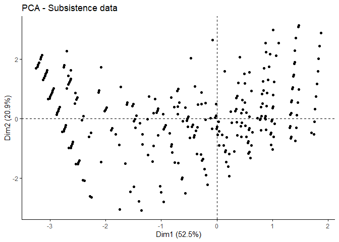<!-- -->

#### Plot the random df

``` r
fviz_pca_ind(prcomp(random_df), title = "PCA - Random data", geom = "point", ggtheme = theme_classic())
```

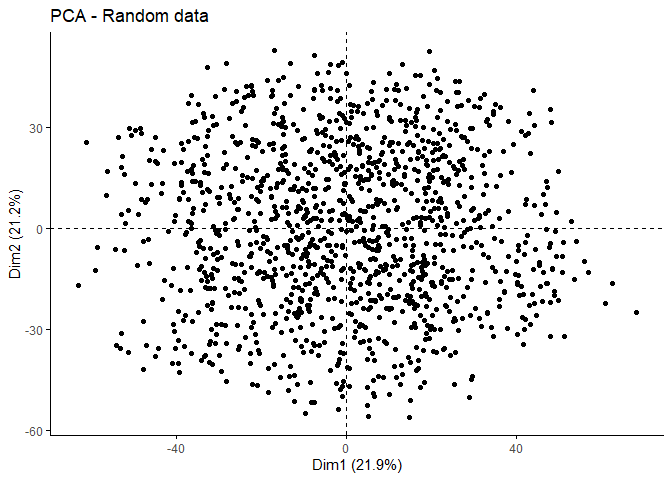<!-- -->

### PCA with FactoMineR

#### We will explore with PCA just variables from EA001 to EA005

``` r
res_no_6 <- PCA(final_clust_db_scaled, ncp = Inf, graph = T)
```

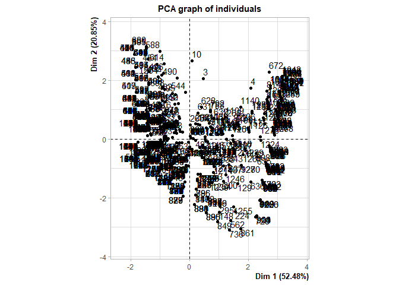<!-- -->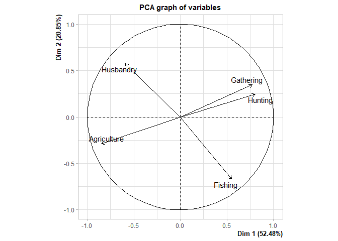<!-- -->
\#\#\#\# Graph of the variables on the 1 and 2 dimensions

``` r
plot(res_no_6, choix = "var", title = "PCA graph of variables 1st & 2nd dims.", axes = 1:2)
```

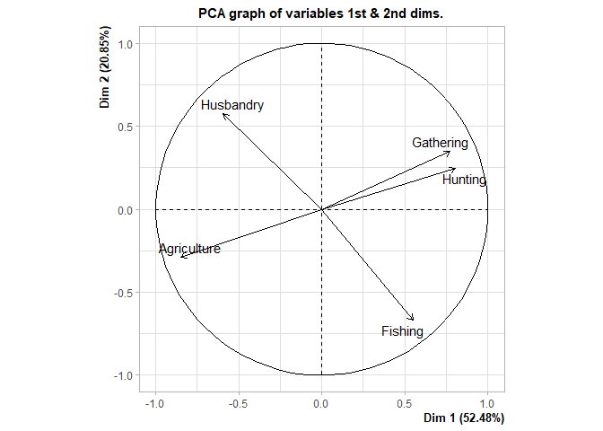<!-- -->

#### Graph of the variables on the 3 and 4 dimensions

``` r
plot(res_no_6, choix = "var", title = "PCA graph of variables 3rd & 4th dims.", axes = 3:4)
```

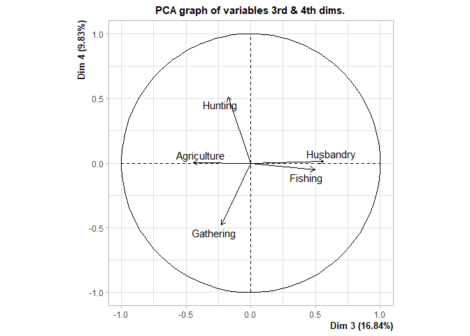<!-- -->

#### Summary of the PCA analysis without the supplementary variable EA028

``` r
summary(res_no_6)
```

    ## 
    ## Call:
    ## PCA(X = final_clust_db_scaled, ncp = Inf, graph = T) 
    ## 
    ## 
    ## Eigenvalues
    ##                        Dim.1   Dim.2   Dim.3   Dim.4   Dim.5
    ## Variance               2.624   1.043   0.842   0.492   0.000
    ## % of var.             52.477  20.851  16.841   9.831   0.000
    ## Cumulative % of var.  52.477  73.328  90.169 100.000 100.000
    ## 
    ## Individuals (the 10 first)
    ##                 Dist    Dim.1    ctr   cos2    Dim.2    ctr   cos2    Dim.3
    ## 1           |  4.905 |  3.145  0.292  0.411 |  2.141  0.341  0.191 | -1.342
    ## 2           |  4.005 |  3.201  0.303  0.639 |  1.885  0.264  0.221 | -1.201
    ## 3           |  2.804 |  0.466  0.006  0.028 |  2.049  0.312  0.534 |  1.645
    ## 4           |  2.775 |  2.086  0.129  0.565 |  1.740  0.225  0.393 |  0.058
    ## 5           |  4.279 |  3.215  0.305  0.565 |  1.821  0.246  0.181 | -1.166
    ## 6           |  0.596 | -0.530  0.008  0.792 |  0.210  0.003  0.125 | -0.076
    ## 7           |  4.415 |  3.159  0.295  0.512 |  2.077  0.321  0.221 | -1.307
    ## 8           |  3.579 |  3.079  0.280  0.740 |  1.507  0.169  0.177 | -0.873
    ## 9           |  4.079 |  3.173  0.297  0.605 |  2.013  0.301  0.244 | -1.272
    ## 10          |  3.283 |  0.081  0.000  0.001 |  2.656  0.524  0.654 |  1.712
    ##                ctr   cos2  
    ## 1            0.166  0.075 |
    ## 2            0.133  0.090 |
    ## 3            0.249  0.344 |
    ## 4            0.000  0.000 |
    ## 5            0.125  0.074 |
    ## 6            0.001  0.016 |
    ## 7            0.157  0.088 |
    ## 8            0.070  0.060 |
    ## 9            0.149  0.097 |
    ## 10           0.270  0.272 |
    ## 
    ## Variables
    ##                Dim.1    ctr   cos2    Dim.2    ctr   cos2    Dim.3    ctr
    ## Gathering   |  0.775 22.892  0.601 |  0.346 11.510  0.120 | -0.225  6.034
    ## Hunting     |  0.806 24.747  0.649 |  0.245  5.743  0.060 | -0.175  3.630
    ## Fishing     |  0.551 11.571  0.304 | -0.670 43.094  0.449 |  0.495 29.049
    ## Husbandry   | -0.593 13.406  0.352 |  0.575 31.674  0.330 |  0.564 37.743
    ## Agriculture | -0.848 27.385  0.719 | -0.288  7.979  0.083 | -0.445 23.543
    ##               cos2  
    ## Gathering    0.051 |
    ## Hunting      0.031 |
    ## Fishing      0.245 |
    ## Husbandry    0.318 |
    ## Agriculture  0.198 |

#### Description of the PCA dimensions

``` r
dimdesc(res_no_6, axes = 1:4)
```

    ## $Dim.1
    ## $quanti
    ##             correlation       p.value
    ## Hunting       0.8058023 2.318745e-295
    ## Gathering     0.7750216 5.286253e-259
    ## Fishing       0.5509960 2.555074e-103
    ## Husbandry    -0.5930840 2.167382e-123
    ## Agriculture  -0.8476672  0.000000e+00
    ## 
    ## attr(,"class")
    ## [1] "condes" "list " 
    ## 
    ## $Dim.2
    ## $quanti
    ##             correlation       p.value
    ## Husbandry     0.5746451 3.079045e-114
    ## Gathering     0.3464041  1.129933e-37
    ## Hunting       0.2446962  4.833906e-19
    ## Agriculture  -0.2884239  3.905108e-26
    ## Fishing      -0.6702810 4.801981e-169
    ## 
    ## attr(,"class")
    ## [1] "condes" "list " 
    ## 
    ## $Dim.3
    ## $quanti
    ##             correlation       p.value
    ## Husbandry     0.5637490 4.255552e-109
    ## Fishing       0.4945824  1.560515e-80
    ## Hunting      -0.1748359  2.579101e-10
    ## Gathering    -0.2254181  2.525113e-16
    ## Agriculture  -0.4452511  7.916867e-64
    ## 
    ## attr(,"class")
    ## [1] "condes" "list " 
    ## 
    ## $Dim.4
    ## $quanti
    ##           correlation      p.value
    ## Hunting     0.5101360 2.153885e-86
    ## Gathering  -0.4780505 1.255807e-74
    ## 
    ## attr(,"class")
    ## [1] "condes" "list " 
    ## 
    ## $call
    ## $call$num.var
    ## [1] 1
    ## 
    ## $call$proba
    ## [1] 0.05
    ## 
    ## $call$weights
    ##    [1] 1 1 1 1 1 1 1 1 1 1 1 1 1 1 1 1 1 1 1 1 1 1 1 1 1 1 1 1 1 1 1 1 1 1 1 1 1
    ##   [38] 1 1 1 1 1 1 1 1 1 1 1 1 1 1 1 1 1 1 1 1 1 1 1 1 1 1 1 1 1 1 1 1 1 1 1 1 1
    ##   [75] 1 1 1 1 1 1 1 1 1 1 1 1 1 1 1 1 1 1 1 1 1 1 1 1 1 1 1 1 1 1 1 1 1 1 1 1 1
    ##  [112] 1 1 1 1 1 1 1 1 1 1 1 1 1 1 1 1 1 1 1 1 1 1 1 1 1 1 1 1 1 1 1 1 1 1 1 1 1
    ##  [149] 1 1 1 1 1 1 1 1 1 1 1 1 1 1 1 1 1 1 1 1 1 1 1 1 1 1 1 1 1 1 1 1 1 1 1 1 1
    ##  [186] 1 1 1 1 1 1 1 1 1 1 1 1 1 1 1 1 1 1 1 1 1 1 1 1 1 1 1 1 1 1 1 1 1 1 1 1 1
    ##  [223] 1 1 1 1 1 1 1 1 1 1 1 1 1 1 1 1 1 1 1 1 1 1 1 1 1 1 1 1 1 1 1 1 1 1 1 1 1
    ##  [260] 1 1 1 1 1 1 1 1 1 1 1 1 1 1 1 1 1 1 1 1 1 1 1 1 1 1 1 1 1 1 1 1 1 1 1 1 1
    ##  [297] 1 1 1 1 1 1 1 1 1 1 1 1 1 1 1 1 1 1 1 1 1 1 1 1 1 1 1 1 1 1 1 1 1 1 1 1 1
    ##  [334] 1 1 1 1 1 1 1 1 1 1 1 1 1 1 1 1 1 1 1 1 1 1 1 1 1 1 1 1 1 1 1 1 1 1 1 1 1
    ##  [371] 1 1 1 1 1 1 1 1 1 1 1 1 1 1 1 1 1 1 1 1 1 1 1 1 1 1 1 1 1 1 1 1 1 1 1 1 1
    ##  [408] 1 1 1 1 1 1 1 1 1 1 1 1 1 1 1 1 1 1 1 1 1 1 1 1 1 1 1 1 1 1 1 1 1 1 1 1 1
    ##  [445] 1 1 1 1 1 1 1 1 1 1 1 1 1 1 1 1 1 1 1 1 1 1 1 1 1 1 1 1 1 1 1 1 1 1 1 1 1
    ##  [482] 1 1 1 1 1 1 1 1 1 1 1 1 1 1 1 1 1 1 1 1 1 1 1 1 1 1 1 1 1 1 1 1 1 1 1 1 1
    ##  [519] 1 1 1 1 1 1 1 1 1 1 1 1 1 1 1 1 1 1 1 1 1 1 1 1 1 1 1 1 1 1 1 1 1 1 1 1 1
    ##  [556] 1 1 1 1 1 1 1 1 1 1 1 1 1 1 1 1 1 1 1 1 1 1 1 1 1 1 1 1 1 1 1 1 1 1 1 1 1
    ##  [593] 1 1 1 1 1 1 1 1 1 1 1 1 1 1 1 1 1 1 1 1 1 1 1 1 1 1 1 1 1 1 1 1 1 1 1 1 1
    ##  [630] 1 1 1 1 1 1 1 1 1 1 1 1 1 1 1 1 1 1 1 1 1 1 1 1 1 1 1 1 1 1 1 1 1 1 1 1 1
    ##  [667] 1 1 1 1 1 1 1 1 1 1 1 1 1 1 1 1 1 1 1 1 1 1 1 1 1 1 1 1 1 1 1 1 1 1 1 1 1
    ##  [704] 1 1 1 1 1 1 1 1 1 1 1 1 1 1 1 1 1 1 1 1 1 1 1 1 1 1 1 1 1 1 1 1 1 1 1 1 1
    ##  [741] 1 1 1 1 1 1 1 1 1 1 1 1 1 1 1 1 1 1 1 1 1 1 1 1 1 1 1 1 1 1 1 1 1 1 1 1 1
    ##  [778] 1 1 1 1 1 1 1 1 1 1 1 1 1 1 1 1 1 1 1 1 1 1 1 1 1 1 1 1 1 1 1 1 1 1 1 1 1
    ##  [815] 1 1 1 1 1 1 1 1 1 1 1 1 1 1 1 1 1 1 1 1 1 1 1 1 1 1 1 1 1 1 1 1 1 1 1 1 1
    ##  [852] 1 1 1 1 1 1 1 1 1 1 1 1 1 1 1 1 1 1 1 1 1 1 1 1 1 1 1 1 1 1 1 1 1 1 1 1 1
    ##  [889] 1 1 1 1 1 1 1 1 1 1 1 1 1 1 1 1 1 1 1 1 1 1 1 1 1 1 1 1 1 1 1 1 1 1 1 1 1
    ##  [926] 1 1 1 1 1 1 1 1 1 1 1 1 1 1 1 1 1 1 1 1 1 1 1 1 1 1 1 1 1 1 1 1 1 1 1 1 1
    ##  [963] 1 1 1 1 1 1 1 1 1 1 1 1 1 1 1 1 1 1 1 1 1 1 1 1 1 1 1 1 1 1 1 1 1 1 1 1 1
    ## [1000] 1 1 1 1 1 1 1 1 1 1 1 1 1 1 1 1 1 1 1 1 1 1 1 1 1 1 1 1 1 1 1 1 1 1 1 1 1
    ## [1037] 1 1 1 1 1 1 1 1 1 1 1 1 1 1 1 1 1 1 1 1 1 1 1 1 1 1 1 1 1 1 1 1 1 1 1 1 1
    ## [1074] 1 1 1 1 1 1 1 1 1 1 1 1 1 1 1 1 1 1 1 1 1 1 1 1 1 1 1 1 1 1 1 1 1 1 1 1 1
    ## [1111] 1 1 1 1 1 1 1 1 1 1 1 1 1 1 1 1 1 1 1 1 1 1 1 1 1 1 1 1 1 1 1 1 1 1 1 1 1
    ## [1148] 1 1 1 1 1 1 1 1 1 1 1 1 1 1 1 1 1 1 1 1 1 1 1 1 1 1 1 1 1 1 1 1 1 1 1 1 1
    ## [1185] 1 1 1 1 1 1 1 1 1 1 1 1 1 1 1 1 1 1 1 1 1 1 1 1 1 1 1 1 1 1 1 1 1 1 1 1 1
    ## [1222] 1 1 1 1 1 1 1 1 1 1 1 1 1 1 1 1 1 1 1 1 1 1 1 1 1 1 1 1 1 1 1 1 1 1 1 1 1
    ## [1259] 1 1 1 1 1 1 1 1 1 1 1 1 1 1 1 1 1 1 1 1 1 1 1 1 1 1 1 1 1 1 1 1
    ## 
    ## $call$X
    ##             Dim.1    Gathering    Hunting    Fishing   Husbandry Agriculture
    ## 1     3.145096085  4.460904526  0.3038583 -0.8592335 -0.83002621 -1.61805117
    ## 2     3.201330735  1.855426464  2.9228100 -0.8592335 -0.83002621 -1.61805117
    ## 3     0.466244230 -0.072502637  1.0350345 -0.3610833  2.01072743 -1.61453566
    ## 4     2.086441356  1.956404322  1.0350345 -0.3610833  0.23865899 -1.61453566
    ## 5     3.215389397  1.204056949  3.5775479 -0.8592335 -0.83002621 -1.61805117
    ## 6    -0.530241559 -0.058646687 -0.3106372 -0.3484711  0.26228657  0.25392200
    ## 7     3.159154748  3.809535011  0.9585962 -0.8592335 -0.83002621 -1.61805117
    ## 8     3.079291373  2.568569051  1.6631311 -0.3732218 -0.82735526 -1.61632642
    ## 9     3.173213410  3.158165495  1.6133341 -0.8592335 -0.83002621 -1.61805117
    ## 10    0.081077739 -0.085838176  0.9960976 -0.8564500  2.53430571 -1.61632642
    ## 11   -1.796609748 -0.619777694 -0.8746700 -0.8592335  1.90075575  0.14532390
    ## 12   -0.903708159 -0.072502637 -0.3245648 -0.8535598  0.82934847  0.21633701
    ## 13   -1.352813936 -0.616719621 -0.3379693 -0.8564500  1.37511227  0.18016366
    ## 14   -1.352813936 -0.616719621 -0.3379693 -0.8564500  1.37511227  0.18016366
    ## 15   -1.347909609 -0.085838176 -0.8715961 -0.8564500  0.79551555  0.55443243
    ## 16   -1.336451470 -0.616719621 -0.3379693 -0.8564500  0.79551555  0.55443243
    ## 17   -0.530241559 -0.058646687 -0.3106372 -0.3484711  0.26228657  0.25392200
    ## 18   -0.569252376 -0.613544493 -0.3245648  0.2545124  0.23865899  0.21633701
    ## 19   -0.530241559 -0.058646687 -0.3106372 -0.3484711  0.26228657  0.25392200
    ## 20   -0.995090348 -0.613544493 -0.3245648 -0.3610833  0.82934847  0.21633701
    ## 21   -0.887032535 -0.072502637 -0.3245648 -0.8535598  0.23865899  0.59776881
    ## 22   -0.995090348 -0.613544493 -0.3245648 -0.3610833  0.82934847  0.21633701
    ## 23   -0.332370034 -0.072502637  0.3552349 -0.8535598 -0.35203049  0.59776881
    ## 24   -1.780548894 -0.619777694 -0.8746700 -0.8592335  1.33184284  0.51269370
    ## 25   -0.978414725 -0.613544493 -0.3245648 -0.3610833  0.23865899  0.59776881
    ## 26    0.018242624 -0.058646687  0.3824268 -0.3484711  0.26228657 -0.13495238
    ## 27   -0.995090348 -0.613544493 -0.3245648 -0.3610833  0.82934847  0.21633701
    ## 28   -0.530241559 -0.058646687 -0.3106372 -0.3484711  0.26228657  0.25392200
    ## 29   -0.887032535 -0.072502637 -0.3245648 -0.8535598  0.23865899  0.59776881
    ## 30   -1.011765971 -0.613544493 -0.3245648 -0.3610833  1.42003795 -0.16509480
    ## 31   -0.903708159 -0.072502637 -0.3245648 -0.8535598  0.82934847  0.21633701
    ## 32   -1.352813936 -0.616719621 -0.3379693 -0.8564500  1.37511227  0.18016366
    ## 33   -1.347909609 -0.085838176 -0.8715961 -0.8564500  0.79551555  0.55443243
    ## 34    0.035243626 -0.058646687  0.3824268 -0.3484711 -0.33992856  0.25392200
    ## 35   -0.166496628 -0.616719621 -0.3379693  0.8348486 -0.82735526  0.55443243
    ## 36    0.114234655 -0.613544493  1.0350345 -0.3610833 -0.35203049  0.21633701
    ## 37    0.254070511 -0.072502637 -0.8684045  1.4857038 -0.35203049 -0.16509480
    ## 38   -0.513240558 -0.058646687 -0.3106372 -0.3484711 -0.33992856  0.64279637
    ## 39   -0.564254187 -0.072502637 -0.8684045  0.2545124 -0.35203049  0.59776881
    ## 40   -0.513240558 -0.058646687 -0.3106372 -0.3484711 -0.33992856  0.64279637
    ## 41    0.008300344 -0.072502637  0.3552349 -0.3610833 -0.82458207  0.59776881
    ## 42   -0.513240558 -0.058646687 -0.3106372 -0.3484711 -0.33992856  0.64279637
    ## 43   -0.961739101 -0.613544493 -0.3245648 -0.3610833 -0.35203049  0.97920062
    ## 44   -0.990092159 -0.072502637 -0.8684045 -0.3610833  0.23865899  0.59776881
    ## 45   -0.775842699 -0.616719621  0.3290642 -0.8564500 -0.36367789  0.92870120
    ## 46   -0.961739101 -0.613544493 -0.3245648 -0.3610833 -0.35203049  0.97920062
    ## 47    0.035243626 -0.058646687  0.3824268 -0.3484711 -0.33992856  0.25392200
    ## 48   -0.961739101 -0.613544493 -0.3245648 -0.3610833 -0.35203049  0.97920062
    ## 49   -0.567975177 -0.616719621 -0.3379693  0.2308134 -0.82735526  0.92870120
    ## 50    0.035243626 -0.058646687  0.3824268 -0.3484711 -0.33992856  0.25392200
    ## 51   -0.014589874 -0.613544493  0.3552349  0.2545124 -0.35203049  0.21633701
    ## 52   -0.961739101 -0.613544493 -0.3245648 -0.3610833 -0.35203049  0.97920062
    ## 53    0.803734823 -0.613544493  0.3552349  1.4857038 -0.35203049 -0.54652661
    ## 54   -0.969453726 -0.616719621 -0.3379693 -0.3732218 -0.82735526  1.30296997
    ## 55   -0.529686534 -0.072502637 -0.3245648 -0.3610833 -0.82458207  0.97920062
    ## 56   -0.978414725 -0.613544493 -0.3245648 -0.3610833  0.23865899  0.59776881
    ## 57   -0.513240558 -0.058646687 -0.3106372 -0.3484711 -0.33992856  0.64279637
    ## 58    0.487792500 -0.616719621  0.9960976  0.2308134 -0.82735526  0.18016366
    ## 59   -0.552576752 -0.613544493 -0.3245648  0.2545124 -0.35203049  0.59776881
    ## 60   -0.143414404 -0.613544493 -0.3245648  0.8701081 -0.35203049  0.21633701
    ## 61   -0.143414404 -0.613544493 -0.3245648  0.8701081 -0.35203049  0.21633701
    ## 62   -0.775842699 -0.616719621  0.3290642 -0.8564500 -0.36367789  0.92870120
    ## 63   -0.366734432  0.002642065 -0.2490315 -0.2926838 -0.80895536  0.84196590
    ## 64   -0.552576752 -0.613544493 -0.3245648  0.2545124 -0.35203049  0.59776881
    ## 65   -0.200415123 -0.616719621 -0.8715961  1.4388838 -0.36367789  0.18016366
    ## 66   -0.552576752 -0.613544493 -0.3245648  0.2545124 -0.35203049  0.59776881
    ## 67   -0.513240558 -0.058646687 -0.3106372 -0.3484711 -0.33992856  0.64279637
    ## 68   -1.303726538 -0.616719621 -0.3379693 -0.8564500 -0.36367789  1.30296997
    ## 69   -0.961739101 -0.613544493 -0.3245648 -0.3610833 -0.35203049  0.97920062
    ## 70   -1.320089004 -0.616719621 -0.3379693 -0.8564500  0.21591883  0.92870120
    ## 71   -0.040091339 -0.616719621  0.3290642  0.2308134 -0.82735526  0.55443243
    ## 72   -0.423752223 -0.613544493  0.3552349 -0.3610833 -0.35203049  0.59776881
    ## 73   -0.552576752 -0.613544493 -0.3245648  0.2545124 -0.35203049  0.59776881
    ## 74   -0.014589874 -0.613544493  0.3552349  0.2545124 -0.35203049  0.21633701
    ## 75   -0.552576752 -0.613544493 -0.3245648  0.2545124 -0.35203049  0.59776881
    ## 76    0.265747945 -0.613544493 -0.3245648  1.4857038 -0.35203049 -0.16509480
    ## 77   -1.336451470 -0.616719621 -0.3379693 -0.8564500  0.79551555  0.55443243
    ## 78   -1.336451470 -0.616719621 -0.3379693 -0.8564500  0.79551555  0.55443243
    ## 79   -1.764488040 -0.619777694 -0.8746700 -0.8592335  0.76292993  0.88006351
    ## 80   -0.792205165 -0.616719621  0.3290642 -0.8564500  0.21591883  0.55443243
    ## 81   -0.961739101 -0.613544493 -0.3245648 -0.3610833 -0.35203049  0.97920062
    ## 82   -1.303726538 -0.616719621 -0.3379693 -0.8564500 -0.36367789  1.30296997
    ## 83   -0.978414725 -0.613544493 -0.3245648 -0.3610833  0.23865899  0.59776881
    ## 84   -0.978414725 -0.613544493 -0.3245648 -0.3610833  0.23865899  0.59776881
    ## 85   -0.040091339 -0.616719621  0.3290642  0.2308134 -0.82735526  0.55443243
    ## 86   -0.601893671 -0.616719621 -0.8715961  0.8348486 -0.36367789  0.55443243
    ## 87   -0.978414725 -0.613544493 -0.3245648 -0.3610833  0.23865899  0.59776881
    ## 88   -0.870356912 -0.072502637 -0.3245648 -0.8535598 -0.35203049  0.97920062
    ## 89   -0.552576752 -0.613544493 -0.3245648  0.2545124 -0.35203049  0.59776881
    ## 90   -1.764488040 -0.619777694 -0.8746700 -0.8592335  0.76292993  0.88006351
    ## 91   -1.369176402 -0.616719621 -0.3379693 -0.8564500  1.95470899 -0.19410511
    ## 92   -1.352813936 -0.616719621 -0.3379693 -0.8564500  1.37511227  0.18016366
    ## 93   -0.808567631 -0.616719621  0.3290642 -0.8564500  0.79551555  0.18016366
    ## 94   -1.796609748 -0.619777694 -0.8746700 -0.8592335  1.90075575  0.14532390
    ## 95   -0.961739101 -0.613544493 -0.3245648 -0.3610833 -0.35203049  0.97920062
    ## 96   -0.978414725 -0.613544493 -0.3245648 -0.3610833  0.23865899  0.59776881
    ## 97   -1.019734686 -0.616719621 -0.8715961  0.2308134  0.21591883  0.55443243
    ## 98   -1.336451470 -0.616719621 -0.3379693 -0.8564500  0.79551555  0.55443243
    ## 99   -0.552576752 -0.613544493 -0.3245648  0.2545124 -0.35203049  0.59776881
    ## 100  -1.336451470 -0.616719621 -0.3379693 -0.8564500  0.79551555  0.55443243
    ## 101  -1.320089004 -0.616719621 -0.3379693 -0.8564500  0.21591883  0.92870120
    ## 102  -0.166496628 -0.616719621 -0.3379693  0.8348486 -0.82735526  0.55443243
    ## 103  -1.336451470 -0.616719621 -0.3379693 -0.8564500  0.79551555  0.55443243
    ## 104  -1.336451470 -0.616719621 -0.3379693 -0.8564500  0.79551555  0.55443243
    ## 105  -1.780548894 -0.619777694 -0.8746700 -0.8592335  1.33184284  0.51269370
    ## 106  -1.336451470 -0.616719621 -0.3379693 -0.8564500  0.79551555  0.55443243
    ## 107  -1.036097152 -0.616719621 -0.8715961  0.2308134  0.79551555  0.18016366
    ## 108  -1.748427186 -0.619777694 -0.8746700 -0.8592335  0.19401702  1.24743331
    ## 109  -1.764488040 -0.619777694 -0.8746700 -0.8592335  0.76292993  0.88006351
    ## 110  -1.764488040 -0.619777694 -0.8746700 -0.8592335  0.76292993  0.88006351
    ## 111  -1.780548894 -0.619777694 -0.8746700 -0.8592335  1.33184284  0.51269370
    ## 112  -1.036097152 -0.616719621 -0.8715961  0.2308134  0.79551555  0.18016366
    ## 113  -0.634618604 -0.616719621 -0.8715961  0.8348486  0.79551555 -0.19410511
    ## 114  -0.143414404 -0.613544493 -0.3245648  0.8701081 -0.35203049  0.21633701
    ## 115  -1.352813936 -0.616719621 -0.3379693 -0.8564500  1.37511227  0.18016366
    ## 116  -1.019734686 -0.616719621 -0.8715961  0.2308134  0.21591883  0.55443243
    ## 117  -1.303726538 -0.616719621 -0.3379693 -0.8564500 -0.36367789  1.30296997
    ## 118  -1.437575701 -0.616719621 -0.8715961 -0.3732218  0.79551555  0.55443243
    ## 119  -1.437575701 -0.616719621 -0.8715961 -0.3732218  0.79551555  0.55443243
    ## 120  -0.824930097 -0.616719621  0.3290642 -0.8564500  1.37511227 -0.19410511
    ## 121  -0.978414725 -0.613544493 -0.3245648 -0.3610833  0.23865899  0.59776881
    ## 122  -0.961739101 -0.613544493 -0.3245648 -0.3610833 -0.35203049  0.97920062
    ## 123  -0.978414725 -0.613544493 -0.3245648 -0.3610833  0.23865899  0.59776881
    ## 124  -0.961739101 -0.613544493 -0.3245648 -0.3610833 -0.35203049  0.97920062
    ## 125  -1.336451470 -0.616719621 -0.3379693 -0.8564500  0.79551555  0.55443243
    ## 126  -0.978414725 -0.613544493 -0.3245648 -0.3610833  0.23865899  0.59776881
    ## 127  -0.513240558 -0.058646687 -0.3106372 -0.3484711 -0.33992856  0.64279637
    ## 128  -1.336451470 -0.616719621 -0.3379693 -0.8564500  0.79551555  0.55443243
    ## 129   1.644949739 -0.072502637  0.3552349  2.1012995 -0.82458207 -0.92795841
    ## 130  -0.601893671 -0.616719621 -0.8715961  0.8348486 -0.36367789  0.55443243
    ## 131  -1.453938167 -0.616719621 -0.8715961 -0.3732218  1.37511227  0.18016366
    ## 132  -1.453938167 -0.616719621 -0.8715961 -0.3732218  1.37511227  0.18016366
    ## 133  -0.995090348 -0.613544493 -0.3245648 -0.3610833  0.82934847  0.21633701
    ## 134  -1.303726538 -0.616719621 -0.3379693 -0.8564500 -0.36367789  1.30296997
    ## 135  -0.014589874 -0.613544493  0.3552349  0.2545124 -0.35203049  0.21633701
    ## 136  -0.961739101 -0.613544493 -0.3245648 -0.3610833 -0.35203049  0.97920062
    ## 137  -0.440427846 -0.613544493  0.3552349 -0.3610833  0.23865899  0.21633701
    ## 138  -0.995090348 -0.613544493 -0.3245648 -0.3610833  0.82934847  0.21633701
    ## 139  -0.200415123 -0.616719621 -0.8715961  1.4388838 -0.36367789  0.18016366
    ## 140   0.279924977 -0.616719621  1.6631311 -0.8564500 -0.36367789  0.18016366
    ## 141  -0.014589874 -0.613544493  0.3552349  0.2545124 -0.35203049  0.21633701
    ## 142  -0.552576752 -0.613544493 -0.3245648  0.2545124 -0.35203049  0.59776881
    ## 143  -0.513240558 -0.058646687 -0.3106372 -0.3484711 -0.33992856  0.64279637
    ## 144  -0.961739101 -0.613544493 -0.3245648 -0.3610833 -0.35203049  0.97920062
    ## 145  -0.423752223 -0.613544493  0.3552349 -0.3610833 -0.35203049  0.59776881
    ## 146   0.201063426 -0.616719621 -0.8715961  2.0429190 -0.36367789 -0.19410511
    ## 147   0.265747945 -0.613544493 -0.3245648  1.4857038 -0.35203049 -0.16509480
    ## 148   1.004020524 -0.616719621 -0.8715961  3.2509894 -0.36367789 -0.94264264
    ## 149  -0.096094553 -0.058646687 -0.3106372  0.2791362 -0.33992856  0.25392200
    ## 150  -1.739961323 -0.623445315 -0.8783565 -0.8625719 -0.38834991  1.62969649
    ## 151  -0.268688520 -0.619777694  0.9585962 -0.8592335 -0.83002621  0.88006351
    ## 152   0.279924977 -0.616719621  1.6631311 -0.8564500 -0.36367789  0.18016366
    ## 153  -0.961739101 -0.613544493 -0.3245648 -0.3610833 -0.35203049  0.97920062
    ## 154  -0.423752223 -0.613544493  0.3552349 -0.3610833 -0.35203049  0.59776881
    ## 155  -0.961739101 -0.613544493 -0.3245648 -0.3610833 -0.35203049  0.97920062
    ## 156  -0.969453726 -0.616719621 -0.3379693 -0.3732218 -0.82735526  1.30296997
    ## 157  -1.003372220 -0.616719621 -0.8715961  0.2308134 -0.36367789  0.92870120
    ## 158  -0.969453726 -0.616719621 -0.3379693 -0.3732218 -0.82735526  1.30296997
    ## 159  -0.040091339 -0.616719621  0.3290642  0.2308134 -0.82735526  0.55443243
    ## 160  -0.120524186 -0.072502637 -0.3245648  0.2545124 -0.82458207  0.59776881
    ## 161  -0.961739101 -0.613544493 -0.3245648 -0.3610833 -0.35203049  0.97920062
    ## 162  -0.332370034 -0.072502637  0.3552349 -0.8535598 -0.35203049  0.59776881
    ## 163  -0.143414404 -0.613544493 -0.3245648  0.8701081 -0.35203049  0.21633701
    ## 164  -0.961739101 -0.613544493 -0.3245648 -0.3610833 -0.35203049  0.97920062
    ## 165  -0.961739101 -0.613544493 -0.3245648 -0.3610833 -0.35203049  0.97920062
    ## 166  -0.978414725 -0.613544493 -0.3245648 -0.3610833  0.23865899  0.59776881
    ## 167  -0.969453726 -0.616719621 -0.3379693 -0.3732218 -0.82735526  1.30296997
    ## 168  -0.143414404 -0.613544493 -0.3245648  0.8701081 -0.35203049  0.21633701
    ## 169  -1.019734686 -0.616719621 -0.8715961  0.2308134  0.21591883  0.55443243
    ## 170  -0.423752223 -0.613544493  0.3552349 -0.3610833 -0.35203049  0.59776881
    ## 171  -1.303726538 -0.616719621 -0.3379693 -0.8564500 -0.36367789  1.30296997
    ## 172  -0.961739101 -0.613544493 -0.3245648 -0.3610833 -0.35203049  0.97920062
    ## 173  -0.870356912 -0.072502637 -0.3245648 -0.8535598 -0.35203049  0.97920062
    ## 174  -1.303726538 -0.616719621 -0.3379693 -0.8564500 -0.36367789  1.30296997
    ## 175  -0.423752223 -0.613544493  0.3552349 -0.3610833 -0.35203049  0.59776881
    ## 176  -1.303726538 -0.616719621 -0.3379693 -0.8564500 -0.36367789  1.30296997
    ## 177  -0.961739101 -0.613544493 -0.3245648 -0.3610833 -0.35203049  0.97920062
    ## 178  -1.303726538 -0.616719621 -0.3379693 -0.8564500 -0.36367789  1.30296997
    ## 179  -1.303726538 -0.616719621 -0.3379693 -0.8564500 -0.36367789  1.30296997
    ## 180  -1.303726538 -0.616719621 -0.3379693 -0.8564500 -0.36367789  1.30296997
    ## 181  -0.961739101 -0.613544493 -0.3245648 -0.3610833 -0.35203049  0.97920062
    ## 182   0.452389630 -0.058646687  0.3824268  0.2791362 -0.33992856 -0.13495238
    ## 183  -0.441569888 -0.616719621  0.3290642 -0.3732218 -0.82735526  0.92870120
    ## 184  -1.437575701 -0.616719621 -0.8715961 -0.3732218  0.79551555  0.55443243
    ## 185  -1.303726538 -0.616719621 -0.3379693 -0.8564500 -0.36367789  1.30296997
    ## 186  -0.440427846 -0.613544493  0.3552349 -0.3610833  0.23865899  0.21633701
    ## 187  -1.739961323 -0.623445315 -0.8783565 -0.8625719 -0.38834991  1.62969649
    ## 188  -0.552576752 -0.613544493 -0.3245648  0.2545124 -0.35203049  0.59776881
    ## 189  -1.303726538 -0.616719621 -0.3379693 -0.8564500 -0.36367789  1.30296997
    ## 190  -0.096094553 -0.058646687 -0.3106372  0.2791362 -0.33992856  0.25392200
    ## 191  -0.564254187 -0.072502637 -0.8684045  0.2545124 -0.35203049  0.59776881
    ## 192  -0.513240558 -0.058646687 -0.3106372 -0.3484711 -0.33992856  0.64279637
    ## 193  -0.961739101 -0.613544493 -0.3245648 -0.3610833 -0.35203049  0.97920062
    ## 194  -0.961739101 -0.613544493 -0.3245648 -0.3610833 -0.35203049  0.97920062
    ## 195  -1.320089004 -0.616719621 -0.3379693 -0.8564500  0.21591883  0.92870120
    ## 196  -0.143414404 -0.613544493 -0.3245648  0.8701081 -0.35203049  0.21633701
    ## 197  -1.739961323 -0.623445315 -0.8783565 -0.8625719 -0.38834991  1.62969649
    ## 198  -0.552576752 -0.613544493 -0.3245648  0.2545124 -0.35203049  0.59776881
    ## 199  -0.200415123 -0.616719621 -0.8715961  1.4388838 -0.36367789  0.18016366
    ## 200   1.155343460 -0.058646687 -0.3106372  2.1619582 -0.33992856 -0.91270114
    ## 201  -0.564254187 -0.072502637 -0.8684045  0.2545124 -0.35203049  0.59776881
    ## 202  -0.870356912 -0.072502637 -0.3245648 -0.8535598 -0.35203049  0.97920062
    ## 203  -0.155091838 -0.072502637 -0.8684045  0.8701081 -0.35203049  0.21633701
    ## 204  -0.961739101 -0.613544493 -0.3245648 -0.3610833 -0.35203049  0.97920062
    ## 205  -1.003372220 -0.616719621 -0.8715961  0.2308134 -0.36367789  0.92870120
    ## 206  -0.887032535 -0.072502637 -0.3245648 -0.8535598  0.23865899  0.59776881
    ## 207  -0.961739101 -0.613544493 -0.3245648 -0.3610833 -0.35203049  0.97920062
    ## 208  -0.567975177 -0.616719621 -0.3379693  0.2308134 -0.82735526  0.92870120
    ## 209  -0.961739101 -0.613544493 -0.3245648 -0.3610833 -0.35203049  0.97920062
    ## 210  -1.320089004 -0.616719621 -0.3379693 -0.8564500  0.21591883  0.92870120
    ## 211  -1.303726538 -0.616719621 -0.3379693 -0.8564500 -0.36367789  1.30296997
    ## 212  -1.003372220 -0.616719621 -0.8715961  0.2308134 -0.36367789  0.92870120
    ## 213  -1.739961323 -0.623445315 -0.8783565 -0.8625719 -0.38834991  1.62969649
    ## 214  -1.303726538 -0.616719621 -0.3379693 -0.8564500 -0.36367789  1.30296997
    ## 215  -0.552576752 -0.613544493 -0.3245648  0.2545124 -0.35203049  0.59776881
    ## 216  -0.423752223 -0.613544493  0.3552349 -0.3610833 -0.35203049  0.59776881
    ## 217  -1.303726538 -0.616719621 -0.3379693 -0.8564500 -0.36367789  1.30296997
    ## 218  -1.303726538 -0.616719621 -0.3379693 -0.8564500 -0.36367789  1.30296997
    ## 219  -0.870356912 -0.072502637 -0.3245648 -0.8535598 -0.35203049  0.97920062
    ## 220  -0.311638814 -0.628310919 -0.3869045  0.7061285 -0.40619852  0.39622624
    ## 221  -1.303726538 -0.616719621 -0.3379693 -0.8564500 -0.36367789  1.30296997
    ## 222  -0.961739101 -0.613544493 -0.3245648 -0.3610833 -0.35203049  0.97920062
    ## 223   0.265747945 -0.613544493 -0.3245648  1.4857038 -0.35203049 -0.16509480
    ## 224   1.555499415 -0.628310919 -0.3869045  3.5152878 -0.40619852 -1.34436868
    ## 225   0.265747945 -0.613544493 -0.3245648  1.4857038 -0.35203049 -0.16509480
    ## 226  -0.961739101 -0.613544493 -0.3245648 -0.3610833 -0.35203049  0.97920062
    ## 227  -0.961739101 -0.613544493 -0.3245648 -0.3610833 -0.35203049  0.97920062
    ## 228  -0.601893671 -0.616719621 -0.8715961  0.8348486 -0.36367789  0.55443243
    ## 229  -0.552576752 -0.613544493 -0.3245648  0.2545124 -0.35203049  0.59776881
    ## 230  -0.973416536 -0.072502637 -0.8684045 -0.3610833 -0.35203049  0.97920062
    ## 231  -0.870356912 -0.072502637 -0.3245648 -0.8535598 -0.35203049  0.97920062
    ## 232   0.205616844 -0.072502637  1.0350345 -0.8535598 -0.35203049  0.21633701
    ## 233   0.035243626 -0.058646687  0.3824268 -0.3484711 -0.33992856  0.25392200
    ## 234  -1.315184677 -0.085838176 -0.8715961 -0.8564500 -0.36367789  1.30296997
    ## 235  -0.961739101 -0.613544493 -0.3245648 -0.3610833 -0.35203049  0.97920062
    ## 236  -0.961739101 -0.613544493 -0.3245648 -0.3610833 -0.35203049  0.97920062
    ## 237  -1.019734686 -0.616719621 -0.8715961  0.2308134  0.21591883  0.55443243
    ## 238  -1.019734686 -0.616719621 -0.8715961  0.2308134  0.21591883  0.55443243
    ## 239  -0.990092159 -0.072502637 -0.8684045 -0.3610833  0.23865899  0.59776881
    ## 240  -1.404850769 -0.616719621 -0.8715961 -0.3732218 -0.36367789  1.30296997
    ## 241  -0.961739101 -0.613544493 -0.3245648 -0.3610833 -0.35203049  0.97920062
    ## 242  -0.973416536 -0.072502637 -0.8684045 -0.3610833 -0.35203049  0.97920062
    ## 243  -0.552576752 -0.613544493 -0.3245648  0.2545124 -0.35203049  0.59776881
    ## 244  -0.466702074  0.603799683 -0.8684045 -0.3610833  0.23865899  0.21633701
    ## 245  -0.513240558 -0.058646687 -0.3106372 -0.3484711 -0.33992856  0.64279637
    ## 246  -0.346966827  0.603799683 -0.3245648 -0.8535598 -0.35203049  0.59776881
    ## 247  -0.978414725 -0.613544493 -0.3245648 -0.3610833  0.23865899  0.59776881
    ## 248  -0.887032535 -0.072502637 -0.3245648 -0.8535598  0.23865899  0.59776881
    ## 249  -0.096094553 -0.058646687 -0.3106372  0.2791362 -0.33992856  0.25392200
    ## 250  -0.978414725 -0.613544493 -0.3245648 -0.3610833  0.23865899  0.59776881
    ## 251  -1.003372220 -0.616719621 -0.8715961  0.2308134 -0.36367789  0.92870120
    ## 252  -0.564254187 -0.072502637 -0.8684045  0.2545124 -0.35203049  0.59776881
    ## 253  -0.580929810 -0.072502637 -0.8684045  0.2545124  0.23865899  0.21633701
    ## 254  -0.171767461 -0.072502637 -0.8684045  0.8701081  0.23865899 -0.16509480
    ## 255  -1.331547143 -0.085838176 -0.8715961 -0.8564500  0.21591883  0.92870120
    ## 256  -1.019734686 -0.616719621 -0.8715961  0.2308134  0.21591883  0.55443243
    ## 257  -0.887032535 -0.072502637 -0.3245648 -0.8535598  0.23865899  0.59776881
    ## 258  -0.580929810 -0.072502637 -0.8684045  0.2545124  0.23865899  0.21633701
    ## 259  -1.006767782 -0.072502637 -0.8684045 -0.3610833  0.82934847  0.21633701
    ## 260  -1.336451470 -0.616719621 -0.3379693 -0.8564500  0.79551555  0.55443243
    ## 261  -1.331547143 -0.085838176 -0.8715961 -0.8564500  0.21591883  0.92870120
    ## 262  -0.978414725 -0.613544493 -0.3245648 -0.3610833  0.23865899  0.59776881
    ## 263  -0.870356912 -0.072502637 -0.3245648 -0.8535598 -0.35203049  0.97920062
    ## 264  -0.580929810 -0.072502637 -0.8684045  0.2545124  0.23865899  0.21633701
    ## 265  -0.870356912 -0.072502637 -0.3245648 -0.8535598 -0.35203049  0.97920062
    ## 266  -0.817985980  0.577763631 -0.8715961 -0.8564500  0.21591883  0.55443243
    ## 267  -1.320089004 -0.616719621 -0.3379693 -0.8564500  0.21591883  0.92870120
    ## 268  -0.887032535 -0.072502637 -0.3245648 -0.8535598  0.23865899  0.59776881
    ## 269  -0.801623514  0.577763631 -0.8715961 -0.8564500 -0.36367789  0.92870120
    ## 270  -1.347909609 -0.085838176 -0.8715961 -0.8564500  0.79551555  0.55443243
    ## 271  -1.347909609 -0.085838176 -0.8715961 -0.8564500  0.79551555  0.55443243
    ## 272  -0.887032535 -0.072502637 -0.3245648 -0.8535598  0.23865899  0.59776881
    ## 273  -1.331547143 -0.085838176 -0.8715961 -0.8564500  0.21591883  0.92870120
    ## 274  -0.978414725 -0.613544493 -0.3245648 -0.3610833  0.23865899  0.59776881
    ## 275  -1.764488040 -0.619777694 -0.8746700 -0.8592335  0.76292993  0.88006351
    ## 276  -1.764488040 -0.619777694 -0.8746700 -0.8592335  0.76292993  0.88006351
    ## 277  -1.331547143 -0.085838176 -0.8715961 -0.8564500  0.21591883  0.92870120
    ## 278  -0.862947086 -0.595652897 -0.2490315 -0.2926838  0.36679798  0.42017094
    ## 279  -1.764488040 -0.619777694 -0.8746700 -0.8592335  0.76292993  0.88006351
    ## 280  -0.887032535 -0.072502637 -0.3245648 -0.8535598  0.23865899  0.59776881
    ## 281  -1.748427186 -0.619777694 -0.8746700 -0.8592335  0.19401702  1.24743331
    ## 282  -1.748427186 -0.619777694 -0.8746700 -0.8592335  0.19401702  1.24743331
    ## 283  -0.978414725 -0.613544493 -0.3245648 -0.3610833  0.23865899  0.59776881
    ## 284  -1.764488040 -0.619777694 -0.8746700 -0.8592335  0.76292993  0.88006351
    ## 285  -0.887032535 -0.072502637 -0.3245648 -0.8535598  0.23865899  0.59776881
    ## 286  -1.320089004 -0.616719621 -0.3379693 -0.8564500  0.21591883  0.92870120
    ## 287  -0.978414725 -0.613544493 -0.3245648 -0.3610833  0.23865899  0.59776881
    ## 288  -0.513240558 -0.058646687 -0.3106372 -0.3484711 -0.33992856  0.64279637
    ## 289  -1.320089004 -0.616719621 -0.3379693 -0.8564500  0.21591883  0.92870120
    ## 290  -1.764488040 -0.619777694 -0.8746700 -0.8592335  0.76292993  0.88006351
    ## 291  -1.320089004 -0.616719621 -0.3379693 -0.8564500  0.21591883  0.92870120
    ## 292  -0.870356912 -0.072502637 -0.3245648 -0.8535598 -0.35203049  0.97920062
    ## 293  -1.748427186 -0.619777694 -0.8746700 -0.8592335  0.19401702  1.24743331
    ## 294  -1.796609748 -0.619777694 -0.8746700 -0.8592335  1.90075575  0.14532390
    ## 295   1.026480879 -0.085838176 -0.8715961  2.6469542 -0.82735526 -0.56837387
    ## 296  -0.346966827  0.603799683 -0.3245648 -0.8535598 -0.35203049  0.59776881
    ## 297  -0.513240558 -0.058646687 -0.3106372 -0.3484711 -0.33992856  0.64279637
    ## 298   0.020362017  0.630851775 -0.3106372 -0.3484711 -0.33992856  0.25392200
    ## 299  -1.320089004 -0.616719621 -0.3379693 -0.8564500  0.21591883  0.92870120
    ## 300  -0.978414725 -0.613544493 -0.3245648 -0.3610833  0.23865899  0.59776881
    ## 301  -0.978414725 -0.613544493 -0.3245648 -0.3610833  0.23865899  0.59776881
    ## 302  -0.887032535 -0.072502637 -0.3245648 -0.8535598  0.23865899  0.59776881
    ## 303  -1.421213235 -0.616719621 -0.8715961 -0.3732218  0.21591883  0.92870120
    ## 304  -0.618256137 -0.616719621 -0.8715961  0.8348486  0.21591883  0.18016366
    ## 305  -1.331547143 -0.085838176 -0.8715961 -0.8564500  0.21591883  0.92870120
    ## 306  -1.331547143 -0.085838176 -0.8715961 -0.8564500  0.21591883  0.92870120
    ## 307  -1.331547143 -0.085838176 -0.8715961 -0.8564500  0.21591883  0.92870120
    ## 308  -1.320089004 -0.616719621 -0.3379693 -0.8564500  0.21591883  0.92870120
    ## 309  -0.978414725 -0.613544493 -0.3245648 -0.3610833  0.23865899  0.59776881
    ## 310  -1.320089004 -0.616719621 -0.3379693 -0.8564500  0.21591883  0.92870120
    ## 311  -0.887032535 -0.072502637 -0.3245648 -0.8535598  0.23865899  0.59776881
    ## 312  -1.748427186 -0.619777694 -0.8746700 -0.8592335  0.19401702  1.24743331
    ## 313  -1.421213235 -0.616719621 -0.8715961 -0.3732218  0.21591883  0.92870120
    ## 314  -1.320089004 -0.616719621 -0.3379693 -0.8564500  0.21591883  0.92870120
    ## 315  -1.320089004 -0.616719621 -0.3379693 -0.8564500  0.21591883  0.92870120
    ## 316  -0.961739101 -0.613544493 -0.3245648 -0.3610833 -0.35203049  0.97920062
    ## 317  -1.303726538 -0.616719621 -0.3379693 -0.8564500 -0.36367789  1.30296997
    ## 318  -0.978414725 -0.613544493 -0.3245648 -0.3610833  0.23865899  0.59776881
    ## 319  -1.748427186 -0.619777694 -0.8746700 -0.8592335  0.19401702  1.24743331
    ## 320   0.035243626 -0.058646687  0.3824268 -0.3484711 -0.33992856  0.25392200
    ## 321  -1.764488040 -0.619777694 -0.8746700 -0.8592335  0.76292993  0.88006351
    ## 322  -1.320089004 -0.616719621 -0.3379693 -0.8564500  0.21591883  0.92870120
    ## 323  -1.421213235 -0.616719621 -0.8715961 -0.3732218  0.21591883  0.92870120
    ## 324  -1.336451470 -0.616719621 -0.3379693 -0.8564500  0.79551555  0.55443243
    ## 325  -1.748427186 -0.619777694 -0.8746700 -0.8592335  0.19401702  1.24743331
    ## 326  -1.437575701 -0.616719621 -0.8715961 -0.3732218  0.79551555  0.55443243
    ## 327  -1.748427186 -0.619777694 -0.8746700 -0.8592335  0.19401702  1.24743331
    ## 328  -1.764488040 -0.619777694 -0.8746700 -0.8592335  0.76292993  0.88006351
    ## 329  -1.748427186 -0.619777694 -0.8746700 -0.8592335  0.19401702  1.24743331
    ## 330  -1.748427186 -0.619777694 -0.8746700 -0.8592335  0.19401702  1.24743331
    ## 331  -1.748427186 -0.619777694 -0.8746700 -0.8592335  0.19401702  1.24743331
    ## 332  -0.978414725 -0.613544493 -0.3245648 -0.3610833  0.23865899  0.59776881
    ## 333  -0.499311007 -0.134521627  0.2335240 -0.8670008  0.13290236  0.39622624
    ## 334  -1.739961323 -0.623445315 -0.8783565 -0.8625719 -0.38834991  1.62969649
    ## 335  -0.513240558 -0.058646687 -0.3106372 -0.3484711 -0.33992856  0.64279637
    ## 336  -0.870356912 -0.072502637 -0.3245648 -0.8535598 -0.35203049  0.97920062
    ## 337  -0.775842699 -0.616719621  0.3290642 -0.8564500 -0.36367789  0.92870120
    ## 338  -0.792205165 -0.616719621  0.3290642 -0.8564500  0.21591883  0.55443243
    ## 339  -0.423752223 -0.613544493  0.3552349 -0.3610833 -0.35203049  0.59776881
    ## 340  -0.887032535 -0.072502637 -0.3245648 -0.8535598  0.23865899  0.59776881
    ## 341  -0.143414404 -0.613544493 -0.3245648  0.8701081 -0.35203049  0.21633701
    ## 342   0.523397004 -0.613544493  1.0350345  0.2545124 -0.35203049 -0.16509480
    ## 343  -1.453938167 -0.616719621 -0.8715961 -0.3732218  1.37511227  0.18016366
    ## 344  -0.995090348 -0.613544493 -0.3245648 -0.3610833  0.82934847  0.21633701
    ## 345  -1.320089004 -0.616719621 -0.3379693 -0.8564500  0.21591883  0.92870120
    ## 346  -0.216777589 -0.616719621 -0.8715961  1.4388838  0.21591883 -0.19410511
    ## 347  -1.019734686 -0.616719621 -0.8715961  0.2308134  0.21591883  0.55443243
    ## 348  -1.320089004 -0.616719621 -0.3379693 -0.8564500  0.21591883  0.92870120
    ## 349  -1.036097152 -0.616719621 -0.8715961  0.2308134  0.79551555  0.18016366
    ## 350  -0.875860228  0.002642065 -0.8504204 -0.2926838  0.36679798  0.42017094
    ## 351  -1.336451470 -0.616719621 -0.3379693 -0.8564500  0.79551555  0.55443243
    ## 352  -1.739961323 -0.623445315 -0.8783565 -0.8625719 -0.38834991  1.62969649
    ## 353  -1.739961323 -0.623445315 -0.8783565 -0.8625719 -0.38834991  1.62969649
    ## 354  -0.552576752 -0.613544493 -0.3245648  0.2545124 -0.35203049  0.59776881
    ## 355  -0.552576752 -0.613544493 -0.3245648  0.2545124 -0.35203049  0.59776881
    ## 356  -0.423752223 -0.613544493  0.3552349 -0.3610833 -0.35203049  0.59776881
    ## 357  -0.775842699 -0.616719621  0.3290642 -0.8564500 -0.36367789  0.92870120
    ## 358  -1.336451470 -0.616719621 -0.3379693 -0.8564500  0.79551555  0.55443243
    ## 359   0.008300344 -0.072502637  0.3552349 -0.3610833 -0.82458207  0.59776881
    ## 360  -1.019734686 -0.616719621 -0.8715961  0.2308134  0.21591883  0.55443243
    ## 361  -0.792205165 -0.616719621  0.3290642 -0.8564500  0.21591883  0.55443243
    ## 362  -1.364272076 -0.085838176 -0.8715961 -0.8564500  1.37511227  0.18016366
    ## 363  -0.585927999 -0.613544493 -0.3245648  0.2545124  0.82934847 -0.16509480
    ## 364  -0.440427846 -0.613544493  0.3552349 -0.3610833  0.23865899  0.21633701
    ## 365   0.020362017  0.630851775 -0.3106372 -0.3484711 -0.33992856  0.25392200
    ## 366  -0.978414725 -0.613544493 -0.3245648 -0.3610833  0.23865899  0.59776881
    ## 367  -1.748427186 -0.619777694 -0.8746700 -0.8592335  0.19401702  1.24743331
    ## 368  -1.336451470 -0.616719621 -0.3379693 -0.8564500  0.79551555  0.55443243
    ## 369  -1.336451470 -0.616719621 -0.3379693 -0.8564500  0.79551555  0.55443243
    ## 370  -1.336451470 -0.616719621 -0.3379693 -0.8564500  0.79551555  0.55443243
    ## 371  -1.336451470 -0.616719621 -0.3379693 -0.8564500  0.79551555  0.55443243
    ## 372  -1.336451470 -0.616719621 -0.3379693 -0.8564500  0.79551555  0.55443243
    ## 373  -1.336451470 -0.616719621 -0.3379693 -0.8564500  0.79551555  0.55443243
    ## 374  -1.336451470 -0.616719621 -0.3379693 -0.8564500  0.79551555  0.55443243
    ## 375  -0.552576752 -0.613544493 -0.3245648  0.2545124 -0.35203049  0.59776881
    ## 376  -0.978414725 -0.613544493 -0.3245648 -0.3610833  0.23865899  0.59776881
    ## 377  -0.552576752 -0.613544493 -0.3245648  0.2545124 -0.35203049  0.59776881
    ## 378  -0.513240558 -0.058646687 -0.3106372 -0.3484711 -0.33992856  0.64279637
    ## 379  -0.870356912 -0.072502637 -0.3245648 -0.8535598 -0.35203049  0.97920062
    ## 380  -0.530241559 -0.058646687 -0.3106372 -0.3484711  0.26228657  0.25392200
    ## 381  -0.513240558 -0.058646687 -0.3106372 -0.3484711 -0.33992856  0.64279637
    ## 382  -0.903708159 -0.072502637 -0.3245648 -0.8535598  0.82934847  0.21633701
    ## 383  -0.143414404 -0.613544493 -0.3245648  0.8701081 -0.35203049  0.21633701
    ## 384  -1.336451470 -0.616719621 -0.3379693 -0.8564500  0.79551555  0.55443243
    ## 385  -0.903708159 -0.072502637 -0.3245648 -0.8535598  0.82934847  0.21633701
    ## 386  -1.028441594 -0.613544493 -0.3245648 -0.3610833  2.01072743 -0.54652661
    ## 387  -0.457103470 -0.613544493  0.3552349 -0.3610833  0.82934847 -0.16509480
    ## 388  -0.978414725 -0.613544493 -0.3245648 -0.3610833  0.23865899  0.59776881
    ## 389  -1.748427186 -0.619777694 -0.8746700 -0.8592335  0.19401702  1.24743331
    ## 390  -1.336451470 -0.616719621 -0.3379693 -0.8564500  0.79551555  0.55443243
    ## 391  -0.569252376 -0.613544493 -0.3245648  0.2545124  0.23865899  0.21633701
    ## 392  -0.569252376 -0.613544493 -0.3245648  0.2545124  0.23865899  0.21633701
    ## 393  -0.841292563 -0.616719621  0.3290642 -0.8564500  1.95470899 -0.56837387
    ## 394  -0.824930097 -0.616719621  0.3290642 -0.8564500  1.37511227 -0.19410511
    ## 395  -1.464292572 -0.623445315 -0.3663633 -0.8625719  4.19947141 -1.62011969
    ## 396  -0.995090348 -0.613544493 -0.3245648 -0.3610833  0.82934847  0.21633701
    ## 397  -1.780548894 -0.619777694 -0.8746700 -0.8592335  1.33184284  0.51269370
    ## 398  -1.320089004 -0.616719621 -0.3379693 -0.8564500  0.21591883  0.92870120
    ## 399  -1.385538868 -0.616719621 -0.3379693 -0.8564500  2.53430571 -0.56837387
    ## 400  -0.937059405 -0.072502637 -0.3245648 -0.8535598  2.01072743 -0.54652661
    ## 401  -0.920383782 -0.072502637 -0.3245648 -0.8535598  1.42003795 -0.16509480
    ## 402  -1.336451470 -0.616719621 -0.3379693 -0.8564500  0.79551555  0.55443243
    ## 403  -0.824930097 -0.616719621  0.3290642 -0.8564500  1.37511227 -0.19410511
    ## 404  -1.401901334 -0.616719621 -0.3379693 -0.8564500  3.11390243 -0.94264264
    ## 405  -1.464292572 -0.623445315 -0.3663633 -0.8625719  4.19947141 -1.62011969
    ## 406  -1.470300633 -0.616719621 -0.8715961 -0.3732218  1.95470899 -0.19410511
    ## 407  -1.812670601 -0.619777694 -0.8746700 -0.8592335  2.46966865 -0.22204591
    ## 408  -1.352813936 -0.616719621 -0.3379693 -0.8564500  1.37511227  0.18016366
    ## 409  -1.352813936 -0.616719621 -0.3379693 -0.8564500  1.37511227  0.18016366
    ## 410  -0.380318073  0.603799683 -0.3245648 -0.8535598  0.82934847 -0.16509480
    ## 411  -0.978414725 -0.613544493 -0.3245648 -0.3610833  0.23865899  0.59776881
    ## 412  -1.796609748 -0.619777694 -0.8746700 -0.8592335  1.90075575  0.14532390
    ## 413  -1.352813936 -0.616719621 -0.3379693 -0.8564500  1.37511227  0.18016366
    ## 414  -1.352813936 -0.616719621 -0.3379693 -0.8564500  1.37511227  0.18016366
    ## 415  -1.748427186 -0.619777694 -0.8746700 -0.8592335  0.19401702  1.24743331
    ## 416  -1.869479086 -0.623445315 -0.8783565 -0.8625719  4.19947141 -1.33284312
    ## 417  -1.369176402 -0.616719621 -0.3379693 -0.8564500  1.95470899 -0.19410511
    ## 418  -1.336451470 -0.616719621 -0.3379693 -0.8564500  0.79551555  0.55443243
    ## 419  -1.336451470 -0.616719621 -0.3379693 -0.8564500  0.79551555  0.55443243
    ## 420  -1.320089004 -0.616719621 -0.3379693 -0.8564500  0.21591883  0.92870120
    ## 421  -1.320089004 -0.616719621 -0.3379693 -0.8564500  0.21591883  0.92870120
    ## 422  -1.336451470 -0.616719621 -0.3379693 -0.8564500  0.79551555  0.55443243
    ## 423  -1.336451470 -0.616719621 -0.3379693 -0.8564500  0.79551555  0.55443243
    ## 424  -1.780548894 -0.619777694 -0.8746700 -0.8592335  1.33184284  0.51269370
    ## 425  -1.369176402 -0.616719621 -0.3379693 -0.8564500  1.95470899 -0.19410511
    ## 426  -1.869479086 -0.623445315 -0.8783565 -0.8625719  4.19947141 -1.33284312
    ## 427  -1.028441594 -0.613544493 -0.3245648 -0.3610833  2.01072743 -0.54652661
    ## 428  -1.369176402 -0.616719621 -0.3379693 -0.8564500  1.95470899 -0.19410511
    ## 429  -1.796609748 -0.619777694 -0.8746700 -0.8592335  1.90075575  0.14532390
    ## 430  -1.764488040 -0.619777694 -0.8746700 -0.8592335  0.76292993  0.88006351
    ## 431  -1.336451470 -0.616719621 -0.3379693 -0.8564500  0.79551555  0.55443243
    ## 432  -1.764488040 -0.619777694 -0.8746700 -0.8592335  0.76292993  0.88006351
    ## 433  -1.748427186 -0.619777694 -0.8746700 -0.8592335  0.19401702  1.24743331
    ## 434  -0.990092159 -0.072502637 -0.8684045 -0.3610833  0.23865899  0.59776881
    ## 435  -1.764488040 -0.619777694 -0.8746700 -0.8592335  0.76292993  0.88006351
    ## 436  -1.748427186 -0.619777694 -0.8746700 -0.8592335  0.19401702  1.24743331
    ## 437  -1.764488040 -0.619777694 -0.8746700 -0.8592335  0.76292993  0.88006351
    ## 438  -0.887032535 -0.072502637 -0.3245648 -0.8535598  0.23865899  0.59776881
    ## 439  -1.764488040 -0.619777694 -0.8746700 -0.8592335  0.76292993  0.88006351
    ## 440  -1.331547143 -0.085838176 -0.8715961 -0.8564500  0.21591883  0.92870120
    ## 441  -0.887032535 -0.072502637 -0.3245648 -0.8535598  0.23865899  0.59776881
    ## 442  -1.418263800 -0.616719621 -0.3379693 -0.8564500  3.69349914 -1.31691141
    ## 443  -1.869479086 -0.623445315 -0.8783565 -0.8625719  4.19947141 -1.33284312
    ## 444  -1.418263800 -0.616719621 -0.3379693 -0.8564500  3.69349914 -1.31691141
    ## 445  -1.869479086 -0.623445315 -0.8783565 -0.8625719  4.19947141 -1.33284312
    ## 446  -1.844792309 -0.619777694 -0.8746700 -0.8592335  3.60749447 -0.95678552
    ## 447  -1.764488040 -0.619777694 -0.8746700 -0.8592335  0.76292993  0.88006351
    ## 448  -1.796609748 -0.619777694 -0.8746700 -0.8592335  1.90075575  0.14532390
    ## 449  -1.748427186 -0.619777694 -0.8746700 -0.8592335  0.19401702  1.24743331
    ## 450  -1.748427186 -0.619777694 -0.8746700 -0.8592335  0.19401702  1.24743331
    ## 451  -1.320089004 -0.616719621 -0.3379693 -0.8564500  0.21591883  0.92870120
    ## 452  -0.953735028 -0.072502637 -0.3245648 -0.8535598  2.60141691 -0.92795841
    ## 453  -1.844792309 -0.619777694 -0.8746700 -0.8592335  3.60749447 -0.95678552
    ## 454  -1.108539101 -0.085838176 -0.8715961 -0.3732218  3.69349914 -1.61632642
    ## 455  -1.437575701 -0.616719621 -0.8715961 -0.3732218  0.79551555  0.55443243
    ## 456  -1.780548894 -0.619777694 -0.8746700 -0.8592335  1.33184284  0.51269370
    ## 457  -1.796609748 -0.619777694 -0.8746700 -0.8592335  1.90075575  0.14532390
    ## 458  -1.421213235 -0.616719621 -0.8715961 -0.3732218  0.21591883  0.92870120
    ## 459  -0.870356912 -0.072502637 -0.3245648 -0.8535598 -0.35203049  0.97920062
    ## 460  -1.869479086 -0.623445315 -0.8783565 -0.8625719  4.19947141 -1.33284312
    ## 461  -1.828731455 -0.619777694 -0.8746700 -0.8592335  3.03858156 -0.58941571
    ## 462  -0.581244563 -0.058646687 -0.3106372 -0.3484711  2.06893195 -0.91270114
    ## 463  -1.796609748 -0.619777694 -0.8746700 -0.8592335  1.90075575  0.14532390
    ## 464  -1.828731455 -0.619777694 -0.8746700 -0.8592335  3.03858156 -0.58941571
    ## 465  -0.953735028 -0.072502637 -0.3245648 -0.8535598  2.60141691 -0.92795841
    ## 466  -1.437575701 -0.616719621 -0.8715961 -0.3732218  0.79551555  0.55443243
    ## 467  -1.437575701 -0.616719621 -0.8715961 -0.3732218  0.79551555  0.55443243
    ## 468  -0.990092159 -0.072502637 -0.8684045 -0.3610833  0.23865899  0.59776881
    ## 469  -1.437575701 -0.616719621 -0.8715961 -0.3732218  0.79551555  0.55443243
    ## 470  -1.453938167 -0.616719621 -0.8715961 -0.3732218  1.37511227  0.18016366
    ## 471  -1.869479086 -0.623445315 -0.8783565 -0.8625719  4.19947141 -1.33284312
    ## 472  -1.780548894 -0.619777694 -0.8746700 -0.8592335  1.33184284  0.51269370
    ## 473  -1.453938167 -0.616719621 -0.8715961 -0.3732218  1.37511227  0.18016366
    ## 474  -1.869479086 -0.623445315 -0.8783565 -0.8625719  4.19947141 -1.33284312
    ## 475  -1.764488040 -0.619777694 -0.8746700 -0.8592335  0.76292993  0.88006351
    ## 476  -1.347909609 -0.085838176 -0.8715961 -0.8564500  0.79551555  0.55443243
    ## 477  -0.978414725 -0.613544493 -0.3245648 -0.3610833  0.23865899  0.59776881
    ## 478  -1.748427186 -0.619777694 -0.8746700 -0.8592335  0.19401702  1.24743331
    ## 479  -0.990092159 -0.072502637 -0.8684045 -0.3610833  0.23865899  0.59776881
    ## 480  -1.036097152 -0.616719621 -0.8715961  0.2308134  0.79551555  0.18016366
    ## 481  -1.796609748 -0.619777694 -0.8746700 -0.8592335  1.90075575  0.14532390
    ## 482   0.204043641 -0.072502637 -0.8684045  1.4857038  1.42003795 -1.30939022
    ## 483  -0.961739101 -0.613544493 -0.3245648 -0.3610833 -0.35203049  0.97920062
    ## 484  -0.887032535 -0.072502637 -0.3245648 -0.8535598  0.23865899  0.59776881
    ## 485  -1.844792309 -0.619777694 -0.8746700 -0.8592335  3.60749447 -0.95678552
    ## 486  -1.331547143 -0.085838176 -0.8715961 -0.8564500  0.21591883  0.92870120
    ## 487  -1.401901334 -0.616719621 -0.3379693 -0.8564500  3.11390243 -0.94264264
    ## 488  -0.937059405 -0.072502637 -0.3245648 -0.8535598  2.01072743 -0.54652661
    ## 489  -0.937059405 -0.072502637 -0.3245648 -0.8535598  2.01072743 -0.54652661
    ## 490  -0.413669320  0.603799683 -0.3245648 -0.8535598  2.01072743 -0.92795841
    ## 491  -0.817985980  0.577763631 -0.8715961 -0.8564500  0.21591883  0.55443243
    ## 492  -0.920383782 -0.072502637 -0.3245648 -0.8535598  1.42003795 -0.16509480
    ## 493  -1.019734686 -0.616719621 -0.8715961  0.2308134  0.21591883  0.55443243
    ## 494  -1.401901334 -0.616719621 -0.3379693 -0.8564500  3.11390243 -0.94264264
    ## 495  -0.490454716 -0.613544493  0.3552349 -0.3610833  2.01072743 -0.92795841
    ## 496  -0.883435844  0.577763631 -0.8715961 -0.8564500  2.53430571 -0.94264264
    ## 497  -1.385538868 -0.616719621 -0.3379693 -0.8564500  2.53430571 -0.56837387
    ## 498  -0.834348446  0.577763631 -0.8715961 -0.8564500  0.79551555  0.18016366
    ## 499  -1.828731455 -0.619777694 -0.8746700 -0.8592335  3.03858156 -0.58941571
    ## 500  -1.764488040 -0.619777694 -0.8746700 -0.8592335  0.76292993  0.88006351
    ## 501  -1.739961323 -0.623445315 -0.8783565 -0.8625719 -0.38834991  1.62969649
    ## 502  -1.385538868 -0.616719621 -0.3379693 -0.8564500  2.53430571 -0.56837387
    ## 503  -1.418263800 -0.616719621 -0.3379693 -0.8564500  3.69349914 -1.31691141
    ## 504  -1.869479086 -0.623445315 -0.8783565 -0.8625719  4.19947141 -1.33284312
    ## 505  -1.385538868 -0.616719621 -0.3379693 -0.8564500  2.53430571 -0.56837387
    ## 506  -0.937059405 -0.072502637 -0.3245648 -0.8535598  2.01072743 -0.54652661
    ## 507  -1.437575701 -0.616719621 -0.8715961 -0.3732218  0.79551555  0.55443243
    ## 508  -1.011765971 -0.613544493 -0.3245648 -0.3610833  1.42003795 -0.16509480
    ## 509  -1.019734686 -0.616719621 -0.8715961  0.2308134  0.21591883  0.55443243
    ## 510  -1.764488040 -0.619777694 -0.8746700 -0.8592335  0.76292993  0.88006351
    ## 511  -1.828731455 -0.619777694 -0.8746700 -0.8592335  3.03858156 -0.58941571
    ## 512  -1.828731455 -0.619777694 -0.8746700 -0.8592335  3.03858156 -0.58941571
    ## 513  -1.764488040 -0.619777694 -0.8746700 -0.8592335  0.76292993  0.88006351
    ## 514  -1.437575701 -0.616719621 -0.8715961 -0.3732218  0.79551555  0.55443243
    ## 515  -1.401901334 -0.616719621 -0.3379693 -0.8564500  3.11390243 -0.94264264
    ## 516  -1.385538868 -0.616719621 -0.3379693 -0.8564500  2.53430571 -0.56837387
    ## 517  -1.764488040 -0.619777694 -0.8746700 -0.8592335  0.76292993  0.88006351
    ## 518  -1.437575701 -0.616719621 -0.8715961 -0.3732218  0.79551555  0.55443243
    ## 519  -1.812670601 -0.619777694 -0.8746700 -0.8592335  2.46966865 -0.22204591
    ## 520  -1.421213235 -0.616719621 -0.8715961 -0.3732218  0.21591883  0.92870120
    ## 521  -0.995090348 -0.613544493 -0.3245648 -0.3610833  0.82934847  0.21633701
    ## 522  -1.764488040 -0.619777694 -0.8746700 -0.8592335  0.76292993  0.88006351
    ## 523  -1.347909609 -0.085838176 -0.8715961 -0.8564500  0.79551555  0.55443243
    ## 524  -1.421213235 -0.616719621 -0.8715961 -0.3732218  0.21591883  0.92870120
    ## 525  -1.352813936 -0.616719621 -0.3379693 -0.8564500  1.37511227  0.18016366
    ## 526  -1.347909609 -0.085838176 -0.8715961 -0.8564500  0.79551555  0.55443243
    ## 527  -1.780548894 -0.619777694 -0.8746700 -0.8592335  1.33184284  0.51269370
    ## 528  -1.780548894 -0.619777694 -0.8746700 -0.8592335  1.33184284  0.51269370
    ## 529  -1.453938167 -0.616719621 -0.8715961 -0.3732218  1.37511227  0.18016366
    ## 530  -1.019734686 -0.616719621 -0.8715961  0.2308134  0.21591883  0.55443243
    ## 531  -1.036097152 -0.616719621 -0.8715961  0.2308134  0.79551555  0.18016366
    ## 532  -1.404850769 -0.616719621 -0.8715961 -0.3732218 -0.36367789  1.30296997
    ## 533  -1.764488040 -0.619777694 -0.8746700 -0.8592335  0.76292993  0.88006351
    ## 534  -1.437575701 -0.616719621 -0.8715961 -0.3732218  0.79551555  0.55443243
    ## 535  -1.453938167 -0.616719621 -0.8715961 -0.3732218  1.37511227  0.18016366
    ## 536  -1.437575701 -0.616719621 -0.8715961 -0.3732218  0.79551555  0.55443243
    ## 537  -1.418263800 -0.616719621 -0.3379693 -0.8564500  3.69349914 -1.31691141
    ## 538  -0.171767461 -0.072502637 -0.8684045  0.8701081  0.23865899 -0.16509480
    ## 539  -0.978414725 -0.613544493 -0.3245648 -0.3610833  0.23865899  0.59776881
    ## 540  -1.421213235 -0.616719621 -0.8715961 -0.3732218  0.21591883  0.92870120
    ## 541  -1.437575701 -0.616719621 -0.8715961 -0.3732218  0.79551555  0.55443243
    ## 542   0.344545605 -0.613544493  0.3552349  0.8701081  1.42003795 -1.30939022
    ## 543  -1.352813936 -0.616719621 -0.3379693 -0.8564500  1.37511227  0.18016366
    ## 544  -0.134993642 -0.616719621  0.3290642  0.2308134  2.53430571 -1.61632642
    ## 545  -1.437575701 -0.616719621 -0.8715961 -0.3732218  0.79551555  0.55443243
    ## 546  -1.780548894 -0.619777694 -0.8746700 -0.8592335  1.33184284  0.51269370
    ## 547  -1.764488040 -0.619777694 -0.8746700 -0.8592335  0.76292993  0.88006351
    ## 548  -1.764488040 -0.619777694 -0.8746700 -0.8592335  0.76292993  0.88006351
    ## 549  -1.796609748 -0.619777694 -0.8746700 -0.8592335  1.90075575  0.14532390
    ## 550  -1.739961323 -0.623445315 -0.8783565 -0.8625719 -0.38834991  1.62969649
    ## 551  -1.739961323 -0.623445315 -0.8783565 -0.8625719 -0.38834991  1.62969649
    ## 552  -1.748427186 -0.619777694 -0.8746700 -0.8592335  0.19401702  1.24743331
    ## 553  -1.437575701 -0.616719621 -0.8715961 -0.3732218  0.79551555  0.55443243
    ## 554  -1.764488040 -0.619777694 -0.8746700 -0.8592335  0.76292993  0.88006351
    ## 555  -1.003372220 -0.616719621 -0.8715961  0.2308134 -0.36367789  0.92870120
    ## 556   0.377896851 -0.613544493  0.3552349  0.8701081  0.23865899 -0.54652661
    ## 557  -1.011765971 -0.613544493 -0.3245648 -0.3610833  1.42003795 -0.16509480
    ## 558  -1.780548894 -0.619777694 -0.8746700 -0.8592335  1.33184284  0.51269370
    ## 559  -1.421213235 -0.616719621 -0.8715961 -0.3732218  0.21591883  0.92870120
    ## 560  -1.698131046 -0.603245473 -0.8580522 -0.8441853 -0.31425035  1.54766955
    ## 561  -1.739961323 -0.623445315 -0.8783565 -0.8625719 -0.38834991  1.62969649
    ## 562   1.405499073 -0.616719621 -0.8715961  3.8550246 -0.36367789 -1.31691141
    ## 563  -1.780548894 -0.619777694 -0.8746700 -0.8592335  1.33184284  0.51269370
    ## 564  -1.739961323 -0.623445315 -0.8783565 -0.8625719 -0.38834991  1.62969649
    ## 565  -0.781562758 -0.176846424 -0.4294482 -0.4560609  0.06072885  0.58406841
    ## 566  -1.003372220 -0.616719621 -0.8715961  0.2308134 -0.36367789  0.92870120
    ## 567  -1.764488040 -0.619777694 -0.8746700 -0.8592335  0.76292993  0.88006351
    ## 568  -1.036097152 -0.616719621 -0.8715961  0.2308134  0.79551555  0.18016366
    ## 569  -1.748427186 -0.619777694 -0.8746700 -0.8592335  0.19401702  1.24743331
    ## 570  -1.437575701 -0.616719621 -0.8715961 -0.3732218  0.79551555  0.55443243
    ## 571  -1.437575701 -0.616719621 -0.8715961 -0.3732218  0.79551555  0.55443243
    ## 572  -1.421213235 -0.616719621 -0.8715961 -0.3732218  0.21591883  0.92870120
    ## 573  -1.453938167 -0.616719621 -0.8715961 -0.3732218  1.37511227  0.18016366
    ## 574  -1.061792841 -0.613544493 -0.3245648 -0.3610833  3.19210638 -1.30939022
    ## 575  -1.764488040 -0.619777694 -0.8746700 -0.8592335  0.76292993  0.88006351
    ## 576  -1.453938167 -0.616719621 -0.8715961 -0.3732218  1.37511227  0.18016366
    ## 577  -1.396997008 -0.085838176 -0.8715961 -0.8564500  2.53430571 -0.56837387
    ## 578  -0.995090348 -0.613544493 -0.3245648 -0.3610833  0.82934847  0.21633701
    ## 579  -1.764488040 -0.619777694 -0.8746700 -0.8592335  0.76292993  0.88006351
    ## 580  -1.352813936 -0.616719621 -0.3379693 -0.8564500  1.37511227  0.18016366
    ## 581  -1.780548894 -0.619777694 -0.8746700 -0.8592335  1.33184284  0.51269370
    ## 582  -1.369176402 -0.616719621 -0.3379693 -0.8564500  1.95470899 -0.19410511
    ## 583  -1.796609748 -0.619777694 -0.8746700 -0.8592335  1.90075575  0.14532390
    ## 584  -1.764488040 -0.619777694 -0.8746700 -0.8592335  0.76292993  0.88006351
    ## 585  -1.011765971 -0.613544493 -0.3245648 -0.3610833  1.42003795 -0.16509480
    ## 586  -1.780548894 -0.619777694 -0.8746700 -0.8592335  1.33184284  0.51269370
    ## 587   0.351622624  0.603799683 -0.8684045  0.8701081  0.23865899 -0.54652661
    ## 588  -1.007414869 -0.085838176 -0.3379693 -0.8564500  3.69349914 -1.61632642
    ## 589  -0.457103470 -0.613544493  0.3552349 -0.3610833  0.82934847 -0.16509480
    ## 590  -1.019734686 -0.616719621 -0.8715961  0.2308134  0.21591883  0.55443243
    ## 591  -1.464292572 -0.623445315 -0.3663633 -0.8625719  4.19947141 -1.62011969
    ## 592  -1.764488040 -0.619777694 -0.8746700 -0.8592335  0.76292993  0.88006351
    ## 593  -1.421213235 -0.616719621 -0.8715961 -0.3732218  0.21591883  0.92870120
    ## 594  -1.739961323 -0.623445315 -0.8783565 -0.8625719 -0.38834991  1.62969649
    ## 595  -1.764488040 -0.619777694 -0.8746700 -0.8592335  0.76292993  0.88006351
    ## 596  -1.036097152 -0.616719621 -0.8715961  0.2308134  0.79551555  0.18016366
    ## 597  -1.380634542 -0.085838176 -0.8715961 -0.8564500  1.95470899 -0.19410511
    ## 598  -1.764488040 -0.619777694 -0.8746700 -0.8592335  0.76292993  0.88006351
    ## 599  -1.418263800 -0.616719621 -0.3379693 -0.8564500  3.69349914 -1.31691141
    ## 600  -1.748427186 -0.619777694 -0.8746700 -0.8592335  0.19401702  1.24743331
    ## 601  -1.764488040 -0.619777694 -0.8746700 -0.8592335  0.76292993  0.88006351
    ## 602  -1.796609748 -0.619777694 -0.8746700 -0.8592335  1.90075575  0.14532390
    ## 603  -0.920383782 -0.072502637 -0.3245648 -0.8535598  1.42003795 -0.16509480
    ## 604  -1.336451470 -0.616719621 -0.3379693 -0.8564500  0.79551555  0.55443243
    ## 605  -1.418263800 -0.616719621 -0.3379693 -0.8564500  3.69349914 -1.31691141
    ## 606  -1.780548894 -0.619777694 -0.8746700 -0.8592335  1.33184284  0.51269370
    ## 607  -1.418263800 -0.616719621 -0.3379693 -0.8564500  3.69349914 -1.31691141
    ## 608  -1.764488040 -0.619777694 -0.8746700 -0.8592335  0.76292993  0.88006351
    ## 609  -1.418263800 -0.616719621 -0.3379693 -0.8564500  3.69349914 -1.31691141
    ## 610  -1.437575701 -0.616719621 -0.8715961 -0.3732218  0.79551555  0.55443243
    ## 611  -1.418263800 -0.616719621 -0.3379693 -0.8564500  3.69349914 -1.31691141
    ## 612  -1.336451470 -0.616719621 -0.3379693 -0.8564500  0.79551555  0.55443243
    ## 613  -1.780548894 -0.619777694 -0.8746700 -0.8592335  1.33184284  0.51269370
    ## 614  -0.874017496 -0.616719621  0.3290642 -0.8564500  3.11390243 -1.31691141
    ## 615  -1.418263800 -0.616719621 -0.3379693 -0.8564500  3.69349914 -1.31691141
    ## 616  -0.619279246 -0.613544493 -0.3245648  0.2545124  2.01072743 -0.92795841
    ## 617   2.616638240  0.577763631  0.9960976  2.0429190 -0.82735526 -1.61632642
    ## 618   1.244934692 -0.616719621  0.9960976  1.4388838  0.79551555 -1.61632642
    ## 619   0.700688388 -0.616719621  0.3290642  1.4388838  1.37511227 -1.61632642
    ## 620   3.031418223 -0.619777694  4.2322858  0.2079881 -0.83002621 -1.61805117
    ## 621   2.602315565  1.241365438  0.3290642  2.0429190 -0.82735526 -1.61632642
    ## 622   2.378150336 -0.085838176  0.3290642  3.2509894 -0.82735526 -1.61632642
    ## 623   2.616638240  0.577763631  0.9960976  2.0429190 -0.82735526 -1.61632642
    ## 624   2.541472914  0.603799683  2.3946338  0.2545124 -0.35203049 -1.61453566
    ## 625   2.616638240  0.577763631  0.9960976  2.0429190 -0.82735526 -1.61632642
    ## 626   2.616638240  0.577763631  0.9960976  2.0429190 -0.82735526 -1.61632642
    ## 627   2.616638240  0.577763631  0.9960976  2.0429190 -0.82735526 -1.61632642
    ## 628   0.401386626 -0.058646687  0.3824268  0.2791362  1.46671682 -1.30157552
    ## 629   2.616638240  0.577763631  0.9960976  2.0429190 -0.82735526 -1.61632642
    ## 630   2.743043530  0.577763631  1.6631311  1.4388838 -0.82735526 -1.61632642
    ## 631   0.282847373 -0.616719621  0.3290642  0.8348486  1.95470899 -1.61632642
    ## 632   0.827093677 -0.616719621  0.9960976  0.8348486  1.37511227 -1.61632642
    ## 633   1.060271116 -0.072502637 -0.3245648  2.1012995  0.82934847 -1.61453566
    ## 634   2.757366204 -0.085838176  2.3301646  1.4388838 -0.82735526 -1.61632642
    ## 635   2.297164353  0.603799683  1.0350345  1.4857038 -0.82458207 -1.30939022
    ## 636   2.080616722 -0.616719621  0.9960976  2.6469542 -0.36367789 -1.61632642
    ## 637   1.341721702 -0.613544493  1.0350345  1.4857038 -0.35203049 -0.92795841
    ## 638  -1.019734686 -0.616719621 -0.8715961  0.2308134  0.21591883  0.55443243
    ## 639  -1.421213235 -0.616719621 -0.8715961 -0.3732218  0.21591883  0.92870120
    ## 640  -1.003372220 -0.616719621 -0.8715961  0.2308134 -0.36367789  0.92870120
    ## 641  -0.961739101 -0.613544493 -0.3245648 -0.3610833 -0.35203049  0.97920062
    ## 642  -1.404850769 -0.616719621 -0.8715961 -0.3732218 -0.36367789  1.30296997
    ## 643  -1.404850769 -0.616719621 -0.8715961 -0.3732218 -0.36367789  1.30296997
    ## 644  -1.748427186 -0.619777694 -0.8746700 -0.8592335  0.19401702  1.24743331
    ## 645  -1.336451470 -0.616719621 -0.3379693 -0.8564500  0.79551555  0.55443243
    ## 646  -1.421213235 -0.616719621 -0.8715961 -0.3732218  0.21591883  0.92870120
    ## 647  -0.978414725 -0.613544493 -0.3245648 -0.3610833  0.23865899  0.59776881
    ## 648  -1.739961323 -0.623445315 -0.8783565 -0.8625719 -0.38834991  1.62969649
    ## 649  -1.421213235 -0.616719621 -0.8715961 -0.3732218  0.21591883  0.92870120
    ## 650  -1.019734686 -0.616719621 -0.8715961  0.2308134  0.21591883  0.55443243
    ## 651  -1.421213235 -0.616719621 -0.8715961 -0.3732218  0.21591883  0.92870120
    ## 652  -0.961739101 -0.613544493 -0.3245648 -0.3610833 -0.35203049  0.97920062
    ## 653  -0.031265498 -0.613544493  0.3552349  0.2545124  0.23865899 -0.16509480
    ## 654  -1.780548894 -0.619777694 -0.8746700 -0.8592335  1.33184284  0.51269370
    ## 655  -1.336451470 -0.616719621 -0.3379693 -0.8564500  0.79551555  0.55443243
    ## 656  -1.780548894 -0.619777694 -0.8746700 -0.8592335  1.33184284  0.51269370
    ## 657  -1.336451470 -0.616719621 -0.3379693 -0.8564500  0.79551555  0.55443243
    ## 658  -1.796609748 -0.619777694 -0.8746700 -0.8592335  1.90075575  0.14532390
    ## 659  -0.961739101 -0.613544493 -0.3245648 -0.3610833 -0.35203049  0.97920062
    ## 660  -1.421213235 -0.616719621 -0.8715961 -0.3732218  0.21591883  0.92870120
    ## 661  -0.961739101 -0.613544493 -0.3245648 -0.3610833 -0.35203049  0.97920062
    ## 662  -1.748427186 -0.619777694 -0.8746700 -0.8592335  0.19401702  1.24743331
    ## 663  -1.748427186 -0.619777694 -0.8746700 -0.8592335  0.19401702  1.24743331
    ## 664  -1.019734686 -0.616719621 -0.8715961  0.2308134  0.21591883  0.55443243
    ## 665  -1.336451470 -0.616719621 -0.3379693 -0.8564500  0.79551555  0.55443243
    ## 666  -0.978414725 -0.613544493 -0.3245648 -0.3610833  0.23865899  0.59776881
    ## 667  -0.530241559 -0.058646687 -0.3106372 -0.3484711  0.26228657  0.25392200
    ## 668  -1.421213235 -0.616719621 -0.8715961 -0.3732218  0.21591883  0.92870120
    ## 669  -1.780548894 -0.619777694 -0.8746700 -0.8592335  1.33184284  0.51269370
    ## 670  -0.990092159 -0.072502637 -0.8684045 -0.3610833  0.23865899  0.59776881
    ## 671  -1.421213235 -0.616719621 -0.8715961 -0.3732218  0.21591883  0.92870120
    ## 672   2.702050537  4.559374472 -0.3379693 -0.8564500 -0.36367789 -1.61632642
    ## 673  -1.764488040 -0.619777694 -0.8746700 -0.8592335  0.76292993  0.88006351
    ## 674  -1.331547143 -0.085838176 -0.8715961 -0.8564500  0.21591883  0.92870120
    ## 675  -1.748427186 -0.619777694 -0.8746700 -0.8592335  0.19401702  1.24743331
    ## 676   0.035243626 -0.058646687  0.3824268 -0.3484711 -0.33992856  0.25392200
    ## 677  -0.450026450  0.603799683 -0.8684045 -0.3610833 -0.35203049  0.59776881
    ## 678  -1.019734686 -0.616719621 -0.8715961  0.2308134  0.21591883  0.55443243
    ## 679  -0.363642450  0.603799683 -0.3245648 -0.8535598  0.23865899  0.21633701
    ## 680  -1.475286193 -0.114086091 -0.8783565 -0.8625719  4.19947141 -1.62011969
    ## 681  -0.978414725 -0.613544493 -0.3245648 -0.3610833  0.23865899  0.59776881
    ## 682  -1.437575701 -0.616719621 -0.8715961 -0.3732218  0.79551555  0.55443243
    ## 683  -0.530241559 -0.058646687 -0.3106372 -0.3484711  0.26228657  0.25392200
    ## 684  -1.331547143 -0.085838176 -0.8715961 -0.8564500  0.21591883  0.92870120
    ## 685  -0.120524186 -0.072502637 -0.3245648  0.2545124 -0.82458207  0.59776881
    ## 686   2.714398180  1.904967244  0.3290642  1.4388838 -0.82735526 -1.61632642
    ## 687  -1.748427186 -0.619777694 -0.8746700 -0.8592335  0.19401702  1.24743331
    ## 688  -1.421213235 -0.616719621 -0.8715961 -0.3732218  0.21591883  0.92870120
    ## 689  -1.019734686 -0.616719621 -0.8715961  0.2308134  0.21591883  0.55443243
    ## 690   2.840803469  1.904967244  0.9960976  0.8348486 -0.82735526 -1.61632642
    ## 691  -0.096094553 -0.058646687 -0.3106372  0.2791362 -0.33992856  0.25392200
    ## 692  -1.437575701 -0.616719621 -0.8715961 -0.3732218  0.79551555  0.55443243
    ## 693  -0.500053320  0.603799683 -0.8684045 -0.3610833  1.42003795 -0.54652661
    ## 694  -1.470300633 -0.616719621 -0.8715961 -0.3732218  1.95470899 -0.19410511
    ## 695  -1.036097152 -0.616719621 -0.8715961  0.2308134  0.79551555  0.18016366
    ## 696  -1.404850769 -0.616719621 -0.8715961 -0.3732218 -0.36367789  1.30296997
    ## 697  -0.978414725 -0.613544493 -0.3245648 -0.3610833  0.23865899  0.59776881
    ## 698  -0.440427846 -0.613544493  0.3552349 -0.3610833  0.23865899  0.21633701
    ## 699  -0.440427846 -0.613544493  0.3552349 -0.3610833  0.23865899  0.21633701
    ## 700  -0.978414725 -0.613544493 -0.3245648 -0.3610833  0.23865899  0.59776881
    ## 701  -0.978414725 -0.613544493 -0.3245648 -0.3610833  0.23865899  0.59776881
    ## 702  -0.440427846 -0.613544493  0.3552349 -0.3610833  0.23865899  0.21633701
    ## 703  -0.569252376 -0.613544493 -0.3245648  0.2545124  0.23865899  0.21633701
    ## 704  -0.440427846 -0.613544493  0.3552349 -0.3610833  0.23865899  0.21633701
    ## 705  -1.748427186 -0.619777694 -0.8746700 -0.8592335  0.19401702  1.24743331
    ## 706  -0.423752223 -0.613544493  0.3552349 -0.3610833 -0.35203049  0.59776881
    ## 707  -0.530241559 -0.058646687 -0.3106372 -0.3484711  0.26228657  0.25392200
    ## 708  -1.320089004 -0.616719621 -0.3379693 -0.8564500  0.21591883  0.92870120
    ## 709  -1.748427186 -0.619777694 -0.8746700 -0.8592335  0.19401702  1.24743331
    ## 710  -0.423752223 -0.613544493  0.3552349 -0.3610833 -0.35203049  0.59776881
    ## 711  -0.887032535 -0.072502637 -0.3245648 -0.8535598  0.23865899  0.59776881
    ## 712  -1.320089004 -0.616719621 -0.3379693 -0.8564500  0.21591883  0.92870120
    ## 713  -0.552576752 -0.613544493 -0.3245648  0.2545124 -0.35203049  0.59776881
    ## 714  -0.530241559 -0.058646687 -0.3106372 -0.3484711  0.26228657  0.25392200
    ## 715  -0.978414725 -0.613544493 -0.3245648 -0.3610833  0.23865899  0.59776881
    ## 716  -0.349045657 -0.072502637  0.3552349 -0.8535598  0.23865899  0.21633701
    ## 717  -1.303726538 -0.616719621 -0.3379693 -0.8564500 -0.36367789  1.30296997
    ## 718  -1.404850769 -0.616719621 -0.8715961 -0.3732218 -0.36367789  1.30296997
    ## 719  -1.404850769 -0.616719621 -0.8715961 -0.3732218 -0.36367789  1.30296997
    ## 720  -0.569252376 -0.613544493 -0.3245648  0.2545124  0.23865899  0.21633701
    ## 721  -0.120524186 -0.072502637 -0.3245648  0.2545124 -0.82458207  0.59776881
    ## 722  -0.726162505 -0.134521627 -0.8832473  0.1442966  0.67200324  0.04810726
    ## 723  -1.404850769 -0.616719621 -0.8715961 -0.3732218 -0.36367789  1.30296997
    ## 724  -0.580929810 -0.072502637 -0.8684045  0.2545124  0.23865899  0.21633701
    ## 725   2.840803469  1.904967244  0.9960976  0.8348486 -0.82735526 -1.61632642
    ## 726  -1.019734686 -0.616719621 -0.8715961  0.2308134  0.21591883  0.55443243
    ## 727  -0.564254187 -0.072502637 -0.8684045  0.2545124 -0.35203049  0.59776881
    ## 728   2.251745047 -0.085838176 -0.3379693  3.8550246 -0.82735526 -1.61632642
    ## 729   0.035243626 -0.058646687  0.3824268 -0.3484711 -0.33992856  0.25392200
    ## 730  -1.019734686 -0.616719621 -0.8715961  0.2308134  0.21591883  0.55443243
    ## 731  -1.404850769 -0.616719621 -0.8715961 -0.3732218 -0.36367789  1.30296997
    ## 732  -0.423752223 -0.613544493  0.3552349 -0.3610833 -0.35203049  0.59776881
    ## 733  -0.247958861 -0.616719621  0.9960976 -0.8564500 -0.36367789  0.55443243
    ## 734  -0.961739101 -0.613544493 -0.3245648 -0.3610833 -0.35203049  0.97920062
    ## 735  -1.003372220 -0.616719621 -0.8715961  0.2308134 -0.36367789  0.92870120
    ## 736   1.354290927 -0.619777694 -0.8746700  3.7653936 -0.83002621 -0.95678552
    ## 737  -0.200415123 -0.616719621 -0.8715961  1.4388838 -0.36367789  0.18016366
    ## 738  -0.513240558 -0.058646687 -0.3106372 -0.3484711 -0.33992856  0.64279637
    ## 739  -0.423752223 -0.613544493  0.3552349 -0.3610833 -0.35203049  0.59776881
    ## 740  -0.961739101 -0.613544493 -0.3245648 -0.3610833 -0.35203049  0.97920062
    ## 741  -1.404850769 -0.616719621 -0.8715961 -0.3732218 -0.36367789  1.30296997
    ## 742  -1.764488040 -0.619777694 -0.8746700 -0.8592335  0.76292993  0.88006351
    ## 743  -0.423752223 -0.613544493  0.3552349 -0.3610833 -0.35203049  0.59776881
    ## 744  -1.739961323 -0.623445315 -0.8783565 -0.8625719 -0.38834991  1.62969649
    ## 745  -0.973416536 -0.072502637 -0.8684045 -0.3610833 -0.35203049  0.97920062
    ## 746  -0.423752223 -0.613544493  0.3552349 -0.3610833 -0.35203049  0.59776881
    ## 747  -0.961739101 -0.613544493 -0.3245648 -0.3610833 -0.35203049  0.97920062
    ## 748  -1.320089004 -0.616719621 -0.3379693 -0.8564500  0.21591883  0.92870120
    ## 749  -0.961739101 -0.613544493 -0.3245648 -0.3610833 -0.35203049  0.97920062
    ## 750  -1.019734686 -0.616719621 -0.8715961  0.2308134  0.21591883  0.55443243
    ## 751  -1.748427186 -0.619777694 -0.8746700 -0.8592335  0.19401702  1.24743331
    ## 752  -1.764488040 -0.619777694 -0.8746700 -0.8592335  0.76292993  0.88006351
    ## 753  -1.421213235 -0.616719621 -0.8715961 -0.3732218  0.21591883  0.92870120
    ## 754  -0.569252376 -0.613544493 -0.3245648  0.2545124  0.23865899  0.21633701
    ## 755  -1.421213235 -0.616719621 -0.8715961 -0.3732218  0.21591883  0.92870120
    ## 756  -0.552576752 -0.613544493 -0.3245648  0.2545124 -0.35203049  0.59776881
    ## 757   2.002229741  1.280102002  1.0350345  0.2545124 -0.82458207 -0.92795841
    ## 758  -0.961739101 -0.613544493 -0.3245648 -0.3610833 -0.35203049  0.97920062
    ## 759  -1.019734686 -0.616719621 -0.8715961  0.2308134  0.21591883  0.55443243
    ## 760  -0.120524186 -0.072502637 -0.3245648  0.2545124 -0.82458207  0.59776881
    ## 761  -0.601893671 -0.616719621 -0.8715961  0.8348486 -0.36367789  0.55443243
    ## 762  -0.961739101 -0.613544493 -0.3245648 -0.3610833 -0.35203049  0.97920062
    ## 763  -1.748427186 -0.619777694 -0.8746700 -0.8592335  0.19401702  1.24743331
    ## 764  -0.801623514  0.577763631 -0.8715961 -0.8564500 -0.36367789  0.92870120
    ## 765  -1.764488040 -0.619777694 -0.8746700 -0.8592335  0.76292993  0.88006351
    ## 766  -1.421213235 -0.616719621 -0.8715961 -0.3732218  0.21591883  0.92870120
    ## 767  -0.792205165 -0.616719621  0.3290642 -0.8564500  0.21591883  0.55443243
    ## 768  -0.096094553 -0.058646687 -0.3106372  0.2791362 -0.33992856  0.25392200
    ## 769  -0.143414404 -0.613544493 -0.3245648  0.8701081 -0.35203049  0.21633701
    ## 770  -0.096094553 -0.058646687 -0.3106372  0.2791362 -0.33992856  0.25392200
    ## 771  -1.320089004 -0.616719621 -0.3379693 -0.8564500  0.21591883  0.92870120
    ## 772   3.173213410  3.158165495  1.6133341 -0.8592335 -0.83002621 -1.61805117
    ## 773   3.173213410  3.158165495  1.6133341 -0.8592335 -0.83002621 -1.61805117
    ## 774   2.952886084  2.568569051  0.9960976  0.2308134 -0.82735526 -1.61632642
    ## 775   2.952886084  2.568569051  0.9960976  0.2308134 -0.82735526 -1.61632642
    ## 776   2.475910276  1.241365438 -0.3379693  2.6469542 -0.82735526 -1.61632642
    ## 777   2.952886084  2.568569051  0.9960976  0.2308134 -0.82735526 -1.61632642
    ## 778   2.952886084  2.568569051  0.9960976  0.2308134 -0.82735526 -1.61632642
    ## 779   3.159154748  3.809535011  0.9585962 -0.8592335 -0.83002621 -1.61805117
    ## 780   2.981531434  1.241365438  2.3301646  0.2308134 -0.82735526 -1.61632642
    ## 781   2.967208759  1.904967244  1.6631311  0.2308134 -0.82735526 -1.61632642
    ## 782   3.050646024  3.895772665  0.3290642 -0.3732218 -0.82735526 -1.61632642
    ## 783   2.967208759  1.904967244  1.6631311  0.2308134 -0.82735526 -1.61632642
    ## 784   2.728720855  1.241365438  0.9960976  1.4388838 -0.82735526 -1.61632642
    ## 785  -0.978414725 -0.613544493 -0.3245648 -0.3610833  0.23865899  0.59776881
    ## 786   0.223523781 -0.085838176 -0.8715961  1.4388838 -0.82735526  0.18016366
    ## 787  -0.870356912 -0.072502637 -0.3245648 -0.8535598 -0.35203049  0.97920062
    ## 788   0.714410136  1.280102002  0.3552349 -0.8535598 -0.35203049 -0.16509480
    ## 789   0.417462692 -0.072502637  0.3552349  0.2545124 -0.82458207  0.21633701
    ## 790  -0.601893671 -0.616719621 -0.8715961  0.8348486 -0.36367789  0.55443243
    ## 791  -0.346966827  0.603799683 -0.3245648 -0.8535598 -0.35203049  0.59776881
    ## 792   0.699813343  1.956404322 -0.3245648 -0.8535598 -0.35203049 -0.16509480
    ## 793  -0.870356912 -0.072502637 -0.3245648 -0.8535598 -0.35203049  0.97920062
    ## 794  -0.006296449  0.603799683 -0.3245648 -0.3610833 -0.82458207  0.59776881
    ## 795   0.452389630 -0.058646687  0.3824268  0.2791362 -0.33992856 -0.13495238
    ## 796  -0.775842699 -0.616719621  0.3290642 -0.8564500 -0.36367789  0.92870120
    ## 797   0.035243626 -0.058646687  0.3824268 -0.3484711 -0.33992856  0.25392200
    ## 798  -0.155091838 -0.072502637 -0.8684045  0.8701081 -0.35203049  0.21633701
    ## 799  -0.513240558 -0.058646687 -0.3106372 -0.3484711 -0.33992856  0.64279637
    ## 800  -0.530241559 -0.058646687 -0.3106372 -0.3484711  0.26228657  0.25392200
    ## 801  -0.332370034 -0.072502637  0.3552349 -0.8535598 -0.35203049  0.59776881
    ## 802  -0.961739101 -0.613544493 -0.3245648 -0.3610833 -0.35203049  0.97920062
    ## 803  -0.332370034 -0.072502637  0.3552349 -0.8535598 -0.35203049  0.59776881
    ## 804   0.020362017  0.630851775 -0.3106372 -0.3484711 -0.33992856  0.25392200
    ## 805  -0.513240558 -0.058646687 -0.3106372 -0.3484711 -0.33992856  0.64279637
    ## 806  -0.601893671 -0.616719621 -0.8715961  0.8348486 -0.36367789  0.55443243
    ## 807  -0.346966827  0.603799683 -0.3245648 -0.8535598 -0.35203049  0.59776881
    ## 808   2.267970768  1.956404322 -0.3245648  1.4857038 -0.82458207 -1.30939022
    ## 809  -0.870356912 -0.072502637 -0.3245648 -0.8535598 -0.35203049  0.97920062
    ## 810  -0.143414404 -0.613544493 -0.3245648  0.8701081 -0.35203049  0.21633701
    ## 811   2.625250770  3.309008962  0.3552349 -0.3610833 -0.82458207 -1.30939022
    ## 812   2.511023033  2.632706642  0.3552349  0.2545124 -0.82458207 -1.30939022
    ## 813  -0.601893671 -0.616719621 -0.8715961  0.8348486 -0.36367789  0.55443243
    ## 814   2.626507064  2.632706642  1.0350345 -0.3610833 -0.35203049 -1.61453566
    ## 815   0.035243626 -0.058646687  0.3824268 -0.3484711 -0.33992856  0.25392200
    ## 816  -1.739961323 -0.623445315 -0.8783565 -0.8625719 -0.38834991  1.62969649
    ## 817   0.971110596  1.320350238 -0.3106372  0.2791362 -0.33992856 -0.52382676
    ## 818  -0.040864102  0.603799683 -0.8684045  0.2545124 -0.35203049  0.21633701
    ## 819  -0.961739101 -0.613544493 -0.3245648 -0.3610833 -0.35203049  0.97920062
    ## 820   1.388256601  1.320350238 -0.3106372  0.9067435 -0.33992856 -0.91270114
    ## 821  -1.320089004 -0.616719621 -0.3379693 -0.8564500  0.21591883  0.92870120
    ## 822   1.504713171  2.009848701 -0.3106372  0.2791362 -0.33992856 -0.91270114
    ## 823  -0.096094553 -0.058646687 -0.3106372  0.2791362 -0.33992856  0.25392200
    ## 824  -0.200415123 -0.616719621 -0.8715961  1.4388838 -0.36367789  0.18016366
    ## 825  -0.200415123 -0.616719621 -0.8715961  1.4388838 -0.36367789  0.18016366
    ## 826  -0.200415123 -0.616719621 -0.8715961  1.4388838 -0.36367789  0.18016366
    ## 827  -0.200415123 -0.616719621 -0.8715961  1.4388838 -0.36367789  0.18016366
    ## 828  -0.222021164 -0.619777694 -0.8746700  1.3937899 -0.83002621  0.51269370
    ## 829   0.265747945 -0.613544493 -0.3245648  1.4857038 -0.35203049 -0.16509480
    ## 830   0.172056859 -0.619777694 -0.8746700  1.9866909 -0.83002621  0.14532390
    ## 831  -0.200415123 -0.616719621 -0.8715961  1.4388838 -0.36367789  0.18016366
    ## 832   0.625002330 -0.085838176 -0.8715961  2.0429190 -0.82735526 -0.19410511
    ## 833   0.172056859 -0.619777694 -0.8746700  1.9866909 -0.83002621  0.14532390
    ## 834  -0.200415123 -0.616719621 -0.8715961  1.4388838 -0.36367789  0.18016366
    ## 835  -0.200415123 -0.616719621 -0.8715961  1.4388838 -0.36367789  0.18016366
    ## 836  -0.601893671 -0.616719621 -0.8715961  0.8348486 -0.36367789  0.55443243
    ## 837  -0.200415123 -0.616719621 -0.8715961  1.4388838 -0.36367789  0.18016366
    ## 838   0.625002330 -0.085838176 -0.8715961  2.0429190 -0.82735526 -0.19410511
    ## 839  -1.421213235 -0.616719621 -0.8715961 -0.3732218  0.21591883  0.92870120
    ## 840  -0.200415123 -0.616719621 -0.8715961  1.4388838 -0.36367789  0.18016366
    ## 841  -0.363642450  0.603799683 -0.3245648 -0.8535598  0.23865899  0.21633701
    ## 842  -0.817985980  0.577763631 -0.8715961 -0.8564500  0.21591883  0.55443243
    ## 843   1.335418334  1.280102002 -0.3245648  0.8701081 -0.82458207 -0.54652661
    ## 844  -0.513240558 -0.058646687 -0.3106372 -0.3484711 -0.33992856  0.64279637
    ## 845   0.636460470 -0.616719621 -0.3379693  2.0429190 -0.82735526 -0.19410511
    ## 846  -0.143414404 -0.613544493 -0.3245648  0.8701081 -0.35203049  0.21633701
    ## 847   0.437508022  0.630851775 -0.3106372  0.2791362 -0.33992856 -0.13495238
    ## 848  -0.601893671 -0.616719621 -0.8715961  0.8348486 -0.36367789  0.55443243
    ## 849   0.960212904 -0.619777694 -0.8746700  3.1724927 -0.83002621 -0.58941571
    ## 850   0.361387210 -0.616719621  0.3290642  0.8348486 -0.82735526  0.18016366
    ## 851  -0.601893671 -0.616719621 -0.8715961  0.8348486 -0.36367789  0.55443243
    ## 852  -0.155091838 -0.072502637 -0.8684045  0.8701081 -0.35203049  0.21633701
    ## 853  -0.601893671 -0.616719621 -0.8715961  0.8348486 -0.36367789  0.55443243
    ## 854  -0.601893671 -0.616719621 -0.8715961  0.8348486 -0.36367789  0.55443243
    ## 855  -0.096094553 -0.058646687 -0.3106372  0.2791362 -0.33992856  0.25392200
    ## 856   0.265747945 -0.613544493 -0.3245648  1.4857038 -0.35203049 -0.16509480
    ## 857  -0.601893671 -0.616719621 -0.8715961  0.8348486 -0.36367789  0.55443243
    ## 858  -0.166496628 -0.616719621 -0.3379693  0.8348486 -0.82735526  0.55443243
    ## 859   0.437508022  0.630851775 -0.3106372  0.2791362 -0.33992856 -0.13495238
    ## 860  -1.003372220 -0.616719621 -0.8715961  0.2308134 -0.36367789  0.92870120
    ## 861   1.746120320 -0.623445315 -0.8783565  4.3823310 -0.38834991 -1.62011969
    ## 862  -0.601893671 -0.616719621 -0.8715961  0.8348486 -0.36367789  0.55443243
    ## 863  -1.003372220 -0.616719621 -0.8715961  0.2308134 -0.36367789  0.92870120
    ## 864  -0.601893671 -0.616719621 -0.8715961  0.8348486 -0.36367789  0.55443243
    ## 865  -0.200415123 -0.616719621 -0.8715961  1.4388838 -0.36367789  0.18016366
    ## 866  -1.404850769 -0.616719621 -0.8715961 -0.3732218 -0.36367789  1.30296997
    ## 867   0.625002330 -0.085838176 -0.8715961  2.0429190 -0.82735526 -0.19410511
    ## 868  -0.143414404 -0.613544493 -0.3245648  0.8701081 -0.35203049  0.21633701
    ## 869  -0.973416536 -0.072502637 -0.8684045 -0.3610833 -0.35203049  0.97920062
    ## 870  -0.200415123 -0.616719621 -0.8715961  1.4388838 -0.36367789  0.18016366
    ## 871  -0.601893671 -0.616719621 -0.8715961  0.8348486 -0.36367789  0.55443243
    ## 872  -1.003372220 -0.616719621 -0.8715961  0.2308134 -0.36367789  0.92870120
    ## 873  -0.155091838 -0.072502637 -0.8684045  0.8701081 -0.35203049  0.21633701
    ## 874  -0.166496628 -0.616719621 -0.3379693  0.8348486 -0.82735526  0.55443243
    ## 875  -0.143414404 -0.613544493 -0.3245648  0.8701081 -0.35203049  0.21633701
    ## 876  -0.601893671 -0.616719621 -0.8715961  0.8348486 -0.36367789  0.55443243
    ## 877  -0.222021164 -0.619777694 -0.8746700  1.3937899 -0.83002621  0.51269370
    ## 878  -0.601893671 -0.616719621 -0.8715961  0.8348486 -0.36367789  0.55443243
    ## 879  -0.222021164 -0.619777694 -0.8746700  1.3937899 -0.83002621  0.51269370
    ## 880  -0.601893671 -0.616719621 -0.8715961  0.8348486 -0.36367789  0.55443243
    ## 881   0.172056859 -0.619777694 -0.8746700  1.9866909 -0.83002621  0.14532390
    ## 882  -0.200415123 -0.616719621 -0.8715961  1.4388838 -0.36367789  0.18016366
    ## 883   0.201063426 -0.616719621 -0.8715961  2.0429190 -0.36367789 -0.19410511
    ## 884   0.172056859 -0.619777694 -0.8746700  1.9866909 -0.83002621  0.14532390
    ## 885   0.566134881 -0.619777694 -0.8746700  2.5795918 -0.83002621 -0.22204591
    ## 886  -0.200415123 -0.616719621 -0.8715961  1.4388838 -0.36367789  0.18016366
    ## 887  -0.601893671 -0.616719621 -0.8715961  0.8348486 -0.36367789  0.55443243
    ## 888   0.172056859 -0.619777694 -0.8746700  1.9866909 -0.83002621  0.14532390
    ## 889  -0.222021164 -0.619777694 -0.8746700  1.3937899 -0.83002621  0.51269370
    ## 890   0.566134881 -0.619777694 -0.8746700  2.5795918 -0.83002621 -0.22204591
    ## 891   0.926255985  1.280102002 -0.3245648  0.2545124 -0.82458207 -0.16509480
    ## 892  -0.200415123 -0.616719621 -0.8715961  1.4388838 -0.36367789  0.18016366
    ## 893   0.172056859 -0.619777694 -0.8746700  1.9866909 -0.83002621  0.14532390
    ## 894   0.625002330 -0.085838176 -0.8715961  2.0429190 -0.82735526 -0.19410511
    ## 895   0.223523781 -0.085838176 -0.8715961  1.4388838 -0.82735526  0.18016366
    ## 896   0.566134881 -0.619777694 -0.8746700  2.5795918 -0.83002621 -0.22204591
    ## 897  -0.200415123 -0.616719621 -0.8715961  1.4388838 -0.36367789  0.18016366
    ## 898  -0.567975177 -0.616719621 -0.3379693  0.2308134 -0.82735526  0.92870120
    ## 899   2.995854108  0.577763631  2.9971980  0.2308134 -0.82735526 -1.61632642
    ## 900   2.286966796 -0.619777694  0.3038583  3.7653936 -0.83002621 -1.61805117
    ## 901   2.286966796 -0.619777694  0.3038583  3.7653936 -0.83002621 -1.61805117
    ## 902   3.010176783 -0.085838176  3.6642315  0.2308134 -0.82735526 -1.61632642
    ## 903   2.286966796 -0.619777694  0.3038583  3.7653936 -0.83002621 -1.61805117
    ## 904   2.630960915 -0.085838176  1.6631311  2.0429190 -0.82735526 -1.61632642
    ## 905   2.616638240  0.577763631  0.9960976  2.0429190 -0.82735526 -1.61632642
    ## 906   2.630960915 -0.085838176  1.6631311  2.0429190 -0.82735526 -1.61632642
    ## 907   2.757366204 -0.085838176  2.3301646  1.4388838 -0.82735526 -1.61632642
    ## 908   2.743043530  0.577763631  1.6631311  1.4388838 -0.82735526 -1.61632642
    ## 909   2.411042034 -0.619777694  0.9585962  3.1724927 -0.83002621 -1.61805117
    ## 910   2.630960915 -0.085838176  1.6631311  2.0429190 -0.82735526 -1.61632642
    ## 911   2.757366204 -0.085838176  2.3301646  1.4388838 -0.82735526 -1.61632642
    ## 912   2.659192509 -0.619777694  2.2680721  1.9866909 -0.83002621 -1.61805117
    ## 913   2.535117272 -0.619777694  1.6133341  2.5795918 -0.83002621 -1.61805117
    ## 914   2.286966796 -0.619777694  0.3038583  3.7653936 -0.83002621 -1.61805117
    ## 915   2.378150336 -0.085838176  0.3290642  3.2509894 -0.82735526 -1.61632642
    ## 916   2.630960915 -0.085838176  1.6631311  2.0429190 -0.82735526 -1.61632642
    ## 917   2.757366204 -0.085838176  2.3301646  1.4388838 -0.82735526 -1.61632642
    ## 918   2.757366204 -0.085838176  2.3301646  1.4388838 -0.82735526 -1.61632642
    ## 919   2.981531434  1.241365438  2.3301646  0.2308134 -0.82735526 -1.61632642
    ## 920   2.535117272 -0.619777694  1.6133341  2.5795918 -0.83002621 -1.61805117
    ## 921   2.783267747 -0.619777694  2.9228100  1.3937899 -0.83002621 -1.61805117
    ## 922   2.869448819  0.577763631  2.3301646  0.8348486 -0.82735526 -1.61632642
    ## 923   2.995854108  0.577763631  2.9971980  0.2308134 -0.82735526 -1.61632642
    ## 924   2.743043530  0.577763631  1.6631311  1.4388838 -0.82735526 -1.61632642
    ## 925   2.743043530  0.577763631  1.6631311  1.4388838 -0.82735526 -1.61632642
    ## 926   2.869448819  0.577763631  2.3301646  0.8348486 -0.82735526 -1.61632642
    ## 927   1.759177475  0.603799683  0.3552349  1.4857038 -0.82458207 -0.92795841
    ## 928   2.855126144  1.241365438  1.6631311  0.8348486 -0.82735526 -1.61632642
    ## 929   2.728720855  1.241365438  0.9960976  1.4388838 -0.82735526 -1.61632642
    ## 930   2.728720855  1.241365438  0.9960976  1.4388838 -0.82735526 -1.61632642
    ## 931   2.630960915 -0.085838176  1.6631311  2.0429190 -0.82735526 -1.61632642
    ## 932   1.493436449 -0.072502637  1.7148342  0.2545124 -0.82458207 -0.54652661
    ## 933   2.757366204 -0.085838176  2.3301646  1.4388838 -0.82735526 -1.61632642
    ## 934   1.622260978 -0.072502637  2.3946338 -0.3610833 -0.82458207 -0.54652661
    ## 935   2.535117272 -0.619777694  1.6133341  2.5795918 -0.83002621 -1.61805117
    ## 936   2.783267747 -0.619777694  2.9228100  1.3937899 -0.83002621 -1.61805117
    ## 937   2.883771494 -0.085838176  2.9971980  0.8348486 -0.82735526 -1.61632642
    ## 938   3.010176783 -0.085838176  3.6642315  0.2308134 -0.82735526 -1.61632642
    ## 939   2.504555626 -0.085838176  0.9960976  2.6469542 -0.82735526 -1.61632642
    ## 940   2.504555626 -0.085838176  0.9960976  2.6469542 -0.82735526 -1.61632642
    ## 941   2.630960915 -0.085838176  1.6631311  2.0429190 -0.82735526 -1.61632642
    ## 942   2.504555626 -0.085838176  0.9960976  2.6469542 -0.82735526 -1.61632642
    ## 943   2.490232951  0.577763631  0.3290642  2.6469542 -0.82735526 -1.61632642
    ## 944   2.630960915 -0.085838176  1.6631311  2.0429190 -0.82735526 -1.61632642
    ## 945   2.490232951  0.577763631  0.3290642  2.6469542 -0.82735526 -1.61632642
    ## 946   2.616638240  0.577763631  0.9960976  2.0429190 -0.82735526 -1.61632642
    ## 947   2.616638240  0.577763631  0.9960976  2.0429190 -0.82735526 -1.61632642
    ## 948   2.616638240  0.577763631  0.9960976  2.0429190 -0.82735526 -1.61632642
    ## 949   2.602315565  1.241365438  0.3290642  2.0429190 -0.82735526 -1.61632642
    ## 950   2.504555626 -0.085838176  0.9960976  2.6469542 -0.82735526 -1.61632642
    ## 951   2.602315565  1.241365438  0.3290642  2.0429190 -0.82735526 -1.61632642
    ## 952   2.504555626 -0.085838176  0.9960976  2.6469542 -0.82735526 -1.61632642
    ## 953   2.490232951  0.577763631  0.3290642  2.6469542 -0.82735526 -1.61632642
    ## 954   2.504555626 -0.085838176  0.9960976  2.6469542 -0.82735526 -1.61632642
    ## 955   2.616638240  0.577763631  0.9960976  2.0429190 -0.82735526 -1.61632642
    ## 956   2.504555626 -0.085838176  0.9960976  2.6469542 -0.82735526 -1.61632642
    ## 957   2.504555626 -0.085838176  0.9960976  2.6469542 -0.82735526 -1.61632642
    ## 958   2.616638240  0.577763631  0.9960976  2.0429190 -0.82735526 -1.61632642
    ## 959   2.490232951  0.577763631  0.3290642  2.6469542 -0.82735526 -1.61632642
    ## 960   2.616638240  0.577763631  0.9960976  2.0429190 -0.82735526 -1.61632642
    ## 961   2.616638240  0.577763631  0.9960976  2.0429190 -0.82735526 -1.61632642
    ## 962   2.728720855  1.241365438  0.9960976  1.4388838 -0.82735526 -1.61632642
    ## 963   2.378150336 -0.085838176  0.3290642  3.2509894 -0.82735526 -1.61632642
    ## 964   2.504555626 -0.085838176  0.9960976  2.6469542 -0.82735526 -1.61632642
    ## 965   2.602315565  1.241365438  0.3290642  2.0429190 -0.82735526 -1.61632642
    ## 966   2.840803469  1.904967244  0.9960976  0.8348486 -0.82735526 -1.61632642
    ## 967   2.602315565  1.241365438  0.3290642  2.0429190 -0.82735526 -1.61632642
    ## 968   2.840803469  1.904967244  0.9960976  0.8348486 -0.82735526 -1.61632642
    ## 969   2.840803469  1.904967244  0.9960976  0.8348486 -0.82735526 -1.61632642
    ## 970   2.587992891  1.904967244 -0.3379693  2.0429190 -0.82735526 -1.61632642
    ## 971   2.587992891  1.904967244 -0.3379693  2.0429190 -0.82735526 -1.61632642
    ## 972   2.587992891  1.904967244 -0.3379693  2.0429190 -0.82735526 -1.61632642
    ## 973   2.728720855  1.241365438  0.9960976  1.4388838 -0.82735526 -1.61632642
    ## 974   2.855126144  1.241365438  1.6631311  0.8348486 -0.82735526 -1.61632642
    ## 975   2.840803469  1.904967244  0.9960976  0.8348486 -0.82735526 -1.61632642
    ## 976   2.587992891  1.904967244 -0.3379693  2.0429190 -0.82735526 -1.61632642
    ## 977   2.616638240  0.577763631  0.9960976  2.0429190 -0.82735526 -1.61632642
    ## 978   2.714398180  1.904967244  0.3290642  1.4388838 -0.82735526 -1.61632642
    ## 979   2.490232951  0.577763631  0.3290642  2.6469542 -0.82735526 -1.61632642
    ## 980   2.616638240  0.577763631  0.9960976  2.0429190 -0.82735526 -1.61632642
    ## 981   2.490232951  0.577763631  0.3290642  2.6469542 -0.82735526 -1.61632642
    ## 982   3.064968698  3.232170858  0.9960976 -0.3732218 -0.82735526 -1.61632642
    ## 983   2.855126144  1.241365438  1.6631311  0.8348486 -0.82735526 -1.61632642
    ## 984   2.826480795  2.568569051  0.3290642  0.8348486 -0.82735526 -1.61632642
    ## 985   2.952886084  2.568569051  0.9960976  0.2308134 -0.82735526 -1.61632642
    ## 986   2.952886084  2.568569051  0.9960976  0.2308134 -0.82735526 -1.61632642
    ## 987   2.728720855  1.241365438  0.9960976  1.4388838 -0.82735526 -1.61632642
    ## 988   2.714398180  1.904967244  0.3290642  1.4388838 -0.82735526 -1.61632642
    ## 989   2.840803469  1.904967244  0.9960976  0.8348486 -0.82735526 -1.61632642
    ## 990   2.952886084  2.568569051  0.9960976  0.2308134 -0.82735526 -1.61632642
    ## 991   2.840803469  1.904967244  0.9960976  0.8348486 -0.82735526 -1.61632642
    ## 992   2.840803469  1.904967244  0.9960976  0.8348486 -0.82735526 -1.61632642
    ## 993   2.952886084  2.568569051  0.9960976  0.2308134 -0.82735526 -1.61632642
    ## 994   2.952886084  2.568569051  0.9960976  0.2308134 -0.82735526 -1.61632642
    ## 995   2.840803469  1.904967244  0.9960976  0.8348486 -0.82735526 -1.61632642
    ## 996   2.952886084  2.568569051  0.9960976  0.2308134 -0.82735526 -1.61632642
    ## 997   2.952886084  2.568569051  0.9960976  0.2308134 -0.82735526 -1.61632642
    ## 998   2.826480795  2.568569051  0.3290642  0.8348486 -0.82735526 -1.61632642
    ## 999   2.840803469  1.904967244  0.9960976  0.8348486 -0.82735526 -1.61632642
    ## 1000  2.952886084  2.568569051  0.9960976  0.2308134 -0.82735526 -1.61632642
    ## 1001  2.952886084  2.568569051  0.9960976  0.2308134 -0.82735526 -1.61632642
    ## 1002  2.587992891  1.904967244 -0.3379693  2.0429190 -0.82735526 -1.61632642
    ## 1003  2.714398180  1.904967244  0.3290642  1.4388838 -0.82735526 -1.61632642
    ## 1004  2.840803469  1.904967244  0.9960976  0.8348486 -0.82735526 -1.61632642
    ## 1005  3.173213410  3.158165495  1.6133341 -0.8592335 -0.83002621 -1.61805117
    ## 1006  3.173213410  3.158165495  1.6133341 -0.8592335 -0.83002621 -1.61805117
    ## 1007  3.173213410  3.158165495  1.6133341 -0.8592335 -0.83002621 -1.61805117
    ## 1008  2.938563409  3.232170858  0.3290642  0.2308134 -0.82735526 -1.61632642
    ## 1009  2.840803469  1.904967244  0.9960976  0.8348486 -0.82735526 -1.61632642
    ## 1010  2.840803469  1.904967244  0.9960976  0.8348486 -0.82735526 -1.61632642
    ## 1011  3.064968698  3.232170858  0.9960976 -0.3732218 -0.82735526 -1.61632642
    ## 1012  3.079291373  2.568569051  1.6631311 -0.3732218 -0.82735526 -1.61632642
    ## 1013  2.840803469  1.904967244  0.9960976  0.8348486 -0.82735526 -1.61632642
    ## 1014  2.602315565  1.241365438  0.3290642  2.0429190 -0.82735526 -1.61632642
    ## 1015  2.952886084  2.568569051  0.9960976  0.2308134 -0.82735526 -1.61632642
    ## 1016  2.602315565  1.241365438  0.3290642  2.0429190 -0.82735526 -1.61632642
    ## 1017  2.616638240  0.577763631  0.9960976  2.0429190 -0.82735526 -1.61632642
    ## 1018  2.728720855  1.241365438  0.9960976  1.4388838 -0.82735526 -1.61632642
    ## 1019  2.855126144  1.241365438  1.6631311  0.8348486 -0.82735526 -1.61632642
    ## 1020  2.855126144  1.241365438  1.6631311  0.8348486 -0.82735526 -1.61632642
    ## 1021  2.855126144  1.241365438  1.6631311  0.8348486 -0.82735526 -1.61632642
    ## 1022  2.728720855  1.241365438  0.9960976  1.4388838 -0.82735526 -1.61632642
    ## 1023  2.728720855  1.241365438  0.9960976  1.4388838 -0.82735526 -1.61632642
    ## 1024  2.728720855  1.241365438  0.9960976  1.4388838 -0.82735526 -1.61632642
    ## 1025  2.602315565  1.241365438  0.3290642  2.0429190 -0.82735526 -1.61632642
    ## 1026  2.728720855  1.241365438  0.9960976  1.4388838 -0.82735526 -1.61632642
    ## 1027  3.107936723  1.241365438  2.9971980 -0.3732218 -0.82735526 -1.61632642
    ## 1028  2.728720855  1.241365438  0.9960976  1.4388838 -0.82735526 -1.61632642
    ## 1029  2.840803469  1.904967244  0.9960976  0.8348486 -0.82735526 -1.61632642
    ## 1030  2.952886084  2.568569051  0.9960976  0.2308134 -0.82735526 -1.61632642
    ## 1031  2.952886084  2.568569051  0.9960976  0.2308134 -0.82735526 -1.61632642
    ## 1032  2.967208759  1.904967244  1.6631311  0.2308134 -0.82735526 -1.61632642
    ## 1033  2.952886084  2.568569051  0.9960976  0.2308134 -0.82735526 -1.61632642
    ## 1034  3.064968698  3.232170858  0.9960976 -0.3732218 -0.82735526 -1.61632642
    ## 1035  2.826480795  2.568569051  0.3290642  0.8348486 -0.82735526 -1.61632642
    ## 1036  3.064968698  3.232170858  0.9960976 -0.3732218 -0.82735526 -1.61632642
    ## 1037  3.064968698  3.232170858  0.9960976 -0.3732218 -0.82735526 -1.61632642
    ## 1038  0.675218531  1.241365438  0.3290642 -0.8564500 -0.82735526  0.18016366
    ## 1039  3.079291373  2.568569051  1.6631311 -0.3732218 -0.82735526 -1.61632642
    ## 1040  2.743785859  3.232170858  0.9960976 -0.8564500 -0.82735526 -1.31691141
    ## 1041  3.173213410  3.158165495  1.6133341 -0.8592335 -0.83002621 -1.61805117
    ## 1042  3.145096085  4.460904526  0.3038583 -0.8592335 -0.83002621 -1.61805117
    ## 1043  3.173213410  3.158165495  1.6133341 -0.8592335 -0.83002621 -1.61805117
    ## 1044  2.743785859  3.232170858  0.9960976 -0.8564500 -0.82735526 -1.31691141
    ## 1045  3.159154748  3.809535011  0.9585962 -0.8592335 -0.83002621 -1.61805117
    ## 1046  3.159154748  3.809535011  0.9585962 -0.8592335 -0.83002621 -1.61805117
    ## 1047  2.743785859  3.232170858  0.9960976 -0.8564500 -0.82735526 -1.31691141
    ## 1048  2.758108534  2.568569051  1.6631311 -0.8564500 -0.82735526 -1.31691141
    ## 1049  2.602315565  1.241365438  0.3290642  2.0429190 -0.82735526 -1.61632642
    ## 1050  3.064968698  3.232170858  0.9960976 -0.3732218 -0.82735526 -1.61632642
    ## 1051  3.064968698  3.232170858  0.9960976 -0.3732218 -0.82735526 -1.61632642
    ## 1052  2.826480795  2.568569051  0.3290642  0.8348486 -0.82735526 -1.61632642
    ## 1053  3.079291373  2.568569051  1.6631311 -0.3732218 -0.82735526 -1.61632642
    ## 1054  2.602315565  1.241365438  0.3290642  2.0429190 -0.82735526 -1.61632642
    ## 1055  2.981531434  1.241365438  2.3301646  0.2308134 -0.82735526 -1.61632642
    ## 1056  2.728720855  1.241365438  0.9960976  1.4388838 -0.82735526 -1.61632642
    ## 1057  2.855126144  1.241365438  1.6631311  0.8348486 -0.82735526 -1.61632642
    ## 1058  3.079291373  2.568569051  1.6631311 -0.3732218 -0.82735526 -1.61632642
    ## 1059  2.952886084  2.568569051  0.9960976  0.2308134 -0.82735526 -1.61632642
    ## 1060  2.952886084  2.568569051  0.9960976  0.2308134 -0.82735526 -1.61632642
    ## 1061  3.064968698  3.232170858  0.9960976 -0.3732218 -0.82735526 -1.61632642
    ## 1062  3.173213410  3.158165495  1.6133341 -0.8592335 -0.83002621 -1.61805117
    ## 1063  2.758108534  2.568569051  1.6631311 -0.8564500 -0.82735526 -1.31691141
    ## 1064  3.159154748  3.809535011  0.9585962 -0.8592335 -0.83002621 -1.61805117
    ## 1065  2.743785859  3.232170858  0.9960976 -0.8564500 -0.82735526 -1.31691141
    ## 1066  2.743785859  3.232170858  0.9960976 -0.8564500 -0.82735526 -1.31691141
    ## 1067  2.639847563  2.632706642  1.0350345 -0.3610833 -0.82458207 -1.30939022
    ## 1068  2.981531434  1.241365438  2.3301646  0.2308134 -0.82735526 -1.61632642
    ## 1069  2.855126144  1.241365438  1.6631311  0.8348486 -0.82735526 -1.61632642
    ## 1070  2.981531434  1.241365438  2.3301646  0.2308134 -0.82735526 -1.61632642
    ## 1071  2.840803469  1.904967244  0.9960976  0.8348486 -0.82735526 -1.61632642
    ## 1072  3.093614048  1.904967244  2.3301646 -0.3732218 -0.82735526 -1.61632642
    ## 1073  2.981531434  1.241365438  2.3301646  0.2308134 -0.82735526 -1.61632642
    ## 1074  3.093614048  1.904967244  2.3301646 -0.3732218 -0.82735526 -1.61632642
    ## 1075  2.981531434  1.241365438  2.3301646  0.2308134 -0.82735526 -1.61632642
    ## 1076  2.981531434  1.241365438  2.3301646  0.2308134 -0.82735526 -1.61632642
    ## 1077  3.173213410  3.158165495  1.6133341 -0.8592335 -0.83002621 -1.61805117
    ## 1078  3.173213410  3.158165495  1.6133341 -0.8592335 -0.83002621 -1.61805117
    ## 1079  2.743785859  3.232170858  0.9960976 -0.8564500 -0.82735526 -1.31691141
    ## 1080  2.728720855  1.241365438  0.9960976  1.4388838 -0.82735526 -1.61632642
    ## 1081  2.616638240  0.577763631  0.9960976  2.0429190 -0.82735526 -1.61632642
    ## 1082  2.616638240  0.577763631  0.9960976  2.0429190 -0.82735526 -1.61632642
    ## 1083  3.229448059  0.552687434  4.2322858 -0.8592335 -0.83002621 -1.61805117
    ## 1084  0.487792500 -0.616719621  0.9960976  0.2308134 -0.82735526  0.18016366
    ## 1085  3.122259398  0.577763631  3.6642315 -0.3732218 -0.82735526 -1.61632642
    ## 1086  3.229448059  0.552687434  4.2322858 -0.8592335 -0.83002621 -1.61805117
    ## 1087  3.229448059  0.552687434  4.2322858 -0.8592335 -0.83002621 -1.61805117
    ## 1088  2.995854108  0.577763631  2.9971980  0.2308134 -0.82735526 -1.61632642
    ## 1089  0.008300344 -0.072502637  0.3552349 -0.3610833 -0.82458207  0.59776881
    ## 1090  2.728720855  1.241365438  0.9960976  1.4388838 -0.82735526 -1.61632642
    ## 1091  3.250463304 -0.114086091  4.9135672 -0.8625719 -0.83322955 -1.62011969
    ## 1092  3.229448059  0.552687434  4.2322858 -0.8592335 -0.83002621 -1.61805117
    ## 1093  2.995854108  0.577763631  2.9971980  0.2308134 -0.82735526 -1.61632642
    ## 1094  3.229448059  0.552687434  4.2322858 -0.8592335 -0.83002621 -1.61805117
    ## 1095  2.698234735 -0.072502637  3.7542331 -0.3610833 -0.82458207 -1.30939022
    ## 1096  3.093614048  1.904967244  2.3301646 -0.3732218 -0.82735526 -1.61632642
    ## 1097  3.250463304 -0.114086091  4.9135672 -0.8625719 -0.83322955 -1.62011969
    ## 1098  3.229448059  0.552687434  4.2322858 -0.8592335 -0.83002621 -1.61805117
    ## 1099  3.229448059  0.552687434  4.2322858 -0.8592335 -0.83002621 -1.61805117
    ## 1100  0.487792500 -0.616719621  0.9960976  0.2308134 -0.82735526  0.18016366
    ## 1101  3.229448059  0.552687434  4.2322858 -0.8592335 -0.83002621 -1.61805117
    ## 1102  3.250463304 -0.114086091  4.9135672 -0.8625719 -0.83322955 -1.62011969
    ## 1103  3.229448059  0.552687434  4.2322858 -0.8592335 -0.83002621 -1.61805117
    ## 1104  0.767618001 -0.619777694  2.2680721 -0.8592335 -0.83002621  0.14532390
    ## 1105  1.142081627 -0.616719621  2.3301646 -0.3732218 -0.82735526 -0.19410511
    ## 1106  1.607664185  0.603799683  1.7148342 -0.3610833 -0.82458207 -0.54652661
    ## 1107  1.493436449 -0.072502637  1.7148342  0.2545124 -0.82458207 -0.54652661
    ## 1108  0.940852778  0.603799683  0.3552349  0.2545124 -0.82458207 -0.16509480
    ## 1109  1.217425044  0.577763631  1.6631311 -0.8564500 -0.82735526 -0.19410511
    ## 1110  1.478839656  0.603799683  1.0350345  0.2545124 -0.82458207 -0.54652661
    ## 1111  1.084274100 -0.072502637  1.7148342 -0.3610833 -0.82458207 -0.16509480
    ## 1112  1.069677307  0.603799683  1.0350345 -0.3610833 -0.82458207 -0.16509480
    ## 1113  0.703863881 -0.085838176  1.6631311 -0.8564500 -0.82735526  0.18016366
    ## 1114  0.703863881 -0.085838176  1.6631311 -0.8564500 -0.82735526  0.18016366
    ## 1115  1.084274100 -0.072502637  1.7148342 -0.3610833 -0.82458207 -0.16509480
    ## 1116  0.546287222 -0.072502637  1.0350345 -0.3610833 -0.82458207  0.21633701
    ## 1117  1.987632948  1.956404322  0.3552349  0.2545124 -0.82458207 -0.92795841
    ## 1118  0.288638163 -0.072502637 -0.3245648  0.8701081 -0.82458207  0.21633701
    ## 1119  0.955449571 -0.072502637  1.0350345  0.2545124 -0.82458207 -0.16509480
    ## 1120 -0.120524186 -0.072502637 -0.3245648  0.2545124 -0.82458207  0.59776881
    ## 1121  0.940852778  0.603799683  0.3552349  0.2545124 -0.82458207 -0.16509480
    ## 1122  1.902598798 -0.072502637  1.7148342  0.8701081 -0.82458207 -0.92795841
    ## 1123  0.086313951 -0.616719621  0.9960976 -0.3732218 -0.82735526  0.55443243
    ## 1124  0.940852778  0.603799683  0.3552349  0.2545124 -0.82458207 -0.16509480
    ## 1125  0.940852778  0.603799683  0.3552349  0.2545124 -0.82458207 -0.16509480
    ## 1126  2.016826534  0.603799683  1.7148342  0.2545124 -0.82458207 -0.92795841
    ## 1127  0.417462692 -0.072502637  0.3552349  0.2545124 -0.82458207  0.21633701
    ## 1128  0.940852778  0.603799683  0.3552349  0.2545124 -0.82458207 -0.16509480
    ## 1129  0.487792500 -0.616719621  0.9960976  0.2308134 -0.82735526  0.18016366
    ## 1130  0.940852778  0.603799683  0.3552349  0.2545124 -0.82458207 -0.16509480
    ## 1131 -0.961739101 -0.613544493 -0.3245648 -0.3610833 -0.35203049  0.97920062
    ## 1132  3.173213410  3.158165495  1.6133341 -0.8592335 -0.83002621 -1.61805117
    ## 1133 -0.870356912 -0.072502637 -0.3245648 -0.8535598 -0.35203049  0.97920062
    ## 1134 -1.303726538 -0.616719621 -0.3379693 -0.8564500 -0.36367789  1.30296997
    ## 1135 -0.887032535 -0.072502637 -0.3245648 -0.8535598  0.23865899  0.59776881
    ## 1136 -0.870356912 -0.072502637 -0.3245648 -0.8535598 -0.35203049  0.97920062
    ## 1137 -0.870356912 -0.072502637 -0.3245648 -0.8535598 -0.35203049  0.97920062
    ## 1138  2.654444356  1.956404322  1.7148342 -0.3610833 -0.82458207 -1.30939022
    ## 1139  2.131054270  1.280102002  1.7148342 -0.3610833 -0.82458207 -0.92795841
    ## 1140  1.730986207  1.241365438  1.6631311 -0.8564500 -0.82735526 -0.56837387
    ## 1141 -0.870356912 -0.072502637 -0.3245648 -0.8535598 -0.35203049  0.97920062
    ## 1142  0.940852778  0.603799683  0.3552349  0.2545124 -0.82458207 -0.16509480
    ## 1143 -1.764488040 -0.619777694 -0.8746700 -0.8592335  0.76292993  0.88006351
    ## 1144  0.940852778  0.603799683  0.3552349  0.2545124 -0.82458207 -0.16509480
    ## 1145  1.055080514  1.280102002  0.3552349 -0.3610833 -0.82458207 -0.16509480
    ## 1146  0.402865900  0.603799683 -0.3245648  0.2545124 -0.82458207  0.21633701
    ## 1147  2.743785859  3.232170858  0.9960976 -0.8564500 -0.82735526 -1.31691141
    ## 1148  3.173213410  3.158165495  1.6133341 -0.8592335 -0.83002621 -1.61805117
    ## 1149 -1.320089004 -0.616719621 -0.3379693 -0.8564500  0.21591883  0.92870120
    ## 1150 -1.303726538 -0.616719621 -0.3379693 -0.8564500 -0.36367789  1.30296997
    ## 1151 -1.322215511 -0.623445315 -0.3663633 -0.8625719 -0.83322955  1.62969649
    ## 1152 -0.380318073  0.603799683 -0.3245648 -0.8535598  0.82934847 -0.16509480
    ## 1153 -0.879787634 -0.085838176 -0.3379693 -0.8564500 -0.82735526  1.30296997
    ## 1154  1.449646070  1.956404322 -0.3245648  0.2545124 -0.82458207 -0.54652661
    ## 1155 -0.775842699 -0.616719621  0.3290642 -0.8564500 -0.36367789  0.92870120
    ## 1156 -0.441569888 -0.616719621  0.3290642 -0.3732218 -0.82735526  0.92870120
    ## 1157 -0.351903796 -0.085838176  0.3290642 -0.8564500 -0.82735526  0.92870120
    ## 1158 -0.775842699 -0.616719621  0.3290642 -0.8564500 -0.36367789  0.92870120
    ## 1159 -0.903708159 -0.072502637 -0.3245648 -0.8535598  0.82934847  0.21633701
    ## 1160  0.675218531  1.241365438  0.3290642 -0.8564500 -0.82735526  0.18016366
    ## 1161  0.035243626 -0.058646687  0.3824268 -0.3484711 -0.33992856  0.25392200
    ## 1162  2.490232951  0.577763631  0.3290642  2.6469542 -0.82735526 -1.61632642
    ## 1163  3.079291373  2.568569051  1.6631311 -0.3732218 -0.82735526 -1.61632642
    ## 1164  0.517093636  1.280102002 -0.3245648 -0.3610833 -0.82458207  0.21633701
    ## 1165 -0.006296449  0.603799683 -0.3245648 -0.3610833 -0.82458207  0.59776881
    ## 1166  0.531690429  0.603799683  0.3552349 -0.3610833 -0.82458207  0.21633701
    ## 1167 -0.786841781 -0.619777694  0.3038583 -0.8592335 -0.83002621  1.24743331
    ## 1168 -1.748427186 -0.619777694 -0.8746700 -0.8592335  0.19401702  1.24743331
    ## 1169 -1.404850769 -0.616719621 -0.8715961 -0.3732218 -0.36367789  1.30296997
    ## 1170 -0.441569888 -0.616719621  0.3290642 -0.3732218 -0.82735526  0.92870120
    ## 1171 -1.404850769 -0.616719621 -0.8715961 -0.3732218 -0.36367789  1.30296997
    ## 1172 -0.969453726 -0.616719621 -0.3379693 -0.3732218 -0.82735526  1.30296997
    ## 1173 -1.303726538 -0.616719621 -0.3379693 -0.8564500 -0.36367789  1.30296997
    ## 1174 -0.961739101 -0.613544493 -0.3245648 -0.3610833 -0.35203049  0.97920062
    ## 1175 -0.969453726 -0.616719621 -0.3379693 -0.3732218 -0.82735526  1.30296997
    ## 1176 -0.513240558 -0.058646687 -0.3106372 -0.3484711 -0.33992856  0.64279637
    ## 1177 -1.748427186 -0.619777694 -0.8746700 -0.8592335  0.19401702  1.24743331
    ## 1178  0.201063426 -0.616719621 -0.8715961  2.0429190 -0.36367789 -0.19410511
    ## 1179 -1.303726538 -0.616719621 -0.3379693 -0.8564500 -0.36367789  1.30296997
    ## 1180 -0.567975177 -0.616719621 -0.3379693  0.2308134 -0.82735526  0.92870120
    ## 1181 -1.748427186 -0.619777694 -0.8746700 -0.8592335  0.19401702  1.24743331
    ## 1182 -0.166496628 -0.616719621 -0.3379693  0.8348486 -0.82735526  0.55443243
    ## 1183 -0.040091339 -0.616719621  0.3290642  0.2308134 -0.82735526  0.55443243
    ## 1184 -0.969453726 -0.616719621 -0.3379693 -0.3732218 -0.82735526  1.30296997
    ## 1185 -0.529686534 -0.072502637 -0.3245648 -0.3610833 -0.82458207  0.97920062
    ## 1186 -1.739961323 -0.623445315 -0.8783565 -0.8625719 -0.38834991  1.62969649
    ## 1187  1.144115406  0.381081650  0.1313651  1.0851957 -0.84830454 -0.41325525
    ## 1188 -1.303726538 -0.616719621 -0.3379693 -0.8564500 -0.36367789  1.30296997
    ## 1189 -0.567975177 -0.616719621 -0.3379693  0.2308134 -0.82735526  0.92870120
    ## 1190 -1.739961323 -0.623445315 -0.8783565 -0.8625719 -0.38834991  1.62969649
    ## 1191 -1.421213235 -0.616719621 -0.8715961 -0.3732218  0.21591883  0.92870120
    ## 1192 -0.978414725 -0.613544493 -0.3245648 -0.3610833  0.23865899  0.59776881
    ## 1193  0.008300344 -0.072502637  0.3552349 -0.3610833 -0.82458207  0.59776881
    ## 1194 -0.096094553 -0.058646687 -0.3106372  0.2791362 -0.33992856  0.25392200
    ## 1195 -0.567975177 -0.616719621 -0.3379693  0.2308134 -0.82735526  0.92870120
    ## 1196 -0.166496628 -0.616719621 -0.3379693  0.8348486 -0.82735526  0.55443243
    ## 1197 -1.739961323 -0.623445315 -0.8783565 -0.8625719 -0.38834991  1.62969649
    ## 1198  1.519594779  1.320350238  0.3824268  0.2791362 -0.33992856 -0.91270114
    ## 1199  0.636460470 -0.616719621 -0.3379693  2.0429190 -0.82735526 -0.19410511
    ## 1200 -1.748427186 -0.619777694 -0.8746700 -0.8592335  0.19401702  1.24743331
    ## 1201  1.449646070  1.956404322 -0.3245648  0.2545124 -0.82458207 -0.54652661
    ## 1202 -0.969453726 -0.616719621 -0.3379693 -0.3732218 -0.82735526  1.30296997
    ## 1203  2.475910276  1.241365438 -0.3379693  2.6469542 -0.82735526 -1.61632642
    ## 1204 -1.061792841 -0.613544493 -0.3245648 -0.3610833  3.19210638 -1.30939022
    ## 1205  0.517093636  1.280102002 -0.3245648 -0.3610833 -0.82458207  0.21633701
    ## 1206 -0.120524186 -0.072502637 -0.3245648  0.2545124 -0.82458207  0.59776881
    ## 1207 -1.748427186 -0.619777694 -0.8746700 -0.8592335  0.19401702  1.24743331
    ## 1208  2.525619826  1.956404322  1.0350345  0.2545124 -0.82458207 -1.30939022
    ## 1209  0.288638163 -0.072502637 -0.3245648  0.8701081 -0.82458207  0.21633701
    ## 1210 -0.040091339 -0.616719621  0.3290642  0.2308134 -0.82735526  0.55443243
    ## 1211  0.417462692 -0.072502637  0.3552349  0.2545124 -0.82458207  0.21633701
    ## 1212  0.487792500 -0.616719621  0.9960976  0.2308134 -0.82735526  0.18016366
    ## 1213  0.417462692 -0.072502637  0.3552349  0.2545124 -0.82458207  0.21633701
    ## 1214  0.826625041 -0.072502637  0.3552349  0.8701081 -0.82458207 -0.16509480
    ## 1215  1.478839656  0.603799683  1.0350345  0.2545124 -0.82458207 -0.54652661
    ## 1216 -0.040091339 -0.616719621  0.3290642  0.2308134 -0.82735526  0.55443243
    ## 1217 -0.969453726 -0.616719621 -0.3379693 -0.3732218 -0.82735526  1.30296997
    ## 1218  0.568846200  0.630851775  0.3824268 -0.3484711 -0.33992856 -0.13495238
    ## 1219  0.940852778  0.603799683  0.3552349  0.2545124 -0.82458207 -0.16509480
    ## 1220  0.955449571 -0.072502637  1.0350345  0.2545124 -0.82458207 -0.16509480
    ## 1221  0.940852778  0.603799683  0.3552349  0.2545124 -0.82458207 -0.16509480
    ## 1222  0.417462692 -0.072502637  0.3552349  0.2545124 -0.82458207  0.21633701
    ## 1223  0.955449571 -0.072502637  1.0350345  0.2545124 -0.82458207 -0.16509480
    ## 1224  2.425988883  0.603799683  1.7148342  0.8701081 -0.82458207 -1.30939022
    ## 1225  0.361387210 -0.616719621  0.3290642  0.8348486 -0.82735526  0.18016366
    ## 1226  0.955449571 -0.072502637  1.0350345  0.2545124 -0.82458207 -0.16509480
    ## 1227  0.288638163 -0.072502637 -0.3245648  0.8701081 -0.82458207  0.21633701
    ## 1228  0.361387210 -0.616719621  0.3290642  0.8348486 -0.82735526  0.18016366
    ## 1229  1.888002005  0.603799683  1.0350345  0.8701081 -0.82458207 -0.92795841
    ## 1230  0.008300344 -0.072502637  0.3552349 -0.3610833 -0.82458207  0.59776881
    ## 1231  2.855126144  1.241365438  1.6631311  0.8348486 -0.82735526 -1.61632642
    ## 1232  0.417462692 -0.072502637  0.3552349  0.2545124 -0.82458207  0.21633701
    ## 1233  2.131054270  1.280102002  1.7148342 -0.3610833 -0.82458207 -0.92795841
    ## 1234 -1.333209132 -0.114086091 -0.8783565 -0.8625719 -0.83322955  1.62969649
    ## 1235  2.669041149  1.280102002  2.3946338 -0.3610833 -0.82458207 -1.30939022
    ## 1236  0.636460470 -0.616719621 -0.3379693  2.0429190 -0.82735526 -0.19410511
    ## 1237  0.940852778  0.603799683  0.3552349  0.2545124 -0.82458207 -0.16509480
    ## 1238  0.361387210 -0.616719621  0.3290642  0.8348486 -0.82735526  0.18016366
    ## 1239  0.697800512 -0.072502637 -0.3245648  1.4857038 -0.82458207 -0.16509480
    ## 1240  0.008300344 -0.072502637  0.3552349 -0.3610833 -0.82458207  0.59776881
    ## 1241  1.142081627 -0.616719621  2.3301646 -0.3732218 -0.82735526 -0.19410511
    ## 1242  0.288638163 -0.072502637 -0.3245648  0.8701081 -0.82458207  0.21633701
    ## 1243  0.940852778  0.603799683  0.3552349  0.2545124 -0.82458207 -0.16509480
    ## 1244 -0.961739101 -0.613544493 -0.3245648 -0.3610833 -0.35203049  0.97920062
    ## 1245  0.614197789 -0.616719621  1.6631311 -0.3732218 -0.82735526  0.18016366
    ## 1246  1.235787390 -0.072502637  0.3552349  1.4857038 -0.82458207 -0.54652661
    ## 1247 -1.320089004 -0.616719621 -0.3379693 -0.8564500  0.21591883  0.92870120
    ## 1248 -1.437575701 -0.616719621 -0.8715961 -0.3732218  0.79551555  0.55443243
    ## 1249 -0.096094553 -0.058646687 -0.3106372  0.2791362 -0.33992856  0.25392200
    ## 1250 -0.120524186 -0.072502637 -0.3245648  0.2545124 -0.82458207  0.59776881
    ## 1251 -0.887032535 -0.072502637 -0.3245648 -0.8535598  0.23865899  0.59776881
    ## 1252 -0.969453726 -0.616719621 -0.3379693 -0.3732218 -0.82735526  1.30296997
    ## 1253  0.487792500 -0.616719621  0.9960976  0.2308134 -0.82735526  0.18016366
    ## 1254  0.762865759 -0.616719621  0.3290642  1.4388838 -0.82735526 -0.19410511
    ## 1255  1.493234992 -0.613544493 -0.3245648  3.3324908 -0.35203049 -1.30939022
    ## 1256  2.378150336 -0.085838176  0.3290642  3.2509894 -0.82735526 -1.61632642
    ## 1257 -0.990092159 -0.072502637 -0.8684045 -0.3610833  0.23865899  0.59776881
    ## 1258  2.883771494 -0.085838176  2.9971980  0.8348486 -0.82735526 -1.61632642
    ## 1259  3.122259398  0.577763631  3.6642315 -0.3732218 -0.82735526 -1.61632642
    ## 1260  2.378150336 -0.085838176  0.3290642  3.2509894 -0.82735526 -1.61632642
    ## 1261  1.820284213  0.630851775  0.3824268  1.5343508 -0.33992856 -1.30157552
    ## 1262  0.854654026  0.630851775 -0.3106372  0.9067435 -0.33992856 -0.52382676
    ## 1263  2.670297443  0.603799683  3.0744335 -0.3610833 -0.35203049 -1.61453566
    ## 1264  1.470546231 -0.613544493  1.7148342  0.8701081 -0.35203049 -0.92795841
    ## 1265  2.525619826  1.956404322  1.0350345  0.2545124 -0.82458207 -1.30939022
    ## 1266  3.173213410  3.158165495  1.6133341 -0.8592335 -0.83002621 -1.61805117
    ## 1267 -0.096094553 -0.058646687 -0.3106372  0.2791362 -0.33992856  0.25392200
    ## 1268  1.117330383  0.630851775  1.0754909 -0.3484711 -0.33992856 -0.52382676
    ## 1269  2.554813412  0.603799683  2.3946338  0.2545124 -0.82458207 -1.30939022
    ## 1270  3.093614048  1.904967244  2.3301646 -0.3732218 -0.82735526 -1.61632642
    ## 1271 -0.579433317 -0.085838176 -0.8715961  0.2308134 -0.82735526  0.92870120
    ## 1272  0.812028248  0.603799683 -0.3245648  0.8701081 -0.82458207 -0.16509480
    ## 1273  0.361387210 -0.616719621  0.3290642  0.8348486 -0.82735526  0.18016366
    ## 1274  2.116457477  1.956404322  1.0350345 -0.3610833 -0.82458207 -0.92795841
    ## 1275  0.812028248  0.603799683 -0.3245648  0.8701081 -0.82458207 -0.16509480
    ## 1276  2.396795297  1.956404322  0.3552349  0.8701081 -0.82458207 -1.30939022
    ## 1277  0.531690429  0.603799683  0.3552349 -0.3610833 -0.82458207  0.21633701
    ## 1278  0.531690429  0.603799683  0.3552349 -0.3610833 -0.82458207  0.21633701
    ## 1279  0.940852778  0.603799683  0.3552349  0.2545124 -0.82458207 -0.16509480
    ## 1280  1.759177475  0.603799683  0.3552349  1.4857038 -0.82458207 -0.92795841
    ## 1281  0.531690429  0.603799683  0.3552349 -0.3610833 -0.82458207  0.21633701
    ## 1282  2.116457477  1.956404322  1.0350345 -0.3610833 -0.82458207 -0.92795841
    ## 1283  1.069677307  0.603799683  1.0350345 -0.3610833 -0.82458207 -0.16509480
    ## 1284  3.201330735  1.855426464  2.9228100 -0.8592335 -0.83002621 -1.61805117
    ## 1285  1.069677307  0.603799683  1.0350345 -0.3610833 -0.82458207 -0.16509480
    ## 1286  3.079291373  2.568569051  1.6631311 -0.3732218 -0.82735526 -1.61632642
    ## 1287  0.035243626 -0.058646687  0.3824268 -0.3484711 -0.33992856  0.25392200
    ## 1288  0.531690429  0.603799683  0.3552349 -0.3610833 -0.82458207  0.21633701
    ## 1289  0.940852778  0.603799683  0.3552349  0.2545124 -0.82458207 -0.16509480
    ## 1290  0.008300344 -0.072502637  0.3552349 -0.3610833 -0.82458207  0.59776881

``` r
# Dimension 1 is highly correlated POSITIVELY to Hunting (0.80) and Gathering(0.77) and 
# NEGATIVELY to Agriculture (-0.85) and Husbandry (-0.59)
# Dimension 2 is highly POSITIVELY correlated to Husbandry (0.57) and NEGATIVELY to Fishing (-0.67)
```

### In case we are interested in exploring how the different categories of agriculture intensity (variable EA028) correlate with our PCA dimensions, we can drop all societies with NAs for variable EA028 and conduct the PCA analysis on the resulting subset of 1188 societies.

``` r
EA028_NAs = is.na(final_clust_db$Agriculture_intensity)
clust_db_with_6 = final_clust_db[!EA028_NAs,]
```

#### Check dimensions of clust\_db\_with\_6

``` r
dim(clust_db_with_6)
```

    ## [1] 1188    6

#### PCA Analysis over clust\_db\_with\_6

``` r
res_with_6 <- PCA(clust_db_with_6, scale.unit = T, ncp = Inf, quali.sup = 6, graph = T)
```

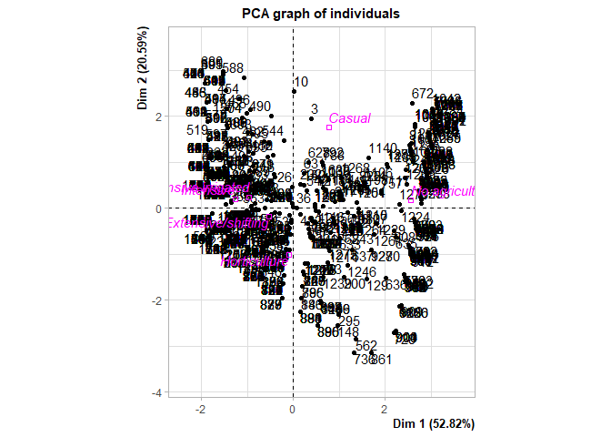<!-- -->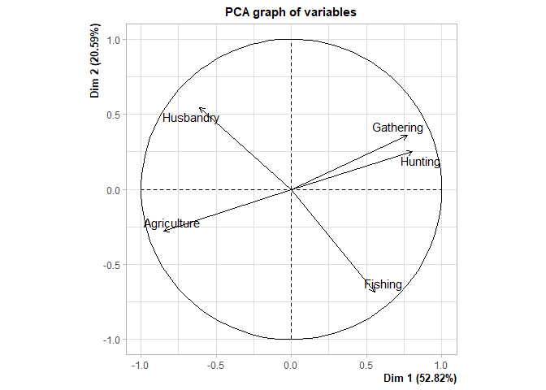<!-- -->

#### Summary of the PCA analysis with the supplementary variable EA028 (1188 societies)

``` r
summary(res_with_6)
```

    ## 
    ## Call:
    ## PCA(X = clust_db_with_6, scale.unit = T, ncp = Inf, quali.sup = 6,  
    ##      graph = T) 
    ## 
    ## 
    ## Eigenvalues
    ##                        Dim.1   Dim.2   Dim.3   Dim.4   Dim.5
    ## Variance               2.641   1.030   0.832   0.498   0.000
    ## % of var.             52.821  20.593  16.633   9.953   0.000
    ## Cumulative % of var.  52.821  73.414  90.047 100.000 100.000
    ## 
    ## Individuals (the 10 first)
    ##                         Dist    Dim.1    ctr   cos2    Dim.2    ctr   cos2  
    ## 1                   |  4.781 |  3.030  0.293  0.401 |  2.169  0.384  0.206 |
    ## 2                   |  3.893 |  3.088  0.304  0.629 |  1.897  0.294  0.237 |
    ## 3                   |  2.738 |  0.389  0.005  0.020 |  1.947  0.310  0.506 |
    ## 5                   |  4.164 |  3.102  0.307  0.555 |  1.829  0.273  0.193 |
    ## 6                   |  0.628 | -0.575  0.011  0.840 |  0.185  0.003  0.087 |
    ## 7                   |  4.298 |  3.044  0.295  0.502 |  2.101  0.361  0.239 |
    ## 8                   |  3.472 |  2.971  0.281  0.732 |  1.517  0.188  0.191 |
    ## 9                   |  3.966 |  3.059  0.298  0.595 |  2.033  0.338  0.263 |
    ## 10                  |  3.217 |  0.003  0.000  0.000 |  2.542  0.528  0.624 |
    ## 11                  |  2.338 | -1.834  0.107  0.615 |  1.094  0.098  0.219 |
    ##                      Dim.3    ctr   cos2  
    ## 1                   -1.289  0.168  0.073 |
    ## 2                   -1.101  0.123  0.080 |
    ## 3                    1.693  0.290  0.382 |
    ## 5                   -1.054  0.112  0.064 |
    ## 6                   -0.092  0.001  0.021 |
    ## 7                   -1.242  0.156  0.083 |
    ## 8                   -0.812  0.067  0.055 |
    ## 9                   -1.195  0.144  0.091 |
    ## 10                   1.775  0.319  0.304 |
    ## 11                   0.946  0.091  0.164 |
    ## 
    ## Variables
    ##                        Dim.1    ctr   cos2    Dim.2    ctr   cos2    Dim.3
    ## Gathering           |  0.771 22.513  0.595 |  0.358 12.422  0.128 | -0.222
    ## Hunting             |  0.805 24.556  0.649 |  0.249  6.024  0.062 | -0.154
    ## Fishing             |  0.556 11.688  0.309 | -0.682 45.208  0.465 |  0.472
    ## Husbandry           | -0.610 14.075  0.372 |  0.545 28.864  0.297 |  0.575
    ## Agriculture         | -0.847 27.168  0.718 | -0.278  7.482  0.077 | -0.453
    ##                        ctr   cos2  
    ## Gathering            5.906  0.049 |
    ## Hunting              2.860  0.024 |
    ## Fishing             26.741  0.222 |
    ## Husbandry           39.800  0.331 |
    ## Agriculture         24.692  0.205 |
    ## 
    ## Supplementary categories
    ##                          Dist     Dim.1    cos2  v.test     Dim.2    cos2
    ## Casual              |   2.131 |   0.766   0.129   3.149 |   1.753   0.676
    ## Extensive/shifting  |   0.650 |  -0.541   0.693  -9.299 |  -0.177   0.074
    ## Horticulture        |   1.074 |  -0.105   0.010  -0.677 |  -1.014   0.891
    ## Intensive           |   1.286 |  -1.270   0.976 -12.370 |   0.189   0.022
    ## Intensive irrigated |   1.005 |  -0.965   0.922  -7.046 |   0.233   0.054
    ## No agriculture      |   2.594 |   2.560   0.974  27.380 |   0.170   0.004
    ##                      v.test     Dim.3    cos2  v.test  
    ## Casual               11.533 |   0.933   0.192   6.833 |
    ## Extensive/shifting   -4.868 |  -0.290   0.199  -8.892 |
    ## Horticulture        -10.434 |   0.077   0.005   0.879 |
    ## Intensive             2.944 |   0.028   0.000   0.480 |
    ## Intensive irrigated   2.725 |  -0.060   0.004  -0.787 |
    ## No agriculture        2.906 |   0.377   0.021   7.186 |

#### The supplementary variable is significant, abs(vtest) \>= 1.96 in the first two dims across most of its factors

``` r
#abs(v_test) for Supplementary categories >= 1.96 --> Significantly different to 0
#as v_test follows a Gaussian distribution
```

#### Description of the PCA dimensions

``` r
dimdesc(res_with_6)
```

    ## $Dim.1
    ## $quanti
    ##             correlation       p.value
    ## Hunting       0.8053138 1.479628e-271
    ## Gathering     0.7710974 9.080699e-235
    ## Fishing       0.5556058  3.486010e-97
    ## Husbandry    -0.6096865 7.672489e-122
    ## Agriculture  -0.8470661  0.000000e+00
    ## 
    ## $quali
    ##                             R2       p.value
    ## Agriculture_intensity 0.699658 1.185898e-305
    ## 
    ## $category
    ##                                             Estimate       p.value
    ## Agriculture_intensity=No agriculture       2.4859942 2.055779e-259
    ## Agriculture_intensity=Casual               0.6922777  1.613754e-03
    ## Agriculture_intensity=Intensive irrigated -1.0390490  1.104623e-12
    ## Agriculture_intensity=Extensive/shifting  -0.6153736  2.802274e-21
    ## Agriculture_intensity=Intensive           -1.3443785  1.841445e-37
    ## 
    ## attr(,"class")
    ## [1] "condes" "list " 
    ## 
    ## $Dim.2
    ## $quanti
    ##             correlation       p.value
    ## Husbandry     0.5451506  6.347755e-93
    ## Gathering     0.3576273  3.677224e-37
    ## Hunting       0.2490484  2.968565e-18
    ## Agriculture  -0.2775584  1.866367e-22
    ## Fishing      -0.6822589 1.638326e-163
    ## 
    ## $quali
    ##                              R2      p.value
    ## Agriculture_intensity 0.2213364 6.987837e-62
    ## 
    ## $category
    ##                                               Estimate      p.value
    ## Agriculture_intensity=Casual               1.560454362 1.706906e-32
    ## Agriculture_intensity=Intensive irrigated  0.040733873 6.382689e-03
    ## Agriculture_intensity=No agriculture      -0.022590691 3.620102e-03
    ## Agriculture_intensity=Intensive           -0.003519542 3.206100e-03
    ## Agriculture_intensity=Extensive/shifting  -0.369148595 1.011670e-06
    ## Agriculture_intensity=Horticulture        -1.205929408 1.267845e-26
    ## 
    ## attr(,"class")
    ## [1] "condes" "list " 
    ## 
    ## $Dim.3
    ## $quanti
    ##             correlation       p.value
    ## Husbandry     0.5753261 1.207212e-105
    ## Fishing       0.4715879  8.129196e-67
    ## Hunting      -0.1542265  9.183490e-08
    ## Gathering    -0.2216301  1.098853e-14
    ## Agriculture  -0.4531533  3.251877e-61
    ## 
    ## $quali
    ##                              R2      p.value
    ## Agriculture_intensity 0.1140196 3.603805e-29
    ## 
    ## $category
    ##                                            Estimate      p.value
    ## Agriculture_intensity=No agriculture      0.1997642 3.815510e-13
    ## Agriculture_intensity=Casual              0.7559713 5.307064e-12
    ## Agriculture_intensity=Extensive/shifting -0.4677172 1.562820e-19
    ## 
    ## attr(,"class")
    ## [1] "condes" "list " 
    ## 
    ## $call
    ## $call$num.var
    ## [1] 1
    ## 
    ## $call$proba
    ## [1] 0.05
    ## 
    ## $call$weights
    ##    [1] 1 1 1 1 1 1 1 1 1 1 1 1 1 1 1 1 1 1 1 1 1 1 1 1 1 1 1 1 1 1 1 1 1 1 1 1 1
    ##   [38] 1 1 1 1 1 1 1 1 1 1 1 1 1 1 1 1 1 1 1 1 1 1 1 1 1 1 1 1 1 1 1 1 1 1 1 1 1
    ##   [75] 1 1 1 1 1 1 1 1 1 1 1 1 1 1 1 1 1 1 1 1 1 1 1 1 1 1 1 1 1 1 1 1 1 1 1 1 1
    ##  [112] 1 1 1 1 1 1 1 1 1 1 1 1 1 1 1 1 1 1 1 1 1 1 1 1 1 1 1 1 1 1 1 1 1 1 1 1 1
    ##  [149] 1 1 1 1 1 1 1 1 1 1 1 1 1 1 1 1 1 1 1 1 1 1 1 1 1 1 1 1 1 1 1 1 1 1 1 1 1
    ##  [186] 1 1 1 1 1 1 1 1 1 1 1 1 1 1 1 1 1 1 1 1 1 1 1 1 1 1 1 1 1 1 1 1 1 1 1 1 1
    ##  [223] 1 1 1 1 1 1 1 1 1 1 1 1 1 1 1 1 1 1 1 1 1 1 1 1 1 1 1 1 1 1 1 1 1 1 1 1 1
    ##  [260] 1 1 1 1 1 1 1 1 1 1 1 1 1 1 1 1 1 1 1 1 1 1 1 1 1 1 1 1 1 1 1 1 1 1 1 1 1
    ##  [297] 1 1 1 1 1 1 1 1 1 1 1 1 1 1 1 1 1 1 1 1 1 1 1 1 1 1 1 1 1 1 1 1 1 1 1 1 1
    ##  [334] 1 1 1 1 1 1 1 1 1 1 1 1 1 1 1 1 1 1 1 1 1 1 1 1 1 1 1 1 1 1 1 1 1 1 1 1 1
    ##  [371] 1 1 1 1 1 1 1 1 1 1 1 1 1 1 1 1 1 1 1 1 1 1 1 1 1 1 1 1 1 1 1 1 1 1 1 1 1
    ##  [408] 1 1 1 1 1 1 1 1 1 1 1 1 1 1 1 1 1 1 1 1 1 1 1 1 1 1 1 1 1 1 1 1 1 1 1 1 1
    ##  [445] 1 1 1 1 1 1 1 1 1 1 1 1 1 1 1 1 1 1 1 1 1 1 1 1 1 1 1 1 1 1 1 1 1 1 1 1 1
    ##  [482] 1 1 1 1 1 1 1 1 1 1 1 1 1 1 1 1 1 1 1 1 1 1 1 1 1 1 1 1 1 1 1 1 1 1 1 1 1
    ##  [519] 1 1 1 1 1 1 1 1 1 1 1 1 1 1 1 1 1 1 1 1 1 1 1 1 1 1 1 1 1 1 1 1 1 1 1 1 1
    ##  [556] 1 1 1 1 1 1 1 1 1 1 1 1 1 1 1 1 1 1 1 1 1 1 1 1 1 1 1 1 1 1 1 1 1 1 1 1 1
    ##  [593] 1 1 1 1 1 1 1 1 1 1 1 1 1 1 1 1 1 1 1 1 1 1 1 1 1 1 1 1 1 1 1 1 1 1 1 1 1
    ##  [630] 1 1 1 1 1 1 1 1 1 1 1 1 1 1 1 1 1 1 1 1 1 1 1 1 1 1 1 1 1 1 1 1 1 1 1 1 1
    ##  [667] 1 1 1 1 1 1 1 1 1 1 1 1 1 1 1 1 1 1 1 1 1 1 1 1 1 1 1 1 1 1 1 1 1 1 1 1 1
    ##  [704] 1 1 1 1 1 1 1 1 1 1 1 1 1 1 1 1 1 1 1 1 1 1 1 1 1 1 1 1 1 1 1 1 1 1 1 1 1
    ##  [741] 1 1 1 1 1 1 1 1 1 1 1 1 1 1 1 1 1 1 1 1 1 1 1 1 1 1 1 1 1 1 1 1 1 1 1 1 1
    ##  [778] 1 1 1 1 1 1 1 1 1 1 1 1 1 1 1 1 1 1 1 1 1 1 1 1 1 1 1 1 1 1 1 1 1 1 1 1 1
    ##  [815] 1 1 1 1 1 1 1 1 1 1 1 1 1 1 1 1 1 1 1 1 1 1 1 1 1 1 1 1 1 1 1 1 1 1 1 1 1
    ##  [852] 1 1 1 1 1 1 1 1 1 1 1 1 1 1 1 1 1 1 1 1 1 1 1 1 1 1 1 1 1 1 1 1 1 1 1 1 1
    ##  [889] 1 1 1 1 1 1 1 1 1 1 1 1 1 1 1 1 1 1 1 1 1 1 1 1 1 1 1 1 1 1 1 1 1 1 1 1 1
    ##  [926] 1 1 1 1 1 1 1 1 1 1 1 1 1 1 1 1 1 1 1 1 1 1 1 1 1 1 1 1 1 1 1 1 1 1 1 1 1
    ##  [963] 1 1 1 1 1 1 1 1 1 1 1 1 1 1 1 1 1 1 1 1 1 1 1 1 1 1 1 1 1 1 1 1 1 1 1 1 1
    ## [1000] 1 1 1 1 1 1 1 1 1 1 1 1 1 1 1 1 1 1 1 1 1 1 1 1 1 1 1 1 1 1 1 1 1 1 1 1 1
    ## [1037] 1 1 1 1 1 1 1 1 1 1 1 1 1 1 1 1 1 1 1 1 1 1 1 1 1 1 1 1 1 1 1 1 1 1 1 1 1
    ## [1074] 1 1 1 1 1 1 1 1 1 1 1 1 1 1 1 1 1 1 1 1 1 1 1 1 1 1 1 1 1 1 1 1 1 1 1 1 1
    ## [1111] 1 1 1 1 1 1 1 1 1 1 1 1 1 1 1 1 1 1 1 1 1 1 1 1 1 1 1 1 1 1 1 1 1 1 1 1 1
    ## [1148] 1 1 1 1 1 1 1 1 1 1 1 1 1 1 1 1 1 1 1 1 1 1 1 1 1 1 1 1 1 1 1 1 1 1 1 1 1
    ## [1185] 1 1 1 1
    ## 
    ## $call$X
    ##             Dim.1 Gathering   Hunting   Fishing Husbandry Agriculture
    ## 1     3.029582386 74.193548 18.894009  2.304147  2.304147    2.304147
    ## 2     3.087607637 37.327189 55.760369  2.304147  2.304147    2.304147
    ## 3     0.389179556 10.047847 29.186603 10.047847 48.325359    2.392344
    ## 5     3.102113950 28.110599 64.976959  2.304147  2.304147    2.304147
    ## 6    -0.575401436 10.243902 10.243902 10.243902 20.000000   49.268293
    ## 7     3.044088699 64.976959 28.110599  2.304147  2.304147    2.304147
    ## 8     2.971123440 47.417840 38.028169  9.859155  2.347418    2.347418
    ## 9     3.058595011 55.760369 37.327189  2.304147  2.304147    2.304147
    ## 10    0.003254509  9.859155 28.638498  2.347418 56.807512    2.347418
    ## 11   -1.833752801  2.304147  2.304147  2.304147 46.543779   46.543779
    ## 12   -0.950251728 10.047847 10.047847  2.392344 29.186603   48.325359
    ## 13   -1.394386556  2.347418  9.859155  2.347418 38.028169   47.417840
    ## 14   -1.394386556  2.347418  9.859155  2.347418 38.028169   47.417840
    ## 15   -1.385836508  9.859155  2.347418  2.347418 28.638498   56.807512
    ## 16   -1.374013523  2.347418  9.859155  2.347418 28.638498   56.807512
    ## 17   -0.575401436 10.243902 10.243902 10.243902 20.000000   49.268293
    ## 19   -0.575401436 10.243902 10.243902 10.243902 20.000000   49.268293
    ## 20   -1.035210620  2.392344 10.047847 10.047847 29.186603   48.325359
    ## 21   -0.929488780 10.047847 10.047847  2.392344 19.617225   57.894737
    ## 23   -0.380881070 10.047847 19.617225  2.392344 10.047847   57.894737
    ## 26   -0.037257263 10.243902 20.000000 10.243902 20.000000   39.512195
    ## 27   -1.035210620  2.392344 10.047847 10.047847 29.186603   48.325359
    ## 28   -0.575401436 10.243902 10.243902 10.243902 20.000000   49.268293
    ## 29   -0.929488780 10.047847 10.047847  2.392344 19.617225   57.894737
    ## 30   -1.055973568  2.392344 10.047847 10.047847 38.755981   38.755981
    ## 31   -0.950251728 10.047847 10.047847  2.392344 29.186603   48.325359
    ## 32   -1.394386556  2.347418  9.859155  2.347418 38.028169   47.417840
    ## 33   -1.385836508  9.859155  2.347418  2.347418 28.638498   56.807512
    ## 34   -0.016089185 10.243902 20.000000 10.243902 10.243902   49.268293
    ## 35   -0.199911333  2.347418  9.859155 28.638498  2.347418   56.807512
    ## 36    0.062004800  2.392344 29.186603 10.047847 10.047847   48.325359
    ## 37    0.214019718 10.047847  2.392344 38.755981 10.047847   38.755981
    ## 38   -0.554233357 10.243902 10.243902 10.243902 10.243902   59.024390
    ## 40   -0.554233357 10.243902 10.243902 10.243902 10.243902   59.024390
    ## 41   -0.039003057 10.047847 19.617225 10.047847  2.392344   57.894737
    ## 42   -0.554233357 10.243902 10.243902 10.243902 10.243902   59.024390
    ## 43   -0.993684725  2.392344 10.047847 10.047847 10.047847   67.464115
    ## 44   -1.026496935 10.047847  2.392344 10.047847 19.617225   57.894737
    ## 45   -0.815335272  2.347418 19.248826  2.347418  9.859155   66.197183
    ## 46   -0.993684725  2.392344 10.047847 10.047847 10.047847   67.464115
    ## 47   -0.016089185 10.243902 20.000000 10.243902 10.243902   49.268293
    ## 48   -0.993684725  2.392344 10.047847 10.047847 10.047847   67.464115
    ## 49   -0.598860510  2.347418  9.859155 19.248826  2.347418   66.197183
    ## 50   -0.016089185 10.243902 20.000000 10.243902 10.243902   49.268293
    ## 51   -0.059255394  2.392344 19.617225 19.617225 10.047847   48.325359
    ## 52   -0.993684725  2.392344 10.047847 10.047847 10.047847   67.464115
    ## 53    0.753913743  2.392344 19.617225 38.755981 10.047847   29.186603
    ## 55   -0.566847819 10.047847 10.047847 10.047847  2.392344   67.464115
    ## 56   -1.014447673  2.392344 10.047847 10.047847 19.617225   57.894737
    ## 57   -0.554233357 10.243902 10.243902 10.243902 10.243902   59.024390
    ## 58    0.437003859  2.347418 28.638498 19.248826  2.347418   47.417840
    ## 59   -0.587100156  2.392344 10.047847 19.617225 10.047847   57.894737
    ## 60   -0.180515588  2.392344 10.047847 29.186603 10.047847   48.325359
    ## 62   -0.815335272  2.347418 19.248826  2.347418  9.859155   66.197183
    ## 63   -0.406595713 11.111111 11.111111 11.111111  2.645503   64.021164
    ## 64   -0.587100156  2.392344 10.047847 19.617225 10.047847   57.894737
    ## 66   -0.587100156  2.392344 10.047847 19.617225 10.047847   57.894737
    ## 67   -0.554233357 10.243902 10.243902 10.243902 10.243902   59.024390
    ## 68   -1.333267456  2.347418  9.859155  2.347418  9.859155   75.586854
    ## 70   -1.353640490  2.347418  9.859155  2.347418 19.248826   66.197183
    ## 71   -0.080928326  2.347418 19.248826 19.248826  2.347418   56.807512
    ## 72   -0.465839962  2.392344 19.617225 10.047847 10.047847   57.894737
    ## 73   -0.587100156  2.392344 10.047847 19.617225 10.047847   57.894737
    ## 74   -0.059255394  2.392344 19.617225 19.617225 10.047847   48.325359
    ## 75   -0.587100156  2.392344 10.047847 19.617225 10.047847   57.894737
    ## 76    0.226068980  2.392344 10.047847 38.755981 10.047847   38.755981
    ## 77   -1.374013523  2.347418  9.859155  2.347418 28.638498   56.807512
    ## 78   -1.374013523  2.347418  9.859155  2.347418 28.638498   56.807512
    ## 79   -1.793757814  2.304147  2.304147  2.304147 28.110599   64.976959
    ## 80   -0.835708305  2.347418 19.248826  2.347418 19.248826   56.807512
    ## 81   -0.993684725  2.392344 10.047847 10.047847 10.047847   67.464115
    ## 82   -1.333267456  2.347418  9.859155  2.347418  9.859155   75.586854
    ## 83   -1.014447673  2.392344 10.047847 10.047847 19.617225   57.894737
    ## 84   -1.014447673  2.392344 10.047847 10.047847 19.617225   57.894737
    ## 85   -0.080928326  2.347418 19.248826 19.248826  2.347418   56.807512
    ## 86   -0.630555507  2.347418  2.347418 28.638498  9.859155   56.807512
    ## 87   -1.014447673  2.392344 10.047847 10.047847 19.617225   57.894737
    ## 88   -0.908725832 10.047847 10.047847  2.392344 10.047847   67.464115
    ## 89   -0.587100156  2.392344 10.047847 19.617225 10.047847   57.894737
    ## 90   -1.793757814  2.304147  2.304147  2.304147 28.110599   64.976959
    ## 91   -1.414759590  2.347418  9.859155  2.347418 47.417840   38.028169
    ## 92   -1.394386556  2.347418  9.859155  2.347418 38.028169   47.417840
    ## 93   -0.856081338  2.347418 19.248826  2.347418 28.638498   47.417840
    ## 94   -1.833752801  2.304147  2.304147  2.304147 46.543779   46.543779
    ## 95   -0.993684725  2.392344 10.047847 10.047847 10.047847   67.464115
    ## 96   -1.014447673  2.392344 10.047847 10.047847 19.617225   57.894737
    ## 97   -1.049877718  2.347418  2.347418 19.248826 19.248826   56.807512
    ## 98   -1.374013523  2.347418  9.859155  2.347418 28.638498   56.807512
    ## 99   -0.587100156  2.392344 10.047847 19.617225 10.047847   57.894737
    ## 101  -1.353640490  2.347418  9.859155  2.347418 19.248826   66.197183
    ## 102  -0.199911333  2.347418  9.859155 28.638498  2.347418   56.807512
    ## 103  -1.374013523  2.347418  9.859155  2.347418 28.638498   56.807512
    ## 104  -1.374013523  2.347418  9.859155  2.347418 28.638498   56.807512
    ## 105  -1.813755307  2.304147  2.304147  2.304147 37.327189   55.760369
    ## 106  -1.374013523  2.347418  9.859155  2.347418 28.638498   56.807512
    ## 107  -1.070250751  2.347418  2.347418 19.248826 28.638498   47.417840
    ## 108  -1.773760320  2.304147  2.304147  2.304147 18.894009   74.193548
    ## 109  -1.793757814  2.304147  2.304147  2.304147 28.110599   64.976959
    ## 110  -1.793757814  2.304147  2.304147  2.304147 28.110599   64.976959
    ## 111  -1.813755307  2.304147  2.304147  2.304147 37.327189   55.760369
    ## 112  -1.070250751  2.347418  2.347418 19.248826 28.638498   47.417840
    ## 113  -0.671301574  2.347418  2.347418 28.638498 28.638498   38.028169
    ## 114  -0.180515588  2.392344 10.047847 29.186603 10.047847   48.325359
    ## 115  -1.394386556  2.347418  9.859155  2.347418 38.028169   47.417840
    ## 116  -1.049877718  2.347418  2.347418 19.248826 19.248826   56.807512
    ## 117  -1.333267456  2.347418  9.859155  2.347418  9.859155   75.586854
    ## 118  -1.469199929  2.347418  2.347418  9.859155 28.638498   56.807512
    ## 119  -1.469199929  2.347418  2.347418  9.859155 28.638498   56.807512
    ## 121  -1.014447673  2.392344 10.047847 10.047847 19.617225   57.894737
    ## 122  -0.993684725  2.392344 10.047847 10.047847 10.047847   67.464115
    ## 123  -1.014447673  2.392344 10.047847 10.047847 19.617225   57.894737
    ## 124  -0.993684725  2.392344 10.047847 10.047847 10.047847   67.464115
    ## 125  -1.374013523  2.347418  9.859155  2.347418 28.638498   56.807512
    ## 126  -1.014447673  2.392344 10.047847 10.047847 19.617225   57.894737
    ## 127  -0.554233357 10.243902 10.243902 10.243902 10.243902   59.024390
    ## 128  -1.374013523  2.347418  9.859155  2.347418 28.638498   56.807512
    ## 129   1.587335217 10.047847 19.617225 48.325359  2.392344   19.617225
    ## 130  -0.630555507  2.347418  2.347418 28.638498  9.859155   56.807512
    ## 132  -1.489572962  2.347418  2.347418  9.859155 38.028169   47.417840
    ## 133  -1.035210620  2.392344 10.047847 10.047847 29.186603   48.325359
    ## 135  -0.059255394  2.392344 19.617225 19.617225 10.047847   48.325359
    ## 136  -0.993684725  2.392344 10.047847 10.047847 10.047847   67.464115
    ## 138  -1.035210620  2.392344 10.047847 10.047847 29.186603   48.325359
    ## 139  -0.231606330  2.347418  2.347418 38.028169  9.859155   47.417840
    ## 140   0.220529098  2.347418 38.028169  2.347418  9.859155   47.417840
    ## 141  -0.059255394  2.392344 19.617225 19.617225 10.047847   48.325359
    ## 145  -0.465839962  2.392344 19.617225 10.047847 10.047847   57.894737
    ## 146   0.167342847  2.347418  2.347418 47.417840  9.859155   38.028169
    ## 147   0.226068980  2.392344 10.047847 38.755981 10.047847   38.755981
    ## 148   0.965241202  2.347418  2.347418 66.197183  9.859155   19.248826
    ## 149  -0.139715431 10.243902 10.243902 20.000000 10.243902   49.268293
    ## 150  -1.761138218  2.252252  2.252252  2.252252  9.459459   83.783784
    ## 151  -0.314286698  2.304147 28.110599  2.304147  2.304147   64.976959
    ## 152   0.220529098  2.347418 38.028169  2.347418  9.859155   47.417840
    ## 153  -0.993684725  2.392344 10.047847 10.047847 10.047847   67.464115
    ## 154  -0.465839962  2.392344 19.617225 10.047847 10.047847   57.894737
    ## 155  -0.993684725  2.392344 10.047847 10.047847 10.047847   67.464115
    ## 156  -0.997809688  2.347418  9.859155  9.859155  2.347418   75.586854
    ## 158  -0.997809688  2.347418  9.859155  9.859155  2.347418   75.586854
    ## 159  -0.080928326  2.347418 19.248826 19.248826  2.347418   56.807512
    ## 160  -0.160263251 10.047847 10.047847 19.617225  2.392344   57.894737
    ## 161  -0.993684725  2.392344 10.047847 10.047847 10.047847   67.464115
    ## 162  -0.380881070 10.047847 19.617225  2.392344 10.047847   57.894737
    ## 163  -0.180515588  2.392344 10.047847 29.186603 10.047847   48.325359
    ## 164  -0.993684725  2.392344 10.047847 10.047847 10.047847   67.464115
    ## 165  -0.993684725  2.392344 10.047847 10.047847 10.047847   67.464115
    ## 166  -1.014447673  2.392344 10.047847 10.047847 19.617225   57.894737
    ## 167  -0.997809688  2.347418  9.859155  9.859155  2.347418   75.586854
    ## 168  -0.180515588  2.392344 10.047847 29.186603 10.047847   48.325359
    ## 169  -1.049877718  2.347418  2.347418 19.248826 19.248826   56.807512
    ## 171  -1.333267456  2.347418  9.859155  2.347418  9.859155   75.586854
    ## 172  -0.993684725  2.392344 10.047847 10.047847 10.047847   67.464115
    ## 173  -0.908725832 10.047847 10.047847  2.392344 10.047847   67.464115
    ## 177  -0.993684725  2.392344 10.047847 10.047847 10.047847   67.464115
    ## 178  -1.333267456  2.347418  9.859155  2.347418  9.859155   75.586854
    ## 179  -1.333267456  2.347418  9.859155  2.347418  9.859155   75.586854
    ## 180  -1.333267456  2.347418  9.859155  2.347418  9.859155   75.586854
    ## 182   0.398428741 10.243902 20.000000 20.000000 10.243902   39.512195
    ## 183  -0.479877503  2.347418 19.248826  9.859155  2.347418   66.197183
    ## 184  -1.469199929  2.347418  2.347418  9.859155 28.638498   56.807512
    ## 185  -1.333267456  2.347418  9.859155  2.347418  9.859155   75.586854
    ## 186  -0.486602910  2.392344 19.617225 10.047847 19.617225   48.325359
    ## 187  -1.761138218  2.252252  2.252252  2.252252  9.459459   83.783784
    ## 188  -0.587100156  2.392344 10.047847 19.617225 10.047847   57.894737
    ## 189  -1.333267456  2.347418  9.859155  2.347418  9.859155   75.586854
    ## 190  -0.139715431 10.243902 10.243902 20.000000 10.243902   49.268293
    ## 191  -0.599149419 10.047847  2.392344 19.617225 10.047847   57.894737
    ## 192  -0.554233357 10.243902 10.243902 10.243902 10.243902   59.024390
    ## 193  -0.993684725  2.392344 10.047847 10.047847 10.047847   67.464115
    ## 194  -0.993684725  2.392344 10.047847 10.047847 10.047847   67.464115
    ## 195  -1.353640490  2.347418  9.859155  2.347418 19.248826   66.197183
    ## 196  -0.180515588  2.392344 10.047847 29.186603 10.047847   48.325359
    ## 197  -1.761138218  2.252252  2.252252  2.252252  9.459459   83.783784
    ## 198  -0.587100156  2.392344 10.047847 19.617225 10.047847   57.894737
    ## 199  -0.231606330  2.347418  2.347418 38.028169  9.859155   47.417840
    ## 200   1.103838346 10.243902 10.243902 49.268293 10.243902   20.000000
    ## 201  -0.599149419 10.047847  2.392344 19.617225 10.047847   57.894737
    ## 202  -0.908725832 10.047847 10.047847  2.392344 10.047847   67.464115
    ## 203  -0.192564851 10.047847  2.392344 29.186603 10.047847   48.325359
    ## 204  -0.993684725  2.392344 10.047847 10.047847 10.047847   67.464115
    ## 205  -1.029504685  2.347418  2.347418 19.248826  9.859155   66.197183
    ## 206  -0.929488780 10.047847 10.047847  2.392344 19.617225   57.894737
    ## 207  -0.993684725  2.392344 10.047847 10.047847 10.047847   67.464115
    ## 208  -0.598860510  2.347418  9.859155 19.248826  2.347418   66.197183
    ## 209  -0.993684725  2.392344 10.047847 10.047847 10.047847   67.464115
    ## 211  -1.333267456  2.347418  9.859155  2.347418  9.859155   75.586854
    ## 212  -1.029504685  2.347418  2.347418 19.248826  9.859155   66.197183
    ## 213  -1.761138218  2.252252  2.252252  2.252252  9.459459   83.783784
    ## 214  -1.333267456  2.347418  9.859155  2.347418  9.859155   75.586854
    ## 215  -0.587100156  2.392344 10.047847 19.617225 10.047847   57.894737
    ## 216  -0.465839962  2.392344 19.617225 10.047847 10.047847   57.894737
    ## 217  -1.333267456  2.347418  9.859155  2.347418  9.859155   75.586854
    ## 218  -1.333267456  2.347418  9.859155  2.347418  9.859155   75.586854
    ## 219  -0.908725832 10.047847 10.047847  2.392344 10.047847   67.464115
    ## 220  -0.346516866  2.183406  9.170306 26.637555  9.170306   52.838428
    ## 221  -1.333267456  2.347418  9.859155  2.347418  9.859155   75.586854
    ## 222  -0.993684725  2.392344 10.047847 10.047847 10.047847   67.464115
    ## 223   0.226068980  2.392344 10.047847 38.755981 10.047847   38.755981
    ## 225   0.226068980  2.392344 10.047847 38.755981 10.047847   38.755981
    ## 226  -0.993684725  2.392344 10.047847 10.047847 10.047847   67.464115
    ## 227  -0.993684725  2.392344 10.047847 10.047847 10.047847   67.464115
    ## 228  -0.630555507  2.347418  2.347418 28.638498  9.859155   56.807512
    ## 229  -0.587100156  2.392344 10.047847 19.617225 10.047847   57.894737
    ## 230  -1.005733987 10.047847  2.392344 10.047847 10.047847   67.464115
    ## 231  -0.908725832 10.047847 10.047847  2.392344 10.047847   67.464115
    ## 232   0.146963692 10.047847 29.186603  2.392344 10.047847   48.325359
    ## 233  -0.016089185 10.243902 20.000000 10.243902 10.243902   49.268293
    ## 234  -1.345090442  9.859155  2.347418  2.347418  9.859155   75.586854
    ## 235  -0.993684725  2.392344 10.047847 10.047847 10.047847   67.464115
    ## 236  -0.993684725  2.392344 10.047847 10.047847 10.047847   67.464115
    ## 237  -1.049877718  2.347418  2.347418 19.248826 19.248826   56.807512
    ## 238  -1.049877718  2.347418  2.347418 19.248826 19.248826   56.807512
    ## 239  -1.026496935 10.047847  2.392344 10.047847 19.617225   57.894737
    ## 240  -1.428453862  2.347418  2.347418  9.859155  9.859155   75.586854
    ## 241  -0.993684725  2.392344 10.047847 10.047847 10.047847   67.464115
    ## 242  -1.005733987 10.047847  2.392344 10.047847 10.047847   67.464115
    ## 243  -0.587100156  2.392344 10.047847 19.617225 10.047847   57.894737
    ## 244  -0.513713751 19.617225  2.392344 10.047847 19.617225   48.325359
    ## 245  -0.554233357 10.243902 10.243902 10.243902 10.243902   59.024390
    ## 246  -0.395942648 19.617225 10.047847  2.392344 10.047847   57.894737
    ## 247  -1.014447673  2.392344 10.047847 10.047847 19.617225   57.894737
    ## 248  -0.929488780 10.047847 10.047847  2.392344 19.617225   57.894737
    ## 249  -0.139715431 10.243902 10.243902 20.000000 10.243902   49.268293
    ## 250  -1.014447673  2.392344 10.047847 10.047847 19.617225   57.894737
    ## 251  -1.029504685  2.347418  2.347418 19.248826  9.859155   66.197183
    ## 252  -0.599149419 10.047847  2.392344 19.617225 10.047847   57.894737
    ## 253  -0.619912367 10.047847  2.392344 19.617225 19.617225   48.325359
    ## 254  -0.213327799 10.047847  2.392344 29.186603 19.617225   38.755981
    ## 255  -1.365463475  9.859155  2.347418  2.347418 19.248826   66.197183
    ## 256  -1.049877718  2.347418  2.347418 19.248826 19.248826   56.807512
    ## 257  -0.929488780 10.047847 10.047847  2.392344 19.617225   57.894737
    ## 258  -0.619912367 10.047847  2.392344 19.617225 19.617225   48.325359
    ## 259  -1.047259883 10.047847  2.392344 10.047847 29.186603   48.325359
    ## 260  -1.374013523  2.347418  9.859155  2.347418 28.638498   56.807512
    ## 261  -1.365463475  9.859155  2.347418  2.347418 19.248826   66.197183
    ## 262  -1.014447673  2.392344 10.047847 10.047847 19.617225   57.894737
    ## 263  -0.908725832 10.047847 10.047847  2.392344 10.047847   67.464115
    ## 264  -0.619912367 10.047847  2.392344 19.617225 19.617225   48.325359
    ## 265  -0.908725832 10.047847 10.047847  2.392344 10.047847   67.464115
    ## 266  -0.862310022 19.248826  2.347418  2.347418 19.248826   56.807512
    ## 267  -1.353640490  2.347418  9.859155  2.347418 19.248826   66.197183
    ## 268  -0.929488780 10.047847 10.047847  2.392344 19.617225   57.894737
    ## 269  -0.841936989 19.248826  2.347418  2.347418  9.859155   66.197183
    ## 270  -1.385836508  9.859155  2.347418  2.347418 28.638498   56.807512
    ## 271  -1.385836508  9.859155  2.347418  2.347418 28.638498   56.807512
    ## 272  -0.929488780 10.047847 10.047847  2.392344 19.617225   57.894737
    ## 273  -1.365463475  9.859155  2.347418  2.347418 19.248826   66.197183
    ## 274  -1.014447673  2.392344 10.047847 10.047847 19.617225   57.894737
    ## 275  -1.793757814  2.304147  2.304147  2.304147 28.110599   64.976959
    ## 276  -1.793757814  2.304147  2.304147  2.304147 28.110599   64.976959
    ## 277  -1.365463475  9.859155  2.347418  2.347418 19.248826   66.197183
    ## 278  -0.901560630  2.645503 11.111111 11.111111 21.693122   53.439153
    ## 279  -1.793757814  2.304147  2.304147  2.304147 28.110599   64.976959
    ## 280  -0.929488780 10.047847 10.047847  2.392344 19.617225   57.894737
    ## 281  -1.773760320  2.304147  2.304147  2.304147 18.894009   74.193548
    ## 282  -1.773760320  2.304147  2.304147  2.304147 18.894009   74.193548
    ## 283  -1.014447673  2.392344 10.047847 10.047847 19.617225   57.894737
    ## 284  -1.793757814  2.304147  2.304147  2.304147 28.110599   64.976959
    ## 285  -0.929488780 10.047847 10.047847  2.392344 19.617225   57.894737
    ## 286  -1.353640490  2.347418  9.859155  2.347418 19.248826   66.197183
    ## 287  -1.014447673  2.392344 10.047847 10.047847 19.617225   57.894737
    ## 288  -0.554233357 10.243902 10.243902 10.243902 10.243902   59.024390
    ## 289  -1.353640490  2.347418  9.859155  2.347418 19.248826   66.197183
    ## 290  -1.793757814  2.304147  2.304147  2.304147 28.110599   64.976959
    ## 291  -1.353640490  2.347418  9.859155  2.347418 19.248826   66.197183
    ## 292  -0.908725832 10.047847 10.047847  2.392344 10.047847   67.464115
    ## 293  -1.773760320  2.304147  2.304147  2.304147 18.894009   74.193548
    ## 294  -1.833752801  2.304147  2.304147  2.304147 46.543779   46.543779
    ## 295   0.985113214  9.859155  2.347418 56.807512  2.347418   28.638498
    ## 296  -0.395942648 19.617225 10.047847  2.392344 10.047847   57.894737
    ## 297  -0.554233357 10.243902 10.243902 10.243902 10.243902   59.024390
    ## 298  -0.031444648 20.000000 10.243902 10.243902 10.243902   49.268293
    ## 299  -1.353640490  2.347418  9.859155  2.347418 19.248826   66.197183
    ## 300  -1.014447673  2.392344 10.047847 10.047847 19.617225   57.894737
    ## 301  -1.014447673  2.392344 10.047847 10.047847 19.617225   57.894737
    ## 302  -0.929488780 10.047847 10.047847  2.392344 19.617225   57.894737
    ## 303  -1.448826895  2.347418  2.347418  9.859155 19.248826   66.197183
    ## 304  -0.650928541  2.347418  2.347418 28.638498 19.248826   47.417840
    ## 305  -1.365463475  9.859155  2.347418  2.347418 19.248826   66.197183
    ## 306  -1.365463475  9.859155  2.347418  2.347418 19.248826   66.197183
    ## 307  -1.365463475  9.859155  2.347418  2.347418 19.248826   66.197183
    ## 308  -1.353640490  2.347418  9.859155  2.347418 19.248826   66.197183
    ## 309  -1.014447673  2.392344 10.047847 10.047847 19.617225   57.894737
    ## 310  -1.353640490  2.347418  9.859155  2.347418 19.248826   66.197183
    ## 311  -0.929488780 10.047847 10.047847  2.392344 19.617225   57.894737
    ## 315  -1.353640490  2.347418  9.859155  2.347418 19.248826   66.197183
    ## 316  -0.993684725  2.392344 10.047847 10.047847 10.047847   67.464115
    ## 317  -1.333267456  2.347418  9.859155  2.347418  9.859155   75.586854
    ## 318  -1.014447673  2.392344 10.047847 10.047847 19.617225   57.894737
    ## 319  -1.773760320  2.304147  2.304147  2.304147 18.894009   74.193548
    ## 320  -0.016089185 10.243902 20.000000 10.243902 10.243902   49.268293
    ## 321  -1.793757814  2.304147  2.304147  2.304147 28.110599   64.976959
    ## 322  -1.353640490  2.347418  9.859155  2.347418 19.248826   66.197183
    ## 323  -1.448826895  2.347418  2.347418  9.859155 19.248826   66.197183
    ## 324  -1.374013523  2.347418  9.859155  2.347418 28.638498   56.807512
    ## 325  -1.773760320  2.304147  2.304147  2.304147 18.894009   74.193548
    ## 326  -1.469199929  2.347418  2.347418  9.859155 28.638498   56.807512
    ## 327  -1.773760320  2.304147  2.304147  2.304147 18.894009   74.193548
    ## 328  -1.793757814  2.304147  2.304147  2.304147 28.110599   64.976959
    ## 329  -1.773760320  2.304147  2.304147  2.304147 18.894009   74.193548
    ## 330  -1.773760320  2.304147  2.304147  2.304147 18.894009   74.193548
    ## 331  -1.773760320  2.304147  2.304147  2.304147 18.894009   74.193548
    ## 332  -1.014447673  2.392344 10.047847 10.047847 19.617225   57.894737
    ## 333  -0.548332769  9.170306 17.903930  2.183406 17.903930   52.838428
    ## 334  -1.761138218  2.252252  2.252252  2.252252  9.459459   83.783784
    ## 335  -0.554233357 10.243902 10.243902 10.243902 10.243902   59.024390
    ## 336  -0.908725832 10.047847 10.047847  2.392344 10.047847   67.464115
    ## 337  -0.815335272  2.347418 19.248826  2.347418  9.859155   66.197183
    ## 338  -0.835708305  2.347418 19.248826  2.347418 19.248826   56.807512
    ## 339  -0.465839962  2.392344 19.617225 10.047847 10.047847   57.894737
    ## 340  -0.929488780 10.047847 10.047847  2.392344 19.617225   57.894737
    ## 341  -0.180515588  2.392344 10.047847 29.186603 10.047847   48.325359
    ## 342   0.468589368  2.392344 29.186603 19.617225 10.047847   38.755981
    ## 343  -1.489572962  2.347418  2.347418  9.859155 38.028169   47.417840
    ## 344  -1.035210620  2.392344 10.047847 10.047847 29.186603   48.325359
    ## 345  -1.353640490  2.347418  9.859155  2.347418 19.248826   66.197183
    ## 346  -0.251979363  2.347418  2.347418 38.028169 19.248826   38.028169
    ## 347  -1.049877718  2.347418  2.347418 19.248826 19.248826   56.807512
    ## 349  -1.070250751  2.347418  2.347418 19.248826 28.638498   47.417840
    ## 350  -0.914884947 11.111111  2.645503 11.111111 21.693122   53.439153
    ## 351  -1.374013523  2.347418  9.859155  2.347418 28.638498   56.807512
    ## 352  -1.761138218  2.252252  2.252252  2.252252  9.459459   83.783784
    ## 353  -1.761138218  2.252252  2.252252  2.252252  9.459459   83.783784
    ## 354  -0.587100156  2.392344 10.047847 19.617225 10.047847   57.894737
    ## 355  -0.587100156  2.392344 10.047847 19.617225 10.047847   57.894737
    ## 356  -0.465839962  2.392344 19.617225 10.047847 10.047847   57.894737
    ## 357  -0.815335272  2.347418 19.248826  2.347418  9.859155   66.197183
    ## 358  -1.374013523  2.347418  9.859155  2.347418 28.638498   56.807512
    ## 359  -0.039003057 10.047847 19.617225 10.047847  2.392344   57.894737
    ## 360  -1.049877718  2.347418  2.347418 19.248826 19.248826   56.807512
    ## 361  -0.835708305  2.347418 19.248826  2.347418 19.248826   56.807512
    ## 362  -1.406209542  9.859155  2.347418  2.347418 38.028169   47.417840
    ## 363  -0.628626052  2.392344 10.047847 19.617225 29.186603   38.755981
    ## 364  -0.486602910  2.392344 19.617225 10.047847 19.617225   48.325359
    ## 365  -0.031444648 20.000000 10.243902 10.243902 10.243902   49.268293
    ## 366  -1.014447673  2.392344 10.047847 10.047847 19.617225   57.894737
    ## 367  -1.773760320  2.304147  2.304147  2.304147 18.894009   74.193548
    ## 368  -1.374013523  2.347418  9.859155  2.347418 28.638498   56.807512
    ## 369  -1.374013523  2.347418  9.859155  2.347418 28.638498   56.807512
    ## 370  -1.374013523  2.347418  9.859155  2.347418 28.638498   56.807512
    ## 371  -1.374013523  2.347418  9.859155  2.347418 28.638498   56.807512
    ## 372  -1.374013523  2.347418  9.859155  2.347418 28.638498   56.807512
    ## 373  -1.374013523  2.347418  9.859155  2.347418 28.638498   56.807512
    ## 374  -1.374013523  2.347418  9.859155  2.347418 28.638498   56.807512
    ## 375  -0.587100156  2.392344 10.047847 19.617225 10.047847   57.894737
    ## 376  -1.014447673  2.392344 10.047847 10.047847 19.617225   57.894737
    ## 377  -0.587100156  2.392344 10.047847 19.617225 10.047847   57.894737
    ## 378  -0.554233357 10.243902 10.243902 10.243902 10.243902   59.024390
    ## 379  -0.908725832 10.047847 10.047847  2.392344 10.047847   67.464115
    ## 380  -0.575401436 10.243902 10.243902 10.243902 20.000000   49.268293
    ## 381  -0.554233357 10.243902 10.243902 10.243902 10.243902   59.024390
    ## 382  -0.950251728 10.047847 10.047847  2.392344 29.186603   48.325359
    ## 383  -0.180515588  2.392344 10.047847 29.186603 10.047847   48.325359
    ## 384  -1.374013523  2.347418  9.859155  2.347418 28.638498   56.807512
    ## 385  -0.950251728 10.047847 10.047847  2.392344 29.186603   48.325359
    ## 386  -1.076736516  2.392344 10.047847 10.047847 48.325359   29.186603
    ## 387  -0.507365858  2.392344 19.617225 10.047847 29.186603   38.755981
    ## 388  -1.014447673  2.392344 10.047847 10.047847 19.617225   57.894737
    ## 389  -1.773760320  2.304147  2.304147  2.304147 18.894009   74.193548
    ## 390  -1.374013523  2.347418  9.859155  2.347418 28.638498   56.807512
    ## 391  -0.607863104  2.392344 10.047847 19.617225 19.617225   48.325359
    ## 392  -0.607863104  2.392344 10.047847 19.617225 19.617225   48.325359
    ## 393  -0.896827405  2.347418 19.248826  2.347418 47.417840   28.638498
    ## 394  -0.876454372  2.347418 19.248826  2.347418 38.028169   38.028169
    ## 395  -1.524853842  2.252252  9.459459  2.252252 83.783784    2.252252
    ## 396  -1.035210620  2.392344 10.047847 10.047847 29.186603   48.325359
    ## 397  -1.813755307  2.304147  2.304147  2.304147 37.327189   55.760369
    ## 398  -1.353640490  2.347418  9.859155  2.347418 19.248826   66.197183
    ## 399  -1.435132623  2.347418  9.859155  2.347418 56.807512   28.638498
    ## 400  -0.991777624 10.047847 10.047847  2.392344 48.325359   29.186603
    ## 401  -0.971014676 10.047847 10.047847  2.392344 38.755981   38.755981
    ## 402  -1.374013523  2.347418  9.859155  2.347418 28.638498   56.807512
    ## 403  -0.876454372  2.347418 19.248826  2.347418 38.028169   38.028169
    ## 404  -1.455505656  2.347418  9.859155  2.347418 66.197183   19.248826
    ## 405  -1.524853842  2.252252  9.459459  2.252252 83.783784    2.252252
    ## 406  -1.509945995  2.347418  2.347418  9.859155 47.417840   38.028169
    ## 409  -1.394386556  2.347418  9.859155  2.347418 38.028169   47.417840
    ## 410  -0.437468544 19.617225 10.047847  2.392344 29.186603   38.755981
    ## 411  -1.014447673  2.392344 10.047847 10.047847 19.617225   57.894737
    ## 412  -1.833752801  2.304147  2.304147  2.304147 46.543779   46.543779
    ## 413  -1.394386556  2.347418  9.859155  2.347418 38.028169   47.417840
    ## 414  -1.394386556  2.347418  9.859155  2.347418 38.028169   47.417840
    ## 415  -1.773760320  2.304147  2.304147  2.304147 18.894009   74.193548
    ## 416  -1.922401790  2.252252  2.252252  2.252252 83.783784    9.459459
    ## 417  -1.414759590  2.347418  9.859155  2.347418 47.417840   38.028169
    ## 418  -1.374013523  2.347418  9.859155  2.347418 28.638498   56.807512
    ## 419  -1.374013523  2.347418  9.859155  2.347418 28.638498   56.807512
    ## 420  -1.353640490  2.347418  9.859155  2.347418 19.248826   66.197183
    ## 421  -1.353640490  2.347418  9.859155  2.347418 19.248826   66.197183
    ## 422  -1.374013523  2.347418  9.859155  2.347418 28.638498   56.807512
    ## 423  -1.374013523  2.347418  9.859155  2.347418 28.638498   56.807512
    ## 424  -1.813755307  2.304147  2.304147  2.304147 37.327189   55.760369
    ## 425  -1.414759590  2.347418  9.859155  2.347418 47.417840   38.028169
    ## 426  -1.922401790  2.252252  2.252252  2.252252 83.783784    9.459459
    ## 427  -1.076736516  2.392344 10.047847 10.047847 48.325359   29.186603
    ## 428  -1.414759590  2.347418  9.859155  2.347418 47.417840   38.028169
    ## 429  -1.833752801  2.304147  2.304147  2.304147 46.543779   46.543779
    ## 430  -1.793757814  2.304147  2.304147  2.304147 28.110599   64.976959
    ## 431  -1.374013523  2.347418  9.859155  2.347418 28.638498   56.807512
    ## 432  -1.793757814  2.304147  2.304147  2.304147 28.110599   64.976959
    ## 433  -1.773760320  2.304147  2.304147  2.304147 18.894009   74.193548
    ## 434  -1.026496935 10.047847  2.392344 10.047847 19.617225   57.894737
    ## 435  -1.793757814  2.304147  2.304147  2.304147 28.110599   64.976959
    ## 436  -1.773760320  2.304147  2.304147  2.304147 18.894009   74.193548
    ## 437  -1.793757814  2.304147  2.304147  2.304147 28.110599   64.976959
    ## 438  -0.929488780 10.047847 10.047847  2.392344 19.617225   57.894737
    ## 439  -1.793757814  2.304147  2.304147  2.304147 28.110599   64.976959
    ## 440  -1.365463475  9.859155  2.347418  2.347418 19.248826   66.197183
    ## 441  -0.929488780 10.047847 10.047847  2.392344 19.617225   57.894737
    ## 442  -1.475878690  2.347418  9.859155  2.347418 75.586854    9.859155
    ## 443  -1.922401790  2.252252  2.252252  2.252252 83.783784    9.459459
    ## 444  -1.475878690  2.347418  9.859155  2.347418 75.586854    9.859155
    ## 445  -1.922401790  2.252252  2.252252  2.252252 83.783784    9.459459
    ## 446  -1.893745281  2.304147  2.304147  2.304147 74.193548   18.894009
    ## 447  -1.793757814  2.304147  2.304147  2.304147 28.110599   64.976959
    ## 448  -1.833752801  2.304147  2.304147  2.304147 46.543779   46.543779
    ## 449  -1.773760320  2.304147  2.304147  2.304147 18.894009   74.193548
    ## 450  -1.773760320  2.304147  2.304147  2.304147 18.894009   74.193548
    ## 451  -1.353640490  2.347418  9.859155  2.347418 19.248826   66.197183
    ## 453  -1.893745281  2.304147  2.304147  2.304147 74.193548   18.894009
    ## 454  -1.168542333  9.859155  2.347418  9.859155 75.586854    2.347418
    ## 455  -1.469199929  2.347418  2.347418  9.859155 28.638498   56.807512
    ## 456  -1.813755307  2.304147  2.304147  2.304147 37.327189   55.760369
    ## 457  -1.833752801  2.304147  2.304147  2.304147 46.543779   46.543779
    ## 459  -0.908725832 10.047847 10.047847  2.392344 10.047847   67.464115
    ## 460  -1.922401790  2.252252  2.252252  2.252252 83.783784    9.459459
    ## 461  -1.873747788  2.304147  2.304147  2.304147 64.976959   28.110599
    ## 462  -0.638905671 10.243902 10.243902 10.243902 49.268293   20.000000
    ## 463  -1.833752801  2.304147  2.304147  2.304147 46.543779   46.543779
    ## 464  -1.873747788  2.304147  2.304147  2.304147 64.976959   28.110599
    ## 465  -1.012540571 10.047847 10.047847  2.392344 57.894737   19.617225
    ## 466  -1.469199929  2.347418  2.347418  9.859155 28.638498   56.807512
    ## 467  -1.469199929  2.347418  2.347418  9.859155 28.638498   56.807512
    ## 468  -1.026496935 10.047847  2.392344 10.047847 19.617225   57.894737
    ## 469  -1.469199929  2.347418  2.347418  9.859155 28.638498   56.807512
    ## 470  -1.489572962  2.347418  2.347418  9.859155 38.028169   47.417840
    ## 471  -1.922401790  2.252252  2.252252  2.252252 83.783784    9.459459
    ## 472  -1.813755307  2.304147  2.304147  2.304147 37.327189   55.760369
    ## 473  -1.489572962  2.347418  2.347418  9.859155 38.028169   47.417840
    ## 474  -1.922401790  2.252252  2.252252  2.252252 83.783784    9.459459
    ## 475  -1.793757814  2.304147  2.304147  2.304147 28.110599   64.976959
    ## 476  -1.385836508  9.859155  2.347418  2.347418 28.638498   56.807512
    ## 477  -1.014447673  2.392344 10.047847 10.047847 19.617225   57.894737
    ## 478  -1.773760320  2.304147  2.304147  2.304147 18.894009   74.193548
    ## 480  -1.070250751  2.347418  2.347418 19.248826 28.638498   47.417840
    ## 481  -1.833752801  2.304147  2.304147  2.304147 46.543779   46.543779
    ## 482   0.151730874 10.047847  2.392344 38.755981 38.755981   10.047847
    ## 483  -0.993684725  2.392344 10.047847 10.047847 10.047847   67.464115
    ## 484  -0.929488780 10.047847 10.047847  2.392344 19.617225   57.894737
    ## 485  -1.893745281  2.304147  2.304147  2.304147 74.193548   18.894009
    ## 486  -1.365463475  9.859155  2.347418  2.347418 19.248826   66.197183
    ## 487  -1.455505656  2.347418  9.859155  2.347418 66.197183   19.248826
    ## 488  -0.991777624 10.047847 10.047847  2.392344 48.325359   29.186603
    ## 489  -0.991777624 10.047847 10.047847  2.392344 48.325359   29.186603
    ## 490  -0.478994440 19.617225 10.047847  2.392344 48.325359   19.617225
    ## 491  -0.862310022 19.248826  2.347418  2.347418 19.248826   56.807512
    ## 492  -0.971014676 10.047847 10.047847  2.392344 38.755981   38.755981
    ## 494  -1.455505656  2.347418  9.859155  2.347418 66.197183   19.248826
    ## 495  -0.548891754  2.392344 19.617225 10.047847 48.325359   19.617225
    ## 496  -0.943802155 19.248826  2.347418  2.347418 56.807512   19.248826
    ## 497  -1.435132623  2.347418  9.859155  2.347418 56.807512   28.638498
    ## 498  -0.882683056 19.248826  2.347418  2.347418 28.638498   47.417840
    ## 499  -1.873747788  2.304147  2.304147  2.304147 64.976959   28.110599
    ## 500  -1.793757814  2.304147  2.304147  2.304147 28.110599   64.976959
    ## 501  -1.761138218  2.252252  2.252252  2.252252  9.459459   83.783784
    ## 502  -1.435132623  2.347418  9.859155  2.347418 56.807512   28.638498
    ## 503  -1.475878690  2.347418  9.859155  2.347418 75.586854    9.859155
    ## 504  -1.922401790  2.252252  2.252252  2.252252 83.783784    9.459459
    ## 506  -0.991777624 10.047847 10.047847  2.392344 48.325359   29.186603
    ## 507  -1.469199929  2.347418  2.347418  9.859155 28.638498   56.807512
    ## 508  -1.055973568  2.392344 10.047847 10.047847 38.755981   38.755981
    ## 509  -1.049877718  2.347418  2.347418 19.248826 19.248826   56.807512
    ## 510  -1.793757814  2.304147  2.304147  2.304147 28.110599   64.976959
    ## 511  -1.873747788  2.304147  2.304147  2.304147 64.976959   28.110599
    ## 512  -1.873747788  2.304147  2.304147  2.304147 64.976959   28.110599
    ## 513  -1.793757814  2.304147  2.304147  2.304147 28.110599   64.976959
    ## 514  -1.469199929  2.347418  2.347418  9.859155 28.638498   56.807512
    ## 515  -1.455505656  2.347418  9.859155  2.347418 66.197183   19.248826
    ## 516  -1.435132623  2.347418  9.859155  2.347418 56.807512   28.638498
    ## 517  -1.793757814  2.304147  2.304147  2.304147 28.110599   64.976959
    ## 518  -1.469199929  2.347418  2.347418  9.859155 28.638498   56.807512
    ## 519  -1.853750294  2.304147  2.304147  2.304147 55.760369   37.327189
    ## 520  -1.448826895  2.347418  2.347418  9.859155 19.248826   66.197183
    ## 521  -1.035210620  2.392344 10.047847 10.047847 29.186603   48.325359
    ## 522  -1.793757814  2.304147  2.304147  2.304147 28.110599   64.976959
    ## 523  -1.385836508  9.859155  2.347418  2.347418 28.638498   56.807512
    ## 524  -1.448826895  2.347418  2.347418  9.859155 19.248826   66.197183
    ## 525  -1.394386556  2.347418  9.859155  2.347418 38.028169   47.417840
    ## 526  -1.385836508  9.859155  2.347418  2.347418 28.638498   56.807512
    ## 527  -1.813755307  2.304147  2.304147  2.304147 37.327189   55.760369
    ## 528  -1.813755307  2.304147  2.304147  2.304147 37.327189   55.760369
    ## 530  -1.049877718  2.347418  2.347418 19.248826 19.248826   56.807512
    ## 531  -1.070250751  2.347418  2.347418 19.248826 28.638498   47.417840
    ## 532  -1.428453862  2.347418  2.347418  9.859155  9.859155   75.586854
    ## 533  -1.793757814  2.304147  2.304147  2.304147 28.110599   64.976959
    ## 534  -1.469199929  2.347418  2.347418  9.859155 28.638498   56.807512
    ## 535  -1.489572962  2.347418  2.347418  9.859155 38.028169   47.417840
    ## 536  -1.469199929  2.347418  2.347418  9.859155 28.638498   56.807512
    ## 537  -1.475878690  2.347418  9.859155  2.347418 75.586854    9.859155
    ## 538  -0.213327799 10.047847  2.392344 29.186603 19.617225   38.755981
    ## 539  -1.014447673  2.392344 10.047847 10.047847 19.617225   57.894737
    ## 540  -1.448826895  2.347418  2.347418  9.859155 19.248826   66.197183
    ## 541  -1.469199929  2.347418  2.347418  9.859155 28.638498   56.807512
    ## 542   0.285040331  2.392344 19.617225 29.186603 38.755981   10.047847
    ## 543  -1.394386556  2.347418  9.859155  2.347418 38.028169   47.417840
    ## 544  -0.199091919  2.347418 19.248826 19.248826 56.807512    2.347418
    ## 545  -1.469199929  2.347418  2.347418  9.859155 28.638498   56.807512
    ## 546  -1.813755307  2.304147  2.304147  2.304147 37.327189   55.760369
    ## 548  -1.793757814  2.304147  2.304147  2.304147 28.110599   64.976959
    ## 549  -1.833752801  2.304147  2.304147  2.304147 46.543779   46.543779
    ## 550  -1.761138218  2.252252  2.252252  2.252252  9.459459   83.783784
    ## 551  -1.761138218  2.252252  2.252252  2.252252  9.459459   83.783784
    ## 552  -1.773760320  2.304147  2.304147  2.304147 18.894009   74.193548
    ## 553  -1.469199929  2.347418  2.347418  9.859155 28.638498   56.807512
    ## 554  -1.793757814  2.304147  2.304147  2.304147 28.110599   64.976959
    ## 555  -1.029504685  2.347418  2.347418 19.248826  9.859155   66.197183
    ## 556   0.326566226  2.392344 19.617225 29.186603 19.617225   29.186603
    ## 557  -1.055973568  2.392344 10.047847 10.047847 38.755981   38.755981
    ## 558  -1.813755307  2.304147  2.304147  2.304147 37.327189   55.760369
    ## 559  -1.448826895  2.347418  2.347418  9.859155 19.248826   66.197183
    ## 560  -1.720517406  2.538071  2.538071  2.538071 10.659898   81.725888
    ## 561  -1.761138218  2.252252  2.252252  2.252252  9.459459   83.783784
    ## 562   1.364190380  2.347418  2.347418 75.586854  9.859155    9.859155
    ## 563  -1.813755307  2.304147  2.304147  2.304147 37.327189   55.760369
    ## 564  -1.761138218  2.252252  2.252252  2.252252  9.459459   83.783784
    ## 565  -0.821251034  8.571429  8.571429  8.571429 16.734694   57.551020
    ## 566  -1.029504685  2.347418  2.347418 19.248826  9.859155   66.197183
    ## 567  -1.793757814  2.304147  2.304147  2.304147 28.110599   64.976959
    ## 568  -1.070250751  2.347418  2.347418 19.248826 28.638498   47.417840
    ## 569  -1.773760320  2.304147  2.304147  2.304147 18.894009   74.193548
    ## 570  -1.469199929  2.347418  2.347418  9.859155 28.638498   56.807512
    ## 571  -1.469199929  2.347418  2.347418  9.859155 28.638498   56.807512
    ## 572  -1.448826895  2.347418  2.347418  9.859155 19.248826   66.197183
    ## 573  -1.489572962  2.347418  2.347418  9.859155 38.028169   47.417840
    ## 574  -1.118262412  2.392344 10.047847 10.047847 67.464115   10.047847
    ## 575  -1.793757814  2.304147  2.304147  2.304147 28.110599   64.976959
    ## 576  -1.489572962  2.347418  2.347418  9.859155 38.028169   47.417840
    ## 577  -1.446955608  9.859155  2.347418  2.347418 56.807512   28.638498
    ## 578  -1.035210620  2.392344 10.047847 10.047847 29.186603   48.325359
    ## 579  -1.793757814  2.304147  2.304147  2.304147 28.110599   64.976959
    ## 580  -1.394386556  2.347418  9.859155  2.347418 38.028169   47.417840
    ## 581  -1.813755307  2.304147  2.304147  2.304147 37.327189   55.760369
    ## 582  -1.414759590  2.347418  9.859155  2.347418 47.417840   38.028169
    ## 583  -1.833752801  2.304147  2.304147  2.304147 46.543779   46.543779
    ## 584  -1.793757814  2.304147  2.304147  2.304147 28.110599   64.976959
    ## 585  -1.055973568  2.392344 10.047847 10.047847 38.755981   38.755981
    ## 586  -1.813755307  2.304147  2.304147  2.304147 37.327189   55.760369
    ## 587   0.299455385 19.617225  2.392344 29.186603 19.617225   29.186603
    ## 588  -1.073355927  9.859155  9.859155  2.347418 75.586854    2.347418
    ## 589  -0.507365858  2.392344 19.617225 10.047847 29.186603   38.755981
    ## 590  -1.049877718  2.347418  2.347418 19.248826 19.248826   56.807512
    ## 591  -1.524853842  2.252252  9.459459  2.252252 83.783784    2.252252
    ## 592  -1.793757814  2.304147  2.304147  2.304147 28.110599   64.976959
    ## 593  -1.448826895  2.347418  2.347418  9.859155 19.248826   66.197183
    ## 594  -1.761138218  2.252252  2.252252  2.252252  9.459459   83.783784
    ## 595  -1.793757814  2.304147  2.304147  2.304147 28.110599   64.976959
    ## 596  -1.070250751  2.347418  2.347418 19.248826 28.638498   47.417840
    ## 597  -1.426582575  9.859155  2.347418  2.347418 47.417840   38.028169
    ## 598  -1.793757814  2.304147  2.304147  2.304147 28.110599   64.976959
    ## 599  -1.475878690  2.347418  9.859155  2.347418 75.586854    9.859155
    ## 600  -1.773760320  2.304147  2.304147  2.304147 18.894009   74.193548
    ## 601  -1.793757814  2.304147  2.304147  2.304147 28.110599   64.976959
    ## 602  -1.833752801  2.304147  2.304147  2.304147 46.543779   46.543779
    ## 603  -0.971014676 10.047847 10.047847  2.392344 38.755981   38.755981
    ## 604  -1.374013523  2.347418  9.859155  2.347418 28.638498   56.807512
    ## 605  -1.475878690  2.347418  9.859155  2.347418 75.586854    9.859155
    ## 606  -1.813755307  2.304147  2.304147  2.304147 37.327189   55.760369
    ## 607  -1.475878690  2.347418  9.859155  2.347418 75.586854    9.859155
    ## 608  -1.793757814  2.304147  2.304147  2.304147 28.110599   64.976959
    ## 609  -1.475878690  2.347418  9.859155  2.347418 75.586854    9.859155
    ## 610  -1.469199929  2.347418  2.347418  9.859155 28.638498   56.807512
    ## 611  -1.475878690  2.347418  9.859155  2.347418 75.586854    9.859155
    ## 613  -1.813755307  2.304147  2.304147  2.304147 37.327189   55.760369
    ## 615  -1.475878690  2.347418  9.859155  2.347418 75.586854    9.859155
    ## 617   2.539527606 19.248826 28.638498 47.417840  2.347418    2.347418
    ## 618   1.177857720  2.347418 28.638498 38.028169 28.638498    2.347418
    ## 619   0.639552502  2.347418 19.248826 38.028169 38.028169    2.347418
    ## 620   2.932510036  2.304147 74.193548 18.894009  2.304147    2.304147
    ## 621   2.524748875 28.638498 19.248826 47.417840  2.347418    2.347418
    ## 622   2.316340324  9.859155 19.248826 66.197183  2.347418    2.347418
    ## 623   2.539527606 19.248826 28.638498 47.417840  2.347418    2.347418
    ## 624   2.447288624 19.617225 48.325359 19.617225 10.047847    2.392344
    ## 625   2.539527606 19.248826 28.638498 47.417840  2.347418    2.347418
    ## 626   2.539527606 19.248826 28.638498 47.417840  2.347418    2.347418
    ## 627   2.539527606 19.248826 28.638498 47.417840  2.347418    2.347418
    ## 628   0.334924505 10.243902 20.000000 20.000000 39.512195   10.243902
    ## 629   2.539527606 19.248826 28.638498 47.417840  2.347418    2.347418
    ## 630   2.658510614 19.248826 38.028169 38.028169  2.347418    2.347418
    ## 631   0.220230292  2.347418 19.248826 28.638498 47.417840    2.347418
    ## 632   0.758535510  2.347418 28.638498 28.638498 38.028169    2.347418
    ## 633   1.001354200 10.047847 10.047847 48.325359 29.186603    2.392344
    ## 634   2.673289345  9.859155 47.417840 38.028169  2.347418    2.347418
    ## 635   2.221378595 19.617225 29.186603 38.755981  2.392344   10.047847
    ## 636   2.016502142  2.347418 28.638498 56.807512  9.859155    2.347418
    ## 637   1.281758505  2.392344 29.186603 38.755981 10.047847   19.617225
    ## 638  -1.049877718  2.347418  2.347418 19.248826 19.248826   56.807512
    ## 639  -1.448826895  2.347418  2.347418  9.859155 19.248826   66.197183
    ## 643  -1.428453862  2.347418  2.347418  9.859155  9.859155   75.586854
    ## 645  -1.374013523  2.347418  9.859155  2.347418 28.638498   56.807512
    ## 646  -1.448826895  2.347418  2.347418  9.859155 19.248826   66.197183
    ## 647  -1.014447673  2.392344 10.047847 10.047847 19.617225   57.894737
    ## 648  -1.761138218  2.252252  2.252252  2.252252  9.459459   83.783784
    ## 649  -1.448826895  2.347418  2.347418  9.859155 19.248826   66.197183
    ## 650  -1.049877718  2.347418  2.347418 19.248826 19.248826   56.807512
    ## 651  -1.448826895  2.347418  2.347418  9.859155 19.248826   66.197183
    ## 652  -0.993684725  2.392344 10.047847 10.047847 10.047847   67.464115
    ## 653  -0.080018342  2.392344 19.617225 19.617225 19.617225   38.755981
    ## 654  -1.813755307  2.304147  2.304147  2.304147 37.327189   55.760369
    ## 655  -1.374013523  2.347418  9.859155  2.347418 28.638498   56.807512
    ## 656  -1.813755307  2.304147  2.304147  2.304147 37.327189   55.760369
    ## 657  -1.374013523  2.347418  9.859155  2.347418 28.638498   56.807512
    ## 658  -1.833752801  2.304147  2.304147  2.304147 46.543779   46.543779
    ## 660  -1.448826895  2.347418  2.347418  9.859155 19.248826   66.197183
    ## 661  -0.993684725  2.392344 10.047847 10.047847 10.047847   67.464115
    ## 663  -1.773760320  2.304147  2.304147  2.304147 18.894009   74.193548
    ## 664  -1.049877718  2.347418  2.347418 19.248826 19.248826   56.807512
    ## 667  -0.575401436 10.243902 10.243902 10.243902 20.000000   49.268293
    ## 668  -1.448826895  2.347418  2.347418  9.859155 19.248826   66.197183
    ## 669  -1.813755307  2.304147  2.304147  2.304147 37.327189   55.760369
    ## 670  -1.026496935 10.047847  2.392344 10.047847 19.617225   57.894737
    ## 671  -1.448826895  2.347418  2.347418  9.859155 19.248826   66.197183
    ## 672   2.591329476 75.586854  9.859155  2.347418  9.859155    2.347418
    ## 673  -1.793757814  2.304147  2.304147  2.304147 28.110599   64.976959
    ## 676  -0.016089185 10.243902 20.000000 10.243902 10.243902   49.268293
    ## 677  -0.492950803 19.617225  2.392344 10.047847 10.047847   57.894737
    ## 678  -1.049877718  2.347418  2.347418 19.248826 19.248826   56.807512
    ## 679  -0.416705596 19.617225 10.047847  2.392344 19.617225   48.325359
    ## 680  -1.536197518  9.459459  2.252252  2.252252 83.783784    2.252252
    ## 681  -1.014447673  2.392344 10.047847 10.047847 19.617225   57.894737
    ## 682  -1.469199929  2.347418  2.347418  9.859155 28.638498   56.807512
    ## 683  -0.575401436 10.243902 10.243902 10.243902 20.000000   49.268293
    ## 684  -1.365463475  9.859155  2.347418  2.347418 19.248826   66.197183
    ## 685  -0.160263251 10.047847 10.047847 19.617225  2.392344   57.894737
    ## 686   2.628953150 38.028169 19.248826 38.028169  2.347418    2.347418
    ## 688  -1.448826895  2.347418  2.347418  9.859155 19.248826   66.197183
    ## 689  -1.049877718  2.347418  2.347418 19.248826 19.248826   56.807512
    ## 690   2.747936157 38.028169 28.638498 28.638498  2.347418    2.347418
    ## 691  -0.139715431 10.243902 10.243902 20.000000 10.243902   49.268293
    ## 692  -1.469199929  2.347418  2.347418  9.859155 28.638498   56.807512
    ## 693  -0.555239647 19.617225  2.392344 10.047847 38.755981   29.186603
    ## 694  -1.509945995  2.347418  2.347418  9.859155 47.417840   38.028169
    ## 695  -1.070250751  2.347418  2.347418 19.248826 28.638498   47.417840
    ## 696  -1.428453862  2.347418  2.347418  9.859155  9.859155   75.586854
    ## 697  -1.014447673  2.392344 10.047847 10.047847 19.617225   57.894737
    ## 698  -0.486602910  2.392344 19.617225 10.047847 19.617225   48.325359
    ## 699  -0.486602910  2.392344 19.617225 10.047847 19.617225   48.325359
    ## 700  -1.014447673  2.392344 10.047847 10.047847 19.617225   57.894737
    ## 701  -1.014447673  2.392344 10.047847 10.047847 19.617225   57.894737
    ## 703  -0.607863104  2.392344 10.047847 19.617225 19.617225   48.325359
    ## 705  -1.773760320  2.304147  2.304147  2.304147 18.894009   74.193548
    ## 706  -0.465839962  2.392344 19.617225 10.047847 10.047847   57.894737
    ## 707  -0.575401436 10.243902 10.243902 10.243902 20.000000   49.268293
    ## 709  -1.773760320  2.304147  2.304147  2.304147 18.894009   74.193548
    ## 710  -0.465839962  2.392344 19.617225 10.047847 10.047847   57.894737
    ## 711  -0.929488780 10.047847 10.047847  2.392344 19.617225   57.894737
    ## 712  -1.353640490  2.347418  9.859155  2.347418 19.248826   66.197183
    ## 713  -0.587100156  2.392344 10.047847 19.617225 10.047847   57.894737
    ## 714  -0.575401436 10.243902 10.243902 10.243902 20.000000   49.268293
    ## 715  -1.014447673  2.392344 10.047847 10.047847 19.617225   57.894737
    ## 716  -0.401644018 10.047847 19.617225  2.392344 19.617225   48.325359
    ## 717  -1.333267456  2.347418  9.859155  2.347418  9.859155   75.586854
    ## 718  -1.428453862  2.347418  2.347418  9.859155  9.859155   75.586854
    ## 719  -1.428453862  2.347418  2.347418  9.859155  9.859155   75.586854
    ## 720  -0.607863104  2.392344 10.047847 19.617225 19.617225   48.325359
    ## 721  -0.160263251 10.047847 10.047847 19.617225  2.392344   57.894737
    ## 722  -0.766487970  9.170306  2.183406 17.903930 26.637555   44.104803
    ## 723  -1.428453862  2.347418  2.347418  9.859155  9.859155   75.586854
    ## 724  -0.619912367 10.047847  2.392344 19.617225 19.617225   48.325359
    ## 725   2.747936157 38.028169 28.638498 28.638498  2.347418    2.347418
    ## 726  -1.049877718  2.347418  2.347418 19.248826 19.248826   56.807512
    ## 727  -0.599149419 10.047847  2.392344 19.617225 10.047847   57.894737
    ## 728   2.197357316  9.859155  9.859155 75.586854  2.347418    2.347418
    ## 729  -0.016089185 10.243902 20.000000 10.243902 10.243902   49.268293
    ## 730  -1.049877718  2.347418  2.347418 19.248826 19.248826   56.807512
    ## 731  -1.428453862  2.347418  2.347418  9.859155  9.859155   75.586854
    ## 732  -0.465839962  2.392344 19.617225 10.047847 10.047847   57.894737
    ## 733  -0.297403087  2.347418 28.638498  2.347418  9.859155   56.807512
    ## 734  -0.993684725  2.392344 10.047847 10.047847 10.047847   67.464115
    ## 735  -1.029504685  2.347418  2.347418 19.248826  9.859155   66.197183
    ## 736   1.316678317  2.304147  2.304147 74.193548  2.304147   18.894009
    ## 737  -0.231606330  2.347418  2.347418 38.028169  9.859155   47.417840
    ## 738  -0.554233357 10.243902 10.243902 10.243902 10.243902   59.024390
    ## 739  -0.465839962  2.392344 19.617225 10.047847 10.047847   57.894737
    ## 742  -1.793757814  2.304147  2.304147  2.304147 28.110599   64.976959
    ## 743  -0.465839962  2.392344 19.617225 10.047847 10.047847   57.894737
    ## 744  -1.761138218  2.252252  2.252252  2.252252  9.459459   83.783784
    ## 745  -1.005733987 10.047847  2.392344 10.047847 10.047847   67.464115
    ## 746  -0.465839962  2.392344 19.617225 10.047847 10.047847   57.894737
    ## 747  -0.993684725  2.392344 10.047847 10.047847 10.047847   67.464115
    ## 748  -1.353640490  2.347418  9.859155  2.347418 19.248826   66.197183
    ## 749  -0.993684725  2.392344 10.047847 10.047847 10.047847   67.464115
    ## 750  -1.049877718  2.347418  2.347418 19.248826 19.248826   56.807512
    ## 751  -1.773760320  2.304147  2.304147  2.304147 18.894009   74.193548
    ## 752  -1.793757814  2.304147  2.304147  2.304147 28.110599   64.976959
    ## 753  -1.448826895  2.347418  2.347418  9.859155 19.248826   66.197183
    ## 754  -0.607863104  2.392344 10.047847 19.617225 19.617225   48.325359
    ## 755  -1.448826895  2.347418  2.347418  9.859155 19.248826   66.197183
    ## 756  -0.587100156  2.392344 10.047847 19.617225 10.047847   57.894737
    ## 757   1.920992642 29.186603 29.186603 19.617225  2.392344   19.617225
    ## 759  -1.049877718  2.347418  2.347418 19.248826 19.248826   56.807512
    ## 760  -0.160263251 10.047847 10.047847 19.617225  2.392344   57.894737
    ## 761  -0.630555507  2.347418  2.347418 28.638498  9.859155   56.807512
    ## 762  -0.993684725  2.392344 10.047847 10.047847 10.047847   67.464115
    ## 764  -0.841936989 19.248826  2.347418  2.347418  9.859155   66.197183
    ## 765  -1.793757814  2.304147  2.304147  2.304147 28.110599   64.976959
    ## 767  -0.835708305  2.347418 19.248826  2.347418 19.248826   56.807512
    ## 768  -0.139715431 10.243902 10.243902 20.000000 10.243902   49.268293
    ## 769  -0.180515588  2.392344 10.047847 29.186603 10.047847   48.325359
    ## 770  -0.139715431 10.243902 10.243902 20.000000 10.243902   49.268293
    ## 771  -1.353640490  2.347418  9.859155  2.347418 19.248826   66.197183
    ## 772   3.058595011 55.760369 37.327189  2.304147  2.304147    2.304147
    ## 773   3.058595011 55.760369 37.327189  2.304147  2.304147    2.304147
    ## 774   2.852140433 47.417840 28.638498 19.248826  2.347418    2.347418
    ## 775   2.852140433 47.417840 28.638498 19.248826  2.347418    2.347418
    ## 776   2.405765867 28.638498  9.859155 56.807512  2.347418    2.347418
    ## 777   2.852140433 47.417840 28.638498 19.248826  2.347418    2.347418
    ## 778   2.852140433 47.417840 28.638498 19.248826  2.347418    2.347418
    ## 779   3.044088699 64.976959 28.110599  2.304147  2.304147    2.304147
    ## 780   2.881697896 28.638498 47.417840 19.248826  2.347418    2.347418
    ## 781   2.866919165 38.028169 38.028169 19.248826  2.347418    2.347418
    ## 782   2.941565977 66.197183 19.248826  9.859155  2.347418    2.347418
    ## 783   2.866919165 38.028169 38.028169 19.248826  2.347418    2.347418
    ## 784   2.643731882 28.638498 28.638498 38.028169  2.347418    2.347418
    ## 785  -1.014447673  2.392344 10.047847 10.047847 19.617225   57.894737
    ## 786   0.187214859  9.859155  2.347418 38.028169  2.347418   47.417840
    ## 787  -0.908725832 10.047847 10.047847  2.392344 10.047847   67.464115
    ## 788   0.644685298 29.186603 19.617225  2.392344 10.047847   38.755981
    ## 789   0.367581511 10.047847 19.617225 19.617225  2.392344   48.325359
    ## 790  -0.630555507  2.347418  2.347418 28.638498  9.859155   56.807512
    ## 791  -0.395942648 19.617225 10.047847  2.392344 10.047847   57.894737
    ## 792   0.629623720 38.755981 10.047847  2.392344 10.047847   38.755981
    ## 793  -0.908725832 10.047847 10.047847  2.392344 10.047847   67.464115
    ## 794  -0.054064635 19.617225 10.047847 10.047847  2.392344   57.894737
    ## 795   0.398428741 10.243902 20.000000 20.000000 10.243902   39.512195
    ## 796  -0.815335272  2.347418 19.248826  2.347418  9.859155   66.197183
    ## 797  -0.016089185 10.243902 20.000000 10.243902 10.243902   49.268293
    ## 798  -0.192564851 10.047847  2.392344 29.186603 10.047847   48.325359
    ## 799  -0.554233357 10.243902 10.243902 10.243902 10.243902   59.024390
    ## 800  -0.575401436 10.243902 10.243902 10.243902 20.000000   49.268293
    ## 801  -0.380881070 10.047847 19.617225  2.392344 10.047847   57.894737
    ## 802  -0.993684725  2.392344 10.047847 10.047847 10.047847   67.464115
    ## 803  -0.380881070 10.047847 19.617225  2.392344 10.047847   57.894737
    ## 804  -0.031444648 20.000000 10.243902 10.243902 10.243902   49.268293
    ## 805  -0.554233357 10.243902 10.243902 10.243902 10.243902   59.024390
    ## 806  -0.630555507  2.347418  2.347418 28.638498  9.859155   56.807512
    ## 807  -0.395942648 19.617225 10.047847  2.392344 10.047847   57.894737
    ## 808   2.191255438 38.755981 10.047847 38.755981  2.392344   10.047847
    ## 809  -0.908725832 10.047847 10.047847  2.392344 10.047847   67.464115
    ## 810  -0.180515588  2.392344 10.047847 29.186603 10.047847   48.325359
    ## 811   2.524912863 57.894737 19.617225 10.047847  2.392344   10.047847
    ## 813  -0.630555507  2.347418  2.347418 28.638498  9.859155   56.807512
    ## 816  -1.761138218  2.252252  2.252252  2.252252  9.459459   83.783784
    ## 817   0.905861988 29.756098 10.243902 20.000000 10.243902   29.756098
    ## 818  -0.086366235 19.617225  2.392344 19.617225 10.047847   48.325359
    ## 819  -0.993684725  2.392344 10.047847 10.047847 10.047847   67.464115
    ## 820   1.320379914 29.756098 10.243902 29.756098 10.243902   20.000000
    ## 821  -1.353640490  2.347418  9.859155  2.347418 19.248826   66.197183
    ## 822   1.428650697 39.512195 10.243902 20.000000 10.243902   20.000000
    ## 823  -0.139715431 10.243902 10.243902 20.000000 10.243902   49.268293
    ## 824  -0.231606330  2.347418  2.347418 38.028169  9.859155   47.417840
    ## 826  -0.231606330  2.347418  2.347418 38.028169  9.859155   47.417840
    ## 827  -0.231606330  2.347418  2.347418 38.028169  9.859155   47.417840
    ## 828  -0.249702785  2.304147  2.304147 37.327189  2.304147   55.760369
    ## 829   0.226068980  2.392344 10.047847 38.755981 10.047847   38.755981
    ## 830   0.141892491  2.304147  2.304147 46.543779  2.304147   46.543779
    ## 831  -0.231606330  2.347418  2.347418 38.028169  9.859155   47.417840
    ## 832   0.586164036  9.859155  2.347418 47.417840  2.347418   38.028169
    ## 833   0.141892491  2.304147  2.304147 46.543779  2.304147   46.543779
    ## 834  -0.231606330  2.347418  2.347418 38.028169  9.859155   47.417840
    ## 835  -0.231606330  2.347418  2.347418 38.028169  9.859155   47.417840
    ## 836  -0.630555507  2.347418  2.347418 28.638498  9.859155   56.807512
    ## 837  -0.231606330  2.347418  2.347418 38.028169  9.859155   47.417840
    ## 838   0.586164036  9.859155  2.347418 47.417840  2.347418   38.028169
    ## 839  -1.448826895  2.347418  2.347418  9.859155 19.248826   66.197183
    ## 840  -0.231606330  2.347418  2.347418 38.028169  9.859155   47.417840
    ## 841  -0.416705596 19.617225 10.047847  2.392344 19.617225   48.325359
    ## 842  -0.862310022 19.248826  2.347418  2.347418 19.248826   56.807512
    ## 843   1.271887686 29.186603 10.047847 29.186603  2.392344   29.186603
    ## 844  -0.554233357 10.243902 10.243902 10.243902 10.243902   59.024390
    ## 845   0.597987022  2.347418  9.859155 47.417840  2.347418   38.028169
    ## 846  -0.180515588  2.392344 10.047847 29.186603 10.047847   48.325359
    ## 852  -0.192564851 10.047847  2.392344 29.186603 10.047847   48.325359
    ## 853  -0.630555507  2.347418  2.347418 28.638498  9.859155   56.807512
    ## 854  -0.630555507  2.347418  2.347418 28.638498  9.859155   56.807512
    ## 855  -0.139715431 10.243902 10.243902 20.000000 10.243902   49.268293
    ## 856   0.226068980  2.392344 10.047847 38.755981 10.047847   38.755981
    ## 857  -0.630555507  2.347418  2.347418 28.638498  9.859155   56.807512
    ## 858  -0.199911333  2.347418  9.859155 28.638498  2.347418   56.807512
    ## 859   0.383073278 20.000000 10.243902 20.000000 10.243902   39.512195
    ## 861   1.702980619  2.252252  2.252252 83.783784  9.459459    2.252252
    ## 862  -0.630555507  2.347418  2.347418 28.638498  9.859155   56.807512
    ## 863  -1.029504685  2.347418  2.347418 19.248826  9.859155   66.197183
    ## 867   0.586164036  9.859155  2.347418 47.417840  2.347418   38.028169
    ## 868  -0.180515588  2.392344 10.047847 29.186603 10.047847   48.325359
    ## 869  -1.005733987 10.047847  2.392344 10.047847 10.047847   67.464115
    ## 870  -0.231606330  2.347418  2.347418 38.028169  9.859155   47.417840
    ## 871  -0.630555507  2.347418  2.347418 28.638498  9.859155   56.807512
    ## 872  -1.029504685  2.347418  2.347418 19.248826  9.859155   66.197183
    ## 873  -0.192564851 10.047847  2.392344 29.186603 10.047847   48.325359
    ## 874  -0.199911333  2.347418  9.859155 28.638498  2.347418   56.807512
    ## 875  -0.180515588  2.392344 10.047847 29.186603 10.047847   48.325359
    ## 876  -0.630555507  2.347418  2.347418 28.638498  9.859155   56.807512
    ## 877  -0.249702785  2.304147  2.304147 37.327189  2.304147   55.760369
    ## 878  -0.630555507  2.347418  2.347418 28.638498  9.859155   56.807512
    ## 879  -0.249702785  2.304147  2.304147 37.327189  2.304147   55.760369
    ## 880  -0.630555507  2.347418  2.347418 28.638498  9.859155   56.807512
    ## 881   0.141892491  2.304147  2.304147 46.543779  2.304147   46.543779
    ## 882  -0.231606330  2.347418  2.347418 38.028169  9.859155   47.417840
    ## 883   0.167342847  2.347418  2.347418 47.417840  9.859155   38.028169
    ## 884   0.141892491  2.304147  2.304147 46.543779  2.304147   46.543779
    ## 885   0.533487766  2.304147  2.304147 55.760369  2.304147   37.327189
    ## 886  -0.231606330  2.347418  2.347418 38.028169  9.859155   47.417840
    ## 887  -0.630555507  2.347418  2.347418 28.638498  9.859155   56.807512
    ## 888   0.141892491  2.304147  2.304147 46.543779  2.304147   46.543779
    ## 889  -0.249702785  2.304147  2.304147 37.327189  2.304147   55.760369
    ## 890   0.533487766  2.304147  2.304147 55.760369  2.304147   37.327189
    ## 891   0.865303117 29.186603 10.047847 19.617225  2.392344   38.755981
    ## 892  -0.231606330  2.347418  2.347418 38.028169  9.859155   47.417840
    ## 893   0.141892491  2.304147  2.304147 46.543779  2.304147   46.543779
    ## 894   0.586164036  9.859155  2.347418 47.417840  2.347418   38.028169
    ## 895   0.187214859  9.859155  2.347418 38.028169  2.347418   47.417840
    ## 896   0.533487766  2.304147  2.304147 55.760369  2.304147   37.327189
    ## 897  -0.231606330  2.347418  2.347418 38.028169  9.859155   47.417840
    ## 898  -0.598860510  2.347418  9.859155 19.248826  2.347418   66.197183
    ## 899   2.896476628 19.248826 56.807512 19.248826  2.347418    2.347418
    ## 900   2.231771403  2.304147 18.894009 74.193548  2.304147    2.304147
    ## 901   2.231771403  2.304147 18.894009 74.193548  2.304147    2.304147
    ## 902   2.911255360  9.859155 66.197183 19.248826  2.347418    2.347418
    ## 903   2.231771403  2.304147 18.894009 74.193548  2.304147    2.304147
    ## 904   2.554306338  9.859155 38.028169 47.417840  2.347418    2.347418
    ## 905   2.539527606 19.248826 28.638498 47.417840  2.347418    2.347418
    ## 906   2.554306338  9.859155 38.028169 47.417840  2.347418    2.347418
    ## 907   2.673289345  9.859155 47.417840 38.028169  2.347418    2.347418
    ## 908   2.658510614 19.248826 38.028169 38.028169  2.347418    2.347418
    ## 909   2.348561175  2.304147 28.110599 64.976959  2.304147    2.304147
    ## 910   2.554306338  9.859155 38.028169 47.417840  2.347418    2.347418
    ## 911   2.673289345  9.859155 47.417840 38.028169  2.347418    2.347418
    ## 912   2.582140719  2.304147 46.543779 46.543779  2.304147    2.304147
    ## 913   2.465350947  2.304147 37.327189 55.760369  2.304147    2.304147
    ## 914   2.231771403  2.304147 18.894009 74.193548  2.304147    2.304147
    ## 915   2.316340324  9.859155 19.248826 66.197183  2.347418    2.347418
    ## 916   2.554306338  9.859155 38.028169 47.417840  2.347418    2.347418
    ## 917   2.673289345  9.859155 47.417840 38.028169  2.347418    2.347418
    ## 918   2.673289345  9.859155 47.417840 38.028169  2.347418    2.347418
    ## 919   2.881697896 28.638498 47.417840 19.248826  2.347418    2.347418
    ## 920   2.465350947  2.304147 37.327189 55.760369  2.304147    2.304147
    ## 921   2.698930491  2.304147 55.760369 37.327189  2.304147    2.304147
    ## 922   2.777493621 19.248826 47.417840 28.638498  2.347418    2.347418
    ## 923   2.896476628 19.248826 56.807512 19.248826  2.347418    2.347418
    ## 924   2.658510614 19.248826 38.028169 38.028169  2.347418    2.347418
    ## 925   2.658510614 19.248826 38.028169 38.028169  2.347418    2.347418
    ## 926   2.777493621 19.248826 47.417840 28.638498  2.347418    2.347418
    ## 927   1.693533832 19.617225 19.617225 38.755981  2.392344   19.617225
    ## 928   2.762714889 28.638498 38.028169 28.638498  2.347418    2.347418
    ## 929   2.643731882 28.638498 28.638498 38.028169  2.347418    2.347418
    ## 930   2.643731882 28.638498 28.638498 38.028169  2.347418    2.347418
    ## 931   2.554306338  9.859155 38.028169 47.417840  2.347418    2.347418
    ## 932   1.423271036 10.047847 38.755981 19.617225  2.392344   29.186603
    ## 933   2.673289345  9.859155 47.417840 38.028169  2.347418    2.347418
    ## 934   1.544531230 10.047847 48.325359 10.047847  2.392344   29.186603
    ## 935   2.465350947  2.304147 37.327189 55.760369  2.304147    2.304147
    ## 936   2.698930491  2.304147 55.760369 37.327189  2.304147    2.304147
    ## 937   2.792272353  9.859155 56.807512 28.638498  2.347418    2.347418
    ## 938   2.911255360  9.859155 66.197183 19.248826  2.347418    2.347418
    ## 939   2.435323331  9.859155 28.638498 56.807512  2.347418    2.347418
    ## 940   2.435323331  9.859155 28.638498 56.807512  2.347418    2.347418
    ## 941   2.554306338  9.859155 38.028169 47.417840  2.347418    2.347418
    ## 942   2.435323331  9.859155 28.638498 56.807512  2.347418    2.347418
    ## 943   2.420544599 19.248826 19.248826 56.807512  2.347418    2.347418
    ## 944   2.554306338  9.859155 38.028169 47.417840  2.347418    2.347418
    ## 945   2.420544599 19.248826 19.248826 56.807512  2.347418    2.347418
    ## 946   2.539527606 19.248826 28.638498 47.417840  2.347418    2.347418
    ## 947   2.539527606 19.248826 28.638498 47.417840  2.347418    2.347418
    ## 948   2.539527606 19.248826 28.638498 47.417840  2.347418    2.347418
    ## 949   2.524748875 28.638498 19.248826 47.417840  2.347418    2.347418
    ## 950   2.435323331  9.859155 28.638498 56.807512  2.347418    2.347418
    ## 951   2.524748875 28.638498 19.248826 47.417840  2.347418    2.347418
    ## 952   2.435323331  9.859155 28.638498 56.807512  2.347418    2.347418
    ## 953   2.420544599 19.248826 19.248826 56.807512  2.347418    2.347418
    ## 954   2.435323331  9.859155 28.638498 56.807512  2.347418    2.347418
    ## 955   2.539527606 19.248826 28.638498 47.417840  2.347418    2.347418
    ## 956   2.435323331  9.859155 28.638498 56.807512  2.347418    2.347418
    ## 957   2.435323331  9.859155 28.638498 56.807512  2.347418    2.347418
    ## 958   2.539527606 19.248826 28.638498 47.417840  2.347418    2.347418
    ## 959   2.420544599 19.248826 19.248826 56.807512  2.347418    2.347418
    ## 960   2.539527606 19.248826 28.638498 47.417840  2.347418    2.347418
    ## 961   2.539527606 19.248826 28.638498 47.417840  2.347418    2.347418
    ## 962   2.643731882 28.638498 28.638498 38.028169  2.347418    2.347418
    ## 963   2.316340324  9.859155 19.248826 66.197183  2.347418    2.347418
    ## 964   2.435323331  9.859155 28.638498 56.807512  2.347418    2.347418
    ## 965   2.524748875 28.638498 19.248826 47.417840  2.347418    2.347418
    ## 966   2.747936157 38.028169 28.638498 28.638498  2.347418    2.347418
    ## 967   2.524748875 28.638498 19.248826 47.417840  2.347418    2.347418
    ## 968   2.747936157 38.028169 28.638498 28.638498  2.347418    2.347418
    ## 969   2.747936157 38.028169 28.638498 28.638498  2.347418    2.347418
    ## 970   2.509970143 38.028169  9.859155 47.417840  2.347418    2.347418
    ## 971   2.509970143 38.028169  9.859155 47.417840  2.347418    2.347418
    ## 972   2.509970143 38.028169  9.859155 47.417840  2.347418    2.347418
    ## 973   2.643731882 28.638498 28.638498 38.028169  2.347418    2.347418
    ## 974   2.762714889 28.638498 38.028169 28.638498  2.347418    2.347418
    ## 975   2.747936157 38.028169 28.638498 28.638498  2.347418    2.347418
    ## 976   2.509970143 38.028169  9.859155 47.417840  2.347418    2.347418
    ## 977   2.539527606 19.248826 28.638498 47.417840  2.347418    2.347418
    ## 978   2.628953150 38.028169 19.248826 38.028169  2.347418    2.347418
    ## 979   2.420544599 19.248826 19.248826 56.807512  2.347418    2.347418
    ## 980   2.539527606 19.248826 28.638498 47.417840  2.347418    2.347418
    ## 981   2.420544599 19.248826 19.248826 56.807512  2.347418    2.347418
    ## 982   2.956344708 56.807512 28.638498  9.859155  2.347418    2.347418
    ## 983   2.762714889 28.638498 38.028169 28.638498  2.347418    2.347418
    ## 984   2.733157426 47.417840 19.248826 28.638498  2.347418    2.347418
    ## 985   2.852140433 47.417840 28.638498 19.248826  2.347418    2.347418
    ## 986   2.852140433 47.417840 28.638498 19.248826  2.347418    2.347418
    ## 987   2.643731882 28.638498 28.638498 38.028169  2.347418    2.347418
    ## 988   2.628953150 38.028169 19.248826 38.028169  2.347418    2.347418
    ## 989   2.747936157 38.028169 28.638498 28.638498  2.347418    2.347418
    ## 990   2.852140433 47.417840 28.638498 19.248826  2.347418    2.347418
    ## 991   2.747936157 38.028169 28.638498 28.638498  2.347418    2.347418
    ## 992   2.747936157 38.028169 28.638498 28.638498  2.347418    2.347418
    ## 993   2.852140433 47.417840 28.638498 19.248826  2.347418    2.347418
    ## 994   2.852140433 47.417840 28.638498 19.248826  2.347418    2.347418
    ## 995   2.747936157 38.028169 28.638498 28.638498  2.347418    2.347418
    ## 996   2.852140433 47.417840 28.638498 19.248826  2.347418    2.347418
    ## 997   2.852140433 47.417840 28.638498 19.248826  2.347418    2.347418
    ## 998   2.733157426 47.417840 19.248826 28.638498  2.347418    2.347418
    ## 999   2.747936157 38.028169 28.638498 28.638498  2.347418    2.347418
    ## 1000  2.852140433 47.417840 28.638498 19.248826  2.347418    2.347418
    ## 1001  2.852140433 47.417840 28.638498 19.248826  2.347418    2.347418
    ## 1002  2.509970143 38.028169  9.859155 47.417840  2.347418    2.347418
    ## 1003  2.628953150 38.028169 19.248826 38.028169  2.347418    2.347418
    ## 1004  2.747936157 38.028169 28.638498 28.638498  2.347418    2.347418
    ## 1005  3.058595011 55.760369 37.327189  2.304147  2.304147    2.304147
    ## 1006  3.058595011 55.760369 37.327189  2.304147  2.304147    2.304147
    ## 1007  3.058595011 55.760369 37.327189  2.304147  2.304147    2.304147
    ## 1008  2.837361701 56.807512 19.248826 19.248826  2.347418    2.347418
    ## 1009  2.747936157 38.028169 28.638498 28.638498  2.347418    2.347418
    ## 1010  2.747936157 38.028169 28.638498 28.638498  2.347418    2.347418
    ## 1011  2.956344708 56.807512 28.638498  9.859155  2.347418    2.347418
    ## 1012  2.971123440 47.417840 38.028169  9.859155  2.347418    2.347418
    ## 1013  2.747936157 38.028169 28.638498 28.638498  2.347418    2.347418
    ## 1014  2.524748875 28.638498 19.248826 47.417840  2.347418    2.347418
    ## 1015  2.852140433 47.417840 28.638498 19.248826  2.347418    2.347418
    ## 1016  2.524748875 28.638498 19.248826 47.417840  2.347418    2.347418
    ## 1017  2.539527606 19.248826 28.638498 47.417840  2.347418    2.347418
    ## 1018  2.643731882 28.638498 28.638498 38.028169  2.347418    2.347418
    ## 1019  2.762714889 28.638498 38.028169 28.638498  2.347418    2.347418
    ## 1020  2.762714889 28.638498 38.028169 28.638498  2.347418    2.347418
    ## 1021  2.762714889 28.638498 38.028169 28.638498  2.347418    2.347418
    ## 1022  2.643731882 28.638498 28.638498 38.028169  2.347418    2.347418
    ## 1023  2.643731882 28.638498 28.638498 38.028169  2.347418    2.347418
    ## 1024  2.643731882 28.638498 28.638498 38.028169  2.347418    2.347418
    ## 1025  2.524748875 28.638498 19.248826 47.417840  2.347418    2.347418
    ## 1026  2.643731882 28.638498 28.638498 38.028169  2.347418    2.347418
    ## 1027  3.000680904 28.638498 56.807512  9.859155  2.347418    2.347418
    ## 1028  2.643731882 28.638498 28.638498 38.028169  2.347418    2.347418
    ## 1029  2.747936157 38.028169 28.638498 28.638498  2.347418    2.347418
    ## 1030  2.852140433 47.417840 28.638498 19.248826  2.347418    2.347418
    ## 1031  2.852140433 47.417840 28.638498 19.248826  2.347418    2.347418
    ## 1032  2.866919165 38.028169 38.028169 19.248826  2.347418    2.347418
    ## 1033  2.852140433 47.417840 28.638498 19.248826  2.347418    2.347418
    ## 1034  2.956344708 56.807512 28.638498  9.859155  2.347418    2.347418
    ## 1035  2.733157426 47.417840 19.248826 28.638498  2.347418    2.347418
    ## 1036  2.956344708 56.807512 28.638498  9.859155  2.347418    2.347418
    ## 1037  2.956344708 56.807512 28.638498  9.859155  2.347418    2.347418
    ## 1038  0.609792823 28.638498 19.248826  2.347418  2.347418   47.417840
    ## 1039  2.971123440 47.417840 38.028169  9.859155  2.347418    2.347418
    ## 1040  2.637185366 56.807512 28.638498  2.347418  2.347418    9.859155
    ## 1041  3.058595011 55.760369 37.327189  2.304147  2.304147    2.304147
    ## 1042  3.029582386 74.193548 18.894009  2.304147  2.304147    2.304147
    ## 1043  3.058595011 55.760369 37.327189  2.304147  2.304147    2.304147
    ## 1044  2.637185366 56.807512 28.638498  2.347418  2.347418    9.859155
    ## 1045  3.044088699 64.976959 28.110599  2.304147  2.304147    2.304147
    ## 1046  3.044088699 64.976959 28.110599  2.304147  2.304147    2.304147
    ## 1047  2.637185366 56.807512 28.638498  2.347418  2.347418    9.859155
    ## 1048  2.651964098 47.417840 38.028169  2.347418  2.347418    9.859155
    ## 1049  2.524748875 28.638498 19.248826 47.417840  2.347418    2.347418
    ## 1050  2.956344708 56.807512 28.638498  9.859155  2.347418    2.347418
    ## 1051  2.956344708 56.807512 28.638498  9.859155  2.347418    2.347418
    ## 1052  2.733157426 47.417840 19.248826 28.638498  2.347418    2.347418
    ## 1053  2.971123440 47.417840 38.028169  9.859155  2.347418    2.347418
    ## 1054  2.524748875 28.638498 19.248826 47.417840  2.347418    2.347418
    ## 1055  2.881697896 28.638498 47.417840 19.248826  2.347418    2.347418
    ## 1056  2.643731882 28.638498 28.638498 38.028169  2.347418    2.347418
    ## 1057  2.762714889 28.638498 38.028169 28.638498  2.347418    2.347418
    ## 1058  2.971123440 47.417840 38.028169  9.859155  2.347418    2.347418
    ## 1059  2.852140433 47.417840 28.638498 19.248826  2.347418    2.347418
    ## 1060  2.852140433 47.417840 28.638498 19.248826  2.347418    2.347418
    ## 1061  2.956344708 56.807512 28.638498  9.859155  2.347418    2.347418
    ## 1062  3.058595011 55.760369 37.327189  2.304147  2.304147    2.304147
    ## 1063  2.651964098 47.417840 38.028169  2.347418  2.347418    9.859155
    ## 1064  3.044088699 64.976959 28.110599  2.304147  2.304147    2.304147
    ## 1065  2.637185366 56.807512 28.638498  2.347418  2.347418    9.859155
    ## 1066  2.637185366 56.807512 28.638498  2.347418  2.347418    9.859155
    ## 1067  2.539974442 48.325359 29.186603 10.047847  2.392344   10.047847
    ## 1068  2.881697896 28.638498 47.417840 19.248826  2.347418    2.347418
    ## 1069  2.762714889 28.638498 38.028169 28.638498  2.347418    2.347418
    ## 1070  2.881697896 28.638498 47.417840 19.248826  2.347418    2.347418
    ## 1071  2.747936157 38.028169 28.638498 28.638498  2.347418    2.347418
    ## 1072  2.985902172 38.028169 47.417840  9.859155  2.347418    2.347418
    ## 1073  2.881697896 28.638498 47.417840 19.248826  2.347418    2.347418
    ## 1074  2.985902172 38.028169 47.417840  9.859155  2.347418    2.347418
    ## 1075  2.881697896 28.638498 47.417840 19.248826  2.347418    2.347418
    ## 1076  2.881697896 28.638498 47.417840 19.248826  2.347418    2.347418
    ## 1077  3.058595011 55.760369 37.327189  2.304147  2.304147    2.304147
    ## 1078  3.058595011 55.760369 37.327189  2.304147  2.304147    2.304147
    ## 1079  2.637185366 56.807512 28.638498  2.347418  2.347418    9.859155
    ## 1080  2.643731882 28.638498 28.638498 38.028169  2.347418    2.347418
    ## 1081  2.539527606 19.248826 28.638498 47.417840  2.347418    2.347418
    ## 1082  2.539527606 19.248826 28.638498 47.417840  2.347418    2.347418
    ## 1083  3.116620262 18.894009 74.193548  2.304147  2.304147    2.304147
    ## 1084  0.437003859  2.347418 28.638498 19.248826  2.347418   47.417840
    ## 1085  3.015459635 19.248826 66.197183  9.859155  2.347418    2.347418
    ## 1086  3.116620262 18.894009 74.193548  2.304147  2.304147    2.304147
    ## 1087  3.116620262 18.894009 74.193548  2.304147  2.304147    2.304147
    ## 1088  2.896476628 19.248826 56.807512 19.248826  2.347418    2.347418
    ## 1089 -0.039003057 10.047847 19.617225 10.047847  2.392344   57.894737
    ## 1090  2.643731882 28.638498 28.638498 38.028169  2.347418    2.347418
    ## 1091  3.137964885  9.459459 83.783784  2.252252  2.252252    2.252252
    ## 1092  3.116620262 18.894009 74.193548  2.304147  2.304147    2.304147
    ## 1093  2.896476628 19.248826 56.807512 19.248826  2.347418    2.347418
    ## 1094  3.116620262 18.894009 74.193548  2.304147  2.304147    2.304147
    ## 1095  2.600220755 10.047847 67.464115 10.047847  2.392344   10.047847
    ## 1097  3.137964885  9.459459 83.783784  2.252252  2.252252    2.252252
    ## 1098  3.116620262 18.894009 74.193548  2.304147  2.304147    2.304147
    ## 1099  3.116620262 18.894009 74.193548  2.304147  2.304147    2.304147
    ## 1100  0.437003859  2.347418 28.638498 19.248826  2.347418   47.417840
    ## 1101  3.116620262 18.894009 74.193548  2.304147  2.304147    2.304147
    ## 1102  3.137964885  9.459459 83.783784  2.252252  2.252252    2.252252
    ## 1103  3.116620262 18.894009 74.193548  2.304147  2.304147    2.304147
    ## 1104  0.702483397  2.304147 46.543779  2.304147  2.304147   46.543779
    ## 1105  1.073919051  2.347418 47.417840  9.859155  2.347418   38.028169
    ## 1106  1.529469652 19.617225 38.755981 10.047847  2.392344   29.186603
    ## 1107  1.423271036 10.047847 38.755981 19.617225  2.392344   29.186603
    ## 1108  0.880364695 19.617225 19.617225 19.617225  2.392344   38.755981
    ## 1110  1.408209458 19.617225 29.186603 19.617225  2.392344   29.186603
    ## 1111  1.016686468 10.047847 38.755981 10.047847  2.392344   38.755981
    ## 1112  1.001624889 19.617225 29.186603 10.047847  2.392344   38.755981
    ## 1113  0.639350287  9.859155 38.028169  2.347418  2.347418   47.417840
    ## 1114  0.639350287  9.859155 38.028169  2.347418  2.347418   47.417840
    ## 1115  1.016686468 10.047847 38.755981 10.047847  2.392344   38.755981
    ## 1116  0.488841705 10.047847 29.186603 10.047847  2.392344   48.325359
    ## 1117  1.905931064 38.755981 19.617225 19.617225  2.392344   19.617225
    ## 1118  0.246321317 10.047847 10.047847 29.186603  2.392344   48.325359
    ## 1119  0.895426274 10.047847 29.186603 19.617225  2.392344   38.755981
    ## 1120 -0.160263251 10.047847 10.047847 19.617225  2.392344   57.894737
    ## 1121  0.880364695 19.617225 19.617225 19.617225  2.392344   38.755981
    ## 1125  0.880364695 19.617225 19.617225 19.617225  2.392344   38.755981
    ## 1127  0.367581511 10.047847 19.617225 19.617225  2.392344   48.325359
    ## 1128  0.880364695 19.617225 19.617225 19.617225  2.392344   38.755981
    ## 1129  0.437003859  2.347418 28.638498 19.248826  2.347418   47.417840
    ## 1130  0.880364695 19.617225 19.617225 19.617225  2.392344   38.755981
    ## 1131 -0.993684725  2.392344 10.047847 10.047847 10.047847   67.464115
    ## 1132  3.058595011 55.760369 37.327189  2.304147  2.304147    2.304147
    ## 1133 -0.908725832 10.047847 10.047847  2.392344 10.047847   67.464115
    ## 1134 -1.333267456  2.347418  9.859155  2.347418  9.859155   75.586854
    ## 1135 -0.929488780 10.047847 10.047847  2.392344 19.617225   57.894737
    ## 1136 -0.908725832 10.047847 10.047847  2.392344 10.047847   67.464115
    ## 1137 -0.908725832 10.047847 10.047847  2.392344 10.047847   67.464115
    ## 1138  2.555036020 38.755981 38.755981 10.047847  2.392344   10.047847
    ## 1139  2.042252836 29.186603 38.755981 10.047847  2.392344   19.617225
    ## 1140  1.645657192 28.638498 38.028169  2.347418  2.347418   28.638498
    ## 1141 -0.908725832 10.047847 10.047847  2.392344 10.047847   67.464115
    ## 1142  0.880364695 19.617225 19.617225 19.617225  2.392344   38.755981
    ## 1143 -1.793757814  2.304147  2.304147  2.304147 28.110599   64.976959
    ## 1144  0.880364695 19.617225 19.617225 19.617225  2.392344   38.755981
    ## 1145  0.986563311 29.186603 19.617225 10.047847  2.392344   38.755981
    ## 1146  0.352519933 19.617225 10.047847 19.617225  2.392344   48.325359
    ## 1147  2.637185366 56.807512 28.638498  2.347418  2.347418    9.859155
    ## 1148  3.058595011 55.760369 37.327189  2.304147  2.304147    2.304147
    ## 1149 -1.353640490  2.347418  9.859155  2.347418 19.248826   66.197183
    ## 1152 -0.437468544 19.617225 10.047847  2.392344 29.186603   38.755981
    ## 1153 -0.914446267  9.859155  9.859155  2.347418  2.347418   75.586854
    ## 1154  1.378086301 38.755981 10.047847 19.617225  2.392344   29.186603
    ## 1155 -0.815335272  2.347418 19.248826  2.347418  9.859155   66.197183
    ## 1156 -0.479877503  2.347418 19.248826  9.859155  2.347418   66.197183
    ## 1157 -0.396514083  9.859155 19.248826  2.347418  2.347418   66.197183
    ## 1158 -0.815335272  2.347418 19.248826  2.347418  9.859155   66.197183
    ## 1159 -0.950251728 10.047847 10.047847  2.392344 29.186603   48.325359
    ## 1160  0.609792823 28.638498 19.248826  2.347418  2.347418   47.417840
    ## 1161 -0.016089185 10.243902 20.000000 10.243902 10.243902   49.268293
    ## 1162  2.420544599 19.248826 19.248826 56.807512  2.347418    2.347418
    ## 1163  2.971123440 47.417840 38.028169  9.859155  2.347418    2.347418
    ## 1164  0.458718549 29.186603 10.047847 10.047847  2.392344   48.325359
    ## 1165 -0.054064635 19.617225 10.047847 10.047847  2.392344   57.894737
    ## 1168 -1.773760320  2.304147  2.304147  2.304147 18.894009   74.193548
    ## 1169 -1.428453862  2.347418  2.347418  9.859155  9.859155   75.586854
    ## 1174 -0.993684725  2.392344 10.047847 10.047847 10.047847   67.464115
    ## 1175 -0.997809688  2.347418  9.859155  9.859155  2.347418   75.586854
    ## 1176 -0.554233357 10.243902 10.243902 10.243902 10.243902   59.024390
    ## 1179 -1.333267456  2.347418  9.859155  2.347418  9.859155   75.586854
    ## 1180 -0.598860510  2.347418  9.859155 19.248826  2.347418   66.197183
    ## 1181 -1.773760320  2.304147  2.304147  2.304147 18.894009   74.193548
    ## 1182 -0.199911333  2.347418  9.859155 28.638498  2.347418   56.807512
    ## 1183 -0.080928326  2.347418 19.248826 19.248826  2.347418   56.807512
    ## 1185 -0.566847819 10.047847 10.047847 10.047847  2.392344   67.464115
    ## 1186 -1.761138218  2.252252  2.252252  2.252252  9.459459   83.783784
    ## 1192 -1.014447673  2.392344 10.047847 10.047847 19.617225   57.894737
    ## 1193 -0.039003057 10.047847 19.617225 10.047847  2.392344   57.894737
    ## 1194 -0.139715431 10.243902 10.243902 20.000000 10.243902   49.268293
    ## 1195 -0.598860510  2.347418  9.859155 19.248826  2.347418   66.197183
    ## 1196 -0.199911333  2.347418  9.859155 28.638498  2.347418   56.807512
    ## 1197 -1.761138218  2.252252  2.252252  2.252252  9.459459   83.783784
    ## 1198  1.444006160 29.756098 20.000000 20.000000 10.243902   20.000000
    ## 1199  0.597987022  2.347418  9.859155 47.417840  2.347418   38.028169
    ## 1200 -1.773760320  2.304147  2.304147  2.304147 18.894009   74.193548
    ## 1201  1.378086301 38.755981 10.047847 19.617225  2.392344   29.186603
    ## 1202 -0.997809688  2.347418  9.859155  9.859155  2.347418   75.586854
    ## 1203  2.405765867 28.638498  9.859155 56.807512  2.347418    2.347418
    ## 1204 -1.118262412  2.392344 10.047847 10.047847 67.464115   10.047847
    ## 1205  0.458718549 29.186603 10.047847 10.047847  2.392344   48.325359
    ## 1206 -0.160263251 10.047847 10.047847 19.617225  2.392344   57.894737
    ## 1207 -1.773760320  2.304147  2.304147  2.304147 18.894009   74.193548
    ## 1208  2.433775826 38.755981 29.186603 19.617225  2.392344   10.047847
    ## 1209  0.246321317 10.047847 10.047847 29.186603  2.392344   48.325359
    ## 1210 -0.080928326  2.347418 19.248826 19.248826  2.347418   56.807512
    ## 1211  0.367581511 10.047847 19.617225 19.617225  2.392344   48.325359
    ## 1212  0.437003859  2.347418 28.638498 19.248826  2.347418   47.417840
    ## 1214  0.774166080 10.047847 19.617225 29.186603  2.392344   38.755981
    ## 1215  1.408209458 19.617225 29.186603 19.617225  2.392344   29.186603
    ## 1216 -0.080928326  2.347418 19.248826 19.248826  2.347418   56.807512
    ## 1217 -0.997809688  2.347418  9.859155  9.859155  2.347418   75.586854
    ## 1218  0.506699525 20.000000 20.000000 10.243902 10.243902   39.512195
    ## 1219  0.880364695 19.617225 19.617225 19.617225  2.392344   38.755981
    ## 1220  0.895426274 10.047847 29.186603 19.617225  2.392344   38.755981
    ## 1221  0.880364695 19.617225 19.617225 19.617225  2.392344   38.755981
    ## 1222  0.367581511 10.047847 19.617225 19.617225  2.392344   48.325359
    ## 1223  0.895426274 10.047847 29.186603 19.617225  2.392344   38.755981
    ## 1224  2.342638789 19.617225 38.755981 29.186603  2.392344   10.047847
    ## 1225  0.318020852  2.347418 19.248826 28.638498  2.347418   47.417840
    ## 1226  0.895426274 10.047847 29.186603 19.617225  2.392344   38.755981
    ## 1227  0.246321317 10.047847 10.047847 29.186603  2.392344   48.325359
    ## 1228  0.318020852  2.347418 19.248826 28.638498  2.347418   47.417840
    ## 1229  1.814794026 19.617225 29.186603 29.186603  2.392344   19.617225
    ## 1230 -0.039003057 10.047847 19.617225 10.047847  2.392344   57.894737
    ## 1231  2.762714889 28.638498 38.028169 28.638498  2.347418    2.347418
    ## 1232  0.367581511 10.047847 19.617225 19.617225  2.392344   48.325359
    ## 1233  2.042252836 29.186603 38.755981 10.047847  2.392344   19.617225
    ## 1234 -1.359296267  9.459459  2.252252  2.252252  2.252252   83.783784
    ## 1235  2.570097598 29.186603 48.325359 10.047847  2.392344   10.047847
    ## 1236  0.597987022  2.347418  9.859155 47.417840  2.347418   38.028169
    ## 1237  0.880364695 19.617225 19.617225 19.617225  2.392344   38.755981
    ## 1239  0.652905886 10.047847 10.047847 38.755981  2.392344   38.755981
    ## 1240 -0.039003057 10.047847 19.617225 10.047847  2.392344   57.894737
    ## 1241  1.073919051  2.347418 47.417840  9.859155  2.347418   38.028169
    ## 1242  0.246321317 10.047847 10.047847 29.186603  2.392344   48.325359
    ## 1243  0.880364695 19.617225 19.617225 19.617225  2.392344   38.755981
    ## 1245  0.555986866  2.347418 38.028169  9.859155  2.347418   47.417840
    ## 1246  1.180750648 10.047847 19.617225 38.755981  2.392344   29.186603
    ## 1247 -1.353640490  2.347418  9.859155  2.347418 19.248826   66.197183
    ## 1248 -1.469199929  2.347418  2.347418  9.859155 28.638498   56.807512
    ## 1249 -0.139715431 10.243902 10.243902 20.000000 10.243902   49.268293
    ## 1250 -0.160263251 10.047847 10.047847 19.617225  2.392344   57.894737
    ## 1251 -0.929488780 10.047847 10.047847  2.392344 19.617225   57.894737
    ## 1252 -0.997809688  2.347418  9.859155  9.859155  2.347418   75.586854
    ## 1253  0.437003859  2.347418 28.638498 19.248826  2.347418   47.417840
    ## 1256  2.316340324  9.859155 19.248826 66.197183  2.347418    2.347418
    ## 1257 -1.026496935 10.047847  2.392344 10.047847 19.617225   57.894737
    ## 1258  2.792272353  9.859155 56.807512 28.638498  2.347418    2.347418
    ## 1259  3.015459635 19.248826 66.197183  9.859155  2.347418    2.347418
    ## 1260  2.316340324  9.859155 19.248826 66.197183  2.347418    2.347418
    ## 1261  1.750253302 20.000000 20.000000 39.512195 10.243902   10.243902
    ## 1262  0.797591204 20.000000 10.243902 29.756098 10.243902   29.756098
    ## 1263  2.568548818 19.617225 57.894737 10.047847 10.047847    2.392344
    ## 1264  1.403018699  2.392344 38.755981 29.186603 10.047847   19.617225
    ## 1265  2.433775826 38.755981 29.186603 19.617225  2.392344   10.047847
    ## 1266  3.058595011 55.760369 37.327189  2.304147  2.304147    2.304147
    ## 1267 -0.139715431 10.243902 10.243902 20.000000 10.243902   49.268293
    ## 1268  1.044843697 20.000000 29.756098 10.243902 10.243902   29.756098
    ## 1269  2.463898983 19.617225 48.325359 19.617225  2.392344   10.047847
    ## 1270  2.985902172 38.028169 47.417840  9.859155  2.347418    2.347418
    ## 1271 -0.610683496  9.859155  2.347418 19.248826  2.347418   66.197183
    ## 1272  0.759104501 19.617225 10.047847 29.186603  2.392344   38.755981
    ## 1273  0.318020852  2.347418 19.248826 28.638498  2.347418   47.417840
    ## 1274  2.027191258 38.755981 29.186603 10.047847  2.392344   19.617225
    ## 1275  0.759104501 19.617225 10.047847 29.186603  2.392344   38.755981
    ## 1276  2.312515632 38.755981 19.617225 29.186603  2.392344   10.047847
    ## 1277  0.473780127 19.617225 19.617225 10.047847  2.392344   48.325359
    ## 1278  0.473780127 19.617225 19.617225 10.047847  2.392344   48.325359
    ## 1280  1.693533832 19.617225 19.617225 38.755981  2.392344   19.617225
    ## 1281  0.473780127 19.617225 19.617225 10.047847  2.392344   48.325359
    ## 1282  2.027191258 38.755981 29.186603 10.047847  2.392344   19.617225
    ## 1283  1.001624889 19.617225 29.186603 10.047847  2.392344   38.755981
    ## 1284  3.087607637 37.327189 55.760369  2.304147  2.304147    2.304147
    ## 1285  1.001624889 19.617225 29.186603 10.047847  2.392344   38.755981
    ## 1286  2.971123440 47.417840 38.028169  9.859155  2.347418    2.347418
    ## 1287 -0.016089185 10.243902 20.000000 10.243902 10.243902   49.268293
    ## 1288  0.473780127 19.617225 19.617225 10.047847  2.392344   48.325359
    ## 1289  0.880364695 19.617225 19.617225 19.617225  2.392344   38.755981
    ## 1290 -0.039003057 10.047847 19.617225 10.047847  2.392344   57.894737
    ##                          Agriculture_intensity
    ## 1         Agriculture_intensity=No agriculture
    ## 2         Agriculture_intensity=No agriculture
    ## 3         Agriculture_intensity=No agriculture
    ## 5         Agriculture_intensity=No agriculture
    ## 6     Agriculture_intensity=Extensive/shifting
    ## 7         Agriculture_intensity=No agriculture
    ## 8         Agriculture_intensity=No agriculture
    ## 9         Agriculture_intensity=No agriculture
    ## 10        Agriculture_intensity=No agriculture
    ## 11             Agriculture_intensity=Intensive
    ## 12    Agriculture_intensity=Extensive/shifting
    ## 13    Agriculture_intensity=Extensive/shifting
    ## 14    Agriculture_intensity=Extensive/shifting
    ## 15             Agriculture_intensity=Intensive
    ## 16    Agriculture_intensity=Extensive/shifting
    ## 17    Agriculture_intensity=Extensive/shifting
    ## 19    Agriculture_intensity=Extensive/shifting
    ## 20    Agriculture_intensity=Extensive/shifting
    ## 21    Agriculture_intensity=Extensive/shifting
    ## 23    Agriculture_intensity=Extensive/shifting
    ## 26             Agriculture_intensity=Intensive
    ## 27    Agriculture_intensity=Extensive/shifting
    ## 28    Agriculture_intensity=Extensive/shifting
    ## 29             Agriculture_intensity=Intensive
    ## 30    Agriculture_intensity=Extensive/shifting
    ## 31             Agriculture_intensity=Intensive
    ## 32    Agriculture_intensity=Extensive/shifting
    ## 33    Agriculture_intensity=Extensive/shifting
    ## 34    Agriculture_intensity=Extensive/shifting
    ## 35    Agriculture_intensity=Extensive/shifting
    ## 36    Agriculture_intensity=Extensive/shifting
    ## 37    Agriculture_intensity=Extensive/shifting
    ## 38    Agriculture_intensity=Extensive/shifting
    ## 40    Agriculture_intensity=Extensive/shifting
    ## 41    Agriculture_intensity=Extensive/shifting
    ## 42    Agriculture_intensity=Extensive/shifting
    ## 43    Agriculture_intensity=Extensive/shifting
    ## 44    Agriculture_intensity=Extensive/shifting
    ## 45    Agriculture_intensity=Extensive/shifting
    ## 46    Agriculture_intensity=Extensive/shifting
    ## 47    Agriculture_intensity=Extensive/shifting
    ## 48    Agriculture_intensity=Extensive/shifting
    ## 49    Agriculture_intensity=Extensive/shifting
    ## 50    Agriculture_intensity=Extensive/shifting
    ## 51    Agriculture_intensity=Extensive/shifting
    ## 52    Agriculture_intensity=Extensive/shifting
    ## 53    Agriculture_intensity=Extensive/shifting
    ## 55    Agriculture_intensity=Extensive/shifting
    ## 56    Agriculture_intensity=Extensive/shifting
    ## 57    Agriculture_intensity=Extensive/shifting
    ## 58    Agriculture_intensity=Extensive/shifting
    ## 59    Agriculture_intensity=Extensive/shifting
    ## 60    Agriculture_intensity=Extensive/shifting
    ## 62    Agriculture_intensity=Extensive/shifting
    ## 63    Agriculture_intensity=Extensive/shifting
    ## 64    Agriculture_intensity=Extensive/shifting
    ## 66    Agriculture_intensity=Extensive/shifting
    ## 67    Agriculture_intensity=Extensive/shifting
    ## 68    Agriculture_intensity=Extensive/shifting
    ## 70    Agriculture_intensity=Extensive/shifting
    ## 71    Agriculture_intensity=Extensive/shifting
    ## 72    Agriculture_intensity=Extensive/shifting
    ## 73    Agriculture_intensity=Extensive/shifting
    ## 74    Agriculture_intensity=Extensive/shifting
    ## 75    Agriculture_intensity=Extensive/shifting
    ## 76    Agriculture_intensity=Extensive/shifting
    ## 77             Agriculture_intensity=Intensive
    ## 78   Agriculture_intensity=Intensive irrigated
    ## 79    Agriculture_intensity=Extensive/shifting
    ## 80    Agriculture_intensity=Extensive/shifting
    ## 81    Agriculture_intensity=Extensive/shifting
    ## 82    Agriculture_intensity=Extensive/shifting
    ## 83             Agriculture_intensity=Intensive
    ## 84    Agriculture_intensity=Extensive/shifting
    ## 85    Agriculture_intensity=Extensive/shifting
    ## 86    Agriculture_intensity=Extensive/shifting
    ## 87             Agriculture_intensity=Intensive
    ## 88    Agriculture_intensity=Extensive/shifting
    ## 89    Agriculture_intensity=Extensive/shifting
    ## 90             Agriculture_intensity=Intensive
    ## 91   Agriculture_intensity=Intensive irrigated
    ## 92    Agriculture_intensity=Extensive/shifting
    ## 93    Agriculture_intensity=Extensive/shifting
    ## 94             Agriculture_intensity=Intensive
    ## 95    Agriculture_intensity=Extensive/shifting
    ## 96    Agriculture_intensity=Extensive/shifting
    ## 97    Agriculture_intensity=Extensive/shifting
    ## 98   Agriculture_intensity=Intensive irrigated
    ## 99    Agriculture_intensity=Extensive/shifting
    ## 101   Agriculture_intensity=Extensive/shifting
    ## 102  Agriculture_intensity=Intensive irrigated
    ## 103            Agriculture_intensity=Intensive
    ## 104   Agriculture_intensity=Extensive/shifting
    ## 105            Agriculture_intensity=Intensive
    ## 106            Agriculture_intensity=Intensive
    ## 107            Agriculture_intensity=Intensive
    ## 108  Agriculture_intensity=Intensive irrigated
    ## 109            Agriculture_intensity=Intensive
    ## 110            Agriculture_intensity=Intensive
    ## 111   Agriculture_intensity=Extensive/shifting
    ## 112            Agriculture_intensity=Intensive
    ## 113            Agriculture_intensity=Intensive
    ## 114   Agriculture_intensity=Extensive/shifting
    ## 115   Agriculture_intensity=Extensive/shifting
    ## 116            Agriculture_intensity=Intensive
    ## 117            Agriculture_intensity=Intensive
    ## 118   Agriculture_intensity=Extensive/shifting
    ## 119   Agriculture_intensity=Extensive/shifting
    ## 121   Agriculture_intensity=Extensive/shifting
    ## 122   Agriculture_intensity=Extensive/shifting
    ## 123            Agriculture_intensity=Intensive
    ## 124            Agriculture_intensity=Intensive
    ## 125            Agriculture_intensity=Intensive
    ## 126   Agriculture_intensity=Extensive/shifting
    ## 127   Agriculture_intensity=Extensive/shifting
    ## 128            Agriculture_intensity=Intensive
    ## 129   Agriculture_intensity=Extensive/shifting
    ## 130   Agriculture_intensity=Extensive/shifting
    ## 132            Agriculture_intensity=Intensive
    ## 133            Agriculture_intensity=Intensive
    ## 135   Agriculture_intensity=Extensive/shifting
    ## 136   Agriculture_intensity=Extensive/shifting
    ## 138   Agriculture_intensity=Extensive/shifting
    ## 139   Agriculture_intensity=Extensive/shifting
    ## 140   Agriculture_intensity=Extensive/shifting
    ## 141   Agriculture_intensity=Extensive/shifting
    ## 145   Agriculture_intensity=Extensive/shifting
    ## 146   Agriculture_intensity=Extensive/shifting
    ## 147   Agriculture_intensity=Extensive/shifting
    ## 148   Agriculture_intensity=Extensive/shifting
    ## 149   Agriculture_intensity=Extensive/shifting
    ## 150   Agriculture_intensity=Extensive/shifting
    ## 151   Agriculture_intensity=Extensive/shifting
    ## 152   Agriculture_intensity=Extensive/shifting
    ## 153   Agriculture_intensity=Extensive/shifting
    ## 154   Agriculture_intensity=Extensive/shifting
    ## 155   Agriculture_intensity=Extensive/shifting
    ## 156   Agriculture_intensity=Extensive/shifting
    ## 158   Agriculture_intensity=Extensive/shifting
    ## 159   Agriculture_intensity=Extensive/shifting
    ## 160   Agriculture_intensity=Extensive/shifting
    ## 161   Agriculture_intensity=Extensive/shifting
    ## 162   Agriculture_intensity=Extensive/shifting
    ## 163   Agriculture_intensity=Extensive/shifting
    ## 164   Agriculture_intensity=Extensive/shifting
    ## 165   Agriculture_intensity=Extensive/shifting
    ## 166   Agriculture_intensity=Extensive/shifting
    ## 167   Agriculture_intensity=Extensive/shifting
    ## 168   Agriculture_intensity=Extensive/shifting
    ## 169   Agriculture_intensity=Extensive/shifting
    ## 171   Agriculture_intensity=Extensive/shifting
    ## 172   Agriculture_intensity=Extensive/shifting
    ## 173   Agriculture_intensity=Extensive/shifting
    ## 177   Agriculture_intensity=Extensive/shifting
    ## 178   Agriculture_intensity=Extensive/shifting
    ## 179   Agriculture_intensity=Extensive/shifting
    ## 180   Agriculture_intensity=Extensive/shifting
    ## 182   Agriculture_intensity=Extensive/shifting
    ## 183   Agriculture_intensity=Extensive/shifting
    ## 184            Agriculture_intensity=Intensive
    ## 185   Agriculture_intensity=Extensive/shifting
    ## 186   Agriculture_intensity=Extensive/shifting
    ## 187   Agriculture_intensity=Extensive/shifting
    ## 188   Agriculture_intensity=Extensive/shifting
    ## 189   Agriculture_intensity=Extensive/shifting
    ## 190   Agriculture_intensity=Extensive/shifting
    ## 191   Agriculture_intensity=Extensive/shifting
    ## 192   Agriculture_intensity=Extensive/shifting
    ## 193   Agriculture_intensity=Extensive/shifting
    ## 194   Agriculture_intensity=Extensive/shifting
    ## 195   Agriculture_intensity=Extensive/shifting
    ## 196   Agriculture_intensity=Extensive/shifting
    ## 197   Agriculture_intensity=Extensive/shifting
    ## 198   Agriculture_intensity=Extensive/shifting
    ## 199   Agriculture_intensity=Extensive/shifting
    ## 200   Agriculture_intensity=Extensive/shifting
    ## 201            Agriculture_intensity=Intensive
    ## 202   Agriculture_intensity=Extensive/shifting
    ## 203   Agriculture_intensity=Extensive/shifting
    ## 204   Agriculture_intensity=Extensive/shifting
    ## 205   Agriculture_intensity=Extensive/shifting
    ## 206            Agriculture_intensity=Intensive
    ## 207   Agriculture_intensity=Extensive/shifting
    ## 208   Agriculture_intensity=Extensive/shifting
    ## 209   Agriculture_intensity=Extensive/shifting
    ## 211   Agriculture_intensity=Extensive/shifting
    ## 212   Agriculture_intensity=Extensive/shifting
    ## 213   Agriculture_intensity=Extensive/shifting
    ## 214   Agriculture_intensity=Extensive/shifting
    ## 215   Agriculture_intensity=Extensive/shifting
    ## 216   Agriculture_intensity=Extensive/shifting
    ## 217   Agriculture_intensity=Extensive/shifting
    ## 218   Agriculture_intensity=Extensive/shifting
    ## 219   Agriculture_intensity=Extensive/shifting
    ## 220   Agriculture_intensity=Extensive/shifting
    ## 221   Agriculture_intensity=Extensive/shifting
    ## 222   Agriculture_intensity=Extensive/shifting
    ## 223   Agriculture_intensity=Extensive/shifting
    ## 225   Agriculture_intensity=Extensive/shifting
    ## 226   Agriculture_intensity=Extensive/shifting
    ## 227   Agriculture_intensity=Extensive/shifting
    ## 228   Agriculture_intensity=Extensive/shifting
    ## 229   Agriculture_intensity=Extensive/shifting
    ## 230   Agriculture_intensity=Extensive/shifting
    ## 231   Agriculture_intensity=Extensive/shifting
    ## 232   Agriculture_intensity=Extensive/shifting
    ## 233   Agriculture_intensity=Extensive/shifting
    ## 234   Agriculture_intensity=Extensive/shifting
    ## 235   Agriculture_intensity=Extensive/shifting
    ## 236   Agriculture_intensity=Extensive/shifting
    ## 237   Agriculture_intensity=Extensive/shifting
    ## 238   Agriculture_intensity=Extensive/shifting
    ## 239   Agriculture_intensity=Extensive/shifting
    ## 240   Agriculture_intensity=Extensive/shifting
    ## 241   Agriculture_intensity=Extensive/shifting
    ## 242   Agriculture_intensity=Extensive/shifting
    ## 243   Agriculture_intensity=Extensive/shifting
    ## 244            Agriculture_intensity=Intensive
    ## 245   Agriculture_intensity=Extensive/shifting
    ## 246   Agriculture_intensity=Extensive/shifting
    ## 247   Agriculture_intensity=Extensive/shifting
    ## 248   Agriculture_intensity=Extensive/shifting
    ## 249   Agriculture_intensity=Extensive/shifting
    ## 250   Agriculture_intensity=Extensive/shifting
    ## 251   Agriculture_intensity=Extensive/shifting
    ## 252   Agriculture_intensity=Extensive/shifting
    ## 253   Agriculture_intensity=Extensive/shifting
    ## 254   Agriculture_intensity=Extensive/shifting
    ## 255            Agriculture_intensity=Intensive
    ## 256   Agriculture_intensity=Extensive/shifting
    ## 257   Agriculture_intensity=Extensive/shifting
    ## 258   Agriculture_intensity=Extensive/shifting
    ## 259   Agriculture_intensity=Extensive/shifting
    ## 260   Agriculture_intensity=Extensive/shifting
    ## 261   Agriculture_intensity=Extensive/shifting
    ## 262   Agriculture_intensity=Extensive/shifting
    ## 263   Agriculture_intensity=Extensive/shifting
    ## 264            Agriculture_intensity=Intensive
    ## 265            Agriculture_intensity=Intensive
    ## 266            Agriculture_intensity=Intensive
    ## 267   Agriculture_intensity=Extensive/shifting
    ## 268   Agriculture_intensity=Extensive/shifting
    ## 269  Agriculture_intensity=Intensive irrigated
    ## 270   Agriculture_intensity=Extensive/shifting
    ## 271   Agriculture_intensity=Extensive/shifting
    ## 272   Agriculture_intensity=Extensive/shifting
    ## 273            Agriculture_intensity=Intensive
    ## 274   Agriculture_intensity=Extensive/shifting
    ## 275   Agriculture_intensity=Extensive/shifting
    ## 276   Agriculture_intensity=Extensive/shifting
    ## 277            Agriculture_intensity=Intensive
    ## 278   Agriculture_intensity=Extensive/shifting
    ## 279            Agriculture_intensity=Intensive
    ## 280            Agriculture_intensity=Intensive
    ## 281   Agriculture_intensity=Extensive/shifting
    ## 282   Agriculture_intensity=Extensive/shifting
    ## 283   Agriculture_intensity=Extensive/shifting
    ## 284            Agriculture_intensity=Intensive
    ## 285   Agriculture_intensity=Extensive/shifting
    ## 286            Agriculture_intensity=Intensive
    ## 287            Agriculture_intensity=Intensive
    ## 288   Agriculture_intensity=Extensive/shifting
    ## 289   Agriculture_intensity=Extensive/shifting
    ## 290   Agriculture_intensity=Extensive/shifting
    ## 291            Agriculture_intensity=Intensive
    ## 292   Agriculture_intensity=Extensive/shifting
    ## 293   Agriculture_intensity=Extensive/shifting
    ## 294   Agriculture_intensity=Extensive/shifting
    ## 295  Agriculture_intensity=Intensive irrigated
    ## 296   Agriculture_intensity=Extensive/shifting
    ## 297   Agriculture_intensity=Extensive/shifting
    ## 298            Agriculture_intensity=Intensive
    ## 299   Agriculture_intensity=Extensive/shifting
    ## 300   Agriculture_intensity=Extensive/shifting
    ## 301   Agriculture_intensity=Extensive/shifting
    ## 302   Agriculture_intensity=Extensive/shifting
    ## 303            Agriculture_intensity=Intensive
    ## 304            Agriculture_intensity=Intensive
    ## 305            Agriculture_intensity=Intensive
    ## 306   Agriculture_intensity=Extensive/shifting
    ## 307            Agriculture_intensity=Intensive
    ## 308            Agriculture_intensity=Intensive
    ## 309   Agriculture_intensity=Extensive/shifting
    ## 310            Agriculture_intensity=Intensive
    ## 311   Agriculture_intensity=Extensive/shifting
    ## 315   Agriculture_intensity=Extensive/shifting
    ## 316   Agriculture_intensity=Extensive/shifting
    ## 317   Agriculture_intensity=Extensive/shifting
    ## 318   Agriculture_intensity=Extensive/shifting
    ## 319   Agriculture_intensity=Extensive/shifting
    ## 320   Agriculture_intensity=Extensive/shifting
    ## 321            Agriculture_intensity=Intensive
    ## 322            Agriculture_intensity=Intensive
    ## 323            Agriculture_intensity=Intensive
    ## 324            Agriculture_intensity=Intensive
    ## 325            Agriculture_intensity=Intensive
    ## 326            Agriculture_intensity=Intensive
    ## 327            Agriculture_intensity=Intensive
    ## 328            Agriculture_intensity=Intensive
    ## 329            Agriculture_intensity=Intensive
    ## 330            Agriculture_intensity=Intensive
    ## 331            Agriculture_intensity=Intensive
    ## 332            Agriculture_intensity=Intensive
    ## 333   Agriculture_intensity=Extensive/shifting
    ## 334            Agriculture_intensity=Intensive
    ## 335   Agriculture_intensity=Extensive/shifting
    ## 336   Agriculture_intensity=Extensive/shifting
    ## 337   Agriculture_intensity=Extensive/shifting
    ## 338            Agriculture_intensity=Intensive
    ## 339   Agriculture_intensity=Extensive/shifting
    ## 340   Agriculture_intensity=Extensive/shifting
    ## 341   Agriculture_intensity=Extensive/shifting
    ## 342   Agriculture_intensity=Extensive/shifting
    ## 343   Agriculture_intensity=Extensive/shifting
    ## 344   Agriculture_intensity=Extensive/shifting
    ## 345   Agriculture_intensity=Extensive/shifting
    ## 346            Agriculture_intensity=Intensive
    ## 347            Agriculture_intensity=Intensive
    ## 349   Agriculture_intensity=Extensive/shifting
    ## 350   Agriculture_intensity=Extensive/shifting
    ## 351   Agriculture_intensity=Extensive/shifting
    ## 352   Agriculture_intensity=Extensive/shifting
    ## 353   Agriculture_intensity=Extensive/shifting
    ## 354   Agriculture_intensity=Extensive/shifting
    ## 355   Agriculture_intensity=Extensive/shifting
    ## 356   Agriculture_intensity=Extensive/shifting
    ## 357   Agriculture_intensity=Extensive/shifting
    ## 358   Agriculture_intensity=Extensive/shifting
    ## 359   Agriculture_intensity=Extensive/shifting
    ## 360   Agriculture_intensity=Extensive/shifting
    ## 361   Agriculture_intensity=Extensive/shifting
    ## 362   Agriculture_intensity=Extensive/shifting
    ## 363   Agriculture_intensity=Extensive/shifting
    ## 364   Agriculture_intensity=Extensive/shifting
    ## 365   Agriculture_intensity=Extensive/shifting
    ## 366   Agriculture_intensity=Extensive/shifting
    ## 367            Agriculture_intensity=Intensive
    ## 368   Agriculture_intensity=Extensive/shifting
    ## 369   Agriculture_intensity=Extensive/shifting
    ## 370            Agriculture_intensity=Intensive
    ## 371            Agriculture_intensity=Intensive
    ## 372            Agriculture_intensity=Intensive
    ## 373   Agriculture_intensity=Extensive/shifting
    ## 374            Agriculture_intensity=Intensive
    ## 375            Agriculture_intensity=Intensive
    ## 376   Agriculture_intensity=Extensive/shifting
    ## 377   Agriculture_intensity=Extensive/shifting
    ## 378   Agriculture_intensity=Extensive/shifting
    ## 379   Agriculture_intensity=Extensive/shifting
    ## 380   Agriculture_intensity=Extensive/shifting
    ## 381   Agriculture_intensity=Extensive/shifting
    ## 382            Agriculture_intensity=Intensive
    ## 383  Agriculture_intensity=Intensive irrigated
    ## 384   Agriculture_intensity=Extensive/shifting
    ## 385   Agriculture_intensity=Extensive/shifting
    ## 386   Agriculture_intensity=Extensive/shifting
    ## 387   Agriculture_intensity=Extensive/shifting
    ## 388   Agriculture_intensity=Extensive/shifting
    ## 389   Agriculture_intensity=Extensive/shifting
    ## 390            Agriculture_intensity=Intensive
    ## 391   Agriculture_intensity=Extensive/shifting
    ## 392   Agriculture_intensity=Extensive/shifting
    ## 393   Agriculture_intensity=Extensive/shifting
    ## 394   Agriculture_intensity=Extensive/shifting
    ## 395       Agriculture_intensity=No agriculture
    ## 396   Agriculture_intensity=Extensive/shifting
    ## 397   Agriculture_intensity=Extensive/shifting
    ## 398   Agriculture_intensity=Extensive/shifting
    ## 399   Agriculture_intensity=Extensive/shifting
    ## 400   Agriculture_intensity=Extensive/shifting
    ## 401  Agriculture_intensity=Intensive irrigated
    ## 402            Agriculture_intensity=Intensive
    ## 403   Agriculture_intensity=Extensive/shifting
    ## 404   Agriculture_intensity=Extensive/shifting
    ## 405       Agriculture_intensity=No agriculture
    ## 406   Agriculture_intensity=Extensive/shifting
    ## 409   Agriculture_intensity=Extensive/shifting
    ## 410   Agriculture_intensity=Extensive/shifting
    ## 411            Agriculture_intensity=Intensive
    ## 412            Agriculture_intensity=Intensive
    ## 413   Agriculture_intensity=Extensive/shifting
    ## 414  Agriculture_intensity=Intensive irrigated
    ## 415            Agriculture_intensity=Intensive
    ## 416               Agriculture_intensity=Casual
    ## 417   Agriculture_intensity=Extensive/shifting
    ## 418            Agriculture_intensity=Intensive
    ## 419            Agriculture_intensity=Intensive
    ## 420            Agriculture_intensity=Intensive
    ## 421            Agriculture_intensity=Intensive
    ## 422            Agriculture_intensity=Intensive
    ## 423  Agriculture_intensity=Intensive irrigated
    ## 424   Agriculture_intensity=Extensive/shifting
    ## 425   Agriculture_intensity=Extensive/shifting
    ## 426            Agriculture_intensity=Intensive
    ## 427   Agriculture_intensity=Extensive/shifting
    ## 428   Agriculture_intensity=Extensive/shifting
    ## 429            Agriculture_intensity=Intensive
    ## 430            Agriculture_intensity=Intensive
    ## 431            Agriculture_intensity=Intensive
    ## 432            Agriculture_intensity=Intensive
    ## 433            Agriculture_intensity=Intensive
    ## 434   Agriculture_intensity=Extensive/shifting
    ## 435            Agriculture_intensity=Intensive
    ## 436            Agriculture_intensity=Intensive
    ## 437            Agriculture_intensity=Intensive
    ## 438            Agriculture_intensity=Intensive
    ## 439            Agriculture_intensity=Intensive
    ## 440   Agriculture_intensity=Extensive/shifting
    ## 441   Agriculture_intensity=Extensive/shifting
    ## 442               Agriculture_intensity=Casual
    ## 443               Agriculture_intensity=Casual
    ## 444               Agriculture_intensity=Casual
    ## 445               Agriculture_intensity=Casual
    ## 446   Agriculture_intensity=Extensive/shifting
    ## 447            Agriculture_intensity=Intensive
    ## 448            Agriculture_intensity=Intensive
    ## 449            Agriculture_intensity=Intensive
    ## 450            Agriculture_intensity=Intensive
    ## 451            Agriculture_intensity=Intensive
    ## 453  Agriculture_intensity=Intensive irrigated
    ## 454               Agriculture_intensity=Casual
    ## 455            Agriculture_intensity=Intensive
    ## 456  Agriculture_intensity=Intensive irrigated
    ## 457   Agriculture_intensity=Extensive/shifting
    ## 459   Agriculture_intensity=Extensive/shifting
    ## 460               Agriculture_intensity=Casual
    ## 461  Agriculture_intensity=Intensive irrigated
    ## 462   Agriculture_intensity=Extensive/shifting
    ## 463   Agriculture_intensity=Extensive/shifting
    ## 464   Agriculture_intensity=Extensive/shifting
    ## 465   Agriculture_intensity=Extensive/shifting
    ## 466            Agriculture_intensity=Intensive
    ## 467            Agriculture_intensity=Intensive
    ## 468            Agriculture_intensity=Intensive
    ## 469   Agriculture_intensity=Extensive/shifting
    ## 470            Agriculture_intensity=Intensive
    ## 471               Agriculture_intensity=Casual
    ## 472   Agriculture_intensity=Extensive/shifting
    ## 473   Agriculture_intensity=Extensive/shifting
    ## 474               Agriculture_intensity=Casual
    ## 475   Agriculture_intensity=Extensive/shifting
    ## 476  Agriculture_intensity=Intensive irrigated
    ## 477            Agriculture_intensity=Intensive
    ## 478            Agriculture_intensity=Intensive
    ## 480            Agriculture_intensity=Intensive
    ## 481   Agriculture_intensity=Extensive/shifting
    ## 482   Agriculture_intensity=Extensive/shifting
    ## 483   Agriculture_intensity=Extensive/shifting
    ## 484   Agriculture_intensity=Extensive/shifting
    ## 485   Agriculture_intensity=Extensive/shifting
    ## 486   Agriculture_intensity=Extensive/shifting
    ## 487  Agriculture_intensity=Intensive irrigated
    ## 488  Agriculture_intensity=Intensive irrigated
    ## 489  Agriculture_intensity=Intensive irrigated
    ## 490  Agriculture_intensity=Intensive irrigated
    ## 491            Agriculture_intensity=Intensive
    ## 492  Agriculture_intensity=Intensive irrigated
    ## 494  Agriculture_intensity=Intensive irrigated
    ## 495  Agriculture_intensity=Intensive irrigated
    ## 496            Agriculture_intensity=Intensive
    ## 497  Agriculture_intensity=Intensive irrigated
    ## 498  Agriculture_intensity=Intensive irrigated
    ## 499            Agriculture_intensity=Intensive
    ## 500  Agriculture_intensity=Intensive irrigated
    ## 501  Agriculture_intensity=Intensive irrigated
    ## 502  Agriculture_intensity=Intensive irrigated
    ## 503               Agriculture_intensity=Casual
    ## 504               Agriculture_intensity=Casual
    ## 506  Agriculture_intensity=Intensive irrigated
    ## 507  Agriculture_intensity=Intensive irrigated
    ## 508  Agriculture_intensity=Intensive irrigated
    ## 509   Agriculture_intensity=Extensive/shifting
    ## 510  Agriculture_intensity=Intensive irrigated
    ## 511            Agriculture_intensity=Intensive
    ## 512            Agriculture_intensity=Intensive
    ## 513  Agriculture_intensity=Intensive irrigated
    ## 514  Agriculture_intensity=Intensive irrigated
    ## 515            Agriculture_intensity=Intensive
    ## 516            Agriculture_intensity=Intensive
    ## 517            Agriculture_intensity=Intensive
    ## 518  Agriculture_intensity=Intensive irrigated
    ## 519            Agriculture_intensity=Intensive
    ## 520            Agriculture_intensity=Intensive
    ## 521            Agriculture_intensity=Intensive
    ## 522            Agriculture_intensity=Intensive
    ## 523  Agriculture_intensity=Intensive irrigated
    ## 524  Agriculture_intensity=Intensive irrigated
    ## 525            Agriculture_intensity=Intensive
    ## 526  Agriculture_intensity=Intensive irrigated
    ## 527  Agriculture_intensity=Intensive irrigated
    ## 528            Agriculture_intensity=Intensive
    ## 530            Agriculture_intensity=Intensive
    ## 531            Agriculture_intensity=Intensive
    ## 532            Agriculture_intensity=Intensive
    ## 533            Agriculture_intensity=Intensive
    ## 534            Agriculture_intensity=Intensive
    ## 535            Agriculture_intensity=Intensive
    ## 536            Agriculture_intensity=Intensive
    ## 537            Agriculture_intensity=Intensive
    ## 538            Agriculture_intensity=Intensive
    ## 539            Agriculture_intensity=Intensive
    ## 540            Agriculture_intensity=Intensive
    ## 541            Agriculture_intensity=Intensive
    ## 542               Agriculture_intensity=Casual
    ## 543            Agriculture_intensity=Intensive
    ## 544       Agriculture_intensity=No agriculture
    ## 545            Agriculture_intensity=Intensive
    ## 546            Agriculture_intensity=Intensive
    ## 548  Agriculture_intensity=Intensive irrigated
    ## 549            Agriculture_intensity=Intensive
    ## 550            Agriculture_intensity=Intensive
    ## 551            Agriculture_intensity=Intensive
    ## 552            Agriculture_intensity=Intensive
    ## 553            Agriculture_intensity=Intensive
    ## 554            Agriculture_intensity=Intensive
    ## 555            Agriculture_intensity=Intensive
    ## 556   Agriculture_intensity=Extensive/shifting
    ## 557            Agriculture_intensity=Intensive
    ## 558            Agriculture_intensity=Intensive
    ## 559            Agriculture_intensity=Intensive
    ## 560         Agriculture_intensity=Horticulture
    ## 561         Agriculture_intensity=Horticulture
    ## 562            Agriculture_intensity=Intensive
    ## 563            Agriculture_intensity=Intensive
    ## 564            Agriculture_intensity=Intensive
    ## 565            Agriculture_intensity=Intensive
    ## 566            Agriculture_intensity=Intensive
    ## 567            Agriculture_intensity=Intensive
    ## 568            Agriculture_intensity=Intensive
    ## 569            Agriculture_intensity=Intensive
    ## 570            Agriculture_intensity=Intensive
    ## 571            Agriculture_intensity=Intensive
    ## 572            Agriculture_intensity=Intensive
    ## 573            Agriculture_intensity=Intensive
    ## 574               Agriculture_intensity=Casual
    ## 575            Agriculture_intensity=Intensive
    ## 576  Agriculture_intensity=Intensive irrigated
    ## 577            Agriculture_intensity=Intensive
    ## 578            Agriculture_intensity=Intensive
    ## 579            Agriculture_intensity=Intensive
    ## 580            Agriculture_intensity=Intensive
    ## 581            Agriculture_intensity=Intensive
    ## 582            Agriculture_intensity=Intensive
    ## 583            Agriculture_intensity=Intensive
    ## 584  Agriculture_intensity=Intensive irrigated
    ## 585            Agriculture_intensity=Intensive
    ## 586  Agriculture_intensity=Intensive irrigated
    ## 587  Agriculture_intensity=Intensive irrigated
    ## 588       Agriculture_intensity=No agriculture
    ## 589            Agriculture_intensity=Intensive
    ## 590  Agriculture_intensity=Intensive irrigated
    ## 591       Agriculture_intensity=No agriculture
    ## 592            Agriculture_intensity=Intensive
    ## 593            Agriculture_intensity=Intensive
    ## 594            Agriculture_intensity=Intensive
    ## 595  Agriculture_intensity=Intensive irrigated
    ## 596  Agriculture_intensity=Intensive irrigated
    ## 597            Agriculture_intensity=Intensive
    ## 598  Agriculture_intensity=Intensive irrigated
    ## 599               Agriculture_intensity=Casual
    ## 600            Agriculture_intensity=Intensive
    ## 601  Agriculture_intensity=Intensive irrigated
    ## 602  Agriculture_intensity=Intensive irrigated
    ## 603  Agriculture_intensity=Intensive irrigated
    ## 604  Agriculture_intensity=Intensive irrigated
    ## 605               Agriculture_intensity=Casual
    ## 606  Agriculture_intensity=Intensive irrigated
    ## 607  Agriculture_intensity=Intensive irrigated
    ## 608  Agriculture_intensity=Intensive irrigated
    ## 609               Agriculture_intensity=Casual
    ## 610            Agriculture_intensity=Intensive
    ## 611               Agriculture_intensity=Casual
    ## 613  Agriculture_intensity=Intensive irrigated
    ## 615               Agriculture_intensity=Casual
    ## 617       Agriculture_intensity=No agriculture
    ## 618       Agriculture_intensity=No agriculture
    ## 619       Agriculture_intensity=No agriculture
    ## 620       Agriculture_intensity=No agriculture
    ## 621       Agriculture_intensity=No agriculture
    ## 622       Agriculture_intensity=No agriculture
    ## 623       Agriculture_intensity=No agriculture
    ## 624       Agriculture_intensity=No agriculture
    ## 625       Agriculture_intensity=No agriculture
    ## 626       Agriculture_intensity=No agriculture
    ## 627       Agriculture_intensity=No agriculture
    ## 628               Agriculture_intensity=Casual
    ## 629       Agriculture_intensity=No agriculture
    ## 630       Agriculture_intensity=No agriculture
    ## 631       Agriculture_intensity=No agriculture
    ## 632       Agriculture_intensity=No agriculture
    ## 633       Agriculture_intensity=No agriculture
    ## 634       Agriculture_intensity=No agriculture
    ## 635   Agriculture_intensity=Extensive/shifting
    ## 636       Agriculture_intensity=No agriculture
    ## 637   Agriculture_intensity=Extensive/shifting
    ## 638  Agriculture_intensity=Intensive irrigated
    ## 639            Agriculture_intensity=Intensive
    ## 643  Agriculture_intensity=Intensive irrigated
    ## 645            Agriculture_intensity=Intensive
    ## 646            Agriculture_intensity=Intensive
    ## 647  Agriculture_intensity=Intensive irrigated
    ## 648  Agriculture_intensity=Intensive irrigated
    ## 649  Agriculture_intensity=Intensive irrigated
    ## 650            Agriculture_intensity=Intensive
    ## 651  Agriculture_intensity=Intensive irrigated
    ## 652            Agriculture_intensity=Intensive
    ## 653   Agriculture_intensity=Extensive/shifting
    ## 654  Agriculture_intensity=Intensive irrigated
    ## 655            Agriculture_intensity=Intensive
    ## 656  Agriculture_intensity=Intensive irrigated
    ## 657            Agriculture_intensity=Intensive
    ## 658            Agriculture_intensity=Intensive
    ## 660  Agriculture_intensity=Intensive irrigated
    ## 661  Agriculture_intensity=Intensive irrigated
    ## 663  Agriculture_intensity=Intensive irrigated
    ## 664  Agriculture_intensity=Intensive irrigated
    ## 667            Agriculture_intensity=Intensive
    ## 668            Agriculture_intensity=Intensive
    ## 669            Agriculture_intensity=Intensive
    ## 670  Agriculture_intensity=Intensive irrigated
    ## 671            Agriculture_intensity=Intensive
    ## 672               Agriculture_intensity=Casual
    ## 673  Agriculture_intensity=Intensive irrigated
    ## 676   Agriculture_intensity=Extensive/shifting
    ## 677   Agriculture_intensity=Extensive/shifting
    ## 678  Agriculture_intensity=Intensive irrigated
    ## 679   Agriculture_intensity=Extensive/shifting
    ## 680       Agriculture_intensity=No agriculture
    ## 681            Agriculture_intensity=Intensive
    ## 682  Agriculture_intensity=Intensive irrigated
    ## 683   Agriculture_intensity=Extensive/shifting
    ## 684            Agriculture_intensity=Intensive
    ## 685   Agriculture_intensity=Extensive/shifting
    ## 686       Agriculture_intensity=No agriculture
    ## 688  Agriculture_intensity=Intensive irrigated
    ## 689  Agriculture_intensity=Intensive irrigated
    ## 690       Agriculture_intensity=No agriculture
    ## 691         Agriculture_intensity=Horticulture
    ## 692  Agriculture_intensity=Intensive irrigated
    ## 693   Agriculture_intensity=Extensive/shifting
    ## 694   Agriculture_intensity=Extensive/shifting
    ## 695            Agriculture_intensity=Intensive
    ## 696   Agriculture_intensity=Extensive/shifting
    ## 697   Agriculture_intensity=Extensive/shifting
    ## 698   Agriculture_intensity=Extensive/shifting
    ## 699   Agriculture_intensity=Extensive/shifting
    ## 700  Agriculture_intensity=Intensive irrigated
    ## 701   Agriculture_intensity=Extensive/shifting
    ## 703   Agriculture_intensity=Extensive/shifting
    ## 705   Agriculture_intensity=Extensive/shifting
    ## 706   Agriculture_intensity=Extensive/shifting
    ## 707   Agriculture_intensity=Extensive/shifting
    ## 709  Agriculture_intensity=Intensive irrigated
    ## 710   Agriculture_intensity=Extensive/shifting
    ## 711   Agriculture_intensity=Extensive/shifting
    ## 712   Agriculture_intensity=Extensive/shifting
    ## 713  Agriculture_intensity=Intensive irrigated
    ## 714   Agriculture_intensity=Extensive/shifting
    ## 715   Agriculture_intensity=Extensive/shifting
    ## 716   Agriculture_intensity=Extensive/shifting
    ## 717   Agriculture_intensity=Extensive/shifting
    ## 718  Agriculture_intensity=Intensive irrigated
    ## 719   Agriculture_intensity=Extensive/shifting
    ## 720  Agriculture_intensity=Intensive irrigated
    ## 721   Agriculture_intensity=Extensive/shifting
    ## 722            Agriculture_intensity=Intensive
    ## 723  Agriculture_intensity=Intensive irrigated
    ## 724   Agriculture_intensity=Extensive/shifting
    ## 725       Agriculture_intensity=No agriculture
    ## 726  Agriculture_intensity=Intensive irrigated
    ## 727  Agriculture_intensity=Intensive irrigated
    ## 728       Agriculture_intensity=No agriculture
    ## 729   Agriculture_intensity=Extensive/shifting
    ## 730  Agriculture_intensity=Intensive irrigated
    ## 731  Agriculture_intensity=Intensive irrigated
    ## 732   Agriculture_intensity=Extensive/shifting
    ## 733   Agriculture_intensity=Extensive/shifting
    ## 734  Agriculture_intensity=Intensive irrigated
    ## 735  Agriculture_intensity=Intensive irrigated
    ## 736         Agriculture_intensity=Horticulture
    ## 737   Agriculture_intensity=Extensive/shifting
    ## 738   Agriculture_intensity=Extensive/shifting
    ## 739  Agriculture_intensity=Intensive irrigated
    ## 742  Agriculture_intensity=Intensive irrigated
    ## 743  Agriculture_intensity=Intensive irrigated
    ## 744   Agriculture_intensity=Extensive/shifting
    ## 745   Agriculture_intensity=Extensive/shifting
    ## 746   Agriculture_intensity=Extensive/shifting
    ## 747   Agriculture_intensity=Extensive/shifting
    ## 748  Agriculture_intensity=Intensive irrigated
    ## 749  Agriculture_intensity=Intensive irrigated
    ## 750   Agriculture_intensity=Extensive/shifting
    ## 751  Agriculture_intensity=Intensive irrigated
    ## 752  Agriculture_intensity=Intensive irrigated
    ## 753  Agriculture_intensity=Intensive irrigated
    ## 754   Agriculture_intensity=Extensive/shifting
    ## 755  Agriculture_intensity=Intensive irrigated
    ## 756         Agriculture_intensity=Horticulture
    ## 757         Agriculture_intensity=Horticulture
    ## 759  Agriculture_intensity=Intensive irrigated
    ## 760   Agriculture_intensity=Extensive/shifting
    ## 761   Agriculture_intensity=Extensive/shifting
    ## 762   Agriculture_intensity=Extensive/shifting
    ## 764   Agriculture_intensity=Extensive/shifting
    ## 765   Agriculture_intensity=Extensive/shifting
    ## 767   Agriculture_intensity=Extensive/shifting
    ## 768   Agriculture_intensity=Extensive/shifting
    ## 769   Agriculture_intensity=Extensive/shifting
    ## 770         Agriculture_intensity=Horticulture
    ## 771  Agriculture_intensity=Intensive irrigated
    ## 772       Agriculture_intensity=No agriculture
    ## 773       Agriculture_intensity=No agriculture
    ## 774       Agriculture_intensity=No agriculture
    ## 775       Agriculture_intensity=No agriculture
    ## 776       Agriculture_intensity=No agriculture
    ## 777       Agriculture_intensity=No agriculture
    ## 778       Agriculture_intensity=No agriculture
    ## 779       Agriculture_intensity=No agriculture
    ## 780       Agriculture_intensity=No agriculture
    ## 781       Agriculture_intensity=No agriculture
    ## 782       Agriculture_intensity=No agriculture
    ## 783       Agriculture_intensity=No agriculture
    ## 784       Agriculture_intensity=No agriculture
    ## 785   Agriculture_intensity=Extensive/shifting
    ## 786   Agriculture_intensity=Extensive/shifting
    ## 787            Agriculture_intensity=Intensive
    ## 788         Agriculture_intensity=Horticulture
    ## 789         Agriculture_intensity=Horticulture
    ## 790         Agriculture_intensity=Horticulture
    ## 791         Agriculture_intensity=Horticulture
    ## 792         Agriculture_intensity=Horticulture
    ## 793         Agriculture_intensity=Horticulture
    ## 794            Agriculture_intensity=Intensive
    ## 795         Agriculture_intensity=Horticulture
    ## 796         Agriculture_intensity=Horticulture
    ## 797         Agriculture_intensity=Horticulture
    ## 798         Agriculture_intensity=Horticulture
    ## 799         Agriculture_intensity=Horticulture
    ## 800         Agriculture_intensity=Horticulture
    ## 801         Agriculture_intensity=Horticulture
    ## 802         Agriculture_intensity=Horticulture
    ## 803         Agriculture_intensity=Horticulture
    ## 804         Agriculture_intensity=Horticulture
    ## 805         Agriculture_intensity=Horticulture
    ## 806         Agriculture_intensity=Horticulture
    ## 807         Agriculture_intensity=Horticulture
    ## 808         Agriculture_intensity=Horticulture
    ## 809         Agriculture_intensity=Horticulture
    ## 810         Agriculture_intensity=Horticulture
    ## 811         Agriculture_intensity=Horticulture
    ## 813         Agriculture_intensity=Horticulture
    ## 816         Agriculture_intensity=Horticulture
    ## 817         Agriculture_intensity=Horticulture
    ## 818         Agriculture_intensity=Horticulture
    ## 819         Agriculture_intensity=Horticulture
    ## 820         Agriculture_intensity=Horticulture
    ## 821   Agriculture_intensity=Extensive/shifting
    ## 822         Agriculture_intensity=Horticulture
    ## 823         Agriculture_intensity=Horticulture
    ## 824         Agriculture_intensity=Horticulture
    ## 826         Agriculture_intensity=Horticulture
    ## 827         Agriculture_intensity=Horticulture
    ## 828         Agriculture_intensity=Horticulture
    ## 829         Agriculture_intensity=Horticulture
    ## 830         Agriculture_intensity=Horticulture
    ## 831         Agriculture_intensity=Horticulture
    ## 832         Agriculture_intensity=Horticulture
    ## 833         Agriculture_intensity=Horticulture
    ## 834         Agriculture_intensity=Horticulture
    ## 835         Agriculture_intensity=Horticulture
    ## 836         Agriculture_intensity=Horticulture
    ## 837         Agriculture_intensity=Horticulture
    ## 838         Agriculture_intensity=Horticulture
    ## 839   Agriculture_intensity=Extensive/shifting
    ## 840         Agriculture_intensity=Horticulture
    ## 841         Agriculture_intensity=Horticulture
    ## 842         Agriculture_intensity=Horticulture
    ## 843         Agriculture_intensity=Horticulture
    ## 844         Agriculture_intensity=Horticulture
    ## 845         Agriculture_intensity=Horticulture
    ## 846         Agriculture_intensity=Horticulture
    ## 852         Agriculture_intensity=Horticulture
    ## 853         Agriculture_intensity=Horticulture
    ## 854         Agriculture_intensity=Horticulture
    ## 855         Agriculture_intensity=Horticulture
    ## 856         Agriculture_intensity=Horticulture
    ## 857         Agriculture_intensity=Horticulture
    ## 858         Agriculture_intensity=Horticulture
    ## 859         Agriculture_intensity=Horticulture
    ## 861               Agriculture_intensity=Casual
    ## 862         Agriculture_intensity=Horticulture
    ## 863         Agriculture_intensity=Horticulture
    ## 867         Agriculture_intensity=Horticulture
    ## 868         Agriculture_intensity=Horticulture
    ## 869         Agriculture_intensity=Horticulture
    ## 870         Agriculture_intensity=Horticulture
    ## 871  Agriculture_intensity=Intensive irrigated
    ## 872         Agriculture_intensity=Horticulture
    ## 873         Agriculture_intensity=Horticulture
    ## 874         Agriculture_intensity=Horticulture
    ## 875         Agriculture_intensity=Horticulture
    ## 876         Agriculture_intensity=Horticulture
    ## 877         Agriculture_intensity=Horticulture
    ## 878         Agriculture_intensity=Horticulture
    ## 879         Agriculture_intensity=Horticulture
    ## 880         Agriculture_intensity=Horticulture
    ## 881         Agriculture_intensity=Horticulture
    ## 882         Agriculture_intensity=Horticulture
    ## 883         Agriculture_intensity=Horticulture
    ## 884         Agriculture_intensity=Horticulture
    ## 885         Agriculture_intensity=Horticulture
    ## 886         Agriculture_intensity=Horticulture
    ## 887         Agriculture_intensity=Horticulture
    ## 888         Agriculture_intensity=Horticulture
    ## 889         Agriculture_intensity=Horticulture
    ## 890         Agriculture_intensity=Horticulture
    ## 891   Agriculture_intensity=Extensive/shifting
    ## 892         Agriculture_intensity=Horticulture
    ## 893         Agriculture_intensity=Horticulture
    ## 894         Agriculture_intensity=Horticulture
    ## 895  Agriculture_intensity=Intensive irrigated
    ## 896         Agriculture_intensity=Horticulture
    ## 897         Agriculture_intensity=Horticulture
    ## 898   Agriculture_intensity=Extensive/shifting
    ## 899       Agriculture_intensity=No agriculture
    ## 900       Agriculture_intensity=No agriculture
    ## 901       Agriculture_intensity=No agriculture
    ## 902       Agriculture_intensity=No agriculture
    ## 903       Agriculture_intensity=No agriculture
    ## 904       Agriculture_intensity=No agriculture
    ## 905       Agriculture_intensity=No agriculture
    ## 906       Agriculture_intensity=No agriculture
    ## 907       Agriculture_intensity=No agriculture
    ## 908       Agriculture_intensity=No agriculture
    ## 909       Agriculture_intensity=No agriculture
    ## 910       Agriculture_intensity=No agriculture
    ## 911       Agriculture_intensity=No agriculture
    ## 912       Agriculture_intensity=No agriculture
    ## 913       Agriculture_intensity=No agriculture
    ## 914       Agriculture_intensity=No agriculture
    ## 915       Agriculture_intensity=No agriculture
    ## 916       Agriculture_intensity=No agriculture
    ## 917       Agriculture_intensity=No agriculture
    ## 918       Agriculture_intensity=No agriculture
    ## 919       Agriculture_intensity=No agriculture
    ## 920       Agriculture_intensity=No agriculture
    ## 921       Agriculture_intensity=No agriculture
    ## 922       Agriculture_intensity=No agriculture
    ## 923       Agriculture_intensity=No agriculture
    ## 924       Agriculture_intensity=No agriculture
    ## 925       Agriculture_intensity=No agriculture
    ## 926       Agriculture_intensity=No agriculture
    ## 927   Agriculture_intensity=Extensive/shifting
    ## 928       Agriculture_intensity=No agriculture
    ## 929       Agriculture_intensity=No agriculture
    ## 930       Agriculture_intensity=No agriculture
    ## 931       Agriculture_intensity=No agriculture
    ## 932   Agriculture_intensity=Extensive/shifting
    ## 933       Agriculture_intensity=No agriculture
    ## 934   Agriculture_intensity=Extensive/shifting
    ## 935       Agriculture_intensity=No agriculture
    ## 936       Agriculture_intensity=No agriculture
    ## 937       Agriculture_intensity=No agriculture
    ## 938       Agriculture_intensity=No agriculture
    ## 939       Agriculture_intensity=No agriculture
    ## 940       Agriculture_intensity=No agriculture
    ## 941       Agriculture_intensity=No agriculture
    ## 942       Agriculture_intensity=No agriculture
    ## 943       Agriculture_intensity=No agriculture
    ## 944       Agriculture_intensity=No agriculture
    ## 945       Agriculture_intensity=No agriculture
    ## 946       Agriculture_intensity=No agriculture
    ## 947       Agriculture_intensity=No agriculture
    ## 948       Agriculture_intensity=No agriculture
    ## 949       Agriculture_intensity=No agriculture
    ## 950       Agriculture_intensity=No agriculture
    ## 951       Agriculture_intensity=No agriculture
    ## 952       Agriculture_intensity=No agriculture
    ## 953       Agriculture_intensity=No agriculture
    ## 954       Agriculture_intensity=No agriculture
    ## 955       Agriculture_intensity=No agriculture
    ## 956       Agriculture_intensity=No agriculture
    ## 957       Agriculture_intensity=No agriculture
    ## 958       Agriculture_intensity=No agriculture
    ## 959       Agriculture_intensity=No agriculture
    ## 960       Agriculture_intensity=No agriculture
    ## 961       Agriculture_intensity=No agriculture
    ## 962       Agriculture_intensity=No agriculture
    ## 963       Agriculture_intensity=No agriculture
    ## 964       Agriculture_intensity=No agriculture
    ## 965       Agriculture_intensity=No agriculture
    ## 966       Agriculture_intensity=No agriculture
    ## 967       Agriculture_intensity=No agriculture
    ## 968       Agriculture_intensity=No agriculture
    ## 969       Agriculture_intensity=No agriculture
    ## 970       Agriculture_intensity=No agriculture
    ## 971       Agriculture_intensity=No agriculture
    ## 972       Agriculture_intensity=No agriculture
    ## 973       Agriculture_intensity=No agriculture
    ## 974       Agriculture_intensity=No agriculture
    ## 975       Agriculture_intensity=No agriculture
    ## 976       Agriculture_intensity=No agriculture
    ## 977       Agriculture_intensity=No agriculture
    ## 978       Agriculture_intensity=No agriculture
    ## 979       Agriculture_intensity=No agriculture
    ## 980       Agriculture_intensity=No agriculture
    ## 981       Agriculture_intensity=No agriculture
    ## 982       Agriculture_intensity=No agriculture
    ## 983       Agriculture_intensity=No agriculture
    ## 984       Agriculture_intensity=No agriculture
    ## 985       Agriculture_intensity=No agriculture
    ## 986       Agriculture_intensity=No agriculture
    ## 987       Agriculture_intensity=No agriculture
    ## 988       Agriculture_intensity=No agriculture
    ## 989       Agriculture_intensity=No agriculture
    ## 990       Agriculture_intensity=No agriculture
    ## 991       Agriculture_intensity=No agriculture
    ## 992       Agriculture_intensity=No agriculture
    ## 993       Agriculture_intensity=No agriculture
    ## 994       Agriculture_intensity=No agriculture
    ## 995       Agriculture_intensity=No agriculture
    ## 996       Agriculture_intensity=No agriculture
    ## 997       Agriculture_intensity=No agriculture
    ## 998       Agriculture_intensity=No agriculture
    ## 999       Agriculture_intensity=No agriculture
    ## 1000      Agriculture_intensity=No agriculture
    ## 1001      Agriculture_intensity=No agriculture
    ## 1002      Agriculture_intensity=No agriculture
    ## 1003      Agriculture_intensity=No agriculture
    ## 1004      Agriculture_intensity=No agriculture
    ## 1005      Agriculture_intensity=No agriculture
    ## 1006      Agriculture_intensity=No agriculture
    ## 1007      Agriculture_intensity=No agriculture
    ## 1008      Agriculture_intensity=No agriculture
    ## 1009      Agriculture_intensity=No agriculture
    ## 1010      Agriculture_intensity=No agriculture
    ## 1011      Agriculture_intensity=No agriculture
    ## 1012      Agriculture_intensity=No agriculture
    ## 1013      Agriculture_intensity=No agriculture
    ## 1014      Agriculture_intensity=No agriculture
    ## 1015      Agriculture_intensity=No agriculture
    ## 1016      Agriculture_intensity=No agriculture
    ## 1017      Agriculture_intensity=No agriculture
    ## 1018      Agriculture_intensity=No agriculture
    ## 1019      Agriculture_intensity=No agriculture
    ## 1020      Agriculture_intensity=No agriculture
    ## 1021      Agriculture_intensity=No agriculture
    ## 1022      Agriculture_intensity=No agriculture
    ## 1023      Agriculture_intensity=No agriculture
    ## 1024      Agriculture_intensity=No agriculture
    ## 1025      Agriculture_intensity=No agriculture
    ## 1026      Agriculture_intensity=No agriculture
    ## 1027              Agriculture_intensity=Casual
    ## 1028      Agriculture_intensity=No agriculture
    ## 1029      Agriculture_intensity=No agriculture
    ## 1030      Agriculture_intensity=No agriculture
    ## 1031      Agriculture_intensity=No agriculture
    ## 1032      Agriculture_intensity=No agriculture
    ## 1033      Agriculture_intensity=No agriculture
    ## 1034      Agriculture_intensity=No agriculture
    ## 1035      Agriculture_intensity=No agriculture
    ## 1036      Agriculture_intensity=No agriculture
    ## 1037      Agriculture_intensity=No agriculture
    ## 1038 Agriculture_intensity=Intensive irrigated
    ## 1039      Agriculture_intensity=No agriculture
    ## 1040              Agriculture_intensity=Casual
    ## 1041      Agriculture_intensity=No agriculture
    ## 1042      Agriculture_intensity=No agriculture
    ## 1043      Agriculture_intensity=No agriculture
    ## 1044              Agriculture_intensity=Casual
    ## 1045      Agriculture_intensity=No agriculture
    ## 1046              Agriculture_intensity=Casual
    ## 1047              Agriculture_intensity=Casual
    ## 1048 Agriculture_intensity=Intensive irrigated
    ## 1049      Agriculture_intensity=No agriculture
    ## 1050      Agriculture_intensity=No agriculture
    ## 1051      Agriculture_intensity=No agriculture
    ## 1052      Agriculture_intensity=No agriculture
    ## 1053      Agriculture_intensity=No agriculture
    ## 1054      Agriculture_intensity=No agriculture
    ## 1055      Agriculture_intensity=No agriculture
    ## 1056      Agriculture_intensity=No agriculture
    ## 1057      Agriculture_intensity=No agriculture
    ## 1058      Agriculture_intensity=No agriculture
    ## 1059      Agriculture_intensity=No agriculture
    ## 1060      Agriculture_intensity=No agriculture
    ## 1061      Agriculture_intensity=No agriculture
    ## 1062              Agriculture_intensity=Casual
    ## 1063 Agriculture_intensity=Intensive irrigated
    ## 1064 Agriculture_intensity=Intensive irrigated
    ## 1065 Agriculture_intensity=Intensive irrigated
    ## 1066 Agriculture_intensity=Intensive irrigated
    ## 1067 Agriculture_intensity=Intensive irrigated
    ## 1068      Agriculture_intensity=No agriculture
    ## 1069      Agriculture_intensity=No agriculture
    ## 1070      Agriculture_intensity=No agriculture
    ## 1071      Agriculture_intensity=No agriculture
    ## 1072      Agriculture_intensity=No agriculture
    ## 1073      Agriculture_intensity=No agriculture
    ## 1074      Agriculture_intensity=No agriculture
    ## 1075      Agriculture_intensity=No agriculture
    ## 1076      Agriculture_intensity=No agriculture
    ## 1077              Agriculture_intensity=Casual
    ## 1078              Agriculture_intensity=Casual
    ## 1079  Agriculture_intensity=Extensive/shifting
    ## 1080      Agriculture_intensity=No agriculture
    ## 1081      Agriculture_intensity=No agriculture
    ## 1082      Agriculture_intensity=No agriculture
    ## 1083      Agriculture_intensity=No agriculture
    ## 1084           Agriculture_intensity=Intensive
    ## 1085      Agriculture_intensity=No agriculture
    ## 1086      Agriculture_intensity=No agriculture
    ## 1087      Agriculture_intensity=No agriculture
    ## 1088      Agriculture_intensity=No agriculture
    ## 1089           Agriculture_intensity=Intensive
    ## 1090      Agriculture_intensity=No agriculture
    ## 1091      Agriculture_intensity=No agriculture
    ## 1092      Agriculture_intensity=No agriculture
    ## 1093      Agriculture_intensity=No agriculture
    ## 1094      Agriculture_intensity=No agriculture
    ## 1095              Agriculture_intensity=Casual
    ## 1097      Agriculture_intensity=No agriculture
    ## 1098              Agriculture_intensity=Casual
    ## 1099              Agriculture_intensity=Casual
    ## 1100           Agriculture_intensity=Intensive
    ## 1101      Agriculture_intensity=No agriculture
    ## 1102      Agriculture_intensity=No agriculture
    ## 1103      Agriculture_intensity=No agriculture
    ## 1104  Agriculture_intensity=Extensive/shifting
    ## 1105  Agriculture_intensity=Extensive/shifting
    ## 1106  Agriculture_intensity=Extensive/shifting
    ## 1107  Agriculture_intensity=Extensive/shifting
    ## 1108  Agriculture_intensity=Extensive/shifting
    ## 1110  Agriculture_intensity=Extensive/shifting
    ## 1111  Agriculture_intensity=Extensive/shifting
    ## 1112  Agriculture_intensity=Extensive/shifting
    ## 1113  Agriculture_intensity=Extensive/shifting
    ## 1114  Agriculture_intensity=Extensive/shifting
    ## 1115  Agriculture_intensity=Extensive/shifting
    ## 1116  Agriculture_intensity=Extensive/shifting
    ## 1117  Agriculture_intensity=Extensive/shifting
    ## 1118  Agriculture_intensity=Extensive/shifting
    ## 1119  Agriculture_intensity=Extensive/shifting
    ## 1120  Agriculture_intensity=Extensive/shifting
    ## 1121  Agriculture_intensity=Extensive/shifting
    ## 1125  Agriculture_intensity=Extensive/shifting
    ## 1127  Agriculture_intensity=Extensive/shifting
    ## 1128  Agriculture_intensity=Extensive/shifting
    ## 1129  Agriculture_intensity=Extensive/shifting
    ## 1130  Agriculture_intensity=Extensive/shifting
    ## 1131           Agriculture_intensity=Intensive
    ## 1132              Agriculture_intensity=Casual
    ## 1133 Agriculture_intensity=Intensive irrigated
    ## 1134 Agriculture_intensity=Intensive irrigated
    ## 1135 Agriculture_intensity=Intensive irrigated
    ## 1136           Agriculture_intensity=Intensive
    ## 1137 Agriculture_intensity=Intensive irrigated
    ## 1138              Agriculture_intensity=Casual
    ## 1139  Agriculture_intensity=Extensive/shifting
    ## 1140  Agriculture_intensity=Extensive/shifting
    ## 1141 Agriculture_intensity=Intensive irrigated
    ## 1142           Agriculture_intensity=Intensive
    ## 1143 Agriculture_intensity=Intensive irrigated
    ## 1144           Agriculture_intensity=Intensive
    ## 1145           Agriculture_intensity=Intensive
    ## 1146           Agriculture_intensity=Intensive
    ## 1147              Agriculture_intensity=Casual
    ## 1148      Agriculture_intensity=No agriculture
    ## 1149 Agriculture_intensity=Intensive irrigated
    ## 1152 Agriculture_intensity=Intensive irrigated
    ## 1153 Agriculture_intensity=Intensive irrigated
    ## 1154 Agriculture_intensity=Intensive irrigated
    ## 1155           Agriculture_intensity=Intensive
    ## 1156 Agriculture_intensity=Intensive irrigated
    ## 1157 Agriculture_intensity=Intensive irrigated
    ## 1158 Agriculture_intensity=Intensive irrigated
    ## 1159           Agriculture_intensity=Intensive
    ## 1160 Agriculture_intensity=Intensive irrigated
    ## 1161  Agriculture_intensity=Extensive/shifting
    ## 1162      Agriculture_intensity=No agriculture
    ## 1163      Agriculture_intensity=No agriculture
    ## 1164 Agriculture_intensity=Intensive irrigated
    ## 1165 Agriculture_intensity=Intensive irrigated
    ## 1168  Agriculture_intensity=Extensive/shifting
    ## 1169  Agriculture_intensity=Extensive/shifting
    ## 1174 Agriculture_intensity=Intensive irrigated
    ## 1175  Agriculture_intensity=Extensive/shifting
    ## 1176  Agriculture_intensity=Extensive/shifting
    ## 1179  Agriculture_intensity=Extensive/shifting
    ## 1180           Agriculture_intensity=Intensive
    ## 1181  Agriculture_intensity=Extensive/shifting
    ## 1182  Agriculture_intensity=Extensive/shifting
    ## 1183  Agriculture_intensity=Extensive/shifting
    ## 1185  Agriculture_intensity=Extensive/shifting
    ## 1186  Agriculture_intensity=Extensive/shifting
    ## 1192  Agriculture_intensity=Extensive/shifting
    ## 1193  Agriculture_intensity=Extensive/shifting
    ## 1194  Agriculture_intensity=Extensive/shifting
    ## 1195  Agriculture_intensity=Extensive/shifting
    ## 1196        Agriculture_intensity=Horticulture
    ## 1197  Agriculture_intensity=Extensive/shifting
    ## 1198  Agriculture_intensity=Extensive/shifting
    ## 1199           Agriculture_intensity=Intensive
    ## 1200  Agriculture_intensity=Extensive/shifting
    ## 1201  Agriculture_intensity=Extensive/shifting
    ## 1202  Agriculture_intensity=Extensive/shifting
    ## 1203      Agriculture_intensity=No agriculture
    ## 1204              Agriculture_intensity=Casual
    ## 1205  Agriculture_intensity=Extensive/shifting
    ## 1206 Agriculture_intensity=Intensive irrigated
    ## 1207           Agriculture_intensity=Intensive
    ## 1208              Agriculture_intensity=Casual
    ## 1209  Agriculture_intensity=Extensive/shifting
    ## 1210  Agriculture_intensity=Extensive/shifting
    ## 1211  Agriculture_intensity=Extensive/shifting
    ## 1212  Agriculture_intensity=Extensive/shifting
    ## 1214  Agriculture_intensity=Extensive/shifting
    ## 1215  Agriculture_intensity=Extensive/shifting
    ## 1216  Agriculture_intensity=Extensive/shifting
    ## 1217  Agriculture_intensity=Extensive/shifting
    ## 1218  Agriculture_intensity=Extensive/shifting
    ## 1219  Agriculture_intensity=Extensive/shifting
    ## 1220  Agriculture_intensity=Extensive/shifting
    ## 1221  Agriculture_intensity=Extensive/shifting
    ## 1222  Agriculture_intensity=Extensive/shifting
    ## 1223  Agriculture_intensity=Extensive/shifting
    ## 1224  Agriculture_intensity=Extensive/shifting
    ## 1225  Agriculture_intensity=Extensive/shifting
    ## 1226  Agriculture_intensity=Extensive/shifting
    ## 1227  Agriculture_intensity=Extensive/shifting
    ## 1228  Agriculture_intensity=Extensive/shifting
    ## 1229  Agriculture_intensity=Extensive/shifting
    ## 1230  Agriculture_intensity=Extensive/shifting
    ## 1231      Agriculture_intensity=No agriculture
    ## 1232  Agriculture_intensity=Extensive/shifting
    ## 1233              Agriculture_intensity=Casual
    ## 1234  Agriculture_intensity=Extensive/shifting
    ## 1235  Agriculture_intensity=Extensive/shifting
    ## 1236  Agriculture_intensity=Extensive/shifting
    ## 1237  Agriculture_intensity=Extensive/shifting
    ## 1239  Agriculture_intensity=Extensive/shifting
    ## 1240  Agriculture_intensity=Extensive/shifting
    ## 1241  Agriculture_intensity=Extensive/shifting
    ## 1242  Agriculture_intensity=Extensive/shifting
    ## 1243  Agriculture_intensity=Extensive/shifting
    ## 1245  Agriculture_intensity=Extensive/shifting
    ## 1246  Agriculture_intensity=Extensive/shifting
    ## 1247 Agriculture_intensity=Intensive irrigated
    ## 1248  Agriculture_intensity=Extensive/shifting
    ## 1249        Agriculture_intensity=Horticulture
    ## 1250  Agriculture_intensity=Extensive/shifting
    ## 1251           Agriculture_intensity=Intensive
    ## 1252 Agriculture_intensity=Intensive irrigated
    ## 1253  Agriculture_intensity=Extensive/shifting
    ## 1256      Agriculture_intensity=No agriculture
    ## 1257           Agriculture_intensity=Intensive
    ## 1258      Agriculture_intensity=No agriculture
    ## 1259      Agriculture_intensity=No agriculture
    ## 1260      Agriculture_intensity=No agriculture
    ## 1261              Agriculture_intensity=Casual
    ## 1262  Agriculture_intensity=Extensive/shifting
    ## 1263      Agriculture_intensity=No agriculture
    ## 1264  Agriculture_intensity=Extensive/shifting
    ## 1265              Agriculture_intensity=Casual
    ## 1266              Agriculture_intensity=Casual
    ## 1267  Agriculture_intensity=Extensive/shifting
    ## 1268        Agriculture_intensity=Horticulture
    ## 1269              Agriculture_intensity=Casual
    ## 1270      Agriculture_intensity=No agriculture
    ## 1271  Agriculture_intensity=Extensive/shifting
    ## 1272  Agriculture_intensity=Extensive/shifting
    ## 1273  Agriculture_intensity=Extensive/shifting
    ## 1274  Agriculture_intensity=Extensive/shifting
    ## 1275  Agriculture_intensity=Extensive/shifting
    ## 1276              Agriculture_intensity=Casual
    ## 1277  Agriculture_intensity=Extensive/shifting
    ## 1278  Agriculture_intensity=Extensive/shifting
    ## 1280  Agriculture_intensity=Extensive/shifting
    ## 1281  Agriculture_intensity=Extensive/shifting
    ## 1282  Agriculture_intensity=Extensive/shifting
    ## 1283  Agriculture_intensity=Extensive/shifting
    ## 1284      Agriculture_intensity=No agriculture
    ## 1285  Agriculture_intensity=Extensive/shifting
    ## 1286      Agriculture_intensity=No agriculture
    ## 1287  Agriculture_intensity=Extensive/shifting
    ## 1288  Agriculture_intensity=Extensive/shifting
    ## 1289  Agriculture_intensity=Extensive/shifting
    ## 1290  Agriculture_intensity=Extensive/shifting

``` r
#We can characterize axes using qualitative variables
# Dimension 1 is highly correlated POSITIVELY to Hunting (0.80) and Gathering(0.77) and 
# NEGATIVELY to Agriculture (-0.85) and Husbandry (-0.60)
# Dimension 2 is highly POSITIVELY correlated to Husbandry (0.54) and NEGATIVELY to Fishing (-0.68)
# The Supplementary variable correlates with the first PCA dimension with a R^2 of 0.70
```

#### PCA Plots over res\_with\_6 (considering the Supplementary Variable)

``` r
# Drawing the supplementary variable: intensity_of_agriculture
plot.PCA(res_with_6, cex = 0.8, choix = c("ind"), invisible = "ind")
```

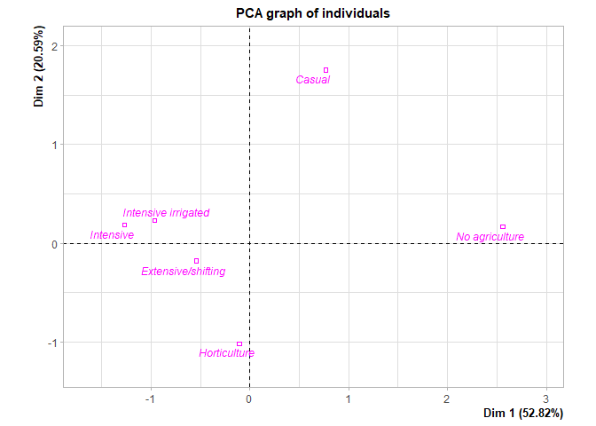<!-- -->
\#\#\#\# Drawing the individuals according to agriculture\_intensity

``` r
plot(res_with_6, cex=0.8, habillage = 6, shadow = TRUE, label = "quali")
```

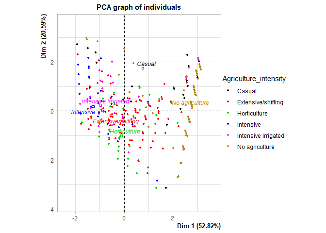<!-- -->
\#\#\#\# Plot of the individuals and variables in the 3 and 4 dimensions

``` r
plot(res_with_6, choix = "ind", cex=0.8, habillage = 6, title = "Individuals 3 & 4 dim",
     axes = 3:4)
```

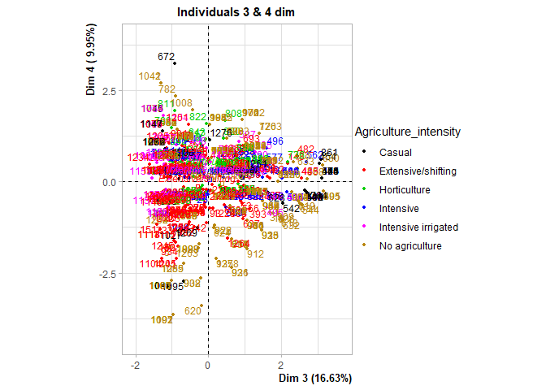<!-- -->

## METHODS FOR ASSESSING CLUSTERING TENDENCY

#### As previously stated, the assessment of clustering tendency and the clustering analysis will be conducted on the database including just variables from EA001 to EA005 (1290 x 5).

#### Such database has already been created and scaled: final\_clust\_db\_scaled

#### The EA028 variable: Agriculture Intensity, was only considered for the PCA analyses and plots, and will not be considered anymore in the subsequent analyses.

### 1\. Statistical method: Hopkins statistic.

``` r
#Hopkins statistic tests the spatial randomness of the data.
#Hopkins measures the probability that a given data set is generated by a uniform data distribution.
#If the value of Hopkins statistic is close to zero, then we can reject the null hypothesis and conclude that the data set D is significantly clusterable.
```

#### Compute Hopkins statistic for the dataset with the real data

``` r
set.seed(27)
hopkins(final_clust_db_scaled, n = nrow(final_clust_db_scaled)-1)
```

    ## $H
    ## [1] 0.1527371

#### Compute Hopkins statistic for the random dataset

``` r
set.seed(27)
hopkins(random_df_scaled, n = nrow(random_df_scaled)-1)
```

    ## $H
    ## [1] 0.5023157

#### It can be seen that the subsistence dataset is highly clusterable (H value = 0.1527 which is far below the threshold = 0.5).

#### However, the random\_df is not clusterable (H = 0.5)

### 2\. Visual Assessment of Clustering Tendency (VAT)

#### Dissimilarity matrices

##### Subsistence data: final\_clust\_db\_scaled

``` r
fviz_dist(dist(final_clust_db_scaled), show_labels = F) + labs(title = "ODI subistence dataset")
```

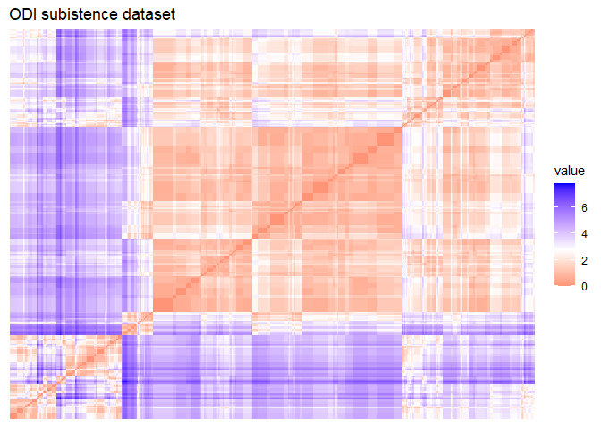<!-- -->

##### Random data: random\_df\_scaled

``` r
fviz_dist(dist(random_df_scaled), show_labels = F) + labs(title = "ODI random dataset")
```

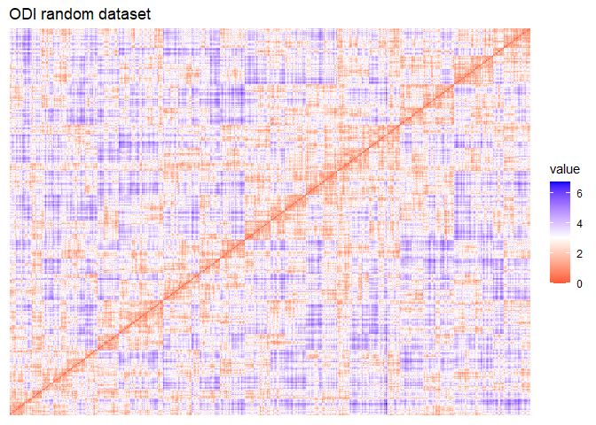<!-- -->

``` r
##Note that: Red: high similarity (low dissimilarity), Blue: low similarity
```
