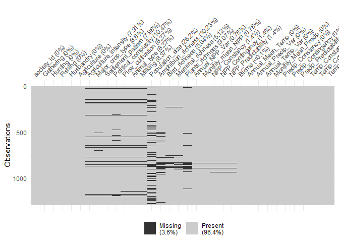

Multiple imputation MICE
================
Virginia\_Ahedo
11/10/2020

#### Setup

#### Clean workspace

#### Set working paths

``` r
setwd("D:/OneDrive - Universidad de Burgos/Goonies/CULM/GitHub_repository/Lets-go-Fishing")
dataPath <- "D:/OneDrive - Universidad de Burgos/Goonies/CULM/GitHub_repository/Lets-go-Fishing"
```

#### Parallel execution: 6 cores

``` r
require(doParallel)
```

    ## Loading required package: doParallel

    ## Loading required package: foreach

    ## Loading required package: iterators

    ## Loading required package: parallel

``` r
cl <- makeCluster(12)
registerDoParallel(cl)
```

#### Load “Database\_for\_MICE.Rda”

``` r
load("Database_for_MICE.Rda")
```

##### Check the dimensions of EA\_ecoClimate\_final

``` r
dim(EA_ecoClimate_final)
```

    ## [1] 1291   34

``` r
names(EA_ecoClimate_final)
```

    ##  [1] "society_id"            "Gathering"             "Hunting"              
    ##  [4] "Fishing"               "Husbandry"             "Agriculture"          
    ##  [7] "Agriculture_intensity" "Major_crop_type"       "Settlement_pattern"   
    ## [10] "Political_complexity"  "Plow_cultivation"      "Animal_type"          
    ## [13] "Milking"               "Population_size"       "Amphibian_richness"   
    ## [16] "Bird_richness"         "Mammal_richness"       "Plants_richness"      
    ## [19] "Annual_NPP_Var"        "Monthly_mean_NPP"      "NPP_Constancy"        
    ## [22] "NPP_Contingency"       "NPP_Predictability"    "Biome"                
    ## [25] "Annual_Mean_Temp"      "Annual_Precip_Var"     "Annual_Temp_Var"      
    ## [28] "Monthly_Mean_Precip"   "Precip_Constancy"      "Precip_Contingency"   
    ## [31] "Precip_Predictability" "Temp_Constancy"        "Temp_Contingency"     
    ## [34] "Temp_Predictability"

##### Load “Named\_Clustering\_db.Rda”, to make sure that in the Supervised Learning approach we are working with exactly the same societies as in the Clustering Analysis section.

``` r
load("Named_Clustering_db.Rda")
dim(named_clust_db)
```

    ## [1] 1290    8

``` r
names(named_clust_db)
```

    ## [1] "society_id"            "society_name"          "Gathering"            
    ## [4] "Hunting"               "Fishing"               "Husbandry"            
    ## [7] "Agriculture"           "Agriculture_intensity"

##### Find out which is the society that makes the difference between EA\_ecoClimate\_final and named\_clust\_db

``` r
which(EA_ecoClimate_final$society_id %in% named_clust_db$society_id == FALSE)
```

    ## [1] 1125

``` r
EA_ecoClimate_final[1125, ]
```

    ##      society_id Gathering Hunting Fishing Husbandry Agriculture
    ## 1125        Ng2        NA      NA      NA        NA          NA
    ##      Agriculture_intensity Major_crop_type Settlement_pattern
    ## 1125                    NA              NA                 NA
    ##      Political_complexity Plow_cultivation Animal_type Milking Population_size
    ## 1125                   NA               NA        <NA>    <NA>             175
    ##      Amphibian_richness Bird_richness Mammal_richness Plants_richness
    ## 1125                 20      91.87229        33.22215         2039.89
    ##      Annual_NPP_Var Monthly_mean_NPP NPP_Constancy NPP_Contingency
    ## 1125      0.4409435         1.833498     0.3171082       0.2037342
    ##      NPP_Predictability                         Biome Annual_Mean_Temp
    ## 1125          0.5208424 Flooded Grasslands & Savannas          21.9706
    ##      Annual_Precip_Var Annual_Temp_Var Monthly_Mean_Precip Precip_Constancy
    ## 1125        2606950438        12.95026            106193.7        0.6213352
    ##      Precip_Contingency Precip_Predictability Temp_Constancy Temp_Contingency
    ## 1125         0.06403544             0.6853707      0.4698559        0.2388788
    ##      Temp_Predictability
    ## 1125           0.7087347

##### Drop row 1125 from EA\_ecoClimate\_final

``` r
data = EA_ecoClimate_final[-1125,]
str(data)
```

    ## 'data.frame':    1290 obs. of  34 variables:
    ##  $ society_id           : chr  "Aa1" "Aa2" "Aa3" "Aa4" ...
    ##  $ Gathering            : int  8 4 1 4 3 1 7 5 6 1 ...
    ##  $ Hunting              : int  2 6 3 3 7 1 3 4 4 3 ...
    ##  $ Fishing              : int  0 0 1 1 0 1 0 1 0 0 ...
    ##  $ Husbandry            : int  0 0 5 2 0 2 0 0 0 6 ...
    ##  $ Agriculture          : int  0 0 0 0 0 5 0 0 0 0 ...
    ##  $ Agriculture_intensity: int  1 1 1 NA 1 3 1 1 1 1 ...
    ##  $ Major_crop_type      : int  1 1 1 NA 1 6 1 1 1 1 ...
    ##  $ Settlement_pattern   : int  1 1 1 NA 1 5 1 1 1 1 ...
    ##  $ Political_complexity : int  1 1 2 NA 1 2 1 1 1 1 ...
    ##  $ Plow_cultivation     : int  1 1 1 NA 1 1 1 1 1 1 ...
    ##  $ Animal_type          : Factor w/ 7 levels "Absence or near absence",..: 1 1 2 NA 1 2 1 1 1 2 ...
    ##  $ Milking              : Factor w/ 2 levels "Absence or near absence",..: 1 1 2 NA 1 2 1 1 1 2 ...
    ##  $ Population_size      : num  3500 1100 2500 29000 40000 23400 300 NA 600 100000 ...
    ##  $ Amphibian_richness   : num  11.6 27 3 5 39.5 ...
    ##  $ Bird_richness        : num  205 461 136 216 339 ...
    ##  $ Mammal_richness      : num  73 173.5 55.8 70 159.9 ...
    ##  $ Plants_richness      : num  1090 2127 1584 1232 2038 ...
    ##  $ Annual_NPP_Var       : num  0.4118 0.3358 0.0265 0.1067 1.5974 ...
    ##  $ Monthly_mean_NPP     : num  0.536 3.046 0.119 0.324 3.486 ...
    ##  $ NPP_Constancy        : num  0.288 0.238 0.67 0.507 0.064 ...
    ##  $ NPP_Contingency      : num  0.2062 0.1477 0.0969 0.158 0.2623 ...
    ##  $ NPP_Predictability   : num  0.494 0.385 0.767 0.665 0.326 ...
    ##  $ Biome                : Factor w/ 16 levels "Boreal Forests/Taiga",..: 14 14 2 2 15 14 14 2 14 2 ...
    ##  $ Annual_Mean_Temp     : num  21 19 20.4 22.7 21.4 ...
    ##  $ Annual_Precip_Var    : num  1.16e+10 3.36e+09 2.16e+09 3.65e+09 9.48e+09 ...
    ##  $ Annual_Temp_Var      : num  14.599 1.212 20.63 8.882 0.306 ...
    ##  $ Monthly_Mean_Precip  : num  87000 50566 39670 42805 243308 ...
    ##  $ Precip_Constancy     : num  0.203 0.44 0.304 0.195 0.674 ...
    ##  $ Precip_Contingency   : num  0.276 0.147 0.16 0.207 0.114 ...
    ##  $ Precip_Predictability: num  0.478 0.587 0.464 0.402 0.788 ...
    ##  $ Temp_Constancy       : num  0.458 0.667 0.428 0.493 0.769 ...
    ##  $ Temp_Contingency     : num  0.2061 0.0938 0.2151 0.152 0.0446 ...
    ##  $ Temp_Predictability  : num  0.664 0.761 0.643 0.645 0.814 ...

### MULTIPLE IMPUTATION

#### Preliminary Analysis with VIM

``` r
library(VIM)
```

    ## Loading required package: colorspace

    ## Loading required package: grid

    ## Loading required package: data.table

    ## VIM is ready to use. 
    ##  Since version 4.0.0 the GUI is in its own package VIMGUI.
    ## 
    ##           Please use the package to use the new (and old) GUI.

    ## Suggestions and bug-reports can be submitted at: https://github.com/alexkowa/VIM/issues

    ## 
    ## Attaching package: 'VIM'

    ## The following object is masked from 'package:datasets':
    ## 
    ##     sleep

``` r
data_plot <- aggr(data, col=c('navyblue','yellow'),
                    numbers=TRUE, sortVars=TRUE,
                    labels=names(data), cex.axis=.7,
                    gap=3, ylab=c("Missing data","Pattern"))
```

    ## Warning in plot.aggr(res, ...): not enough vertical space to display frequencies
    ## (too many combinations)

<!-- -->

    ## 
    ##  Variables sorted by number of missings: 
    ##               Variable        Count
    ##        Population_size 0.2620155039
    ##   Political_complexity 0.1046511628
    ##     Amphibian_richness 0.1023255814
    ##        Plants_richness 0.0906976744
    ##        Major_crop_type 0.0860465116
    ##       Plow_cultivation 0.0837209302
    ##            Animal_type 0.0837209302
    ##                Milking 0.0837209302
    ##     Settlement_pattern 0.0798449612
    ##  Agriculture_intensity 0.0790697674
    ##        Mammal_richness 0.0511627907
    ##          Bird_richness 0.0503875969
    ##          NPP_Constancy 0.0139534884
    ##        NPP_Contingency 0.0139534884
    ##     NPP_Predictability 0.0139534884
    ##         Annual_NPP_Var 0.0077519380
    ##       Monthly_mean_NPP 0.0077519380
    ##                  Biome 0.0007751938
    ##             society_id 0.0000000000
    ##              Gathering 0.0000000000
    ##                Hunting 0.0000000000
    ##                Fishing 0.0000000000
    ##              Husbandry 0.0000000000
    ##            Agriculture 0.0000000000
    ##       Annual_Mean_Temp 0.0000000000
    ##      Annual_Precip_Var 0.0000000000
    ##        Annual_Temp_Var 0.0000000000
    ##    Monthly_Mean_Precip 0.0000000000
    ##       Precip_Constancy 0.0000000000
    ##     Precip_Contingency 0.0000000000
    ##  Precip_Predictability 0.0000000000
    ##         Temp_Constancy 0.0000000000
    ##       Temp_Contingency 0.0000000000
    ##    Temp_Predictability 0.0000000000

#### Preliminary analysis with naniar

``` r
library(naniar)
naniar::gg_miss_var(data)
```

<!-- -->

#### Preliminary analysis with VIM (restricted to variables with NAs)

``` r
subsetdataWithNA<-data[,colSums(is.na.data.frame(data))>0]

data_plot <- aggr(subsetdataWithNA, col=c('navyblue','yellow'),
                    numbers=TRUE, sortVars=TRUE,
                    labels=names(subsetdataWithNA), cex.axis=.45,cex.numbers = 0.7,
                    gap=3, ylab=c("Missing data","Pattern"))
```

    ## Warning in plot.aggr(res, ...): not enough vertical space to display frequencies
    ## (too many combinations)

<!-- -->

    ## 
    ##  Variables sorted by number of missings: 
    ##               Variable        Count
    ##        Population_size 0.2620155039
    ##   Political_complexity 0.1046511628
    ##     Amphibian_richness 0.1023255814
    ##        Plants_richness 0.0906976744
    ##        Major_crop_type 0.0860465116
    ##       Plow_cultivation 0.0837209302
    ##            Animal_type 0.0837209302
    ##                Milking 0.0837209302
    ##     Settlement_pattern 0.0798449612
    ##  Agriculture_intensity 0.0790697674
    ##        Mammal_richness 0.0511627907
    ##          Bird_richness 0.0503875969
    ##          NPP_Constancy 0.0139534884
    ##        NPP_Contingency 0.0139534884
    ##     NPP_Predictability 0.0139534884
    ##         Annual_NPP_Var 0.0077519380
    ##       Monthly_mean_NPP 0.0077519380
    ##                  Biome 0.0007751938

#### Preliminary analysis witn naniar (restricted to variables with NAs)

``` r
library(naniar)
naniar::gg_miss_var(subsetdataWithNA)
```

<!-- -->
\#\#\#\#\# Additional visualizations

``` r
# https://cran.r-project.org/web/packages/naniar/vignettes/getting-started-w-naniar.html
library(visdat)
vis_dat(data)
```

<!-- -->

``` r
vis_miss(data)
```

<!-- -->
\#\#\# Data imputation with MICE \#\#\#\# MICE is the most suitable tool
for MULTIPLE IMPUTATION

``` r
library(mice)
```

    ## 
    ## Attaching package: 'mice'

    ## The following objects are masked from 'package:base':
    ## 
    ##     cbind, rbind

##### Drop society\_id from data before performing the data imputation with MICE

``` r
require(dplyr)
```

    ## Loading required package: dplyr

    ## 
    ## Attaching package: 'dplyr'

    ## The following objects are masked from 'package:data.table':
    ## 
    ##     between, first, last

    ## The following objects are masked from 'package:stats':
    ## 
    ##     filter, lag

    ## The following objects are masked from 'package:base':
    ## 
    ##     intersect, setdiff, setequal, union

``` r
data_final = select(data, -c("society_id"))
str(data_final)
```

    ## 'data.frame':    1290 obs. of  33 variables:
    ##  $ Gathering            : int  8 4 1 4 3 1 7 5 6 1 ...
    ##  $ Hunting              : int  2 6 3 3 7 1 3 4 4 3 ...
    ##  $ Fishing              : int  0 0 1 1 0 1 0 1 0 0 ...
    ##  $ Husbandry            : int  0 0 5 2 0 2 0 0 0 6 ...
    ##  $ Agriculture          : int  0 0 0 0 0 5 0 0 0 0 ...
    ##  $ Agriculture_intensity: int  1 1 1 NA 1 3 1 1 1 1 ...
    ##  $ Major_crop_type      : int  1 1 1 NA 1 6 1 1 1 1 ...
    ##  $ Settlement_pattern   : int  1 1 1 NA 1 5 1 1 1 1 ...
    ##  $ Political_complexity : int  1 1 2 NA 1 2 1 1 1 1 ...
    ##  $ Plow_cultivation     : int  1 1 1 NA 1 1 1 1 1 1 ...
    ##  $ Animal_type          : Factor w/ 7 levels "Absence or near absence",..: 1 1 2 NA 1 2 1 1 1 2 ...
    ##  $ Milking              : Factor w/ 2 levels "Absence or near absence",..: 1 1 2 NA 1 2 1 1 1 2 ...
    ##  $ Population_size      : num  3500 1100 2500 29000 40000 23400 300 NA 600 100000 ...
    ##  $ Amphibian_richness   : num  11.6 27 3 5 39.5 ...
    ##  $ Bird_richness        : num  205 461 136 216 339 ...
    ##  $ Mammal_richness      : num  73 173.5 55.8 70 159.9 ...
    ##  $ Plants_richness      : num  1090 2127 1584 1232 2038 ...
    ##  $ Annual_NPP_Var       : num  0.4118 0.3358 0.0265 0.1067 1.5974 ...
    ##  $ Monthly_mean_NPP     : num  0.536 3.046 0.119 0.324 3.486 ...
    ##  $ NPP_Constancy        : num  0.288 0.238 0.67 0.507 0.064 ...
    ##  $ NPP_Contingency      : num  0.2062 0.1477 0.0969 0.158 0.2623 ...
    ##  $ NPP_Predictability   : num  0.494 0.385 0.767 0.665 0.326 ...
    ##  $ Biome                : Factor w/ 16 levels "Boreal Forests/Taiga",..: 14 14 2 2 15 14 14 2 14 2 ...
    ##  $ Annual_Mean_Temp     : num  21 19 20.4 22.7 21.4 ...
    ##  $ Annual_Precip_Var    : num  1.16e+10 3.36e+09 2.16e+09 3.65e+09 9.48e+09 ...
    ##  $ Annual_Temp_Var      : num  14.599 1.212 20.63 8.882 0.306 ...
    ##  $ Monthly_Mean_Precip  : num  87000 50566 39670 42805 243308 ...
    ##  $ Precip_Constancy     : num  0.203 0.44 0.304 0.195 0.674 ...
    ##  $ Precip_Contingency   : num  0.276 0.147 0.16 0.207 0.114 ...
    ##  $ Precip_Predictability: num  0.478 0.587 0.464 0.402 0.788 ...
    ##  $ Temp_Constancy       : num  0.458 0.667 0.428 0.493 0.769 ...
    ##  $ Temp_Contingency     : num  0.2061 0.0938 0.2151 0.152 0.0446 ...
    ##  $ Temp_Predictability  : num  0.664 0.761 0.643 0.645 0.814 ...

``` r
# data_imp_MICE <-mice(data=data_final, m=100,maxit=50,method='rf', remove.collinear = FALSE,seed=27)
# saveRDS(data_imp_MICE, file="data_imp_MICE_def.Rda")
```
