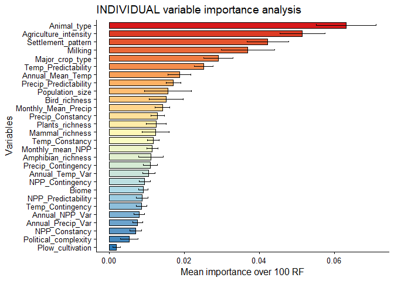
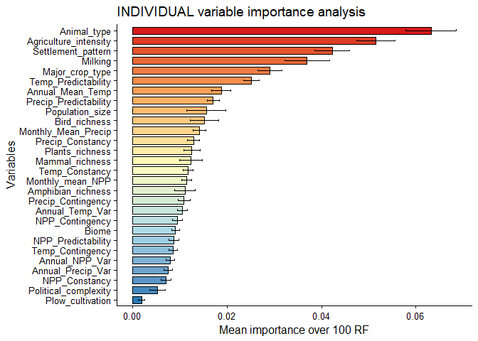
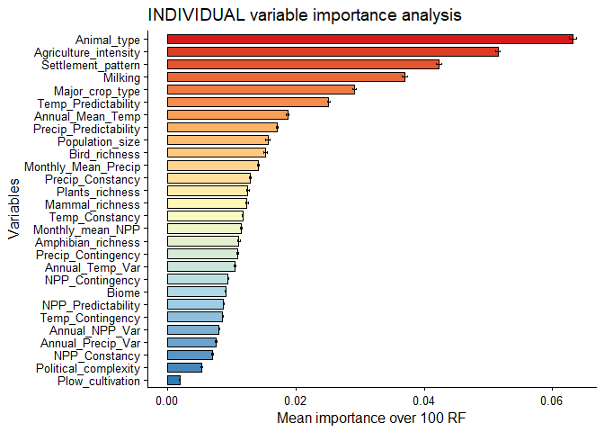
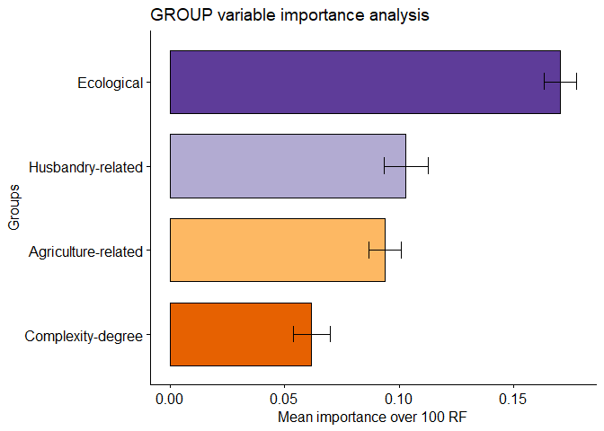
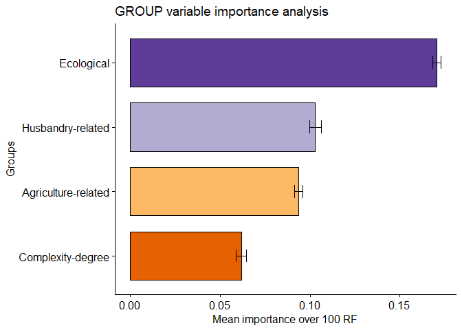
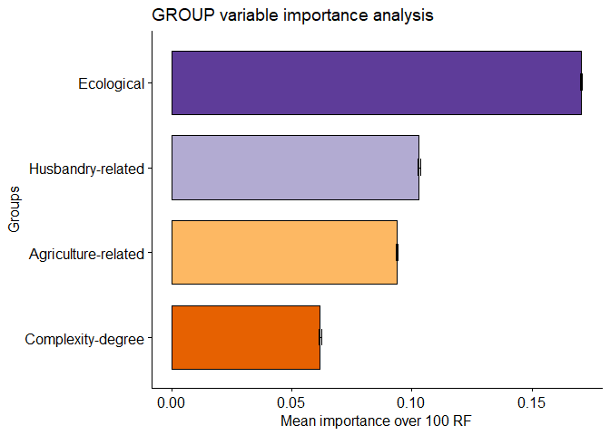

Variable Importance Analyses Plots
================
Virginia\_Ahedo
22/10/2020

#### Setup

#### Clean workspace

#### Set working paths

``` r
setwd("D:/OneDrive - Universidad de Burgos/Goonies/CULM/GitHub_repository/Lets-go-Fishing")
dataPath <- "D:/OneDrive - Universidad de Burgos/Goonies/CULM/GitHub_repository/Lets-go-Fishing"
```

#### Load required libraries

``` r
require(ggplot2)
```

    ## Loading required package: ggplot2

``` r
require(ggpubr)
```

    ## Loading required package: ggpubr

    ## Loading required package: magrittr

``` r
require(RColorBrewer)
```

    ## Loading required package: RColorBrewer

#### Load variable importance results

``` r
load("Individual_variable_importance_matrix_k15.Rda")
load("Group_variable_importance_matrix_k15.Rda")
```

#### Explore the structure of the results obtained

##### Individual variable importance analysis

``` r
dim(ind_varImpMatrix)
```

    ## [1]  28 100

##### Group variable importance analysis

``` r
dim(group_varImpMatrix)
```

    ## [1]   4 100

### INDIVIDUAL Variable Importance Analysis

##### Obtention of the necessary statistics

``` r
# In the apply function, MARGIN = 1 for rows, MARGIN = 2 for cols.
Mean_Ind_Importance <- data.frame(apply(ind_varImpMatrix,1,mean))
Std_Ind_Importance <- data.frame(apply(ind_varImpMatrix,1,sd))
variable_names = row.names(Mean_Ind_Importance)
Mean_Ind_Importance = cbind(variable_names, Mean_Ind_Importance)
rownames(Mean_Ind_Importance) <- NULL
colnames(Mean_Ind_Importance) <- c("Variables", "Mean_importance")
```

##### Given that N = 100 \>\>\> N = 30, we assume a Normal Distribution

##### In a Normal distribution, 99.73% of the values lie within three standard deviations of the mean

``` r
yi_min_6sigma = Mean_Ind_Importance$Mean_importance - 3*Std_Ind_Importance
yi_max_6sigma = Mean_Ind_Importance$Mean_importance + 3*Std_Ind_Importance
```

##### 4 sigma. In a Normal distribution, 95.45% of the values lie within two standard deviations of the mean

``` r
yi_min_4sigma = Mean_Ind_Importance$Mean_importance - 2*Std_Ind_Importance
yi_max_4sigma = Mean_Ind_Importance$Mean_importance + 2*Std_Ind_Importance
```

##### One std: In a Normal distribution, 68,27% of the values lie within one standard deviation of the mean

``` r
yi_min_2sigma = Mean_Ind_Importance$Mean_importance - Std_Ind_Importance
yi_max_2sigma = Mean_Ind_Importance$Mean_importance + Std_Ind_Importance
```

##### 95% confidence interval for the mean in an standard normal distribution

``` r
yi_min_95 = Mean_Ind_Importance$Mean_importance - ((1.96*Std_Ind_Importance)/sqrt(100))
yi_max_95 = Mean_Ind_Importance$Mean_importance + ((1.96*Std_Ind_Importance)/sqrt(100))
```

##### Summary dataframe

``` r
ind_summary_df = cbind(Mean_Ind_Importance, Std_Ind_Importance, yi_min_6sigma, yi_max_6sigma,
                       yi_min_4sigma, yi_max_4sigma, yi_min_2sigma, yi_max_2sigma, 
                       yi_min_95, yi_max_95)
colnames(ind_summary_df) <- c("Variables", "Mean_importance", "Std", "Yi_min_6sigma", "Yi_max_6sigma",
                              "Yi_min_4sigma", "Yi_max_4sigma", "Yi_min_2sigma", "Yi_max_2sigma",
                              "Yi_min_95", "Yi_max_95")
```

#### Individual Variable Importance plots

##### 6 sigma plot

``` r
Lab.palette <- colorRampPalette(c("#2c7bb6", "#abd9e9", "#ffffbf", "#fdae61", "#d7191c"), bias = 1,
                                space = "Lab")

ggbarplot(data = ind_summary_df, x = "Variables", y = "Mean_importance", #fill = "Variables", 
          rotate = T,
          sort.val = "asc",
          fill = Lab.palette(28),
          width = 0.75,
          title = "INDIVIDUAL variable importance analysis",
          ylab = "Mean importance over 100 RF")+
  geom_errorbar(aes(ymin = Yi_min_6sigma, ymax = Yi_max_6sigma), width = 0.2,
                position = position_dodge(0.9))+
  theme(axis.text = element_text(size = 10))
```

    ## Warning in if (fill %in% names(data)) add.params$group <- fill: la condición
    ## tiene longitud > 1 y sólo el primer elemento será usado

    ## Warning in if (fill %in% names(data) & is.null(add.params$fill)) add.params$fill
    ## <- fill: la condición tiene longitud > 1 y sólo el primer elemento será usado

<!-- -->

##### 4 Sigma Plot

``` r
ggbarplot(data = ind_summary_df, x = "Variables", y = "Mean_importance", #fill = "Variables", 
          rotate = T,
          sort.val = "asc",
          fill = Lab.palette(28),
          width = 0.75,
          title = "INDIVIDUAL variable importance analysis",
          ylab = "Mean importance over 100 RF")+
  geom_errorbar(aes(ymin = Yi_min_4sigma, ymax = Yi_max_4sigma), width = 0.2,
                position = position_dodge(0.9))+
  theme(axis.text = element_text(size = 10))
```

    ## Warning in if (fill %in% names(data)) add.params$group <- fill: la condición
    ## tiene longitud > 1 y sólo el primer elemento será usado

    ## Warning in if (fill %in% names(data) & is.null(add.params$fill)) add.params$fill
    ## <- fill: la condición tiene longitud > 1 y sólo el primer elemento será usado

<!-- -->

##### Two sigma plot

``` r
ggbarplot(data = ind_summary_df, x = "Variables", y = "Mean_importance", #fill = "Variables", 
          rotate = T, sort.val = "asc", fill = Lab.palette(28), width = 0.75,
          title = "INDIVIDUAL variable importance analysis",
          ylab = "Mean importance over 100 RF")+
  geom_errorbar(aes(ymin = Yi_min_2sigma, ymax = Yi_max_2sigma), width = 0.2,
                position = position_dodge(0.9))+
  theme(axis.text = element_text(size = 10))
```

    ## Warning in if (fill %in% names(data)) add.params$group <- fill: la condición
    ## tiene longitud > 1 y sólo el primer elemento será usado

    ## Warning in if (fill %in% names(data) & is.null(add.params$fill)) add.params$fill
    ## <- fill: la condición tiene longitud > 1 y sólo el primer elemento será usado

<!-- -->

##### 95% CI Plot

``` r
ggbarplot(data = ind_summary_df, x = "Variables", y = "Mean_importance", #fill = "Variables", 
          rotate = T,
          sort.val = "asc",
          fill = Lab.palette(28),
          width = 0.75,
          title = "INDIVIDUAL variable importance analysis",
          ylab = "Mean importance over 100 RF")+
  geom_errorbar(aes(ymin = Yi_min_95, ymax = Yi_max_95), width = 0.2,
                position = position_dodge(0.9))+
  theme(axis.text = element_text(size = 10))
```

    ## Warning in if (fill %in% names(data)) add.params$group <- fill: la condición
    ## tiene longitud > 1 y sólo el primer elemento será usado

    ## Warning in if (fill %in% names(data) & is.null(add.params$fill)) add.params$fill
    ## <- fill: la condición tiene longitud > 1 y sólo el primer elemento será usado

<!-- -->

### GROUP Variable Importance Analysis

##### Obtention of the necessary statistics

``` r
Mean_Group_Importance <- data.frame(apply(group_varImpMatrix,1,mean))
Std_Group_Importance <- data.frame(apply(group_varImpMatrix,1,sd))
variable_names = row.names(Mean_Group_Importance)
Mean_Group_Importance = cbind(variable_names, Mean_Group_Importance)
rownames(Mean_Group_Importance) <- NULL
colnames(Mean_Group_Importance) <- c("Variables", "Mean_importance")
```

##### Given that N = 100 \>\>\> N = 30, we assume a Normal Distribution

##### In a Normal distribution, 99.73% of the values lie within three standard deviations of the mean

``` r
yg_min_6sigma = Mean_Group_Importance$Mean_importance - 3*Std_Group_Importance
yg_max_6sigma = Mean_Group_Importance$Mean_importance + 3*Std_Group_Importance
```

##### 4 sigma. In a Normal distribution, 95.45% of the values lie within two standard deviations of the mean

``` r
yg_min_4sigma = Mean_Group_Importance$Mean_importance - 2*Std_Group_Importance
yg_max_4sigma = Mean_Group_Importance$Mean_importance + 2*Std_Group_Importance
```

##### One std: In a Normal distribution, 68,27% of the values lie within one standard deviation of the mean

``` r
yg_min_2sigma = Mean_Group_Importance$Mean_importance - Std_Group_Importance
yg_max_2sigma = Mean_Group_Importance$Mean_importance + Std_Group_Importance
```

##### 95% confidence interval for the mean in an standard normal distribution

``` r
yg_min_95 = Mean_Group_Importance$Mean_importance - ((1.96*Std_Group_Importance)/sqrt(100))
yg_max_95 = Mean_Group_Importance$Mean_importance + ((1.96*Std_Group_Importance)/sqrt(100))
```

##### Summary dataframe

``` r
group_summary_df = cbind(Mean_Group_Importance, Std_Group_Importance, yg_min_6sigma, yg_max_6sigma,
                       yg_min_4sigma, yg_max_4sigma, yg_min_2sigma, yg_max_2sigma, 
                       yg_min_95, yg_max_95)
colnames(group_summary_df) <- c("Groups_of_Variables", "Mean_importance", "Std", "Yg_min_6sigma",
                                "Yg_max_6sigma", "Yg_min_4sigma", "Yg_max_4sigma", "Yg_min_2sigma",
                                "Yg_max_2sigma", "Yg_min_95", "Yg_max_95")
```

#### Group Variable Importance plots

##### 6 sigma plot

``` r
ggbarplot(data = group_summary_df, x = "Groups_of_Variables", y = "Mean_importance", #fill = "Variables",
          rotate = T,
          sort.val = "asc",
          fill = c("#e66101", "#fdb863", "#b2abd2", "#5e3c99"),
          width = 0.75,
          title = "GROUP variable importance analysis",
          ylab = "Mean importance over 100 RF", xlab = "Groups")+
  geom_errorbar(aes(ymin = Yg_min_6sigma, ymax = Yg_max_6sigma), width = 0.2,
                position = position_dodge(0.9))+
  theme(axis.text = element_text(size = 12))
```

    ## Warning in if (fill %in% names(data)) add.params$group <- fill: la condición
    ## tiene longitud > 1 y sólo el primer elemento será usado

    ## Warning in if (fill %in% names(data) & is.null(add.params$fill)) add.params$fill
    ## <- fill: la condición tiene longitud > 1 y sólo el primer elemento será usado

<!-- -->

##### 4 sigma plot

``` r
ggbarplot(data = group_summary_df, x = "Groups_of_Variables", y = "Mean_importance", #fill = "Variables",
          rotate = T,
          sort.val = "asc",
          fill = c("#e66101", "#fdb863", "#b2abd2", "#5e3c99"),
          width = 0.75,
          title = "GROUP variable importance analysis",
          ylab = "Mean importance over 100 RF", xlab = "Groups")+
  geom_errorbar(aes(ymin = Yg_min_4sigma, ymax = Yg_max_4sigma), width = 0.2,
                position = position_dodge(0.9))+
  theme(axis.text = element_text(size = 12))
```

    ## Warning in if (fill %in% names(data)) add.params$group <- fill: la condición
    ## tiene longitud > 1 y sólo el primer elemento será usado

    ## Warning in if (fill %in% names(data) & is.null(add.params$fill)) add.params$fill
    ## <- fill: la condición tiene longitud > 1 y sólo el primer elemento será usado

<!-- -->

##### 2 sigma plot

``` r
ggbarplot(data = group_summary_df, x = "Groups_of_Variables", y = "Mean_importance", #fill = "Variables",
          rotate = T,
          sort.val = "asc",
          fill = c("#e66101", "#fdb863", "#b2abd2", "#5e3c99"),
          width = 0.75,
          title = "GROUP variable importance analysis",
          ylab = "Mean importance over 100 RF", xlab = "Groups")+
  geom_errorbar(aes(ymin = Yg_min_2sigma, ymax = Yg_max_2sigma), width = 0.2,
                position = position_dodge(0.9))+
  theme(axis.text = element_text(size = 12))
```

    ## Warning in if (fill %in% names(data)) add.params$group <- fill: la condición
    ## tiene longitud > 1 y sólo el primer elemento será usado

    ## Warning in if (fill %in% names(data) & is.null(add.params$fill)) add.params$fill
    ## <- fill: la condición tiene longitud > 1 y sólo el primer elemento será usado

<!-- -->
\#\#\#\#\# 95% CI plot

``` r
ggbarplot(data = group_summary_df, x = "Groups_of_Variables", y = "Mean_importance", #fill = "Variables",
          rotate = T,
          sort.val = "asc",
          fill = c("#e66101", "#fdb863", "#b2abd2", "#5e3c99"),
          width = 0.75,
          title = "GROUP variable importance analysis",
          ylab = "Mean importance over 100 RF", xlab = "Groups")+
  geom_errorbar(aes(ymin = Yg_min_95, ymax = Yg_max_95), width = 0.2,
                position = position_dodge(0.9))+
  theme(axis.text = element_text(size = 12))
```

    ## Warning in if (fill %in% names(data)) add.params$group <- fill: la condición
    ## tiene longitud > 1 y sólo el primer elemento será usado

    ## Warning in if (fill %in% names(data) & is.null(add.params$fill)) add.params$fill
    ## <- fill: la condición tiene longitud > 1 y sólo el primer elemento será usado

<!-- -->
